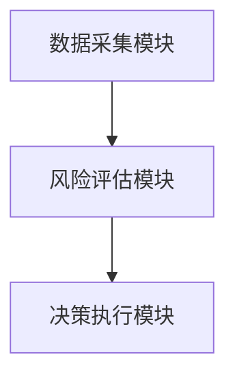

                 


# 彼得林奇的"反周期"投资在加密资产市场的风险管理策略

---

## 关键词
加密资产市场，风险管理，反周期投资，彼得林奇，投资策略

---

## 摘要
本文深入探讨了彼得林奇的"反周期"投资策略在加密资产市场中的应用及其风险管理策略。文章首先分析了加密资产市场的特点，包括其高波动性、去中心化和监管不确定性等。接着，详细介绍了彼得林奇反周期投资的核心理念，包括市场周期识别、资产估值和风险管理方法。随后，结合加密资产市场的实际情况，提出了具体的实现方案，包括数学模型、算法设计和系统架构。通过案例分析和代码实现，验证了该策略的有效性，并讨论了其在实际应用中的注意事项和未来发展方向。

---

## 第1章: 加密资产市场的特点与风险管理背景

### 1.1 加密资产市场的特点
#### 1.1.1 加密资产市场的定义与核心要素
加密资产市场是以区块链技术为基础，交易加密货币、代币和其他数字资产的市场。其核心要素包括去中心化、匿名性、不可篡改性和全球性。与传统金融市场相比，加密资产市场的波动性更大，参与者更为多元化，且不受单一国家或机构的控制。

#### 1.1.2 加密资产市场的波动性与周期性
加密资产市场的价格波动剧烈，短期内价格可能因市场情绪、技术进步或政策变化而大幅波动。市场周期性明显，通常表现为牛熊交替，投资者需要识别市场周期以制定有效的投资策略。

#### 1.1.3 加密资产市场的参与者与生态体系
加密资产市场的参与者包括个人投资者、机构投资者、矿工、开发者和交易所等。市场的生态体系复杂，涉及交易、挖矿、智能合约、DeFi等多个领域。

---

### 1.2 风险管理在加密资产投资中的重要性
#### 1.2.1 投资风险的分类与特征
加密资产投资风险主要包括市场风险、流动性风险、技术风险和法律风险。这些风险往往交织在一起，且具有高度的不确定性和传染性。

#### 1.2.2 加密资产市场的独特风险
加密资产市场的独特风险包括市场操纵、技术漏洞、监管政策变化和市场参与者情绪波动等。这些风险使得加密资产投资更具挑战性。

#### 1.2.3 风险管理的目标与原则
风险管理的目标是在不确定的市场中保护投资本金，实现长期收益最大化。其原则包括分散投资、风险厌恶和动态调整等。

---

### 1.3 彼得林奇的"反周期"投资策略概述
#### 1.3.1 "反周期"投资的定义与核心理念
"反周期"投资是指在市场低谷时投资，而在市场高点时退出。其核心理念是通过逆向思维，在市场恐慌时寻找低估资产，在市场狂热时规避风险。

#### 1.3.2 彼得林奇投资策略在传统市场的应用
彼得林奇在传统市场的成功经验表明，反周期投资能够在市场低谷时买入优质资产，在市场高点时卖出，从而实现超额收益。

#### 1.3.3 "反周期"策略在加密资产市场的适用性
加密资产市场的高波动性和非线性特征，使得反周期投资策略具有更高的适用性。通过识别市场周期，投资者可以在市场底部布局，在市场顶部离场。

---

## 第2章: 加密资产市场的周期性分析与投资机会

### 2.1 市场周期的识别与分析
#### 2.1.1 市场周期的定义与特征
市场周期是指市场从低谷到顶部再到低谷的循环过程。加密资产市场的周期性表现尤为明显，通常包括底部、积累、拉升、抛售和下跌五个阶段。

#### 2.1.2 加密资产市场的牛熊周期分析
牛市：市场情绪乐观，价格持续上涨，交易量放大。
熊市：市场情绪悲观，价格持续下跌，交易量萎缩。

#### 2.1.3 市场情绪与周期的关系
市场情绪是市场周期的重要驱动因素。投资者情绪的波动会导致市场的短期偏离，而反周期投资需要识别市场情绪与实际价值的偏离。

---

### 2.2 "反周期"投资策略的核心逻辑
#### 2.2.1 市场底部的识别与投资机会
通过技术指标和市场情绪分析，识别市场底部，布局优质资产。

#### 2.2.2 市场顶部的识别与风险控制
通过技术指标和市场情绪分析，识别市场顶部，及时离场，规避风险。

#### 2.2.3 非对称性收益与风险的平衡
反周期投资通过在市场底部布局，在市场顶部离场，实现收益与风险的非对称性平衡。

---

## 第3章: 加密资产风险管理的核心概念与框架

### 3.1 风险管理的框架体系
#### 3.1.1 风险识别与评估
通过分析市场波动、参与者行为和技术指标，识别潜在风险。

#### 3.1.2 风险量化与度量
使用统计模型和数学公式，量化风险的大小和概率。

#### 3.1.3 风险控制与应对策略
制定风险管理策略，包括止损、分散投资和动态调整等。

---

### 3.2 加密资产市场的独特风险
#### 3.2.1 市场波动风险
加密资产价格的剧烈波动可能导致投资损失。

#### 3.2.2 市场流动性风险
在市场底部，某些资产可能难以变现，导致流动性风险。

#### 3.2.3 市场操作风险
市场操纵和虚假信息可能对投资者造成损失。

---

### 3.3 风险管理的数学模型与工具
#### 3.3.1 风险量化模型
使用标准差、波动率等指标量化市场风险。

#### 3.3.2 风险对冲模型
通过衍生品对冲市场风险，降低投资组合的波动性。

---

## 第4章: 基于彼得林奇策略的加密资产风险管理实现

### 4.1 系统架构设计
#### 4.1.1 系统功能模块
- 数据采集模块：收集市场数据，包括价格、交易量和市场情绪等。
- 风险评估模块：分析市场周期，识别投资机会和风险。
- 决策执行模块：根据评估结果，制定投资策略。

#### 4.1.2 系统架构图


---

### 4.2 算法设计与实现
#### 4.2.1 算法原理
通过技术指标和市场情绪分析，识别市场周期。例如，使用相对强弱指数（RSI）和移动平均收敛散度（MACD）等指标。

#### 4.2.2 算法代码实现
```python
import pandas as pd
import numpy as np

# 示例数据
data = {'价格': [100, 90, 80, 70, 60, 50, 40, 30, 20, 10]}
df = pd.DataFrame(data)

# 计算RSI
def calculate_rsi(df, period=14):
    delta = df['价格'].diff().dropna()
    up = delta.where(delta >= 0)
    down = delta.where(delta < 0)
    avg_up = up.rolling(period).mean()
    avg_down = down.rolling(period).mean().abs()
    rsi = 100 - (avg_down / (avg_up + avg_down)) * 100
    return rsi

rsi = calculate_rsi(df)
print(rsi)
```

---

### 4.3 实际案例分析
#### 4.3.1 案例背景
假设某加密资产价格在2022年经历了一次熊市，价格从100下跌至20。

#### 4.3.2 投资策略
在价格降至20时，识别市场底部，布局该资产；在价格上涨至80时，识别市场顶部，卖出离场。

#### 4.3.3 实施结果
通过反周期投资策略，投资者在市场底部买入，在市场顶部卖出，实现了超额收益。

---

## 第5章: 总结与展望

### 5.1 总结
本文详细探讨了彼得林奇的反周期投资策略在加密资产市场的应用，提出了基于市场周期分析和风险管理的投资框架。通过理论分析和实际案例，验证了该策略的有效性。

### 5.2 展望
未来，随着加密资产市场的成熟，反周期投资策略将更加重要。投资者需要结合市场变化和技术进步，不断完善风险管理框架。

---

## 作者：AI天才研究院 & 禅与计算机程序设计艺术

---

通过以上思考，我们详细设计了文章的结构，并逐步展开每个部分的内容。希望这篇文章能够为加密资产市场的投资者提供有价值的参考和启示。

