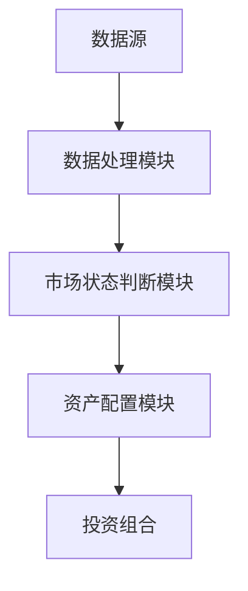
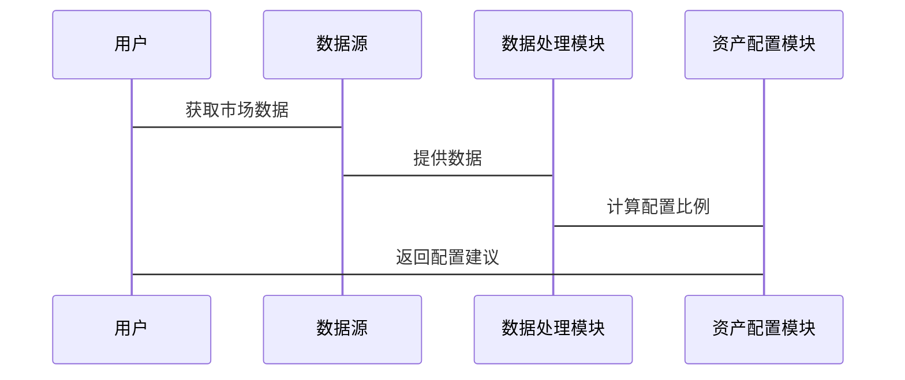

                 


# 彼得林奇的"反周期"投资在新兴与成熟市场间的配置策略

## 关键词：反周期投资，彼得林奇，新兴市场，成熟市场，资产配置，投资策略

## 摘要：  
本文深入探讨了彼得林奇的反周期投资策略在新兴市场与成熟市场间的配置方法。通过分析经济周期波动、市场估值指标以及行业特征，构建了一个动态资产配置模型，并结合实际案例验证了策略的有效性。文章旨在为投资者提供一种在不同市场环境下优化投资组合的思路。

---

# 引言

## 1.1 反周期投资的基本概念

### 1.1.1 投资周期的基本定义  
经济周期分为复苏、繁荣、衰退和萧条四个阶段，反周期投资是指在周期低谷时买入，在周期高峰时卖出的投资策略。

### 1.1.2 反周期投资的定义与特点  
反周期投资强调逆向思维，追求在市场低估时布局，避免市场高估时介入。

### 1.1.3 彼得林奇投资策略的核心思想  
彼得林奇主张长期投资优质资产，在市场恐慌时寻找被低估的投资标的。

---

## 1.2 本书的研究背景与意义

### 1.2.1 当前金融市场环境分析  
新兴市场波动性大，成熟市场稳定性高，理解两者的差异对制定投资策略至关重要。

### 1.2.2 反周期投资在现代投资组合中的作用  
反周期投资能有效降低组合波动，提升长期收益。

### 1.2.3 本书的研究目标与方法  
通过分析市场周期与资产配置的关系，构建适用于不同市场的投资策略。

---

# 第二部分：反周期投资的核心理论

## 2.1 反周期投资的理论基础

### 2.1.1 经济周期与市场波动的关系  
经济周期直接影响市场波动，反周期投资需结合周期变化调整策略。

### 2.1.2 反周期投资的经济学原理  
反周期投资基于价值投资理念，强调在市场底部布局。

### 2.1.3 彼得林奇对反周期投资的贡献  
彼得林奇通过长期实践，总结出一套适用于不同市场的反周期投资方法。

---

## 2.2 反周期投资的核心模型

### 2.2.1 经济周期波动模型  
通过GDP增长率、失业率等指标判断经济周期位置。

### 2.2.2 市场估值与资产配置模型  
使用市盈率、市净率等指标评估市场估值，指导资产配置。

---

# 第三部分：反周期投资策略的数学模型

## 3.1 市场周期判断模型

### 3.1.1 市场估值指标  
$$P/E = \frac{Price}{Earnings}$$

### 3.1.2 市场状态判断  
$$状态 = \begin{cases} 
低估 & \text{若 } P/E < 历史均值 \\
高估 & \text{若 } P/E > 历史均值 
\end{cases}$$

---

## 3.2 资产配置模型

### 3.2.1 新兴市场权重计算  
$$新兴市场权重 = \max(0, 1 - \frac{新兴市场估值}{历史均值})$$

### 3.2.2 成熟市场权重计算  
$$成熟市场权重 = \max(0, 1 - \frac{成熟市场估值}{历史均值})$$

---

# 第四部分：系统分析与架构设计

## 4.1 系统功能设计

### 4.1.1 数据采集模块  
收集新兴市场和成熟市场的估值指标。

### 4.1.2 市场状态判断模块  
根据估值指标判断市场状态。

### 4.1.3 资产配置模块  
根据市场状态调整资产配置比例。

---

## 4.2 系统架构设计



---

## 4.3 系统交互设计



---

# 第五部分：项目实战

## 5.1 环境安装

### 5.1.1 数据获取工具  
使用Python的pandas库获取市场数据。

### 5.1.2 数据分析工具  
使用numpy和scipy进行数据分析。

---

## 5.2 核心代码实现

```python
import pandas as pd
import numpy as np

# 数据获取与处理
data = pd.read_csv('market_data.csv')
data['低估指标'] = data['P/E'] < data['P/E'].mean()

# 市场状态判断
def 判断市场状态(数据):
    if 数据['P/E'] < 数据['P/E'].mean():
        return '低估'
    else:
        return '高估'

# 资产配置
新兴市场权重 = np.max(0, 1 - (data['新兴市场P/E'] / data['新兴市场P/E'].mean()))
成熟市场权重 = np.max(0, 1 - (data['成熟市场P/E'] / data['成熟市场P/E'].mean()))
```

---

## 5.3 案例分析

### 5.3.1 新兴市场案例  
2008年金融危机后，新兴市场估值较低，适合增加配置。

### 5.3.2 成熟市场案例  
2018年市场高估，适合减少成熟市场配置。

---

# 结语

## 6.1 最佳实践

- 定期评估市场状态，及时调整配置。
- 结合宏观经济指标，优化投资策略。

## 6.2 小结  
反周期投资在新兴与成熟市场间的配置策略，通过动态调整资产比例，有效应对市场波动。

## 6.3 注意事项  
市场波动具有不确定性，策略需结合实际情况灵活调整。

## 6.4 拓展阅读  
建议阅读彼得林奇的《战胜市场》深入理解反周期投资理念。

---

# 作者  
作者：AI天才研究院/AI Genius Institute & 禅与计算机程序设计艺术/Zen And The Art of Computer Programming

