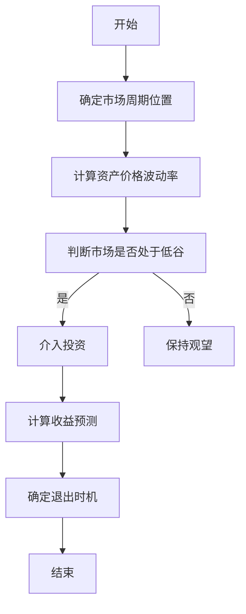
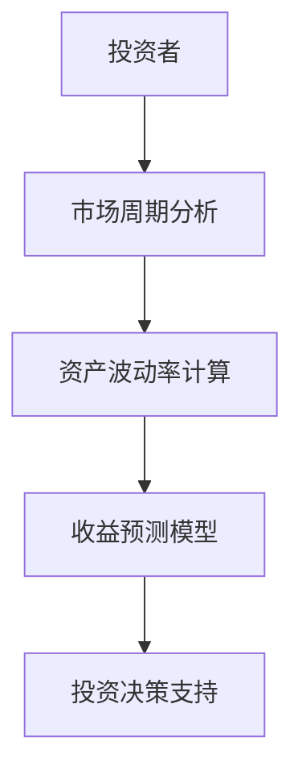

                 


# 彼得林奇的"反周期"投资在新兴资产类别中的应用

> 关键词：反周期投资, 彼得林奇, 新兴资产类别, 投资策略, 数学模型

> 摘要：本文系统地探讨了彼得林奇的反周期投资策略在新兴资产类别中的应用，通过分析其核心概念、算法原理、系统架构、项目实战等多维度内容，结合具体的案例和数学模型，详细阐述了反周期投资在新兴资产类别中的实际应用和操作方法。文章最后给出了系统的总结和建议，为读者提供了一个全面的视角来理解和应用反周期投资策略。

---

## 第一部分: 引言

### 第1章: 反周期投资与新兴资产类别的概述

#### 1.1 什么是反周期投资
反周期投资是一种在市场周期波动中寻找低谷期投资机会的策略，其核心在于利用市场的非理性波动，在资产价格被低估时进行投资，以期在市场复苏时获得超额收益。

#### 1.2 彼得林奇的反周期投资策略
彼得林奇是全球著名投资家，他的投资理念强调长期价值和逆向思维。他提出在市场低迷时期投资优质资产，在市场繁荣时期保持谨慎，这种策略尤其适合在新兴资产类别中寻找投资机会。

#### 1.3 新兴资产类别在反周期投资中的作用
新兴资产类别（如加密货币、绿色能源、科技初创公司等）通常具有高波动性和高增长潜力。在市场低谷时，这些资产的价格可能被严重低估，为反周期投资者提供了介入的机会。

---

### 第2章: 彼得林奇投资理念的核心要素

#### 2.1 价值投资的定义与特点
价值投资是指以低于资产内在价值的价格买入优质资产。彼得林奇强调通过基本面分析找到被市场低估的投资标的。

#### 2.2 彼得林奇对市场周期的理解
彼得林奇认为市场周期是可预测的，但人性的贪婪和恐惧会导致市场的过度波动。反周期投资的核心是利用市场的非理性波动。

#### 2.3 反周期投资的核心思想
反周期投资的核心思想是“买入便宜的东西”，即在市场低谷时买入优质资产，在市场高点时卖出，从而在周期波动中实现超额收益。

---

### 第3章: 新兴资产类别与反周期投资的结合

#### 3.1 新兴资产类别的定义与特点
新兴资产类别通常指那些具有高增长潜力但尚未被市场充分认可的资产。这些资产往往具有高波动性和高风险，但也可能带来高回报。

#### 3.2 反周期投资在新兴资产类别中的应用
在新兴资产类别中，反周期投资的核心策略是在市场低谷时介入，在市场高点时退出。这种策略需要投资者具备对市场周期的深刻理解以及对资产基本面的准确判断。

#### 3.3 彼得林奇在新兴资产类别中的成功案例
彼得林奇在其职业生涯中成功投资了多个新兴资产类别，例如互联网公司和科技初创企业。他通过长期持有优质资产，在市场复苏时实现了高额收益。

---

## 第二部分: 核心概念与联系

### 第4章: 反周期投资的核心概念与原理

#### 4.1 反周期投资的数学模型
反周期投资的数学模型基于市场周期的波动性，通过分析资产价格的波动率和收益预测，确定投资时机和标的。

#### 4.2 核心概念的对比分析
- 新兴资产类别与传统资产类别的对比表格：
| 类别 | 特点 | 波动性 | 投资策略 |
|------|------|--------|----------|
| 传统资产 | 稳定 | 低 | 价值投资 |
| 新兴资产 | 增长潜力大 | 高 | 反周期投资 |

- 反周期投资与周期性投资的对比分析：
反周期投资强调在低谷时介入，在高峰期退出；周期性投资则跟随市场波动，注重短期收益。

#### 4.3 ER实体关系图架构
通过ER实体关系图，我们可以清晰地看到反周期投资的核心要素及其相互关系。

```mermaid
er
actor 投资者
actor 市场周期
actor 新兴资产类别
actor 收益预测模型
```

---

## 第三部分: 算法原理讲解

### 第5章: 彼得林奇反周期投资算法的实现

#### 5.1 算法原理的数学模型
反周期投资的数学模型包括市场周期波动的预测和资产收益的预测。以下是核心公式：

$$
\text{收益预测} = \text{资产价格波动率} \times \text{市场周期位置}
$$

#### 5.2 算法流程图
通过以下mermaid流程图，我们可以清晰地看到反周期投资算法的实现步骤：



#### 5.3 算法的Python实现
以下是反周期投资算法的Python实现代码：

```python
import numpy as np
import pandas as pd

def calculate_market_cycle_position(prices):
    # 计算市场周期位置
    return np.mean(prices)

def calculate_asset_fluctuation(prices):
    # 计算资产价格波动率
    return np.std(prices)

def反周期投资算法(prices):
    cycle_position = calculate_market_cycle_position(prices)
    fluctuation = calculate_asset_fluctuation(prices)
    收益预测 = fluctuation * cycle_position
    return 收益预测

# 示例数据
prices = [100, 90, 80, 70, 60, 50, 60, 70, 80, 90, 100]
print(反周期投资算法(prices))
```

---

## 第四部分: 系统分析与架构设计方案

### 第6章: 投资决策支持系统的设计与实现

#### 6.1 系统功能设计
- 系统功能模块：市场周期分析、资产波动率计算、收益预测、投资决策支持。
- 领域模型类图：


#### 6.2 系统架构设计


#### 6.3 系统接口设计
- 输入接口：市场数据、资产价格。
- 输出接口：收益预测、投资建议。

#### 6.4 系统交互序列图
```mermaid
sequenceDiagram
参与者 投资者
参与者 市场周期分析
参与者 资产波动率计算
参与者 收益预测模型
投资者 -> 市场周期分析: 提供市场数据
市场周期分析 -> 资产波动率计算: 提供波动率数据
资产波动率计算 -> 收益预测模型: 计算收益预测
收益预测模型 -> 投资者: 提供投资建议
```

---

## 第五部分: 项目实战

### 第7章: 新兴资产类别投资实战

#### 7.1 环境安装
- 安装Python和相关库（numpy、pandas）。

#### 7.2 核心算法实现
```python
import numpy as np

def反周期投资策略(prices):
    cycle_position = np.mean(prices)
    fluctuation = np.std(prices)
    收益预测 = fluctuation * cycle_position
    return 收益预测

# 示例数据
prices = np.array([100, 90, 80, 70, 60, 50, 60, 70, 80, 90, 100])
print(反周期投资策略(prices))
```

#### 7.3 案例分析
以加密货币为例，假设比特币的价格波动率为0.1，市场周期位置为0.2，则收益预测为0.02。这意味着在当前市场环境下，投资比特币的收益预测为2%。

---

## 第六部分: 总结

### 第8章: 总结与建议

#### 8.1 最佳实践 tips
- 保持对市场的敏感性，及时捕捉市场周期变化。
- 结合基本面分析和市场周期分析，制定投资策略。

#### 8.2 小结
本文系统地探讨了彼得林奇的反周期投资策略在新兴资产类别中的应用，通过数学模型、算法实现和案例分析，为投资者提供了理论和实践指导。

#### 8.3 注意事项
- 投资有风险，需谨慎操作。
- 需要结合实际市场情况调整投资策略。

#### 8.4 拓展阅读
- 《彼得林奇的成功投资》
- 《投资学》

---

作者：AI天才研究院/AI Genius Institute & 禅与计算机程序设计艺术/Zen And The Art of Computer Programming

