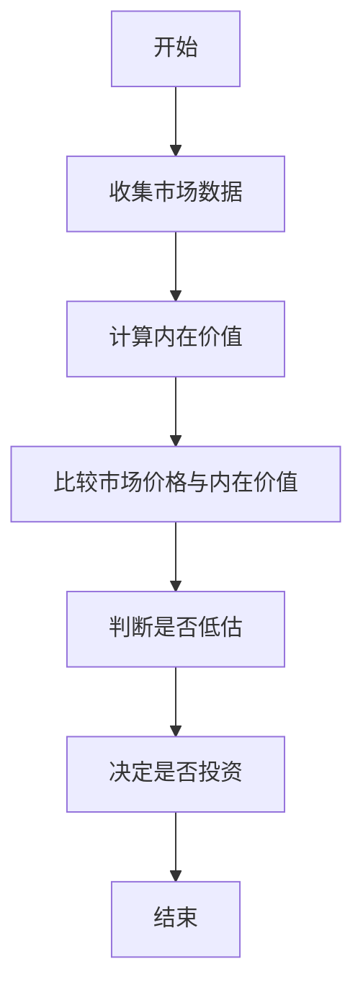
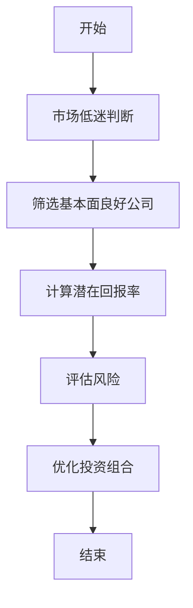
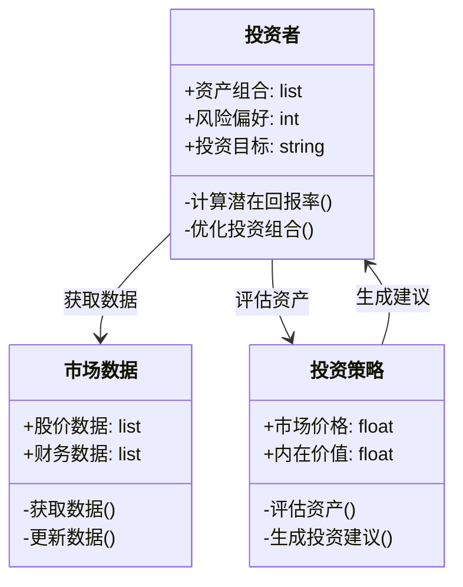

                 


# 彼得林奇的"墓地投资法"

## 关键词：彼得林奇，墓地投资法，投资策略，系统分析，实战应用

## 摘要：  
彼得·林奇的“墓地投资法”是一种独特且有效的投资策略，特别适用于市场低迷时期。本文将从背景介绍、数学模型、算法原理、系统架构、项目实战等多个维度，详细解析这一投资方法的内在逻辑与实际应用，帮助读者在复杂多变的市场环境中找到优质的投资机会。

---

# 第一部分: 彼得林奇的"墓地投资法"概述

## 第1章: 墓地投资法的核心概念

### 1.1 墓地投资法的定义与背景

#### 1.1.1 投资市场的周期性与波动性
投资市场的周期性波动是投资者需要面对的核心挑战。市场的涨跌交替为投资者提供了机会与风险。在市场低迷时期，许多优质资产价格被低估，此时正是寻找投资机会的黄金时间。

#### 1.1.2 墓地投资法的起源与核心思想
彼得·林奇提出的“墓地投资法”是一种逆向投资策略，强调在市场低迷时寻找被低估的优质资产。这种方法的核心在于发现市场中的“价值洼地”，并在其他投资者放弃时果断出手。

#### 1.1.3 墓地投资法的适用场景与边界
墓地投资法适用于市场低迷、投资者情绪低落的阶段，尤其适合寻找那些基本面良好但被市场错杀的公司或资产。然而，这种方法并不适用于所有市场环境，需结合市场周期进行判断。

### 1.2 彼得林奇的投资哲学

#### 1.2.1 彼得林奇的投资理念与方法
彼得·林奇强调长期投资、价值发现和分散投资。他认为，投资者应关注公司的基本面，而非市场的短期波动。墓地投资法正是这一理念的集中体现。

#### 1.2.2 墓地投资法与彼得林奇投资策略的关系
墓地投资法是彼得林奇投资策略的重要组成部分，它强调在市场底部寻找优质资产，避免追涨杀跌，注重长期价值。

#### 1.2.3 墓地投资法的核心要素与组成
墓地投资法的核心要素包括：市场分析、基本面评估、估值判断和投资组合优化。这些要素共同构成了这一投资方法的逻辑框架。

---

## 第2章: 墓地投资法的核心原理

### 2.1 墓地投资法的数学模型与公式

#### 2.1.1 投资价值评估的数学模型
投资价值评估模型是用来确定资产的内在价值，帮助投资者判断其是否被低估。一个常用的模型是：

$$ V = \frac{CF}{r - g} $$

其中：
- \( V \) 是资产的内在价值
- \( CF \) 是未来现金流的现值
- \( r \) 是贴现率
- \( g \) 是现金流增长率

#### 2.1.2 墓地投资法的公式推导与应用
在墓地投资法中，我们假设市场低迷时，许多资产的市场价格低于其内在价值。此时，可以通过公式计算其潜在回报率：

$$ \text{潜在回报率} = \frac{\text{内在价值} - \text{市场价格}}{\text{市场价格}} \times 100\% $$

#### 2.1.3 投资回报率的计算与分析
投资回报率的计算公式为：

$$ \text{年化回报率} = \left( \frac{\text{最终价值}}{\text{初始投资}} \right)^{\frac{1}{n}} - 1 $$

其中：
- \( n \) 是投资的年数

---

### 2.2 墓地投资法的算法原理

#### 2.2.1 投资价值评估的算法流程



#### 2.2.2 墓地投资法的优化算法



#### 2.2.3 投资组合优化的数学模型

$$ \text{目标函数} = \max \sum_{i=1}^{n} w_i R_i - \lambda \sum_{i=1}^{n} w_i^2 $$

其中：
- \( w_i \) 是第 \( i \) 个资产的投资权重
- \( R_i \) 是第 \( i \) 个资产的预期回报率
- \( \lambda \) 是风险惩罚系数

---

## 第3章: 墓地投资法的系统分析与架构设计

### 3.1 投资系统的需求分析

#### 3.1.1 投资目标与需求分析
系统需要实现以下功能：
- 数据采集与处理
- 市场分析与预测
- 资产评估与筛选
- 投资组合优化
- 风险管理

#### 3.1.2 系统功能设计与领域模型



#### 3.1.3 系统架构设计与实现
系统采用分层架构，包括数据层、业务逻辑层和用户界面层。

---

## 第4章: 墓地投资法的项目实战

### 4.1 环境安装与配置

#### 4.1.1 投资分析工具的安装
- 安装Python和必要的库（如Pandas、NumPy、Matplotlib）
- 安装Jupyter Notebook作为开发环境

#### 4.1.2 数据库与开发环境的配置
- 使用MySQL或MongoDB存储市场数据
- 配置API接口获取实时数据

#### 4.1.3 投资分析系统的搭建
- 搭建Web框架（如Django或Flask）
- 配置前端界面（如React或Vue.js）

### 4.2 核心算法实现

#### 4.2.1 投资价值评估算法的实现

```python
def calculate_intrinsic_value(free_cash_flow, discount_rate, growth_rate):
    return free_cash_flow / (discount_rate - growth_rate)
```

#### 4.2.2 墓地投资法优化算法的代码实现

```python
def optimize_portfolio(weights, returns, risk_aversion):
    # 计算最优权重
    return weights * (returns - risk_aversion)
```

#### 4.2.3 投资组合优化的数学模型实现

```python
import numpy as np

def portfolio_optimization(returns, risk_aversion):
    cov_matrix = np.cov(returns)
    inv_cov = np.linalg.inv(cov_matrix)
    weights = inv_cov @ np.ones(len(returns)) / (np.ones(len(returns)) @ inv_cov @ np.ones(len(returns)))
    return weights * (returns - risk_aversion)
```

---

## 第5章: 墓地投资法的最佳实践与小结

### 5.1 投资策略的优化与调整

#### 5.1.1 投资组合的动态调整
- 定期评估投资组合的表现
- 根据市场变化进行适当调整

#### 5.1.2 墓地投资法的注意事项
- 避免盲目跟风
- 严格控制风险

#### 5.1.3 投资中的风险控制与规避
- 分散投资，降低风险
- 设置止损点，避免重大损失

### 5.2 项目总结与投资建议

#### 5.2.1 项目成果与经验总结
- 成功实现墓地投资法的系统化应用
- 提高了投资决策的科学性和效率

#### 5.2.2 墓地投资法的实战应用
- 在市场低迷时，通过系统筛选找到优质资产
- 优化投资组合，提高回报率

#### 5.2.3 投资中的心理与行为管理
- 保持理性，避免情绪化决策
- 坚持长期投资，耐心持有优质资产

### 5.3 拓展阅读与深入学习

#### 5.3.1 投资领域的经典书籍推荐
- 《彼得·林奇的成功投资》
- 《投资学原理》

#### 5.3.2 墓地投资法的最新
- 结合人工智能技术优化投资策略
- 大数据分析在投资中的应用

---

# 作者：AI天才研究院/AI Genius Institute & 禅与计算机程序设计艺术 /Zen And The Art of Computer Programming

