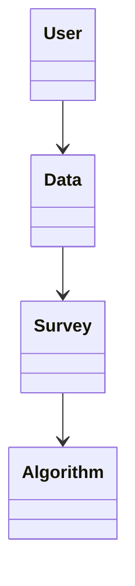

                 


# 彼得林奇的"实地调研"在大数据时代的方法创新

> 关键词：彼得林奇、实地调研、大数据、投资决策、数据驱动、算法优化、系统架构

> 摘要：本文探讨了彼得·林奇的传统实地调研方法在大数据时代的创新应用，分析了如何结合大数据技术提升调研效率和准确性。通过系统架构设计、算法优化和项目实战，展示了创新方法的实际应用价值。

---

## 第一部分: 大数据时代实地调研的背景与意义

### 第1章: 背景介绍

#### 1.1 问题背景

传统实地调研方法在投资决策中占据重要地位，但随着数据量的爆炸式增长，其效率和覆盖范围的局限性日益明显。大数据技术的出现，为调研方法的创新提供了契机。

#### 1.2 问题描述

投资者在面对海量数据时，传统方法难以快速提取关键信息，导致决策效率低下。此外，数据的多样性和复杂性使得传统调研方法难以全面覆盖。

#### 1.3 问题解决

通过结合大数据技术，创新实地调研方法，提升数据处理效率和准确性，为投资决策提供更有力的支持。

---

## 第二部分: 彼得林奇传统调研方法的核心要素

### 第2章: 核心概念与联系

#### 2.1 核心概念

- **实地调研**: 通过现场考察、访谈等方式获取信息。
- **数据驱动**: 依赖数据支持决策。

#### 2.2 方法对比分析

| 方法特点 | 传统调研 | 大数据调研 |
|----------|-----------|------------|
| 数据来源 | 现场数据 | 结构化数据 |
| 数据量   | 小 | 大 |
| 效率     | 低 | 高 |

#### 2.3 实体关系图

```mermaid
erd
    title 实体关系图
    User
    Company
    Survey
    Data
    relationship User- Survey
    relationship Company- Survey
    relationship Survey- Data
```

---

## 第三部分: 大数据技术在调研中的应用

### 第3章: 大数据技术的核心原理

#### 3.1 数据采集与处理

- **数据源**: 结构化和非结构化数据。
- **数据清洗**: 去除无效数据，确保数据质量。

#### 3.2 数据分析与挖掘

- **算法**: 使用聚类、分类等方法。
- **可视化**: 使用图表展示数据。

#### 3.3 机器学习与预测

- **模型**: 线性回归、决策树等。
- **预测**: 基于历史数据预测未来趋势。

---

## 第四部分: 传统调研与大数据技术的结合

### 第4章: 创新调研方法的构建

#### 4.1 融合策略

- **数据整合**: 综合传统和大数据源。
- **工具协同**: 结合数据采集、分析工具。

#### 4.2 应用场景

- **行业分析**: 通过大数据预测行业趋势。

---

## 第五部分: 创新调研方法的系统架构设计

### 第5章: 系统分析与架构设计

#### 5.1 问题场景介绍

- **目标**: 提升调研效率。
- **范围**: 数据采集、处理、分析。

#### 5.2 系统功能设计



#### 5.3 系统架构设计


#### 5.4 系统接口设计

- **数据接口**: API访问。
- **算法接口**: 调用分析工具。

#### 5.5 系统交互设计

```mermaid
sequenceDiagram
    User -> Data Layer: 请求数据
    Data Layer -> Algorithm Layer: 分析数据
    Algorithm Layer -> Survey Layer: 生成报告
    User <- Survey Layer: 获取报告
```

---

## 第六部分: 创新调研方法的项目实战

### 第6章: 项目实战

#### 6.1 环境安装

- **工具**: Python、Jupyter。
- **库**: Pandas、Scikit-learn。

#### 6.2 核心实现

```python
import pandas as pd
from sklearn.tree import DecisionTreeClassifier

# 数据加载
data = pd.read_csv('survey.csv')

# 特征工程
features = data.drop('label', axis=1)
label = data['label']

# 模型训练
model = DecisionTreeClassifier().fit(features, label)
```

#### 6.3 案例分析

- **数据预处理**: 清洗和归一化。
- **模型优化**: 调参提升准确率。

---

## 第七部分: 总结与展望

### 7.1 创新点

- **数据整合**: 提升效率。
- **算法优化**: 提高准确性。

### 7.2 最佳实践

- **数据质量**: 重视数据清洗。
- **工具选择**: 根据需求选择工具。

### 7.3 注意事项

- **数据隐私**: 注意数据安全。
- **模型解释**: 确保结果可解释。

### 7.4 拓展阅读

- **书籍推荐**: 《大数据投资策略》。

---

作者：AI天才研究院/AI Genius Institute & 禅与计算机程序设计艺术/Zen And The Art of Computer Programming

