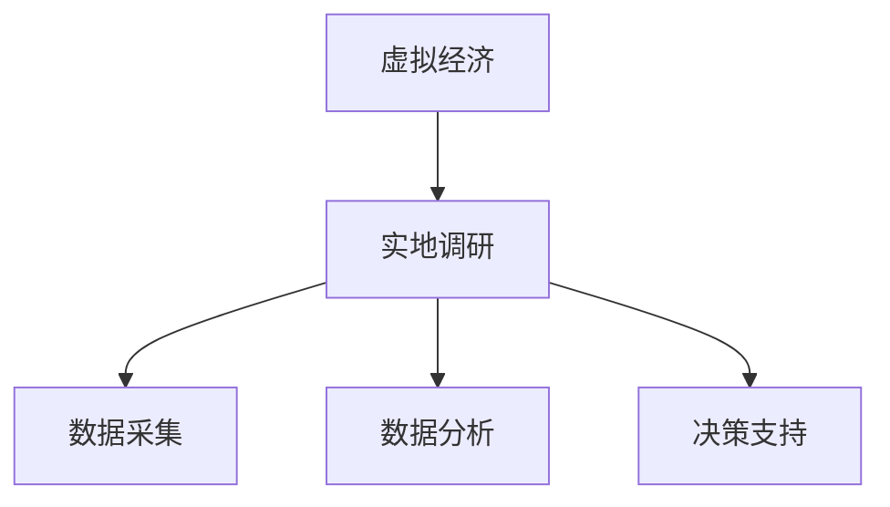
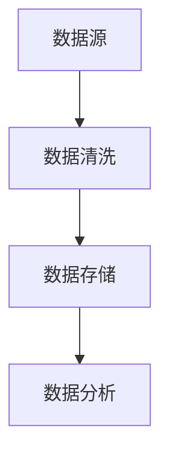
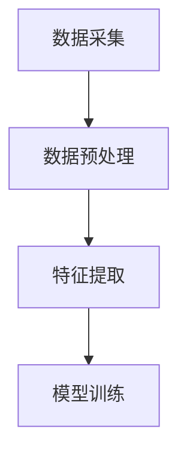
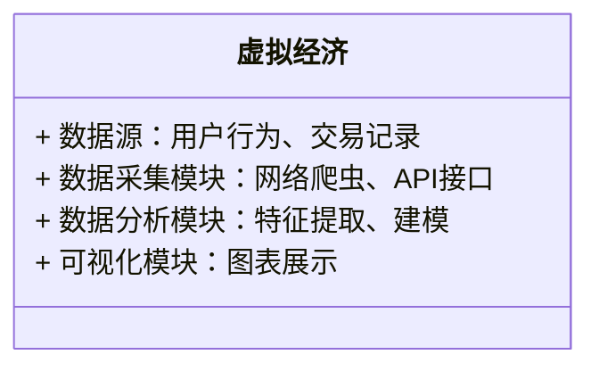
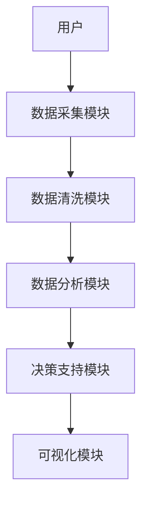

                 


# 彼得林奇的"实地调研"在虚拟经济时代的方法创新

## 关键词：虚拟经济，实地调研，彼得林奇，算法创新，系统架构

## 摘要：  
在虚拟经济时代，传统的实地调研方法面临巨大挑战。本文结合彼得林奇的实地调研理念，提出了一套创新的方法体系，涵盖数据采集、分析、决策支持等环节，并通过算法与系统架构的创新，为虚拟经济时代的实地调研提供了新的思路。

---

# 第一部分：背景与概念

## 第1章：虚拟经济时代的实地调研

### 1.1 虚拟经济的现状与挑战
#### 1.1.1 虚拟经济的核心特征  
虚拟经济是指以数字化、网络化为特征的经济形态，其核心在于数据的生成、流动和价值创造。与传统经济相比，虚拟经济具有实时性、全球化和去中介化的特点。  

#### 1.1.2 传统实地调研的局限性  
传统实地调研依赖于面对面的访谈、现场考察和问卷调查，这种方式在虚拟经济环境下效率低下，且难以捕捉实时数据。  

#### 1.1.3 虚拟经济时代调研的必要性  
虚拟经济的快速发展要求调研方法必须与时俱进，采用更加高效、精准的方式获取数据，以支持决策。

---

### 1.2 彼得林奇实地调研方法的演变  
#### 1.2.1 传统实地调研的核心理念  
彼得林奇以其独特的实地调研方法闻名，强调通过深入企业内部、与管理层沟通等方式，挖掘企业的内在价值。  

#### 1.2.2 虚拟经济对调研方法的影响  
虚拟经济的兴起使得数据来源更加多样化，调研对象从实体企业扩展到虚拟平台、在线社区等。  

#### 1.2.3 方法创新的必要性与目标  
创新的目标是将彼得林奇的实地调研方法与虚拟经济的特点相结合，构建一套高效、精准的虚拟调研体系。

---

## 第2章：虚拟经济时代实地调研的核心概念

### 2.1 虚拟经济中的实地调研定义  
#### 2.1.1 虚拟经济的定义与特征  
虚拟经济是指以数字化技术为基础，通过网络平台进行交易、投资和价值创造的经济形态。  

#### 2.1.2 实地调研在虚拟经济中的新内涵  
虚拟经济时代的实地调研不再局限于线下，而是扩展到线上数据的采集与分析，强调数据的实时性和动态性。

---

### 2.2 核心概念与联系  
#### 2.2.1 虚拟经济中的调研要素对比表  
| 调研要素 | 传统调研 | 虚拟调研 |
|----------|-----------|----------|
| 数据来源 | 线下数据 | 线上数据 |
| 数据类型 | 结构化数据为主 | 结构化+非结构化数据 |
| 数据获取方式 | 调查问卷、访谈 | 网络爬取、API接口 |

#### 2.2.2 实地调研与虚拟经济的ER实体关系图  


---

## 第3章：虚拟经济时代实地调研的算法与模型

### 3.1 数据采集算法  
#### 3.1.1 数据采集流程  


#### 3.1.2 数据清洗算法  
```python
def data_cleaning(data):
    # 删除缺失值
    data = data.dropna()
    # 填充缺失值（示例：均值填充）
    data['value'].fillna(data['value'].mean(), inplace=True)
    return data
```

---

### 3.2 数据分析模型  
#### 3.2.1 数据分析流程  


#### 3.2.2 数据分析的数学模型  
$$ 

---

## 第4章：虚拟经济时代实地调研的系统架构设计

### 4.1 系统功能设计  
#### 4.1.1 数据采集模块  
- 负责从虚拟平台获取实时数据，包括用户行为数据、交易数据等。

#### 4.1.2 数据分析模块  
- 对采集的数据进行清洗、建模和预测，提供决策支持。

#### 4.1.3 可视化模块  
- 将分析结果以图表形式展示，便于用户理解。

---

### 4.2 系统架构设计  
#### 4.2.1 领域模型  


#### 4.2.2 系统架构图  


---

## 第5章：虚拟经济时代实地调研的项目实战

### 5.1 环境安装与配置  
- 安装Python、Pandas、BeautifulSoup等工具。

### 5.2 核心代码实现  
```python
import requests
from bs4 import BeautifulSoup

def fetch_data(url):
    response = requests.get(url)
    soup = BeautifulSoup(response.text, 'html.parser')
    data = []
    for item in soup.find_all('div', class_='data-item'):
        data.append({
            'name': item.find('h3').text,
            'value': item.find('span').text
        })
    return data

# 示例调用
url = 'https://example.com/data'
data = fetch_data(url)
print(data)
```

### 5.3 案例分析与总结  
通过实际案例分析，验证算法和系统的有效性，总结经验教训。

---

## 第6章：虚拟经济时代实地调研的最佳实践

### 6.1 小结  
虚拟经济时代的实地调研需要结合传统方法与现代技术，构建高效的数据采集与分析体系。

### 6.2 注意事项  
- 数据隐私与安全问题需高度重视。
- 算法的实时性和准确性是关键。

### 6.3 拓展阅读  
推荐相关书籍和论文，进一步深入学习。

---

## 作者：AI天才研究院/AI Genius Institute & 禅与计算机程序设计艺术 /Zen And The Art of Computer Programming

