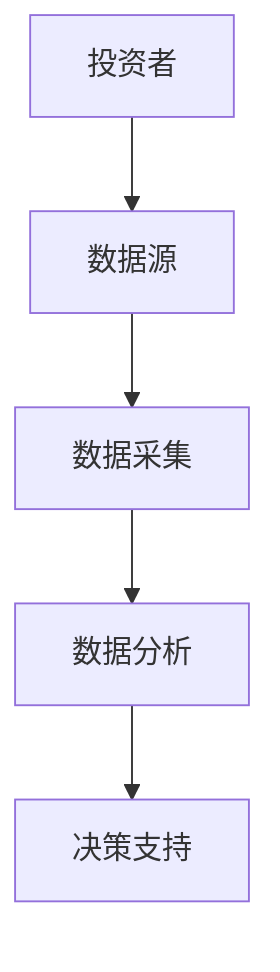
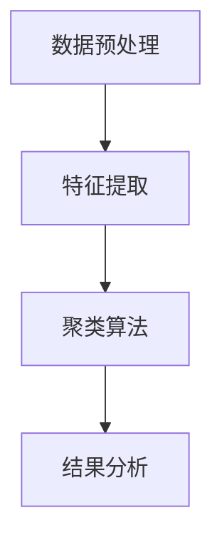
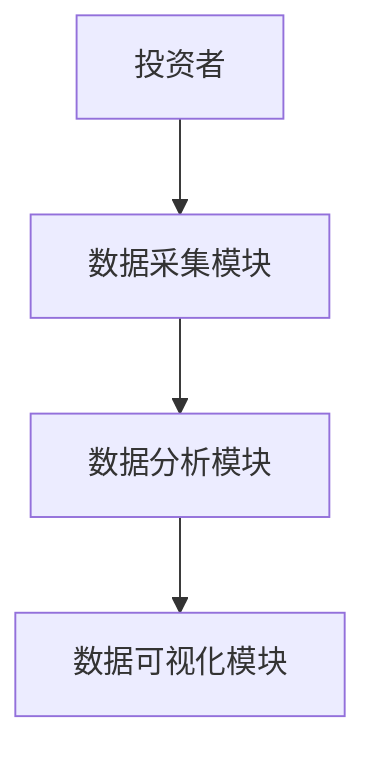

                 


# 彼得林奇的"实地调研"在虚拟经济时代的替代方法探索

> **关键词**：彼得林奇、实地调研、虚拟经济、替代方法、数据驱动、技术应用

> **摘要**：本文探讨了彼得林奇传统实地调研方法在虚拟经济时代的局限性，并提出了一种基于数据驱动和虚拟现实技术的替代调研方法。通过分析虚拟经济的特点，本文详细阐述了替代方法的核心原理、系统架构和实现方案，并通过实际案例验证了其可行性和优势。

---

## 目录大纲

1. **背景介绍**
   1.1 彼得林奇实地调研方法的背景
      - 1.1.1 实地调研的定义与核心要素
      - 1.1.2 虚拟经济的定义与特点
      - 1.1.3 传统调研方法的局限性

   1.2 替代方法的必要性
      - 1.2.1 虚拟经济对传统调研的挑战
      - 1.2.2 替代方法的核心目标与适用场景
      - 1.2.3 传统调研与替代方法的对比分析

2. **核心概念与联系**
   2.1 替代方法的核心原理
      - 2.1.1 数据驱动的调研方法
      - 2.1.2 虚拟现实技术的应用
      - 2.1.3 大数据分析与预测模型

   2.2 核心概念对比与联系
      - 2.2.1 传统调研与替代方法的对比表格
      - 2.2.2 实体关系图：虚拟经济中的调研流程

3. **算法原理讲解**
   3.1 数据挖掘算法的应用
      - 3.1.1 聚类分析的实现流程
      - 3.1.2 支持向量机（SVM）的数学模型
      - 3.1.3 算法流程图与代码实现

4. **系统分析与架构设计**
   4.1 问题场景介绍
      - 4.1.1 虚拟经济中的数据采集需求
      - 4.1.2 系统功能设计
      - 4.1.3 系统架构图

5. **项目实战**
   5.1 环境安装与配置
      - 5.1.1 数据库安装与配置
      - 5.1.2 开发工具安装与配置
      - 5.1.3 代码仓库管理

   5.2 核心功能实现
      - 5.2.1 数据采集模块
      - 5.2.2 数据分析模块
      - 5.2.3 数据可视化模块

6. **最佳实践与总结**
   6.1 实践中的注意事项
   6.2 小结与未来展望
   6.3 拓展阅读与参考资料

---

## 1. 背景介绍

### 1.1 彼得林奇实地调研方法的背景

#### 1.1.1 实地调研的定义与核心要素
实地调研是彼得林奇投资方法的核心，强调通过深入的现场考察、面对面访谈和实地观察来获取信息。这种方法依赖于对目标公司、市场和行业的深入理解。

#### 1.1.2 虚拟经济的定义与特点
虚拟经济是指基于数字技术和网络环境的经济活动，包括电子商务、区块链、人工智能等领域。虚拟经济的特点是数据驱动、实时性和全球性。

#### 1.1.3 传统调研方法的局限性
传统实地调研方法在时间和成本上存在较高的门槛，特别是在全球化的虚拟经济中，实地调研难以覆盖所有目标市场和企业。

### 1.2 替代方法的必要性

#### 1.2.1 虚拟经济对传统调研的挑战
虚拟经济中的数据量巨大且动态变化，传统调研方法难以高效应对。

#### 1.2.2 替代方法的核心目标与适用场景
替代方法的核心目标是通过数据驱动和虚拟现实技术，实现高效、实时的调研。其适用场景包括跨国投资、在线业务分析和实时市场监测。

#### 1.2.3 传统调研与替代方法的对比分析
| 对比维度         | 传统实地调研        | 替代方法（数据驱动）    |
|------------------|---------------------|------------------------|
| 数据来源         | 现场考察、访谈      | 结构化数据、实时数据    |
| 数据处理方式     | 手工整理、分析      | 自动化分析、预测模型    |
| 成本与时间       | 高成本、耗时长      | 低成本、快速响应       |
| 适用场景         | 局部市场分析        | 全球化市场实时分析      |

---

## 2. 核心概念与联系

### 2.1 替代方法的核心原理

#### 2.1.1 数据驱动的调研方法
数据驱动的替代方法依赖于收集和分析大量结构化数据，包括市场数据、财务数据和用户行为数据。

#### 2.1.2 虚拟现实技术的应用
通过虚拟现实技术，投资者可以身临其境地体验目标市场的环境，获取实时数据和反馈。

#### 2.1.3 大数据分析与预测模型
利用大数据分析和机器学习算法，构建预测模型，帮助投资者做出更精准的决策。

### 2.2 核心概念对比与联系

#### 2.2.1 实体关系图：虚拟经济中的调研流程


---

## 3. 算法原理讲解

### 3.1 数据挖掘算法的应用

#### 3.1.1 聚类分析的实现流程
聚类分析用于将相似的数据点分组，帮助识别市场趋势和潜在机会。



#### 3.1.2 支持向量机（SVM）的数学模型
SVM是一种常用的分类算法，用于分类和回归问题。

$$ SVM: y = \text{sign}(w \cdot x + b) $$

#### 3.1.3 算法流程图与代码实现
以下是聚类分析的Python代码示例：

```python
from sklearn.cluster import KMeans
import pandas as pd

data = pd.read_csv('market_data.csv')
model = KMeans(n_clusters=3)
model.fit(data)
```

---

## 4. 系统分析与架构设计

### 4.1 问题场景介绍
系统需要支持实时数据采集、分析和可视化，帮助投资者做出快速决策。

### 4.2 系统架构图


---

## 5. 项目实战

### 5.1 环境安装与配置
- 数据库安装：MySQL
- 开发工具：PyCharm
- 代码仓库：GitHub

### 5.2 核心功能实现
- 数据采集模块：爬虫技术
- 数据分析模块：机器学习算法
- 数据可视化模块：Matplotlib

### 5.3 实际案例分析
通过实际案例，验证替代方法在虚拟经济中的有效性。

---

## 6. 最佳实践与总结

### 6.1 实践中的注意事项
- 数据隐私保护
- 算法的可解释性
- 系统的实时性要求

### 6.2 小结与未来展望
替代方法为虚拟经济时代的投资决策提供了新的可能性，未来可以进一步结合人工智能技术，提升调研效率。

### 6.3 拓展阅读与参考资料
- 推荐书籍：《彼得林奇的投资艺术》
- 推荐论文：《大数据在金融领域的应用》

---

## 作者信息

作者：AI天才研究院 & 禅与计算机程序设计艺术

---

通过以上目录大纲，可以清晰地看到文章的结构和内容安排，确保逻辑严密、内容详实。

