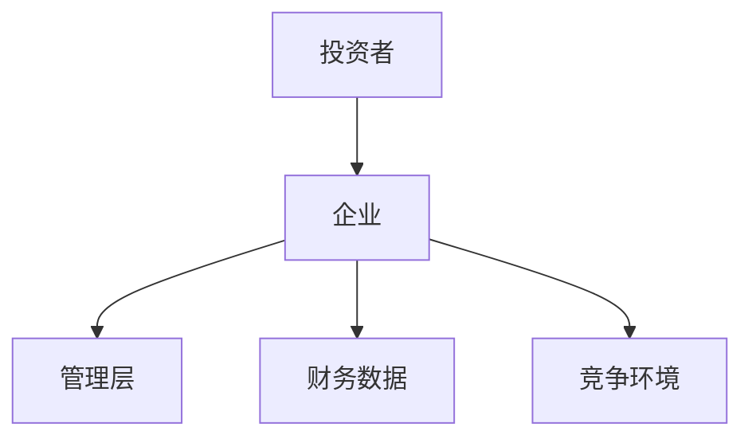

                 


# 彼得林奇的实地调研技巧

> 关键词：彼得林奇，实地调研，投资技巧，企业分析，管理评估，财务分析

> 摘要：本文将详细介绍彼得林奇的实地调研技巧，包括其背景、核心概念、算法原理、系统分析与架构设计、项目实战、最佳实践等。通过分析彼得林奇的投资哲学和实地调研方法，本文将为读者提供一套系统化的实地调研框架，帮助投资者更好地理解和应用这些技巧。

---

## 第一部分: 实地调研的背景与核心概念

### 第1章: 实地调研的重要性与背景

#### 1.1 什么是实地调研
- **1.1.1 实地调研的定义**
  - 实地调研是一种通过亲临企业现场，与管理层、员工、客户等直接交流，收集第一手信息的调研方法。
- **1.1.2 实地调研的核心要素**
  - 企业基本面分析
  - 管理层能力评估
  - 竞争环境分析
  - 财务状况核实
- **1.1.3 实地调研的边界与外延**
  - 与其他调研方法（如定量分析、定性分析）的对比

#### 1.2 彼得林奇的背景与投资哲学
- **1.2.1 彼得林奇的个人简介**
  - 彼得·林奇（Peter Lynch）是美国著名基金经理，以其独特的投资风格和实地调研技巧闻名。
- **1.2.2 彼得林奇的投资哲学**
  - 长期投资，注重企业基本面
  - 通过实地调研发现被低估的投资机会
- **1.2.3 彼得林奇实地调研方法的核心理念**
  - 通过实地调研验证财务数据的真实性
  - 发现企业潜在的问题和机会

#### 1.3 实地调研在企业投资中的作用
- **1.3.1 实地调研对企业价值评估的意义**
  - 确认财务数据的真实性
  - 评估企业管理层的能力
  - 了解企业实际运营状况
- **1.3.2 实地调研在投资决策中的应用**
  - 发现投资机会
  - 风险评估与管理
- **1.3.3 实地调研与其他调研方法的对比**
  - 定量分析 vs 实地调研
  - 定性分析 vs 实地调研

---

### 第2章: 实地调研的核心概念

#### 2.1 实地调研的核心要素
- **2.1.1 企业基本面分析**
  - 收入来源
  - 成本结构
  - 利润能力
- **2.1.2 管理层分析**
  - 管理层能力
  - 管理层决策
  - 管理层道德
- **2.1.3 竞争环境分析**
  - 行业竞争格局
  - 竞争对手分析
  - 市场前景
- **2.1.4 财务状况分析**
  - 财务报表分析
  - 资产负债表
  - 利润表
  - 现金流量表

#### 2.2 实地调研与其它调研方法的联系
- **2.2.1 实地调研与定量分析的对比**
  - 数据来源
  - 分析方法
  - 结论的应用
- **2.2.2 实地调研与定性分析的结合**
  - 定性分析的局限性
  - 实地调研的优势
- **2.2.3 实地调研在混合分析中的应用**
  - 混合分析的定义
  - 混合分析的优势

#### 2.3 实地调研的ER实体关系图


---

### 第3章: 实地调研的系统化流程

#### 3.1 实地调研的准备阶段
- **3.1.1 调研目标的确定**
  - 明确调研的目的
  - 设定调研的问题
- **3.1.2 调研计划的制定**
  - 时间安排
  - 人员分工
  - 资金预算
- **3.1.3 调研工具的选择**
  - 数据收集工具
  - 数据分析工具
  - 沟通工具

#### 3.2 实地调研的执行阶段
- **3.2.1 调研过程中的关键点**
  - 现场观察
  - 与管理层交流
  - 与员工和客户交流
- **3.2.2 调研中的沟通技巧**
  - 有效提问
  - 耐心倾听
  - 沟通中的注意事项
- **3.2.3 调研中的问题解决**
  - 问题的识别
  - 问题的分析
  - 问题的解决

#### 3.3 实地调研的分析阶段
- **3.3.1 数据的整理与分析**
  - 数据清洗
  - 数据分析
  - 数据可视化
- **3.3.2 数据分析的可视化**
  - 图表的选择
  - 数据的呈现方式
  - 可视化工具的使用
- **3.3.3 数据分析的结论提取**
  - 结论的逻辑性
  - 结论的实用性
  - 结论的可操作性

---

### 第4章: 实地调研的数学模型与算法

#### 4.1 实地调研的数学模型
- **4.1.1 模型的定义**
  - 模型的输入
  - 模型的输出
- **4.1.2 模型的构建**
  - 数据的处理
  - 模型的训练
  - 模型的验证
- **4.1.3 模型的应用**
  - 预测企业价值
  - 评估投资风险
  - 指导投资决策

#### 4.2 实地调研的算法原理
- **4.2.1 算法的流程**
  - 数据的获取
  - 数据的预处理
  - 数据的分析
  - 结果的输出
- **4.2.2 算法的实现**
  - 代码示例
  - 算法的优化
  - 算法的扩展

---

### 第5章: 实地调研的系统架构与设计

#### 5.1 系统架构设计
- **5.1.1 系统功能设计**
  - 数据收集模块
  - 数据分析模块
  - 数据可视化模块
- **5.1.2 系统架构图**
  ```mermaid
  graph TD
      A[投资者] --> B[企业]
      B --> C[管理层]
      B --> D[财务数据]
      B --> E[竞争环境]
  ```

#### 5.2 系统接口设计
- **5.2.1 接口的设计**
  - 接口的定义
  - 接口的实现
  - 接口的测试
- **5.2.2 接口的优化**
  - 接口的性能优化
  - 接口的安全性
  - 接口的可扩展性

---

### 第6章: 实地调研的项目实战

#### 6.1 项目背景
- **6.1.1 项目介绍**
  - 项目的目标
  - 项目的范围
  - 项目的计划
- **6.1.2 项目实施**
  - 项目准备
  - 项目执行
  - 项目总结

#### 6.2 项目核心实现
- **6.2.1 核心代码实现**
  ```python
  def analyze_financial_data(data):
      # 数据清洗
      cleaned_data = data.dropna()
      # 数据分析
      summary = cleaned_data.describe()
      return summary
  ```

---

### 第7章: 实地调研的最佳实践与小结

#### 7.1 最佳实践
- **7.1.1 调研前的准备**
  - 明确目标
  - 制定计划
  - 准备工具
- **7.1.2 调研中的注意事项**
  - 沟通技巧
  - 问题解决
  - 数据记录
- **7.1.3 调研后的总结**
  - 数据分析
  - 结论提取
  - 报告撰写

#### 7.2 小结
- **7.2.1 本章总结**
  - 实地调研的重要性
  - 实地调研的方法
  - 实地调研的应用
- **7.2.2 未来展望**
  - 实地调研的发展趋势
  - 实地调研的创新方向

---

## 作者信息

作者：AI天才研究院/AI Genius Institute & 禅与计算机程序设计艺术/Zen And The Art of Computer Programming

