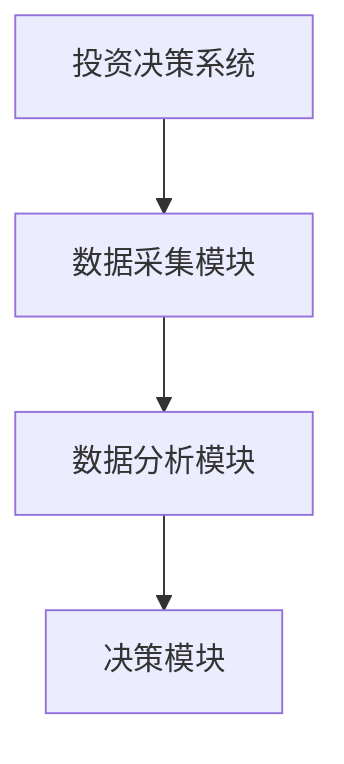
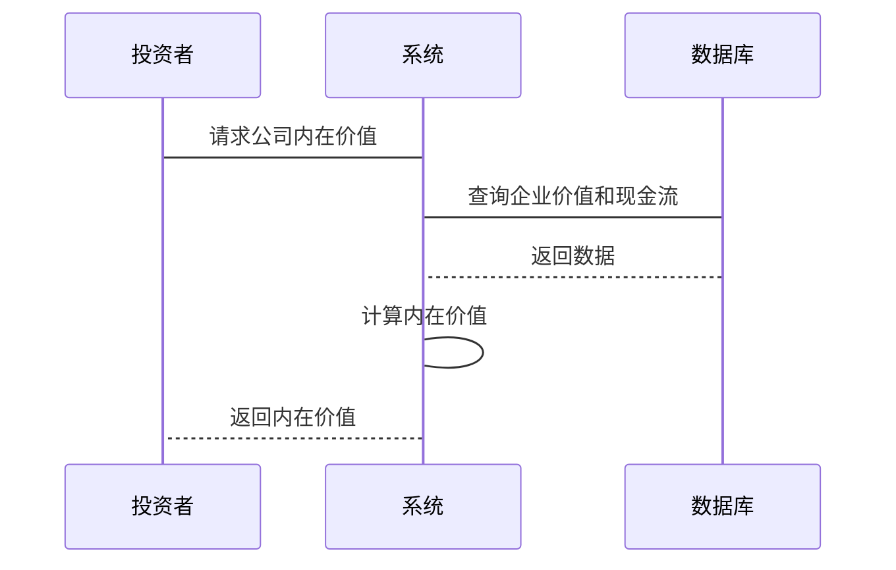

                 


# 彼得林奇的"实地调研"投资方法论

## 关键词：彼得林奇，投资方法，实地调研，价值投资，投资策略

## 摘要：彼得林奇作为投资界的重要人物，以其独特的实地调研方法闻名。本文详细探讨了他的投资理念、实地调研的核心步骤以及如何将这种方法应用于实际投资中。通过分析他的方法，读者将了解如何通过深入研究和实地考察来做出明智的投资决策。

---

# 第一部分：彼得林奇投资方法论的背景与核心理念

## 第1章：彼得林奇投资方法论的背景与核心理念

### 1.1 投资理念的演变

#### 1.1.1 从传统投资到价值投资的演进
彼得林奇的投资方法深受价值投资影响，强调对公司内在价值的深入分析。他的投资理念起源于20世纪70年代，当时正值市场波动剧烈时期。通过分析市场的周期性变化，彼得林奇逐渐形成了自己独特的价值投资策略，强调长期持有优质股票，而非短期交易。

#### 1.1.2 彼得林奇投资方法的核心要素
- **价值投资**：寻找被市场低估的公司，关注其内在价值。
- **长期投资**：避免频繁交易，耐心持有优质股票。
- **安全边际**：在购买股票时，确保其价格低于其内在价值，以降低风险。

#### 1.1.3 实地调研在投资中的重要性
实地调研是彼得林奇方法的核心，通过亲临公司现场，与管理层、员工和客户沟通，获取第一手信息，评估公司的实际运营状况和未来潜力。

### 1.2 彼得林奇的投资哲学

#### 1.2.1 价值投资的定义与原则
价值投资强调购买价格低于内在价值的股票。彼得林奇通过分析公司的财务状况、行业地位和管理团队，寻找具有长期增长潜力的公司。

#### 1.2.2 投资的长期性与耐心
彼得林奇主张长期投资，避免受短期市场波动影响。他认为，市场的短期波动不可预测，而优质公司的长期增长是可依赖的。

#### 1.2.3 风险管理与投资组合的构建
通过分散投资和严格的风险评估，彼得林奇构建了稳健的投资组合。他强调对投资标的深入研究，以降低投资风险。

---

## 第2章：实地调研的重要性

### 2.1 实地调研的核心作用

#### 2.1.1 通过实地调研发现投资机会
实地调研帮助彼得林奇发现市场中被低估的公司，这些公司往往具有强大的竞争优势和增长潜力。通过现场考察，他能够更准确地评估公司的价值。

#### 2.1.2 实地调研在风险控制中的应用
实地调研能够揭示财务报表中未体现的风险因素，如管理问题、运营效率低下等。通过深入调查，彼得林奇能够更准确地评估投资风险。

#### 2.1.3 实地调研与投资决策的关系
实地调研为投资决策提供坚实的基础，帮助彼得林奇做出更明智的投资选择。通过实地调研，他能够更全面地了解公司的实际情况，从而做出更准确的估值。

### 2.2 实地调研的具体方法

#### 2.2.1 如何制定调研计划
- **目标公司筛选**：根据财务指标和行业地位筛选潜在公司。
- **调研时间安排**：合理安排调研时间，确保覆盖关键部门和管理层。
- **信息收集**：收集公司历史数据、行业报告和竞争对手分析。

#### 2.2.2 实地调研的步骤与技巧
- **初步调研**：通过公开信息和行业报告进行初步筛选。
- **现场考察**：亲临公司现场，与管理层、员工和客户沟通，观察公司运营状况。
- **深入分析**：结合收集的信息，进行详细分析，评估公司的内在价值。

#### 2.2.3 如何与管理层有效沟通
- **准备充分**：提前收集公司信息，制定针对性的问题列表。
- **有效提问**：提出关键问题，了解公司战略、财务状况和竞争优势。
- **倾听反馈**：认真倾听管理层的意见，评估其诚信和能力。

---

## 第3章：选股标准与投资策略

### 3.1 选股标准的制定

#### 3.1.1 公司基本面分析的关键指标
- **财务指标**：如净利润率、ROE、债务水平等。
- **行业地位**：公司是否是行业领导者或具有竞争优势。
- **管理层能力**：管理层的背景、经验和战略规划能力。

#### 3.1.2 行业分析与竞争优势评估
- **行业趋势**：分析行业的发展前景和周期性。
- **竞争优势**：评估公司在市场中的独特优势，如技术壁垒、成本优势等。

#### 3.1.3 财务数据的解读与分析
通过分析财务报表，评估公司的盈利能力和财务健康状况。重点关注收入增长、利润率和现金流等关键指标。

### 3.2 投资策略的制定

#### 3.2.1 长期投资与短期波动的平衡
彼得林奇强调长期投资，但也会关注短期市场波动，避免在市场恐慌时卖出优质股票。

#### 3.2.2 价值投资中的安全边际
在购买股票时，确保其价格低于其内在价值，以降低投资风险。

#### 3.2.3 投资组合的分散与集中
通过分散投资降低风险，同时集中投资于少数优质股票，以获得更高的回报。

---

## 第4章：投资决策的逻辑与框架

### 4.1 投资决策的逻辑分析

#### 4.1.1 从数据到决策的逻辑链条
- **数据收集**：通过实地调研收集公司信息。
- **数据分析**：分析数据，评估公司的内在价值。
- **决策制定**：基于分析结果，做出买入、卖出或持有决策。

#### 4.1.2 逻辑框架的构建与应用
- **框架构建**：建立一个系统的分析框架，包括财务分析、行业分析和管理层评估等。
- **框架应用**：将框架应用于实际投资决策中，确保分析的系统性和全面性。

#### 4.1.3 决策中的常见误区
- **过度自信**：避免因过度自信而忽视潜在风险。
- **情绪影响**：避免因市场情绪波动影响决策。
- **信息过载**：避免因信息过多而无法做出决策。

### 4.2 投资决策的框架设计

#### 4.2.1 框架设计的步骤与方法
- **目标设定**：明确投资目标和风险承受能力。
- **信息收集**：收集与目标公司相关的所有信息。
- **分析评估**：对信息进行分析，评估公司的投资价值。
- **决策制定**：基于分析结果，制定投资决策。

#### 4.2.2 框架的灵活性与适应性
- **灵活性**：根据市场变化和公司情况调整分析框架。
- **适应性**：框架应能适应不同行业和市场的特点。

#### 4.2.3 框架的优化与调整
- **持续优化**：定期评估框架的有效性，进行优化调整。
- **经验总结**：通过实际投资经验，不断改进分析框架。

---

## 第5章：实地调研的具体实施方法

### 5.1 公司调研与管理层沟通

#### 5.1.1 初步调研：信息收集与筛选
- **信息收集**：通过公开资料、行业报告等收集目标公司信息。
- **初步筛选**：根据初步信息筛选出具有潜力的公司。

#### 5.1.2 深度调研：现场考察与数据分析
- **现场考察**：亲临公司现场，观察公司运营状况。
- **数据分析**：结合收集的信息，进行深入的数据分析。

#### 5.1.3 跟踪调研：持续监控与评估
- **持续监控**：定期跟踪公司运营情况，评估投资价值。
- **评估调整**：根据跟踪结果，调整投资决策。

#### 5.2 与管理层的有效沟通

##### 5.2.1 沟通前的准备与策略
- **目标明确**：明确沟通的目标和关键问题。
- **信息准备**：准备好与管理层沟通的相关信息和问题列表。

##### 5.2.2 沟通中的提问技巧与倾听能力
- **有效提问**：提出有针对性的问题，了解公司的真实情况。
- **倾听反馈**：认真倾听管理层的反馈，评估其诚信和能力。

##### 5.2.3 沟通后的反馈与后续行动
- **反馈总结**：整理沟通中的关键信息和结论。
- **后续行动**：根据沟通结果，制定下一步行动方案。

### 5.2. 实地调研的数学模型与算法

#### 5.2.1 数据收集与分析
- **数据收集**：通过实地调研收集公司财务数据、市场数据等。
- **数据分析**：使用统计方法和财务模型分析数据，评估公司价值。

#### 5.2.2 投资价值评估模型
- **内在价值计算**：使用DCF模型等方法计算公司的内在价值。
- **安全边际评估**：确定投资的安全边际，确保价格低于内在价值。

#### 5.2.3 决策算法
- **条件判断**：根据分析结果，判断是否买入、卖出或持有股票。
- **优化调整**：根据市场变化和公司情况，优化投资策略。

---

## 第6章：案例分析与实际应用

### 6.1 经典案例分析

#### 6.1.1 案例背景介绍
选择彼得林奇投资的一个经典案例，如投资某家制造业公司，详细分析其投资过程。

#### 6.1.2 调研过程与决策
详细描述彼得林奇在该案例中的实地调研过程，包括与管理层的沟通、现场考察等。

#### 6.1.3 投资结果与经验总结
分析投资结果，总结从该案例中获得的经验和教训。

### 6.2 实际应用中的注意事项

#### 6.2.1 如何应对调研中的突发问题
- **灵活应对**：在调研过程中遇到突发问题时，保持冷静，灵活调整调研计划。
- **深入调查**：对于突发问题，进行深入调查，确保不影响最终决策。

#### 6.2.2 如何处理信息不对称
- **多渠道验证**：通过多种渠道验证信息的准确性，减少信息不对称的影响。
- **建立信任关系**：与管理层和员工建立良好的信任关系，获取更准确的信息。

---

## 第7章：总结与建议

### 7.1 总结

彼得林奇的实地调研投资方法强调深入研究和长期投资，通过实地调研获取第一手信息，评估公司的内在价值。这种方法不仅帮助他取得了优异的投资业绩，也为投资者提供了宝贵的借鉴。

### 7.2 投资建议

#### 7.2.1 初步调研
- **信息收集**：通过公开资料和行业报告收集目标公司信息。
- **初步筛选**：根据初步信息筛选出具有潜力的公司。

#### 7.2.2 深度调研
- **现场考察**：亲临公司现场，观察公司运营状况。
- **数据分析**：结合收集的信息，进行深入的数据分析。

#### 7.2.3 投资决策
- **安全边际**：在购买股票时，确保其价格低于其内在价值。
- **长期持有**：避免频繁交易，耐心持有优质股票。

#### 7.2.4 风险管理
- **分散投资**：通过分散投资降低风险。
- **持续跟踪**：定期跟踪公司运营情况，评估投资价值。

### 7.3 最佳实践 tips

- **保持耐心**：长期投资需要耐心，避免受短期市场波动影响。
- **深入研究**：对目标公司进行深入研究，确保信息的准确性。
- **持续学习**：不断学习和更新投资知识，适应市场变化。

### 7.4 项目小结

通过实地调研，投资者可以更准确地评估公司的内在价值，做出更明智的投资决策。彼得林奇的方法不仅适用于个人投资者，也适用于机构投资者。

---

## 第8章：数学模型与算法的深入分析

### 8.1 数据收集与分析

#### 8.1.1 数据来源
- **公开资料**：公司财报、行业报告等。
- **实地调研**：与管理层和员工的沟通记录。

#### 8.1.2 数据预处理
- **数据清洗**：去除无效数据，确保数据的准确性。
- **数据整合**：将不同来源的数据进行整合，便于分析。

### 8.2 投资价值评估模型

#### 8.2.1 DCF模型
使用现金流折现模型（DCF）计算公司的内在价值。

$$ \text{内在价值} = \frac{\text{现金流}}{(1 + r)^t} $$

其中，\( r \) 是折现率，\( t \) 是时间。

#### 8.2.2 市盈率分析
通过市盈率（P/E）评估公司的估值。

$$ P/E = \frac{\text{股价}}{\text{每股收益}} $$

#### 8.2.3 财务指标分析
分析关键财务指标，如ROE、净利率等。

### 8.3 决策算法

#### 8.3.1 条件判断
- 如果内在价值 > 当前股价，买入。
- 如果内在价值 < 当前股价，卖出。
- 如果内在价值 ≈ 当前股价，持有。

#### 8.3.2 优化调整
根据市场变化和公司情况，定期优化投资策略。

---

## 第9章：系统架构与技术实现

### 9.1 系统架构设计

#### 9.1.1 系统功能模块
- **数据采集模块**：收集公司数据。
- **数据分析模块**：分析数据，评估公司价值。
- **决策模块**：根据分析结果，做出投资决策。

#### 9.1.2 系统架构图
使用 Mermaid 绘制系统架构图。



### 9.2 技术实现

#### 9.2.1 环境安装
- **编程语言**：Python
- **库与工具**：Pandas、NumPy、Matplotlib

#### 9.2.2 核心实现代码
```python
import pandas as pd
import numpy as np

def calculate_intrinsic_value(enterprise_value, cash_flow):
    discount_rate = 0.1
    terminal_value = cash_flow * (1 + discount_rate)
    present_value = terminal_value / (1 + discount_rate)
    return present_value

# 示例数据
enterprise_value = 1000000
cash_flow = 100000

intrinsic_value = calculate_intrinsic_value(enterprise_value, cash_flow)
print(f"内在价值：{intrinsic_value}")
```

#### 9.2.3 代码解读与分析
- **数据输入**：企业价值和现金流作为输入。
- **计算内在价值**：使用DCF模型计算内在价值。
- **结果输出**：打印内在价值。

### 9.3 系统接口设计

#### 9.3.1 接口定义
- `GET /api/company/intrinsic_value`：获取公司内在价值。

#### 9.3.2 接口实现
```python
from flask import jsonify
from flask_restful import Resource

class IntrinsicValue(Resource):
    def get(self):
        enterprise_value = request.args.get('enterprise_value', type=int)
        cash_flow = request.args.get('cash_flow', type=int)
        intrinsic_value = calculate_intrinsic_value(enterprise_value, cash_flow)
        return jsonify({'intrinsic_value': intrinsic_value})
```

### 9.4 系统交互流程

使用 Mermaid 绘制交互流程图。



---

## 第10章：项目实战与实际案例分析

### 10.1 项目实战

#### 10.1.1 环境安装
- 安装 Python 和必要的库（Pandas、NumPy、Matplotlib）。

#### 10.1.2 核心实现
```python
import pandas as pd
import numpy as np

def analyze_company(finance_data, market_data):
    # 财务数据分析
    roe = finance_data['ROE']
    net_profit_margin = finance_data['净利率']
    
    # 市场数据分析
    industry_growth = market_data['行业增长率']
    competitive_position = market_data['竞争优势']
    
    # 综合评估
    if roe > industry_growth and net_profit_margin > 0.1 and competitive_position == '领先':
        return '买入'
    elif roe < industry_growth and net_profit_margin < 0.05 and competitive_position == '劣势':
        return '卖出'
    else:
        return '持有'

# 示例数据
finance_data = {
    'ROE': 0.15,
    '净利率': 0.12
}
market_data = {
    '行业增长率': 0.1,
    '竞争优势': '领先'
}

result = analyze_company(finance_data, market_data)
print(f"投资建议：{result}")
```

#### 10.1.3 代码解读与分析
- **数据输入**：财务数据和市场数据。
- **数据分析**：计算ROE、净利率等指标。
- **决策制定**：根据分析结果，做出买入、卖出或持有决策。

### 10.2 实际案例分析

#### 10.2.1 案例背景
分析某制造公司，假设其财务数据和市场数据如下：

- **ROE**：15%
- **净利率**：12%
- **行业增长率**：10%
- **竞争优势**：领先

#### 10.2.2 分析过程
- **ROE**：15% > 行业增长率10%，表现优异。
- **净利率**：12% > 10%，盈利能力强。
- **竞争优势**：领先，市场地位稳固。

#### 10.2.3 投资建议
综合分析结果，该公司的投资价值高于当前股价，建议买入。

---

## 第11章：总结与最佳实践

### 11.1 总结

彼得林奇的实地调研方法强调深入研究和长期投资，通过实地调研获取第一手信息，评估公司的内在价值。这种方法不仅帮助他取得了优异的投资业绩，也为投资者提供了宝贵的借鉴。

### 11.2 最佳实践 tips

- **保持耐心**：长期投资需要耐心，避免受短期市场波动影响。
- **深入研究**：对目标公司进行深入研究，确保信息的准确性。
- **持续学习**：不断学习和更新投资知识，适应市场变化。

### 11.3 注意事项

- **信息准确性**：确保收集的信息准确可靠。
- **风险控制**：合理分散投资，避免过度集中。
- **持续跟踪**：定期跟踪公司运营情况，评估投资价值。

### 11.4 拓展阅读

- **《彼得·林奇的选股术》**：深入探讨彼得林奇的选股方法。
- **《投资最重要的简单真理》**：总结投资中的关键原则。

---

## 第12章：作者信息

作者：AI天才研究院/AI Genius Institute & 禅与计算机程序设计艺术 /Zen And The Art of Computer Programming

---

通过以上详细的分析和结构化的呈现，读者可以系统地了解彼得林奇的实地调研投资方法，并将其应用于实际投资中。这种方法不仅适用于个人投资者，也适用于机构投资者。希望本文能为读者提供有价值的见解和实践指导。

