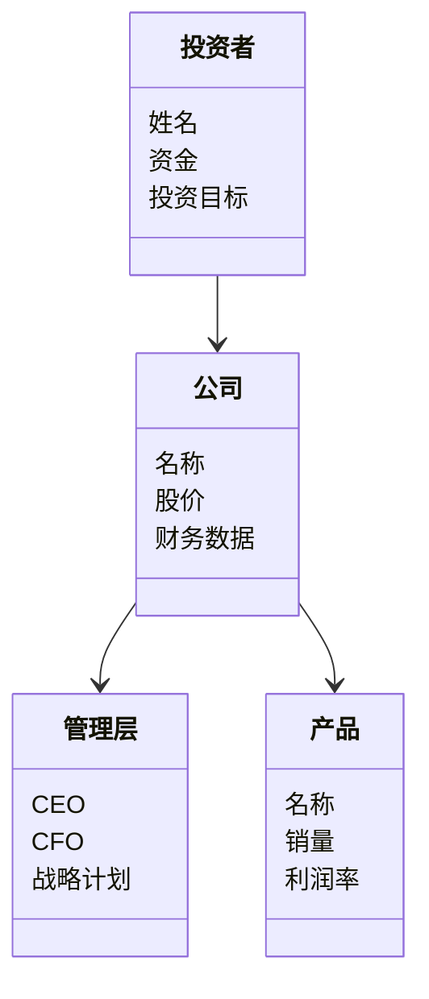
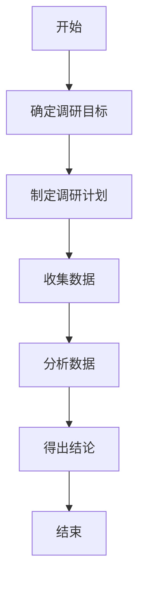
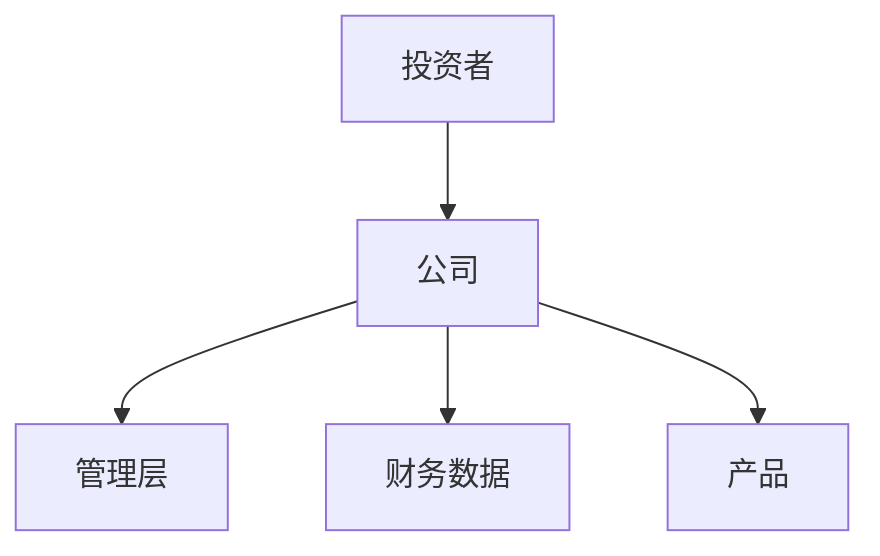

                 


# 彼得林奇的"实地调研"注意事项

**关键词**：彼得·林奇、实地调研、投资分析、财务数据、管理层沟通、投资决策

**摘要**：  
彼得·林奇是全球最著名的投资经理之一，他以深入的企业实地调研而闻名。本文详细探讨了他在实地调研过程中需要注意的关键事项，包括调研前的准备、调研中的注意事项以及调研后的分析。通过案例分析、数学模型和系统架构设计，本文为投资者提供了实用的指导，帮助他们在投资决策中做出明智的选择。

---

## 第一章: 背景介绍

### 1.1 实地调研的重要性

#### 1.1.1 投资中的信息不对称问题  
在金融市场中，信息不对称是一个普遍存在的问题。卖方通常掌握更多的信息，而买方则处于弱势地位。实地调研是打破这种信息不对称的重要手段之一。

#### 1.1.2 实地调研在投资决策中的作用  
实地调研可以帮助投资者更好地理解企业的经营状况、管理层的决策能力和财务数据的真实性。通过实地调研，投资者可以更全面地评估企业的价值，从而做出更准确的投资决策。

#### 1.1.3 彼得·林奇的调研方法简介  
彼得·林奇以其独特的调研方法闻名。他不仅关注企业的财务数据，还注重与管理层的沟通，以及对企业所在行业的深入了解。他的调研方法强调“眼见为实”，即通过实地考察来验证数据的可靠性。

### 1.2 彼得·林奇的基本情况

#### 1.2.1 彼得·林奇的生平简介  
彼得·林奇（Peter Lynch）是美国著名的投资经理，曾管理富达麦哲伦基金（Fidelity Magellan Fund）长达13年，取得了卓越的投资业绩。他以对企业基本面的深入研究和对管理层的精准判断而闻名。

#### 1.2.2 林奇的投资理念与风格  
林奇的投资理念强调“买入并持有”，他倾向于投资那些具有强大竞争优势和良好管理的企业。他认为，成功的投资需要对企业的基本面有深入的了解，而实地调研是实现这一目标的关键手段。

#### 1.2.3 林奇对实地调研的重视  
林奇认为，仅凭财务报表和公开信息是无法全面评估一家企业的。实地调研可以帮助投资者更直观地了解企业的运营状况，发现潜在的风险和机会。

---

## 第二章: 核心概念与联系

### 2.1 实地调研的核心概念

#### 2.1.1 实地调研的定义  
实地调研是指投资者亲自前往企业所在地，与管理层、员工和客户进行交流，了解企业的运营状况、财务数据和市场前景。

#### 2.1.2 实地调研的核心要素  
- **调研目标**：明确调研的目的，例如评估企业的财务状况或了解管理层的战略规划。  
- **调研对象**：包括企业管理层、员工、客户和供应商。  
- **调研工具**：包括财务报表、访谈记录和现场观察。

#### 2.1.3 实地调研与其他调研方法的对比  
与其他调研方法相比，实地调研的优势在于其直观性和真实性。通过实地考察，投资者可以更全面地了解企业的实际情况。

### 2.2 实地调研的ER实体关系图



### 2.3 实地调研的流程图



---

## 第三章: 实地调研的算法原理

### 3.1 实地调研的流程

#### 3.1.1 调研前的准备  
- **确定调研目标**：明确调研的目的和范围。  
- **制定调研计划**：包括调研的时间、地点和人员安排。

#### 3.1.2 调研中的数据收集  
- **与管理层沟通**：了解企业的战略规划和财务状况。  
- **与员工和客户交流**：获取企业内部运营和外部市场的真实反馈。

#### 3.1.3 调研后的数据分析  
- **整理数据**：将收集到的信息进行分类和整理。  
- **分析数据**：结合财务数据和市场反馈，评估企业的价值。

### 3.2 实地调研的数学模型

#### 3.2.1 财务指标分析  
利润率是衡量企业盈利能力的重要指标，计算公式如下：  
$$ 利润率 = \frac{净利润}{收入} $$  

#### 3.2.2 市盈率计算  
市盈率是评估企业股票价值的重要指标，计算公式如下：  
$$ 市盈率 = \frac{股价}{每股收益} $$  

---

## 第四章: 系统分析与架构设计

### 4.1 问题场景介绍

#### 4.1.1 投资者如何选择调研目标  
投资者需要根据自身的投资目标和市场情况，选择具有潜力的企业进行调研。

#### 4.1.2 如何制定有效的调研计划  
制定调研计划时，投资者需要明确调研的时间、地点和人员安排，确保调研的高效性和有效性。

### 4.2 系统功能设计

#### 4.2.1 领域模型类图


#### 4.2.2 系统架构设计



### 4.3 系统接口设计

#### 4.3.1 系统接口设计  
- **输入接口**：投资者提供调研目标和调研计划。  
- **输出接口**：系统提供调研数据和分析结果。

#### 4.3.2 系统交互序列图


---

## 第五章: 项目实战

### 5.1 环境安装

#### 5.1.1 数据收集工具  
- **工具1**：用于收集企业财务数据。  
- **工具2**：用于收集管理层和员工的反馈。

#### 5.1.2 数据分析工具  
- **工具1**：用于分析财务数据。  
- **工具2**：用于分析市场反馈。

#### 5.1.3 实地调研工具  
- **工具1**：用于记录访谈内容。  
- **工具2**：用于拍摄现场照片。

### 5.2 系统核心实现源代码

#### 5.2.1 Python代码示例

```python
# 示例代码：计算市盈率
import pandas as pd

def calculate_pe_ratio(stock_price, eps):
    return stock_price / eps

# 示例数据
stock_price = 100
eps = 2.5
pe_ratio = calculate_pe_ratio(stock_price, eps)
print(f"市盈率为: {pe_ratio}")
```

#### 5.2.2 代码解读  
上述代码展示了如何计算市盈率。通过输入股票价格和每股收益，可以得出市盈率，从而评估股票的估值。

### 5.3 实际案例分析

#### 5.3.1 案例背景  
假设我们对一家科技公司进行实地调研，目标是评估其财务状况和市场前景。

#### 5.3.2 调研步骤  
- **第一步**：与公司管理层沟通，了解公司的战略规划和财务数据。  
- **第二步**：与员工和客户交流，获取企业内部运营和外部市场的真实反馈。  
- **第三步**：分析财务数据，计算关键财务指标，如利润率和市盈率。

#### 5.3.3 分析结果  
通过分析，我们发现该公司的利润率较高，但市盈率低于行业平均水平，表明其股票具有较高的投资价值。

### 5.4 项目小结  
通过实地调研，投资者可以更全面地了解企业的实际情况，从而做出更明智的投资决策。

---

## 第六章: 总结与展望

### 6.1 最佳实践 tips  
- **全面准备**：在进行实地调研前，确保做好充分的准备工作。  
- **深入沟通**：与企业管理层、员工和客户进行深入交流，获取真实信息。  
- **数据分析**：结合财务数据和市场反馈，进行综合分析，得出结论。

### 6.2 小结  
彼得·林奇的实地调研方法为投资者提供了重要的指导。通过实地考察，投资者可以更全面地了解企业的实际情况，从而做出更准确的投资决策。

### 6.3 注意事项  
- **时间管理**：合理安排调研时间，确保调研的高效性。  
- **风险管理**：在调研过程中，注意潜在的风险，如信息泄露和市场波动。

### 6.4 拓展阅读  
- 推荐阅读彼得·林奇的《彼得·林奇的投资哲学》和《彼得·林奇的成功投资》。

---

## 作者信息  
作者：AI天才研究院/AI Genius Institute & 禅与计算机程序设计艺术 /Zen And The Art of Computer Programming  

---

希望这篇博客能够帮助投资者更好地理解和应用彼得·林奇的实地调研方法。

