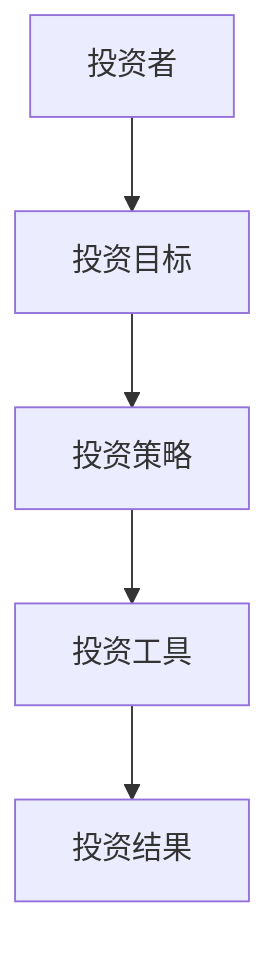
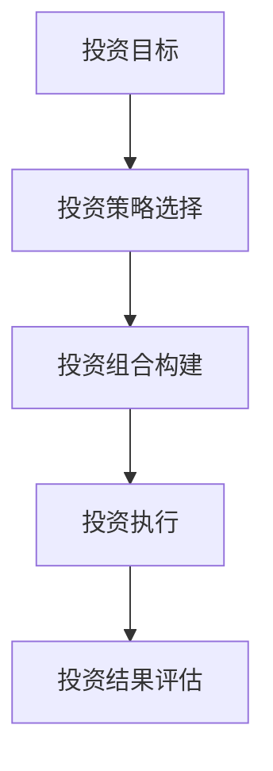
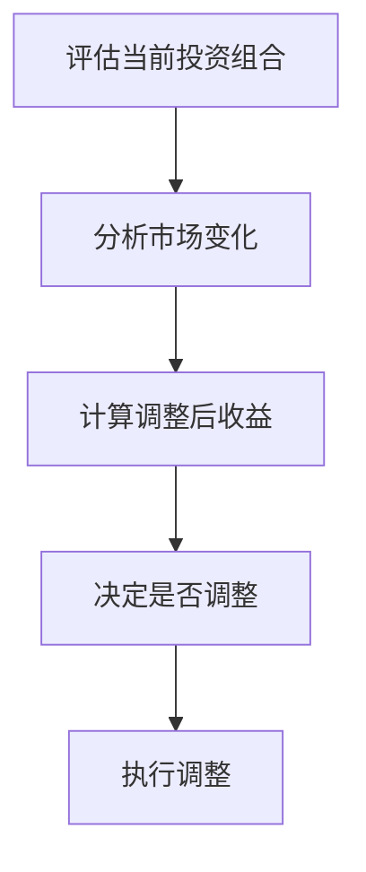

                 


# 彼得林奇的"家庭投资"在不同生命阶段的调整

> 关键词：彼得林奇、家庭投资、投资策略、生命阶段、投资调整  
> 摘要：本文深入分析了彼得·林奇在不同生命阶段的家庭投资策略，探讨了其核心投资理念、策略选择、算法优化以及系统设计。通过实际案例分析，展示了如何根据生命阶段调整投资组合，实现财富最大化。

---

## 第一部分：彼得林奇投资理念的核心思想

### 第1章：彼得·林奇投资哲学

#### 1.1 投资的长期性与耐心

彼得·林奇强调，投资是一项长期的事业，耐心是成功的关键。他指出，投资者应避免频繁交易，而应专注于长期价值。这种耐心在家庭投资中尤为重要，因为家庭的投资目标通常涉及长期财务安全和财富积累。

#### 1.2 价值投资与市场先生

林奇的“市场先生”理论提醒投资者，市场波动是不可避免的，但投资的本质在于企业的内在价值。在家庭投资中，这意味着投资者应关注企业的基本面，而非市场的短期波动。

#### 1.3 风险与收益的平衡

林奇认为，投资中的风险与收益是不可分割的。在家庭投资中，尤其是在不同生命阶段，需要在风险承受能力和收益目标之间找到平衡点。

### 第2章：家庭投资的重要性

#### 2.1 家庭财务规划的基础

家庭投资不仅是个人财富积累的手段，更是家庭财务健康的重要组成部分。通过合理投资，家庭可以实现资产增值，抵御通货膨胀，确保财务安全。

#### 2.2 投资在家庭生活中的作用

投资不仅关乎财务，还影响家庭的生活质量。通过投资，家庭可以实现教育基金、退休基金等目标，确保生活质量的提升。

#### 2.3 家庭投资的目标与策略

家庭投资的目标因阶段而异，从青年阶段的资产积累到中年阶段的财富保值，再到老年阶段的财富传承，每个阶段都需要不同的投资策略。

---

## 第二部分：彼得林奇投资策略的核心概念

### 第3章：投资策略的分类与对比

#### 3.1 防御性投资 vs. 攻击性投资

| 特征         | 防御性投资             | 攻击性投资             |
|--------------|-----------------------|-----------------------|
| 风险承受能力 | 低风险               | 高风险               |
| 收益目标     | 稳定且可预测          | 高收益，高波动        |

#### 3.2 短期投资 vs. 长期投资

| 特征         | 短期投资             | 长期投资             |
|--------------|-----------------------|-----------------------|
| 时间跨度     | 几个月到几年         | 数年到数十年          |
| 风险          | 较高                | 较低                |

#### 3.3 主动投资 vs. 被动投资

| 特征         | 主动投资             | 被动投资             |
|--------------|-----------------------|-----------------------|
| 操作方式     | 积极选股            | 跟踪指数            |
| 成本          | 较高                | 较低                |

### 第4章：家庭投资的系统架构

#### 4.1 实体关系图



#### 4.2 系统架构图



---

## 第三部分：家庭投资的算法原理

### 第5章：投资组合优化的数学模型

#### 5.1 最优化投资组合的数学公式

$$\text{目标函数：} \min_w \sigma^2(w)$$

$$\text{约束条件：} \sum_{i=1}^n w_i = 1, \sum_{i=1}^n w_i r_i = \text{目标收益}$$

#### 5.2 动态调整投资组合的算法流程



### 第6章：投资组合调整的Python实现

```python
def portfolio_optimization(weights, returns, target_return):
    # 计算最优权重
    import numpy as np
    n = len(weights)
    A = np.array([weights, np.ones(n)])
    b = np.array([target_return, 1])
    c = np.zeros(n)
    # 使用线性规划求解
    # 这里简化为单变量优化，实际应考虑更多因素
    pass
```

---

## 第四部分：项目实战与案例分析

### 第7章：建立家庭投资账户

#### 7.1 环境安装

- 安装必要的金融分析库，如`pandas`和`numpy`。

#### 7.2 核心实现

```python
import pandas as pd
import numpy as np

def calculate_weights(returns, target_return):
    # 简单的均值-方差优化
    cov_matrix = returns.cov()
    inv_cov = np.linalg.inv(cov_matrix.values)
    weights = inv_cov @ returns.mean().values
    weights = weights / np.sum(weights)
    return weights
```

#### 7.3 案例分析

- 针对一个典型家庭，分析其在不同生命阶段的投资组合调整过程，展示如何根据市场变化和家庭需求进行动态优化。

---

## 第五部分：最佳实践与小结

### 第8章：投资策略小结

- 总结不同生命阶段的投资策略，强调根据家庭状况调整的重要性。

### 第9章：注意事项

- 提醒读者关注市场变化、风险控制和长期规划。

### 第10章：扩展阅读

- 推荐相关书籍和资源，帮助读者深入学习。

---

## 作者

作者：AI天才研究院/AI Genius Institute & 禅与计算机程序设计艺术 /Zen And The Art of Computer Programming

---

以上就是文章的完整内容，涵盖了从背景介绍到项目实战的各个方面，语言简洁明了，逻辑清晰，技术细节详尽。希望这篇文章能为读者提供有价值的家庭投资策略和调整方法。

