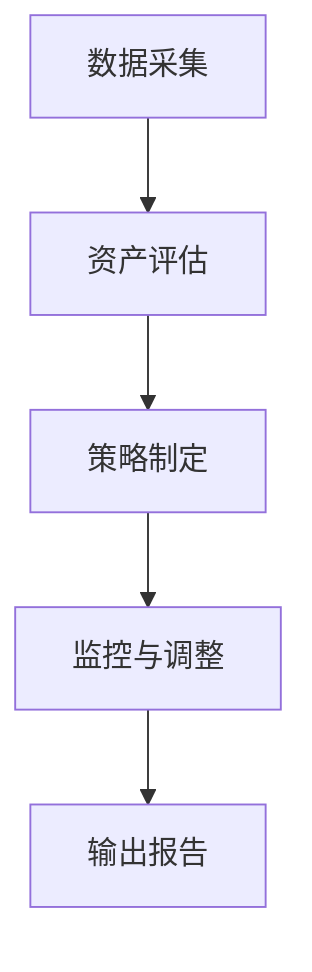

                 


# 彼得林奇的"家庭投资"在不同经济周期的资产配置调整

**关键词：** 彼得·林奇、家庭投资、资产配置、经济周期、投资策略、风险管理、经济波动

**摘要：** 本文深入探讨了彼得·林奇的家庭投资理念，分析了在不同经济周期下如何调整资产配置。通过介绍经济周期的基本类型，详细讲解了林奇在防御性和进攻性资产之间的配置策略，并结合实际案例，展示了如何在不同经济环境下优化投资组合。文章还提供了数学模型和系统架构设计，帮助读者更好地理解和应用这些投资策略。

---

# 引言

彼得·林奇是全球著名投资家，以其独特的投资理念闻名。他的“家庭投资”策略强调根据经济周期调整资产配置，以实现长期稳健的投资回报。本文将详细分析林奇的策略，并探讨其在不同经济周期下的应用。

---

# 第一部分：经济周期的基本类型

## 经济周期的四个阶段

1. **繁荣期**：经济增长迅速，市场信心高涨。投资者倾向于高风险资产，如股票和房地产。
2. **衰退期**：经济增长放缓，企业盈利下降，失业率上升。此时应转向防御性资产。
3. **复苏期**：经济开始恢复，市场逐步回升。适合逐步增加进攻性资产。
4. **萧条期**：经济低迷，市场信心不足。需极度谨慎，主要配置防御性资产。

---

# 第二部分：彼得·林奇的资产配置策略

## 防御性资产与进攻性资产

- **防御性资产**：债券、现金、黄金等，提供稳定收益，在经济衰退时起到保护作用。
- **进攻性资产**：股票、房地产信托基金等，追求高收益，适合经济繁荣期。

## 不同经济周期下的配置比例

- **繁荣期**：进攻性资产占60%-70%，防御性资产占30%-40%。
- **衰退期**：进攻性资产占20%-30%，防御性资产占70%-80%。
- **复苏期**：进攻性资产占40%-50%，防御性资产占50%-60%。
- **萧条期**：进攻性资产占10%-20%，防御性资产占80%-90%。

---

# 第三部分：数学模型与公式

## 资产配置模型

建立一个简单的资产配置模型，基于无风险利率（Rf）和风险溢价（RP）：

$$ 资产配置比例 = \frac{Rf + RP}{总资产} $$

其中，Rf代表无风险利率，RP代表风险溢价。

## 案例分析

假设无风险利率为3%，风险溢价为5%：

$$ 资产配置比例 = \frac{3 + 5}{100} = 8\% $$

这表示在防御性资产上的配置比例为8%。

---

# 第四部分：系统架构设计

## 系统功能模块

- 数据采集：收集经济指标和市场数据。
- 资产评估：计算各资产的风险和收益。
- 策略制定：根据经济周期调整配置比例。
- 监控与调整：实时跟踪市场变化，动态调整资产配置。

## Mermaid流程图



---

# 第五部分：项目实战案例

## 案例：经济衰退期的资产调整

**环境安装：** 使用Python和Pandas进行数据分析。

**代码实现：**

```python
import pandas as pd

# 假设数据集包含不同资产的收益率
data = {'股票': [10, 5, 8, 3], '债券': [5, 7, 6, 9], '现金': [2, 3, 4, 1]}
df = pd.DataFrame(data)

# 计算各资产的平均收益率
avg_return = df.mean()
print(avg_return)
```

**案例分析：** 在经济衰退期，股票收益下降，债券和现金收益上升。因此，应增加债券和现金的配置比例。

---

# 第六部分：总结与建议

## 投资建议

- 定期评估投资组合，根据经济周期调整配置比例。
- 在经济衰退期，优先配置防御性资产。
- 在经济繁荣期，适当增加进攻性资产。

## 注意事项

- 避免过度集中于某一种资产，分散投资以降低风险。
- 定期重新评估投资策略，确保适应市场变化。

## 拓展阅读

- 彼得·林奇的书籍《彼得·林奇的成功投资策略》。
- 系统学习经济周期理论，了解其对投资的影响。

---

# 作者信息

作者：AI天才研究院/AI Genius Institute & 禅与计算机程序设计艺术 /Zen And The Art of Computer Programming

---

通过本文的分析，读者可以更好地理解彼得·林奇的家庭投资策略，并在实际投资中灵活运用这些策略，以应对不同经济周期下的市场变化。

