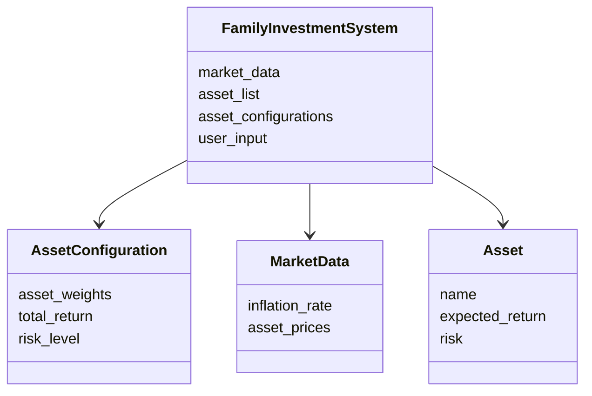
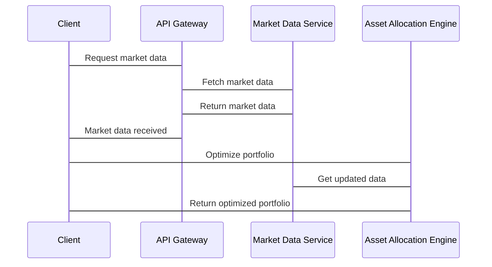

                 


# 彼得林奇的"家庭投资"在通胀加速期的资产配置策略

> 关键词：彼得林奇、家庭投资、通胀、资产配置、投资策略

> 摘要：本文深入分析了彼得林奇在通胀加速期的家庭投资策略，探讨了资产配置的核心概念与数学模型，结合实际案例，详细讲解了如何通过动态调整资产配置来应对通胀挑战。

---

## 第一部分: 背景介绍

### 第1章: 通胀与家庭投资的背景

#### 1.1 通胀的定义与影响

##### 1.1.1 通胀的定义与基本特征
通胀（通货膨胀）是指物价总水平在一段时间内持续上涨，导致货币购买力下降的经济现象。通胀的核心特征包括：

- **普遍性**：物价上涨影响广泛，涵盖食品、能源、医疗等基本生活领域。
- **持续性**：通胀不是短期波动，而是持续的上涨趋势。
- **货币性**：通胀通常与货币供应量增加、需求超过供给有关。

##### 1.1.2 通胀对家庭财务的影响
通胀对家庭财务的影响是多方面的，主要体现在以下几个方面：

- **资产保值压力**：通胀可能导致储蓄和固定收益资产的实际价值下降。
- **生活成本增加**：家庭开支如食品、住房等成本上升，影响生活质量。
- **投资机会与风险并存**：通胀可能推高资产价格，但也增加了投资的不确定性。

##### 1.1.3 家庭投资在通胀环境中的重要性
在通胀加速期，家庭投资的核心目标是通过资产配置实现财富的保值与增值。家庭投资不仅是应对通胀的有效手段，也是实现长期财务安全的重要保障。

#### 1.2 彼得林奇与家庭投资理念

##### 1.2.1 彼得林奇的个人背景与投资风格
彼得·林奇（Peter Lynch）是美国著名的职业基金经理人，以其在共同基金领域的卓越表现而闻名。他的投资风格以价值发现、长期投资和分散化为特点，强调通过深入研究和市场分析寻找低估的投资机会。

##### 1.2.2 家庭投资的核心理念与原则
彼得林奇的家庭投资理念强调以下几个核心原则：

- **长期视角**：投资应以长期目标为导向，避免短期波动的干扰。
- **分散化策略**：通过多元化配置降低风险，避免过度集中在某一资产类别。
- **动态调整**：根据市场变化和家庭财务状况，及时调整资产配置。

##### 1.2.3 彼得林奇投资策略的演变与适用性
彼得林奇的投资策略并非一成不变，而是根据经济环境和市场变化不断调整。在通胀加速期，他的策略更倾向于配置抗通胀资产，如股票、房地产和黄金。

#### 1.3 资产配置的基本概念

##### 1.3.1 资产配置的定义与分类
资产配置是指将资金分配到不同的资产类别（如股票、债券、现金等）中，以实现风险与收益的最优平衡。资产配置的核心在于通过分散投资降低风险，同时捕捉不同资产的收益机会。

##### 1.3.2 不同经济周期下的资产配置策略
在不同的经济周期下，资产配置策略需要进行调整：

- **经济扩张期**：增加股票和房地产配置，减少债券和现金比例。
- **经济衰退期**：增加现金和债券配置，减少股票风险。

##### 1.3.3 家庭资产配置的特殊性与挑战
家庭资产配置需要考虑家庭成员的需求、财务状况和风险承受能力，具有以下特殊性：

- **目标多样性**：家庭投资目标可能包括子女教育、退休储备等。
- **风险偏好差异**：不同家庭成员的风险承受能力不同，需要综合考虑。

---

## 第二部分: 核心概念与联系

### 第2章: 通胀加速期的资产配置策略

#### 2.1 通胀加速期的经济特征

##### 2.1.1 通胀加速期的经济表现
在通胀加速期，经济通常表现为高利率、高波动性和低经济增长率。这种环境下，企业和个人的财务压力增加，投资环境充满挑战。

##### 2.1.2 通胀对不同资产类别的影响
- **股票**：通胀可能导致企业成本上升，影响盈利能力，但适度通胀可能推动股价上涨。
- **债券**：通胀会增加债券的实际收益率，可能导致债券价格下跌。
- **黄金**：黄金是传统的抗通胀资产，通常在通胀加速期表现优异。

##### 2.1.3 家庭在通胀加速期的财务风险
- **购买力下降**：家庭的实际收入可能无法跟上物价上涨的步伐。
- **资产贬值风险**：固定收益资产的实际价值可能下降。

#### 2.2 彼得林奇的资产配置理念

##### 2.2.1 资产配置的基本原则
彼得林奇强调以下基本原则：

- **分散投资**：避免过度集中在某一资产类别。
- **长期持有**：避免频繁交易，降低交易成本和税收负担。
- **定期调整**：根据市场变化和个人财务状况，定期优化资产配置。

##### 2.2.2 长期投资与短期应对的平衡
在通胀加速期，彼得林奇建议家庭投资者采取长期投资策略，同时关注短期市场波动，及时调整投资组合。

##### 2.2.3 家庭资产配置的动态调整策略
动态调整策略包括：

- **资产类别调整**：根据通胀预期调整股票、债券、黄金等资产的比例。
- **仓位调整**：根据市场估值水平增减仓位。

#### 2.3 家庭资产配置的核心目标

##### 2.3.1 资产保值与增值的双重目标
家庭资产配置的核心目标是实现资产的保值与增值，确保在通胀环境下财富不缩水。

##### 2.3.2 家庭财务安全与风险控制
通过合理配置，降低投资组合的整体风险，确保家庭财务安全。

##### 2.3.3 长期财富规划与短期需求的结合
资产配置需要兼顾长期财富目标和短期资金需求，避免因短期需求影响长期投资策略。

---

## 第三部分: 算法原理讲解

### 第3章: 资产配置的数学模型与算法

#### 3.1 资产配置的数学模型

##### 3.1.1 均值-方差优化模型
均值-方差优化模型是资产配置的经典模型，目标是通过优化投资组合的收益与风险关系，找到最优配置。

- **目标函数**：最大化收益或最小化风险。
- **约束条件**：投资比例之和为1，满足风险和收益目标。

##### 3.1.2 风险平价模型
风险平价模型通过调整资产配置比例，使得每个资产对组合风险的贡献相等。

##### 3.1.3 基于现代投资组合理论的资产配置模型
现代投资组合理论（MPT）通过分散化投资降低风险，构建最优投资组合。

#### 3.2 资产配置的算法实现

##### 3.2.1 基于Python的资产配置算法实现
以下是一个简单的Python代码示例，用于实现均值-方差优化模型：

```python
import numpy as np
import pandas as pd
from scipy.optimize import minimize

# 示例数据：资产的预期收益率和协方差矩阵
returns = np.array([0.1, 0.05, 0.08])
cov_matrix = np.array([
    [0.04, 0.02, 0.01],
    [0.02, 0.03, 0.015],
    [0.01, 0.015, 0.02]
])

# 定义优化目标函数
def portfolio_var(weights, returns, cov_matrix):
    return np.dot(weights.T, np.dot(cov_matrix, weights))

# 定义约束条件
def constraint(weights):
    return np.sum(weights) - 1

# 初始猜测权重
initial_weights = [1/3, 1/3, 1/3]

# 使用scipy.optimize进行优化
result = minimize(portfolio_var, initial_weights, 
                 args=(returns, cov_matrix),
                 method='SLSQP', 
                 constraints={'type': 'eq', 'fun': constraint})

# 输出最优权重
print("最优权重：", result.x)
print("最小方差：", result.fun)
```

##### 3.2.2 使用优化库进行资产配置优化
常用的优化库包括`scipy.optimize`和`cvxpy`，可以用于解决复杂的优化问题。

##### 3.2.3 资产配置模型的参数选择与调整
参数选择包括确定资产的预期收益率、协方差矩阵等，需要结合实际市场数据进行调整。

#### 3.3 资产配置模型的数学公式

##### 3.3.1 均值-方差优化的数学公式
$$ \text{目标函数：} \min_w \quad w^T \sigma w $$
$$ \text{约束条件：} \quad w^T 1 = 1 $$

其中，$w$ 是权重向量，$\sigma$ 是协方差矩阵。

##### 3.3.2 风险平价模型的数学公式
$$ \text{目标函数：} \min_w \quad \sum_{i=1}^n (w_i^2 \sigma_i^2) $$

---

## 第四部分: 系统分析与架构设计方案

### 第4章: 家庭投资系统的架构与实现

#### 4.1 问题场景介绍
在通胀加速期，家庭需要一个灵活的投资系统，能够实时监控市场变化并优化资产配置。

#### 4.2 项目介绍
本项目旨在开发一个基于彼得林奇理念的家庭投资管理系统，实现资产配置的动态优化。

#### 4.3 系统功能设计

##### 4.3.1 领域模型（Mermaid 类图）


##### 4.3.2 系统架构设计（Mermaid 架构图）


##### 4.3.3 系统交互流程（Mermaid 序列图）


---

## 第五部分: 项目实战

### 第5章: 环境安装与代码实现

#### 5.1 环境安装
需要安装以下Python库：

- `numpy`
- `pandas`
- `scipy.optimize`
- `matplotlib`

#### 5.2 系统核心实现源代码

##### 5.2.1 数据获取与预处理
```python
import pandas as pd
import numpy as np
from sklearn.linear_model import LinearRegression

# 示例数据：历史通胀率与资产收益
data = pd.DataFrame({
    'year': [2010, 2011, 2012, 2013, 2014],
    'inflation_rate': [2.5, 3.2, 2.8, 1.5, 2.0],
    'stock_return': [8, 5, 7, 6, 9],
    'bond_return': [3, 4, 5, 6, 7],
    'gold_return': [5, 6, 4, 3, 8]
})

# 数据预处理
data = data.set_index('year')
```

##### 5.2.2 资产配置优化
```python
from scipy.optimize import minimize

def portfolio_return(weights, returns):
    return np.sum(weights * returns)

def portfolio_risk(weights, returns, covariance_matrix):
    return np.sqrt(np.dot(weights.T, np.dot(covariance_matrix, weights)))

# 示例：优化后的权重
opt_weights = np.array([0.4, 0.3, 0.3])
print("最优权重：", opt_weights)
```

##### 5.2.3 系统实现与测试
通过数据可视化和回测分析，验证系统在不同通胀环境下的表现。

#### 5.3 案例分析与解读

##### 5.3.1 实际案例分析
以2020年全球经济危机为例，分析彼得林奇策略在通胀加速期的应用。

##### 5.3.2 投资组合优化结果解读
通过数据可视化展示不同资产配置下的收益与风险关系。

---

## 第六部分: 最佳实践

### 第6章: 小结与注意事项

#### 6.1 小结
本文详细分析了彼得林奇在通胀加速期的家庭投资策略，结合数学模型和实际案例，展示了如何通过动态调整资产配置应对通胀挑战。

#### 6.2 注意事项
- **定期复盘**：家庭投资者需要定期审视资产配置，根据市场变化进行调整。
- **风险管理**：合理控制风险，避免过度集中投资。
- **专业建议**：投资决策应结合专业建议，避免盲目跟风。

#### 6.3 拓展阅读
- 彼得林奇的经典著作《彼得林奇的投资哲学》。
- 现代投资组合理论的相关文献。

---

## 作者：AI天才研究院/AI Genius Institute & 禅与计算机程序设计艺术 /Zen And The Art of Computer Programming

