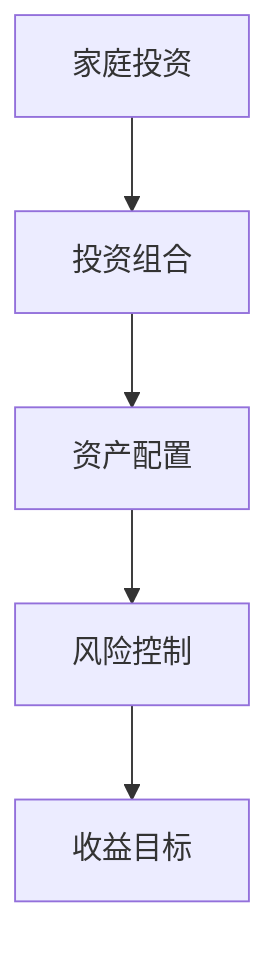
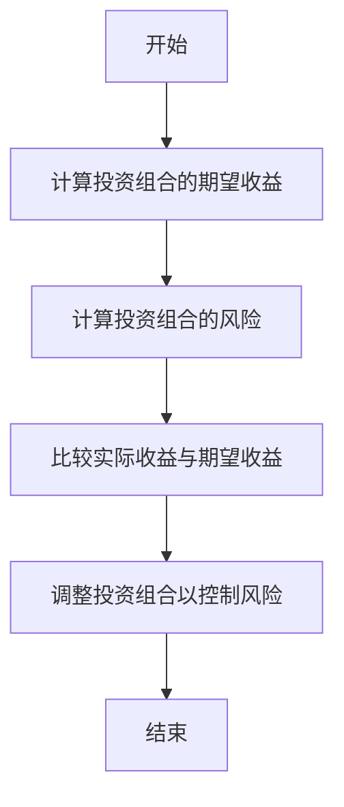
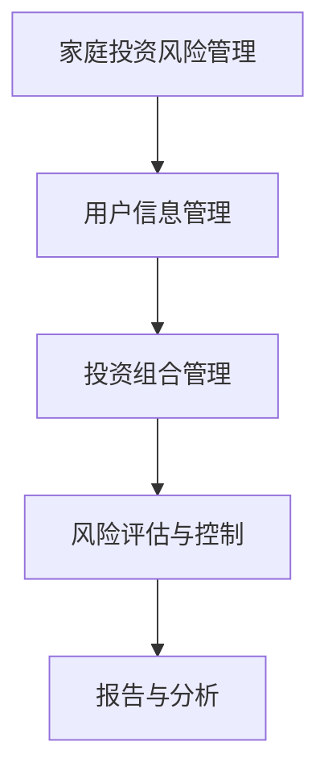

                 


# 彼得林奇的"家庭投资"风险控制方法

**关键词：** 家庭投资、风险控制、彼得林奇、投资策略、风险管理

**摘要：** 本文深入分析了彼得·林奇的“家庭投资”风险控制方法，从核心概念到实战案例，结合技术语言与专业分析，帮助读者理解如何在家庭投资中实现风险控制，优化投资组合，实现稳健收益。

---

## 第一部分: 家庭投资与风险控制的背景介绍

### # 第1章: 家庭投资与风险控制的背景介绍

#### 1.1 家庭投资的定义与特点

- **1.1.1 家庭投资的定义**  
  家庭投资是指个人或家庭利用可支配资金进行资产配置，以实现财富增值的过程。与机构投资相比，家庭投资更注重长期稳健的收益，而非短期暴利。

- **1.1.2 家庭投资的核心特点**  
  1. 投资目标：追求长期稳健的收益，注重资产保值与增值的平衡。  
  2. 资金规模：通常资金有限，追求高风险高收益的策略不可取。  
  3. 投资期限：注重长期性，避免短期波动带来的损失。  
  4. 投资策略：注重分散投资，降低风险。

- **1.1.3 家庭投资与机构投资的区别**  
  - 投资目标：家庭投资注重稳健收益，机构投资注重高收益和市场占有率。  
  - 投资规模：家庭投资资金有限，机构投资资金庞大。  
  - 投资策略：家庭投资注重分散风险，机构投资注重集中投资。  
  - 投资期限：家庭投资注重长期性，机构投资注重短期收益。

#### 1.2 风险控制的核心概念

- **1.2.1 风险的定义与分类**  
  风险是指在投资过程中，由于不确定性因素导致投资收益低于预期或出现损失的可能性。常见的风险类型包括市场风险、流动性风险、信用风险等。

- **1.2.2 风险控制的目标与原则**  
  1. **目标：** 通过科学的策略和方法，降低投资风险，提高投资收益。  
  2. **原则：**  
     - 分散投资：通过多元化配置降低风险。  
     - 风险与收益匹配：根据自身风险承受能力选择合适的投资策略。  
     - 定期评估：定期审视投资组合，及时调整策略。

- **1.2.3 家庭投资中的风险来源分析**  
  1. 市场波动风险：市场下跌可能导致投资损失。  
  2. 流动性风险：投资资产难以快速变现。  
  3. 利率风险：利率变化影响债券等固定收益资产的价值。  
  4. 信用风险：债券发行人违约的风险。  
  5. 操作风险：投资者自身决策失误带来的风险。

#### 1.3 彼得·林奇的“家庭投资”理念

- **1.3.1 彼得·林奇的背景介绍**  
  彼得·林奇是美国著名基金经理，曾管理富达麦哲伦基金，创造了辉煌的投资业绩。他的投资理念注重长期稳健的收益，强调分散投资和风险控制。

- **1.3.2 “家庭投资”的核心理念**  
  1. 以家庭为单位进行资产配置，注重长期稳健的收益。  
  2. 避免过度冒险，注重分散投资以降低风险。  
  3. 以价值投资为主，注重基本面分析。

- **1.3.3 家庭投资与个人财务规划的关系**  
  家庭投资是家庭财务规划的重要组成部分，通过合理的投资策略实现财富增值，同时为家庭提供财务保障。

---

## 第二部分: 家庭投资风险控制的核心概念与联系

### # 第2章: 家庭投资风险控制的核心概念与联系

#### 2.1 风险、收益与投资的关系

- **2.1.1 风险与收益的正相关性**  
  投资收益与风险正相关，收益越高，风险越大；收益越低，风险越小。

- **2.1.2 投资组合的收益与风险平衡**  
  通过合理配置资产，可以在一定程度上平衡收益与风险，实现最优的投资效果。

#### 2.2 核心概念的原理分析

- **2.2.1 投资组合的分散化原理**  
  通过将资金分散投资于不同的资产类别或行业，降低单一资产波动对整体投资组合的影响。

- **2.2.2 风险调整后的收益计算**  
  在计算投资收益时，需考虑风险因素，调整后的收益更能反映实际投资效果。

- **2.2.3 风险与收益的数学模型**  
  通过夏普比率（Sharpe Ratio）等指标，衡量投资组合的风险调整后收益。

#### 2.3 概念属性特征对比表格

| **概念**       | **定义**                                                                 |
|-----------------|--------------------------------------------------------------------------|
| 风险           | 投资过程中可能出现的损失或收益低于预期的情况。                          |
| 收益           | 投资带来的回报，包括资本收益和分红收益。                              |
| 投资组合       | 由多种资产组成的集合，用于分散风险和优化收益。                        |
| 风险控制       | 通过策略和方法降低投资风险，提高投资收益。                            |

#### 2.4 ER实体关系图架构



---

## 第三部分: 家庭投资风险控制的算法原理

### # 第3章: 家庭投资风险控制的算法原理

#### 3.1 算法原理概述

- 通过数学模型和算法，优化投资组合配置，降低风险，提高收益。

#### 3.2 算法流程图



#### 3.3 算法的数学模型与公式

- **数学模型：**  
  $$ \text{夏普比率} = \frac{E(r) - r_f}{\sigma} $$  
  其中，$E(r)$ 是投资组合的期望收益，$r_f$ 是无风险利率，$\sigma$ 是投资组合的收益标准差。

---

## 第四部分: 家庭投资风险控制的系统分析与架构设计

### # 第4章: 家庭投资风险控制的系统分析与架构设计

#### 4.1 系统功能设计

- **家庭投资风险管理系统的功能模块：**  
  1. 用户信息管理模块。  
  2. 投资组合管理模块。  
  3. 风险评估与控制模块。  
  4. 报告与分析模块。

#### 4.2 系统架构设计



---

## 第五部分: 家庭投资风险控制的项目实战

### # 第5章: 家庭投资风险控制的项目实战

#### 5.1 项目环境安装

- **工具：**  
  - Python 3.9+  
  - Pandas、NumPy、Matplotlib 等库。

#### 5.2 核心代码实现

```python
import pandas as pd
import numpy as np

# 示例代码：计算投资组合的风险调整后收益
def calculate_sharpe_ratio(returns, risk_free_rate):
    excess_return = returns - risk_free_rate
    sharpe_ratio = excess_return.mean() / excess_return.std()
    return sharpe_ratio

# 示例数据
returns = pd.Series([0.05, 0.03, 0.07, 0.02, 0.06])
risk_free_rate = 0.01

# 计算夏普比率
sharpe_ratio = calculate_sharpe_ratio(returns, risk_free_rate)
print(f"夏普比率：{sharpe_ratio}")
```

#### 5.3 实战案例分析

- **案例：**  
  某家庭有50万元可投资资金，希望通过分散投资降低风险，追求年化6%的收益。

---

## 第六部分: 家庭投资风险控制的总结与展望

### # 第6章: 家庭投资风险控制的总结与展望

#### 6.1 总结

- 彼得·林奇的“家庭投资”理念强调分散投资和风险控制，通过合理配置资产，实现长期稳健的收益。

#### 6.2 展望

- 随着金融市场的不断发展，家庭投资需要更加注重全球化配置和风险管理，未来将有更多的科技手段和工具帮助投资者实现更好的风险控制。

---

**作者：AI天才研究院/AI Genius Institute & 禅与计算机程序设计艺术 /Zen And The Art of Computer Programming**

