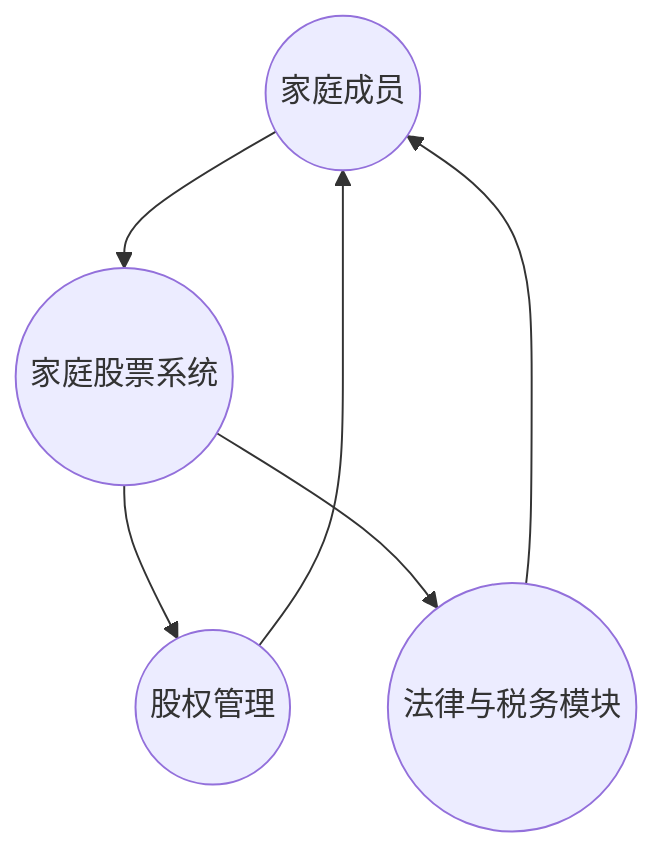

                 


# 目录大纲：《彼得林奇的"家庭股票"在财富传承中的角色》

---

## # 第一部分：引言

## # 第1章：引言

### 1.1 彼得·林奇与“家庭股票”概述
#### 1.1.1 彼得·林奇的生平与投资理念
#### 1.1.2 “家庭股票”的概念与背景
#### 1.1.3 财富传承的重要性和挑战

## # 第2章：家庭股票的背景与概念

### 2.1 家庭股票的定义与特点
#### 2.1.1 家庭股票的定义
#### 2.1.2 家庭股票的特点
#### 2.1.3 家庭股票与传统财富传承方式的对比

### 2.2 家庭股票的核心要素
#### 2.2.1 家庭成员的角色与责任
#### 2.2.2 股权分配的原则与方法
#### 2.2.3 家庭股票的法律与税务考量

## # 第3章：家庭股票的核心理论与模型

### 3.1 家庭股票的理论基础
#### 3.1.1 投资组合理论
#### 3.1.2 家庭财富传承的生命周期理论
#### 3.1.3 家庭股票的风险与收益分析

### 3.2 家庭股票的数学模型与公式
#### 3.2.1 家庭股票价值的评估模型
$$ V = \sum_{t=1}^{n} \frac{C_t}{(1 + r)^t} $$
#### 3.2.2 家庭股票分配的优化模型
$$ Max \quad \sum_{i=1}^{m} w_i \cdot V_i $$
$$ s.t. \quad \sum_{i=1}^{m} w_i = 1 $$

### 3.3 家庭股票的ER图
```mermaid
er
  %%{家庭股票的ER图}
  rectangle 家庭成员 {
    <name> 名称
    <role> 角色
    <share> 股份
  }
  rectangle 股权分配 {
    <total_shares> 总股份
    <distribution_rule> 分配规则
  }
  rectangle 法律与税务 {
    <tax_liabilities> 税务责任
    <legal_requirements> 法律要求
  }
  家庭成员 -[属于]-> 股权分配
  股权分配 --<约束条件>-> 法律与税务
```

## # 第4章：家庭股票的法律与税务考量

### 4.1 家庭股票的法律框架
#### 4.1.1 公司法与股权结构
#### 4.1.2 合同法与家庭协议
#### 4.1.3 继承法与财富传承

### 4.2 家庭股票的税务规划
#### 4.2.1 股权转让的税务影响
#### 4.2.2 股息与资本收益的税务处理
#### 4.2.3 税务优化策略

## # 第5章：家庭股票的系统架构设计

### 5.1 系统功能设计
#### 5.1.1 家庭成员信息管理
#### 5.1.2 股权分配与管理
#### 5.1.3 财务与税务规划模块

### 5.2 系统架构设计


### 5.3 接口与交互设计
```mermaid
sequence
  用户 -> 家庭股票系统: 请求股权分配
  家庭股票系统 -> 股权管理: 获取分配规则
  股权管理 -> 用户: 返回分配结果
```

## # 第6章：家庭股票的项目实战

### 6.1 环境配置与工具安装
#### 6.1.1 安装必要的软件与工具
#### 6.1.2 配置开发环境

### 6.2 核心代码实现
#### 6.2.1 家庭成员信息管理代码
#### 6.2.2 股权分配逻辑代码
#### 6.2.3 税务计算与优化代码

### 6.3 实际案例分析
#### 6.3.1 案例背景介绍
#### 6.3.2 系统实现与代码解读
#### 6.3.3 实验结果与分析

## # 第7章：家庭股票的最佳实践与注意事项

### 7.1 成功案例总结
#### 7.1.1 成功案例一：小明家族的财富传承
#### 7.1.2 成功案例二：财富分配的优化策略

### 7.2 注意事项与风险提示
#### 7.2.1 定期审查与更新计划
#### 7.2.2 避免法律纠纷的建议
#### 7.2.3 保持灵活性与适应性

## # 第8章：结论与未来展望

### 8.1 总结
#### 8.1.1 家庭股票的核心价值
#### 8.1.2 本书的主要观点总结

### 8.2 未来展望
#### 8.2.1 技术与法律的未来趋势
#### 8.2.2 家庭股票的创新与发展

---

## # 作者信息

作者：AI天才研究院/AI Genius Institute & 禅与计算机程序设计艺术 /Zen And The Art of Computer Programming

---

通过以上目录大纲，本书将系统地探讨彼得·林奇提出的“家庭股票”在财富传承中的角色，结合理论分析、数学模型、系统架构设计和实际案例，为读者提供全面的指导和深刻的理解。

