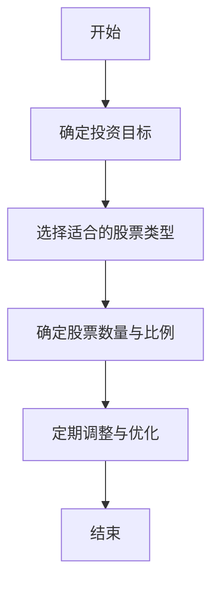
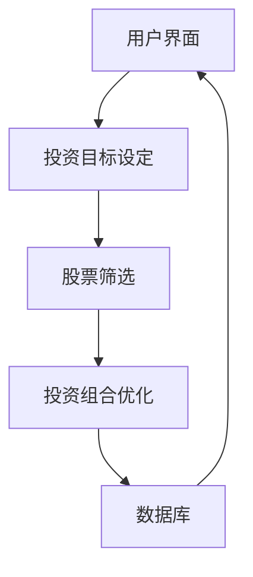

                 


# 彼得林奇的"家庭股票"在跨代财富传承中的投资组合构建

**关键词**：彼得林奇、家庭股票、跨代财富传承、投资组合、风险管理

**摘要**：本文深入探讨了彼得林奇提出的“家庭股票”概念在跨代财富传承中的应用。通过分析投资组合构建的策略与方法，结合数学模型和系统架构设计，提供了一套完整的解决方案。文章从背景介绍、核心概念、构建策略、优化算法、数学模型、系统架构、项目实战等方面进行了详细阐述，旨在为读者提供实用的指导和启发。

---

## 第一部分: 彼得林奇的"家庭股票"投资理念与跨代财富传承

### 第1章: 彼得林奇投资理念概述

#### 1.1 彼得林奇与"家庭股票"的概念

- **1.1.1 彼得林奇的投资者背景**  
  彼得·林奇是美国著名的投资家，曾任富达投资集团的董事长。他以长期投资、价值投资和分散投资的理念闻名，强调通过深入研究和长期持有优质股票来实现财富增长。

- **1.1.2 "家庭股票"的核心理念**  
  彼得林奇提出的“家庭股票”是指那些具有长期稳定增长潜力，适合家庭长期持有的股票。这些股票通常具有较高的股息收益率、良好的成长性和较强的抗跌性。

- **1.1.3 跨代财富传承的定义与目标**  
  跨代财富传承是指将财富从一代人传递到下一代人，同时保持财富的增值和保值。目标是在传承过程中实现财富的可持续增长，同时避免因财富分配不当导致的家庭矛盾或财务风险。

#### 1.2 家庭股票在财富传承中的作用

- **1.2.1 家庭股票的定义与特点**  
  家庭股票是专门设计用于跨代财富传承的股票投资组合，具有以下特点：
  - **长期性**：适合长期持有，避免频繁交易。
  - **稳定性**：股票选择注重稳定性，降低波动风险。
  - **收益性**：通过股息和资本增值实现收益。

- **1.2.2 家庭股票在财富传承中的优势**  
  - **资产隔离**：通过股票投资实现财富的分散管理，避免单一资产的风险。
  - **税务优化**：合理配置股票资产，降低税务负担。
  - **传承规划**：通过家庭股票的投资组合设计，确保财富在代际之间的有序传承。

- **1.2.3 家庭股票与其他财富传承工具的对比**  
  通过对比信托基金、保险等其他财富传承工具，分析家庭股票在灵活性、收益性和管理成本等方面的优势。

#### 1.3 财富传承中的常见问题与挑战

- **1.3.1 财富传承中的常见问题**  
  - 财产分配不均导致的家庭矛盾。
  - 财产贬值或损失的风险。
  - 财产管理不当导致的收益下降。

- **1.3.2 财富传承中的法律与税务挑战**  
  - 税务规划的复杂性。
  - 法律法规对财富传承的限制。

- **1.3.3 家庭股票在财富传承中的解决方案**  
  通过家庭股票的投资组合设计，解决财富传承中的分散化、税务优化和风险管理问题。

---

### 第2章: 家庭股票投资组合的核心概念

#### 2.1 家庭股票投资组合的构成要素

- **2.1.1 投资目标的确定**  
  明确投资目标，如财富增值、风险控制、传承规划等。

- **2.1.2 投资期限的规划**  
  根据家庭的长期规划，确定投资的持有期限。

- **2.1.3 风险承受能力的评估**  
  评估家庭对投资风险的承受能力，选择适合的风险水平。

#### 2.2 家庭股票投资组合的特征

- **2.2.1 长期性与稳定性**  
  家庭股票投资组合注重长期性，避免短期波动带来的风险。

- **2.2.2 收益性与安全性**  
  通过选择高股息收益率和成长性好的股票，实现收益与安全的平衡。

- **2.2.3 稀释性与流动性**  
  通过分散投资，降低单一资产的风险，同时保持一定的流动性。

#### 2.3 家庭股票与其他资产的对比

- **2.3.1 家庭股票与现金资产**  
  现金资产流动性高，但收益性低；家庭股票流动性较低，但收益性较高。

- **2.3.2 家庭股票与房地产投资**  
  房地产投资具有较高的收益性，但流动性较差；家庭股票流动性较好，且风险分散。

- **2.3.3 家庭股票与信托基金**  
  信托基金具有一定的收益性和安全性，但管理成本较高；家庭股票管理成本较低，且灵活性更高。

#### 2.4 家庭股票投资组合的ER实体关系图

```mermaid
erDiagram
    class 家庭股票 {
        股票名称
        股票代码
        股票数量
        股票价值
        持股比例
    }
    class 投资组合 {
        股票组合
        投资目标
        投资期限
        风险承受能力
    }
    class 财富传承 {
        传承目标
        传承方式
        传承工具
        传承时间
    }
    家庭股票 --> 投资组合: 包含于
    投资组合 --> 财富传承: 服务于
```

---

### 第3章: 家庭股票投资组合构建的策略与方法

#### 3.1 投资组合构建的基本原则

- **3.1.1 分散投资原则**  
  通过分散投资降低风险，避免将所有资金投入单一资产。

- **3.1.2 长期投资原则**  
  长期持有优质股票，避免频繁交易带来的成本和风险。

- **3.1.3 风险控制原则**  
  根据家庭的财务状况和风险承受能力，合理配置资产。

#### 3.2 家庭股票投资组合的构建步骤

- **3.2.1 确定投资目标与约束条件**  
  明确投资目标（如财富增值、传承规划）和约束条件（如投资期限、风险承受能力）。

- **3.2.2 选择适合的股票类型**  
  根据目标和约束选择具有长期增长潜力和稳定股息收益的股票。

- **3.2.3 确定股票数量与比例**  
  根据资产规模和风险偏好，确定每种股票的数量和比例。

- **3.2.4 定期调整与优化**  
  定期评估投资组合的表现，根据市场变化和家庭需求进行调整。

#### 3.3 家庭股票投资组合的优化算法



---

### 第4章: 家庭股票投资组合的数学模型与优化

#### 4.1 投资组合优化的数学模型

- **4.1.1 资产配置模型**  
  通过数学模型确定不同股票的权重和比例，实现风险与收益的最优平衡。

- **4.1.2 风险调整后的收益模型**  
  使用夏普比率等指标衡量投资组合的风险调整后收益。

#### 4.2 投资组合优化的算法实现

- **4.2.1 基于遗传算法的优化**  
  使用遗传算法寻找最优的投资组合配置。

- **4.2.2 基于均值-方差模型的优化**  
  使用均值-方差模型计算最优投资组合。

---

### 第5章: 家庭股票投资组合的系统架构与实现

#### 5.1 系统功能设计

- **5.1.1 投资目标设定模块**  
  用户输入投资目标、约束条件等信息。

- **5.1.2 股票筛选模块**  
  根据用户需求筛选适合的股票。

- **5.1.3 投资组合优化模块**  
  使用优化算法生成最优投资组合。

#### 5.2 系统架构设计



---

### 第6章: 家庭股票投资组合的项目实战

#### 6.1 项目环境安装

- **6.1.1 安装Python环境**  
  使用Anaconda安装Python和相关库。

- **6.1.2 安装优化算法库**  
  安装numpy、pandas、scipy等库。

#### 6.2 核心代码实现

```python
import numpy as np
import pandas as pd
from scipy.optimize import minimize

# 示例数据：股票收益和风险
stocks = pd.DataFrame({
    '收益': [0.1, 0.15, 0.08, 0.12],
    '风险': [0.1, 0.2, 0.05, 0.15]
})

# 定义优化目标函数
def portfolio Optimization(weights, stocks):
    return -weights.dot(stocks['收益'])

# 定义约束条件
def constraint(weights):
    return weights.sum() - 1

# 初始权重
initial_weights = [0.25, 0.25, 0.25, 0.25]

# 使用最小化器优化
result = minimize(portfolio Optimization, initial_weights, args=(stocks,), 
                  method='SLSQP', constraints={'type': 'eq', 'fun': constraint})

# 输出最优权重
print("最优权重:", result.x)
```

#### 6.3 代码应用与案例分析

- **6.3.1 案例分析**  
  以一个家族企业的传承为例，展示如何通过家庭股票投资组合实现财富的跨代传承。

---

### 第7章: 最佳实践与注意事项

#### 7.1 最佳实践

- **分散投资**：避免将所有资金投入单一股票。
- **长期持有**：坚持长期投资，避免短期波动的影响。
- **定期调整**：根据市场变化和家庭需求，定期优化投资组合。

#### 7.2 注意事项

- **风险控制**：合理评估自身的风险承受能力。
- **税务规划**：合理配置资产，降低税务负担。
- **专业咨询**：在构建投资组合时，建议寻求专业财务顾问的帮助。

---

## 第八章: 小结与展望

### 8.1 小结

本文详细介绍了彼得林奇的“家庭股票”在跨代财富传承中的应用，从投资理念、构建策略、优化算法到系统实现，提供了完整的解决方案。

### 8.2 展望

未来，随着技术的发展，家庭股票投资组合可以通过人工智能和大数据分析进一步优化，为财富传承提供更多可能性。

---

**作者：AI天才研究院/AI Genius Institute & 禅与计算机程序设计艺术 /Zen And The Art of Computer Programming**

