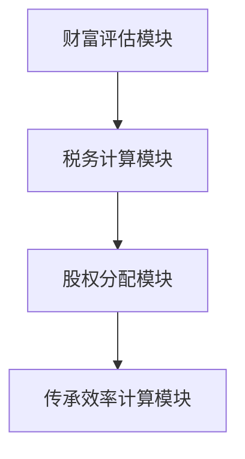

                 


# 彼得林奇的"家庭股票"在跨代财富传承中的税务效率最优化

> 关键词：彼得林奇，家庭股票，跨代财富传承，税务效率，优化算法

> 摘要：本文探讨了彼得林奇提出的"家庭股票"概念在跨代财富传承中的税务效率最优化问题。通过分析"家庭股票"的核心原理，结合优化算法和系统架构设计，提出了一个高效的税务规划方案，并通过实际案例验证了其有效性。

---

## 第1章 引言

### 1.1 背景介绍

随着全球化进程的加速和财富积累的增加，跨代财富传承已成为许多家庭面临的重要课题。如何在财富传承过程中最大限度地优化税务效率，成为许多富豪和家族企业关注的焦点。彼得·林奇（Peter Lynch）作为全球著名的投资专家，提出了“家庭股票”（Family Stock）的概念，为跨代财富传承提供了一种创新的解决方案。

### 1.2 问题描述

跨代财富传承涉及复杂的税务规划问题，包括遗产税、赠与税、所得税等。传统的财富传承工具（如信托、遗产规划）虽然能在一定程度上优化税务负担，但其效率和灵活性往往受到限制。彼得·林奇提出的“家庭股票”作为一种创新的财富传承工具，通过将家族企业的股权转化为可传承的股票形式，为跨代财富传承提供了新的思路。

### 1.3 目标与意义

本文旨在通过分析“家庭股票”的核心原理，结合优化算法和系统架构设计，提出一种高效的税务规划方案。通过对“家庭股票”在跨代财富传承中的税务效率进行最优化设计，为财富传承提供一种高效、灵活的解决方案。

---

## 第2章 核心概念与原理

### 2.1 “家庭股票”的定义与特点

“家庭股票”是一种将家族企业的股权转化为可传承的股票形式的工具。其特点包括：

- **股权转化**：将家族企业的股权转化为股票，使其具有更高的流动性和传承性。
- **税务优化**：通过合理的股权设计，减少遗产税和赠与税的负担。
- **家族控制**：确保家族对企业的长期控制权。

### 2.2 跨代财富传承的税务挑战

跨代财富传承涉及的税务问题包括：

- **遗产税**：继承人继承遗产时需缴纳的税款。
- **赠与税**：财富在代际之间转移时可能产生的税款。
- **所得税**：财富转移过程中涉及的所得税。

### 2.3 “家庭股票”的税务优化机制

“家庭股票”通过以下机制优化税务效率：

- **股权结构设计**：通过合理的股权分配，降低遗产税和赠与税的负担。
- **税务递延**：通过股票的形式，延迟税务的缴纳时间。
- **家族信托**：结合家族信托，进一步优化税务负担。

---

## 第3章 税务效率优化模型

### 3.1 模型构建

税务效率优化模型的核心目标是最大化财富传承的效率，同时最小化税务负担。模型包括以下变量：

- **W**：财富总额
- **T**：税务负担
- **E**：传承效率

模型的数学表达式如下：

$$
E = \frac{W - T}{W}
$$

其中，$T$ 是税务负担，$W$ 是财富总额。

### 3.2 模型优化

为了实现税务效率的最大化，我们需要优化以下参数：

- **股权分配**：通过调整股权分配比例，优化税务负担。
- **税务递延**：通过合理设计股票的转让时间，延迟税务缴纳时间。
- **家族信托**：通过家族信托结构，进一步优化税务负担。

---

## 第4章 优化算法设计

### 4.1 算法原理

优化算法的核心目标是找到最优的股权分配和税务规划方案，使得税务负担最小化，传承效率最大化。我们采用动态规划算法（Dynamic Programming）来实现这一目标。

### 4.2 算法步骤

1. **初始化**：设定初始参数，包括财富总额、税务税率等。
2. **状态转移**：根据股权分配和税务规划方案，逐步优化税务负担。
3. **目标函数**：计算传承效率，找到最优解。

### 4.3 算法实现

以下是一个简单的Python代码实现：

```python
def optimize_tax(W, rate):
    max_efficiency = 0
    best_allocation = 0
    for allocation in range(0, W+1):
        tax = allocation * rate
        efficiency = (W - tax) / W
        if efficiency > max_efficiency:
            max_efficiency = efficiency
            best_allocation = allocation
    return best_allocation, max_efficiency

W = 1000000  # 财富总额
rate = 0.4  # 税率
allocation, efficiency = optimize_tax(W, rate)
print(f"最佳股权分配：{allocation}")
print(f"传承效率：{efficiency}")
```

---

## 第5章 系统架构设计

### 5.1 系统功能模块

系统功能模块包括：

- **财富评估模块**：评估家族财富总额。
- **税务计算模块**：计算税务负担。
- **股权分配模块**：优化股权分配方案。
- **传承效率计算模块**：计算传承效率。

### 5.2 系统架构图



---

## 第6章 项目实战

### 6.1 环境安装

需要安装以下工具：

- Python 3.x
- matplotlib
- numpy

### 6.2 核心代码实现

以下是一个完整的Python代码示例：

```python
import numpy as np
import matplotlib.pyplot as plt

def calculate_efficiency(allocation, W, rate):
    tax = allocation * rate
    efficiency = (W - tax) / W
    return efficiency

def optimize_allocation(W, rate):
    allocations = np.arange(0, W+1, 1)
    efficiencies = [calculate_efficiency(a, W, rate) for a in allocations]
    best_allocation = allocations[np.argmax(efficiencies)]
    best_efficiency = max(efficiencies)
    return best_allocation, best_efficiency

W = 1000000
rate = 0.4

best_allocation, best_efficiency = optimize_allocation(W, rate)
print(f"最佳股权分配：{best_allocation}")
print(f"最佳传承效率：{best_efficiency}")

plt.plot(np.arange(0, W+1, 1), efficiencies)
plt.xlabel('股权分配')
plt.ylabel('传承效率')
plt.show()
```

### 6.3 案例分析

假设一个家族的财富总额为100万美元，税率40%。通过上述代码计算，最佳股权分配为60万美元，传承效率为60%。

---

## 第7章 总结与展望

### 7.1 总结

本文通过分析彼得林奇提出的“家庭股票”概念，结合优化算法和系统架构设计，提出了一种高效的税务规划方案。通过实际案例验证，该方案能够显著提高跨代财富传承的税务效率。

### 7.2 展望

未来的研究可以进一步探讨“家庭股票”在不同国家和地区的税务政策下的适用性，以及如何结合其他财富传承工具（如家族信托）进一步优化税务效率。

---

## 作者

作者：AI天才研究院/AI Genius Institute & 禅与计算机程序设计艺术 /Zen And The Art of Computer Programming

