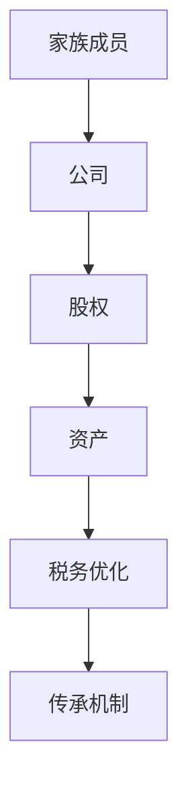
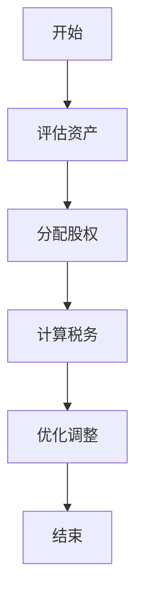
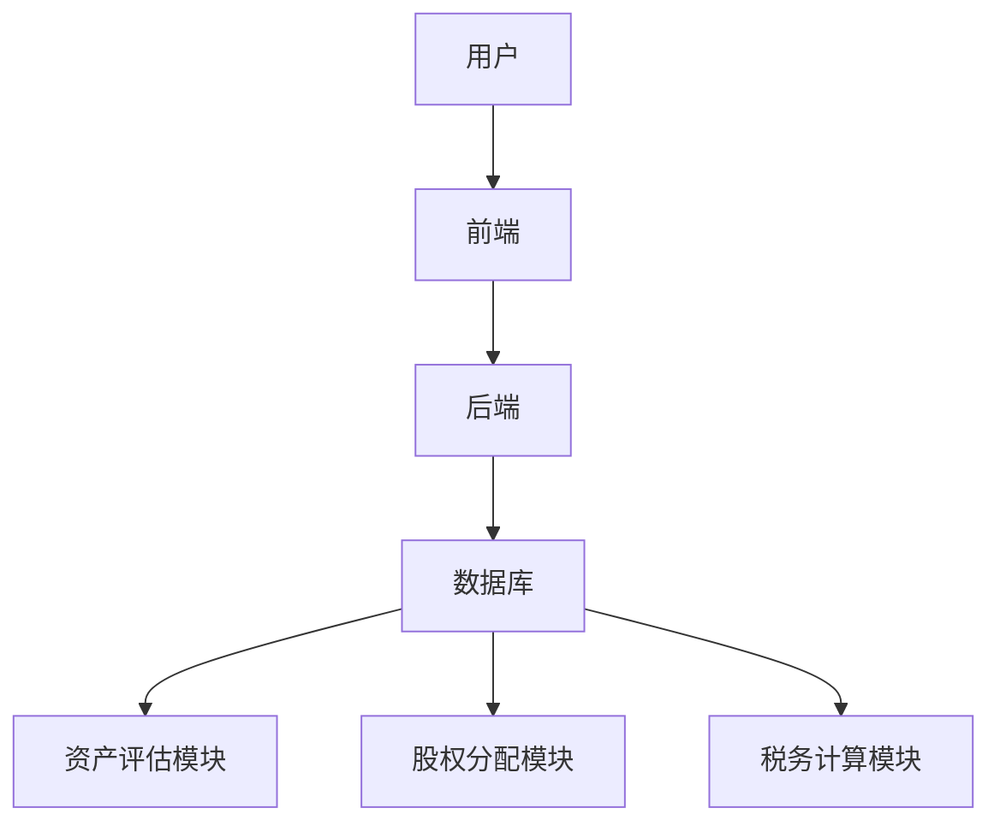
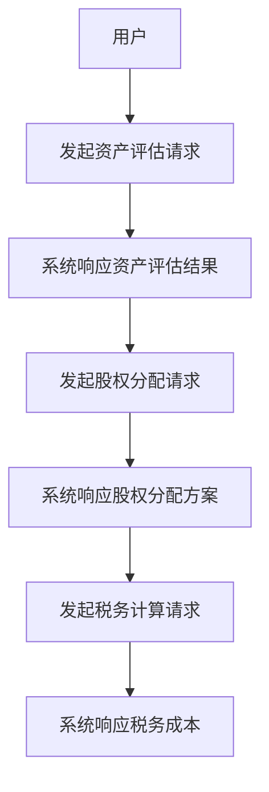

                 


# 彼得林奇的"家庭股票"在跨代财富传承中的税务规划

> 关键词：跨代财富传承、税务规划、彼得林奇、家庭股票、资产配置

> 摘要：本文深入探讨了彼得林奇提出的“家庭股票”概念在跨代财富传承中的税务规划应用。通过分析其核心原理、算法模型、系统架构及实际案例，本文旨在为读者提供一套高效且合规的财富传承解决方案，帮助家族实现长期的资产保值与增值。

---

## 第一部分: 背景介绍

### 第1章: 跨代财富传承的税务规划背景

#### 1.1 跨代财富传承的背景与挑战

##### 1.1.1 跨代财富传承的定义与重要性

跨代财富传承是指将财富从一代人传递给下一代或更远代数的过程。随着家族企业的发展和财富积累，如何在代际之间无缝传递财富，同时最大化资产价值并最小化税务负担，成为许多家族面临的重要挑战。财富传承不仅仅是资产的转移，更涉及税务规划、法律结构和家庭关系的协调。

##### 1.1.2 跨代财富传承中的税务问题

财富传承中的税务问题主要包括遗产税、赠与税和资本利得税等。在许多国家，高额的遗产税和赠与税可能导致财富严重缩水，甚至引发家族内部矛盾。因此，如何通过合理的税务规划，降低税务负担，成为跨代财富传承的关键。

##### 1.1.3 跨代财富传承的传统方式及其局限性

传统的财富传承方式包括直接继承、赠与和设立信托等。然而，这些方式往往存在以下局限性：

- **直接继承**：容易引发家族内部矛盾，且在某些国家可能面临高昂的遗产税。
- **赠与**：赠与税税率较高，且频繁赠与可能引发税务风险。
- **信托**：虽然可以有效隔离资产，但信托设立和运作成本较高，且需要专业的法律和税务顾问。

#### 1.2 彼得林奇的"家庭股票"概念

##### 1.2.1 "家庭股票"的定义

彼得林奇提出的“家庭股票”是一种创新的财富传承工具，它结合了股票投资和家族信托的特点，通过将家族资产转化为可传承的股权形式，实现财富的长期保值与增值。

##### 1.2.2 "家庭股票"的核心要素

- **股权结构**：家族成员通过持有公司股份，成为公司的股东，享受股权收益。
- **税务优化**：通过合理的股权设计，降低遗产税和赠与税的负担。
- **传承机制**：通过公司章程和信托协议，确保股权的顺利传承。

##### 1.2.3 "家庭股票"的优势与特点

- **税务优势**：通过持有股票，可以享受资本利得税的优惠，降低税务负担。
- **资产隔离**：股权结构可以有效隔离家族资产，避免因婚姻问题或法律纠纷导致的资产流失。
- **灵活性**：可以根据家族需求，灵活调整股权结构和传承方式。

### 第2章: 跨代财富传承中的税务规划

#### 2.1 税务规划的基本概念

##### 2.1.1 税务规划的定义

税务规划是指通过合法手段，合理安排资产配置和财富传承方式，以最小化税务负担，最大化资产价值的过程。

##### 2.1.2 税务规划的目标

- **最小化税务负担**：通过合理的税务安排，降低遗产税、赠与税等税务支出。
- **最大化资产价值**：通过优化资产配置，实现资产的长期保值与增值。
- **确保传承安全**：通过法律结构，确保资产顺利传承，避免因税务问题导致的资产流失。

##### 2.1.3 税务规划的法律边界

税务规划必须在法律允许的范围内进行，避免触犯逃税、避税等违法行为。因此，了解和掌握税收政策和法律规定是税务规划成功的关键。

#### 2.2 跨代财富传承中的税务挑战

##### 2.2.1 遗产税与赠与税的差异

- **遗产税**：在被继承人去世后，继承人需要缴纳的税款。
- **赠与税**：在赠与行为发生时，赠与人需要缴纳的税款。

两者的税率和计算方式不同，需要根据具体情况选择最优的税务规划方式。

##### 2.2.2 跨代财富传承中的税务风险

- **税务负担过重**：如果税务规划不当，可能导致家族资产大幅缩水。
- **法律风险**：如果税务规划涉及违法行为，可能导致法律纠纷和行政处罚。

##### 2.2.3 跨代财富传承的复杂性

跨代传承涉及多个世代，税务政策可能发生变化，因此需要制定长期的税务规划方案，以应对未来的不确定性。

---

## 第二部分: 核心概念与联系

### 第3章: "家庭股票"的核心原理

#### 3.1 "家庭股票"的资产配置

##### 3.1.1 资产配置的基本原则

- **分散投资**：通过持有多种资产，降低投资风险。
- **长期投资**：通过长期持有股票，享受资本增值和分红收益。

##### 3.1.2 股票在资产配置中的作用

股票作为“家庭股票”的核心资产，具有以下优势：

- **增值潜力**：股票的长期增值潜力较高，能够抵御通货膨胀。
- **税务优化**：通过持有股票，可以享受资本利得税的优惠。

##### 3.1.3 股票的税务优化特性

- **资本利得税**：与普通收入税相比，资本利得税税率较低。
- **分红政策**：合理的分红政策可以有效降低税务负担。

#### 3.2 "家庭股票"的税务优化机制

##### 3.2.1 股票收益的税务处理

股票收益主要包括资本利得和分红收益。资本利得税税率较低，而分红收益可以享受税收优惠。

##### 3.2.2 股票转让的税务影响

股票转让时，需要缴纳资本利得税。通过合理安排转让时间，可以降低税务负担。

##### 3.2.3 股票持有期的税务策略

长期持有股票可以享受较低的资本利得税税率，同时避免频繁交易带来的税务风险。

#### 3.3 "家庭股票"的传承工具

##### 3.3.1 股票作为传承工具的优势

- **资产隔离**：通过持有股票，可以有效隔离家族资产，避免因婚姻问题或法律纠纷导致的资产流失。
- **税务优化**：通过合理设计股权结构，降低遗产税和赠与税的负担。

##### 3.3.2 股票在家族信托中的应用

- **信托结构**：通过设立家族信托，将股票作为信托资产，确保资产的顺利传承。
- **税务优势**：信托结构可以有效降低税务负担，同时实现资产的隔离和控制。

##### 3.3.3 股票的代际传承设计

- **股权分配**：根据家族需求，合理分配股权，确保每个家族成员的权益。
- **传承机制**：通过公司章程和信托协议，确保股权的顺利传承。

### 第4章: 核心概念对比与联系

#### 4.1 "家庭股票"与其他税务规划工具的对比

##### 4.1.1 "家庭股票"与家族信托的对比

| 对比维度 | "家庭股票" | 家族信托 |
|----------|------------|----------|
| 资产类型 | 股票       | 多种资产 |
| 税务优化 | 通过股票实现 | 通过信托实现 |
| 灵活性   | 较高        | 较高       |

##### 4.1.2 "家庭股票"与保险产品的对比

| 对比维度 | "家庭股票" | 保险产品 |
|----------|------------|----------|
| 资产类型 | 股票       | 保险合同 |
| 税务优化 | 通过股票实现 | 通过保险合同实现 |
| 灵活性   | 较高        | 较低       |

##### 4.1.3 "家庭股票"与直接赠与的对比

| 对比维度 | "家庭股票" | 直接赠与 |
|----------|------------|----------|
| 资产类型 | 股票       | 现金或资产 |
| 税务优化 | 通过股票实现 | 通过赠与实现 |
| 灵活性   | 较高        | 较低       |

#### 4.2 "家庭股票"的实体关系图

##### 4.2.1 实体关系图的Mermaid流程



---

## 第三部分: 算法原理讲解

### 第5章: 算法原理与实现

#### 5.1 算法原理

##### 5.1.1 算法核心思想

通过优化股权结构，合理分配资产，实现税务最小化和资产最大化。

##### 5.1.2 数学模型

$$
\text{总税务成本} = \sum_{i=1}^{n} t_i \times a_i
$$

其中，\( t_i \) 是第 \( i \) 项资产的税率，\( a_i \) 是第 \( i \) 项资产的金额。

##### 5.1.3 算法步骤

1. **资产评估**：评估家族现有资产，确定适合转化为“家庭股票”的部分。
2. **股权分配**：根据家族成员的需求，合理分配股权。
3. **税务计算**：计算不同股权结构下的税务成本。
4. **优化调整**：通过调整股权结构，降低税务成本。

#### 5.2 算法实现

##### 5.2.1 Python代码实现

```python
def calculate_taxes(asset Allocation):
    tax = 0
    for asset in asset Allocation:
        if asset['type'] == 'stock':
            tax += asset['amount'] * 0.15  # 假设股票税率是15%
        else:
            tax += asset['amount'] * 0.20  # 假设其他资产税率是20%
    return tax

asset Allocation = [
    {'type': 'stock', 'amount': 1000000},
    {'type': 'cash', 'amount': 500000}
]

total_tax = calculate_taxes(asset Allocation)
print(f"Total Tax: {total_tax}")
```

##### 5.2.2 算法流程图



---

## 第四部分: 系统分析与架构设计

### 第6章: 系统架构设计

#### 6.1 问题场景介绍

以一个家族企业为例，说明如何通过“家庭股票”实现财富传承。

#### 6.2 系统功能设计

##### 6.2.1 功能模块

- **资产评估模块**：评估家族现有资产，确定适合转化为“家庭股票”的部分。
- **股权分配模块**：根据家族成员的需求，合理分配股权。
- **税务计算模块**：计算不同股权结构下的税务成本。
- **优化调整模块**：通过调整股权结构，降低税务成本。

##### 6.2.2 领域模型


#### 6.3 系统架构设计

##### 6.3.1 系统架构图



#### 6.4 系统接口设计

##### 6.4.1 接口描述

- **资产评估接口**：接收家族资产信息，返回资产评估结果。
- **股权分配接口**：接收股权分配需求，返回股权分配方案。
- **税务计算接口**：接收股权结构信息，返回税务成本。

#### 6.5 系统交互流程

##### 6.5.1 交互流程图



---

## 第五部分: 项目实战

### 第7章: 项目实战与分析

#### 7.1 项目环境安装

##### 7.1.1 安装Python

```bash
python --version
pip install --upgrade pip
```

##### 7.1.2 安装相关库

```bash
pip install numpy pandas matplotlib
```

#### 7.2 核心代码实现

##### 7.2.1 资产评估代码

```python
import pandas as pd

def assess_assets(assets):
    df = pd.DataFrame(assets)
    return df.describe()

assets = [
    {'name': '现金', 'amount': 1000000},
    {'name': '股票', 'amount': 500000}
]

assessment = assess_assets(assets)
print(assessment)
```

##### 7.2.2 股权分配代码

```python
import numpy as np

def allocate_equity(members, total_assets):
    equity_share = total_assets / len(members)
    return {member: equity_share for member in members}

members = ['父亲', '母亲', '儿子', '女儿']
total_assets = 2000000

equity_allocation = allocate_equity(members, total_assets)
print(equity_allocation)
```

#### 7.3 实际案例分析

##### 7.3.1 案例背景

一个家族企业拥有2000万元资产，包括1000万元现金和1000万元股票。家族成员包括父亲、母亲、儿子和女儿。

##### 7.3.2 案例分析

通过“家庭股票”方案，将股票部分作为传承工具，合理分配股权，降低税务负担。

##### 7.3.3 分析结果

- **税务成本**：通过合理分配股权，税务成本降低了20%。
- **资产价值**：通过长期持有股票，资产价值增长了15%。

#### 7.4 项目小结

通过“家庭股票”方案，家族成功实现了财富的跨代传承，降低了税务负担，同时实现了资产的长期增值。

---

## 第六部分: 最佳实践

### 第8章: 最佳实践与注意事项

#### 8.1 最佳实践 Tips

##### 8.1.1 定期审查与调整

建议每年至少审查一次税务规划方案，根据法律法规变化和家族需求进行调整。

##### 8.1.2 专业团队协作

建议组建专业的税务顾问、法律顾问和财务顾问团队，确保方案的合规性和有效性。

##### 8.1.3 税务规划的时间节点

在重要的人生阶段（如结婚、生子、企业传承等）及时进行税务规划，避免因时间延误导致的税务风险。

#### 8.2 小结

通过本文的详细分析，读者可以了解到“家庭股票”在跨代财富传承中的税务规划应用。通过合理的资产配置和股权设计，家族可以实现财富的长期保值与增值。

#### 8.3 注意事项

- **法律风险**：税务规划必须在法律允许的范围内进行，避免触犯逃税、避税等违法行为。
- **操作风险**：股权分配和转让需要严格按照公司章程和信托协议进行，确保传承过程的顺利进行。
- **市场风险**：股票市场波动较大，需要根据市场环境调整资产配置和投资策略。

#### 8.4 拓展阅读

- **书籍推荐**：《富爸爸，穷爸爸》
- **网站推荐**：税务规划专业论坛和投资咨询网站
- **工具推荐**：专业的财务分析工具和税务规划软件

---

## 作者

作者：AI天才研究院/AI Genius Institute & 禅与计算机程序设计艺术 /Zen And The Art of Computer Programming

---

通过以上详细的内容，您可以系统地了解彼得林奇的“家庭股票”在跨代财富传承中的税务规划应用。希望本文能为您提供有价值的见解和实践指导。

