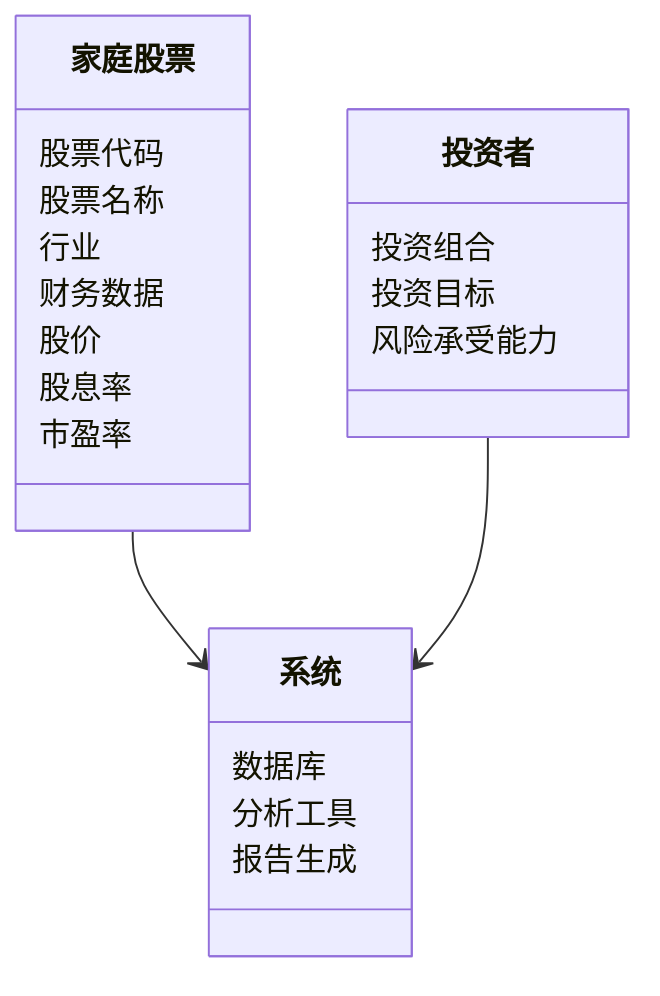
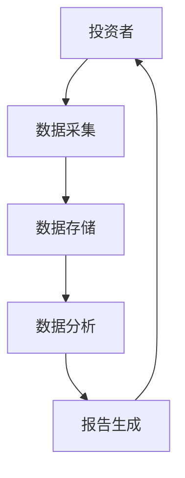
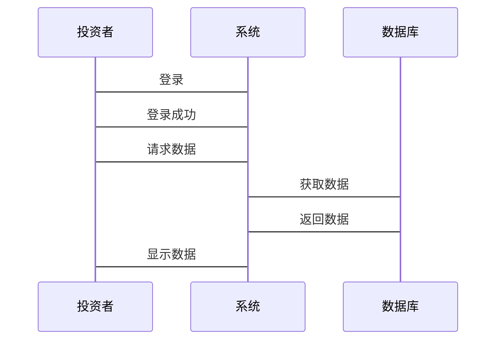

                 


# 彼得林奇的"家庭股票"长期跟踪方法

## 关键词：家庭股票，彼得林奇，长期跟踪，投资策略，股票分析

## 摘要：本文深入探讨了彼得林奇的"家庭股票"理念，分析了长期跟踪的方法，并通过实际案例和系统化策略提供了详细指导。文章涵盖了核心概念、选择标准、跟踪方法、系统架构以及实战指导，帮助读者掌握长期投资的精髓。

---

## 第1章: 家庭股票的核心概念与背景

### 1.1 家庭股票的定义与特点

#### 1.1.1 家庭股票的定义
家庭股票是指那些具备稳定增长潜力、良好财务状况和竞争优势的公司股票，适合长期持有的优质资产。

#### 1.1.2 家庭股票的核心特点
- 稳定增长：公司收入和利润持续增长，股息稳定或增长。
- 良好财务状况：低负债率、高利润率、健康的现金流。
- 竞争优势：市场领先地位、独特的商业模式或技术壁垒。
- 管理团队：优秀的管理层，长期致力于公司发展。

#### 1.1.3 家庭股票与传统股票的区别
| 特性 | 家庭股票 | 传统股票 |
|------|----------|----------|
| 投资期限 | 长期持有 | 短期交易 |
| 风险承受 | 较低 | 较高 |
| 股票选择 | 严格筛选 | 快速决策 |

### 1.2 彼得林奇投资理念的背景

#### 1.2.1 彼得林奇的个人投资哲学
彼得林奇强调长期投资，避免频繁交易，关注公司基本面，寻找具有持续增长潜力的股票。

#### 1.2.2 家庭股票在彼得林奇投资体系中的地位
家庭股票是彼得林奇投资组合的核心，占总投资的大部分，其余部分用于分散投资。

#### 1.2.3 家庭股票长期跟踪的必要性
通过长期跟踪，投资者可以及时发现潜在风险，调整投资策略，确保投资组合的稳健增长。

### 1.3 家庭股票长期跟踪的意义

#### 1.3.1 长期跟踪的核心价值
- 通过持续监控，发现公司基本面变化，及时做出调整。
- 避免短期波动干扰，保持投资的稳定性。
- 优化投资组合，提高整体收益。

#### 1.3.2 长期跟踪与短期投资的对比
| 特性 | 长期跟踪 | 短期投资 |
|------|----------|----------|
| 风险 | 低 | 高 |
| 困难 | 少 | 多 |
| 收益 | 稳定 | 不稳定 |

#### 1.3.3 长期跟踪在投资组合中的作用
- 提高投资组合的稳定性。
- 增强抗风险能力。
- 通过复利效应实现财富增长。

---

## 第2章: 家庭股票的选择标准与评估体系

### 2.1 家庭股票的选择标准

#### 2.1.1 行业选择与公司分析
- 选择成长性强的行业，如科技、医疗等。
- 公司需具备竞争优势，如品牌、技术或成本优势。

#### 2.1.2 财务指标的筛选标准
- 利润率：净利润率高，ROE（净资产收益率）≥15%。
- 偿债能力：低负债率，流动比率≥2。
- 现金流：健康的现金流，经营活动现金流为正。

#### 2.1.3 管理团队的评估方法
- 管理层是否稳定且有长期愿景。
- 管理层的决策能力和过往业绩。

### 2.2 家庭股票的评估体系

#### 2.2.1 财务健康度评估
- 财务健康度评分：满分10分，评分越高，财务状况越好。
- 评分标准：基于利润、现金流和负债情况。

#### 2.2.2 市场地位分析
- 市场份额：公司是否为行业领导者。
- 市场前景：行业是否具备增长潜力。

#### 2.2.3 竞争优势评估
- 竞争优势类型：成本优势、技术壁垒、品牌影响力。
- 优势强度：强、中、弱。

### 2.3 家庭股票的定性与定量分析

#### 2.3.1 定性分析的核心要素
- 公司战略：是否有明确的发展目标。
- 管理层素质：管理层是否具备领导力和决策能力。

#### 2.3.2 定量分析的关键指标
| 指标 | 定义 | 重要性 |
|------|------|--------|
| 市盈率 | 股价/每股收益 | 判断估值是否合理 |
| 股息率 | 每股股息/股价 | 评估收益能力 |
| 净资产收益率 | 净利润/净资产 | 评估盈利能力 |

#### 2.3.3 定性与定量分析的结合
通过定性分析确定潜在股票，再用定量分析筛选出符合条件的股票，最终形成投资组合。

---

## 第3章: 家庭股票的长期跟踪方法

### 3.1 长期跟踪的核心要素

#### 3.1.1 定期复盘的重要性
- 每季度复盘一次，检查投资组合的表现。
- 分析市场变化，及时调整投资策略。

#### 3.1.2 关键指标的持续监控
- 监控市盈率、股息率等关键指标。
- 每月检查公司财务报告，了解公司最新动态。

#### 3.1.3 市场变化的敏感性分析
- 市场波动对投资组合的影响。
- 如何在市场低迷时保持信心。

### 3.2 长期跟踪的实施步骤

#### 3.2.1 初始评估与目标设定
- 设定投资目标，如年化收益率≥10%。
- 制定投资计划，确定投资金额和时间。

#### 3.2.2 定期跟踪与动态调整
- 每季度评估投资组合，调整股票比例。
- 根据市场变化和公司情况，及时调整投资策略。

#### 3.2.3 数据记录与分析总结
- 建立投资日志，记录每次的投资决策和原因。
- 每季度总结投资表现，分析成功与失败的原因。

### 3.3 长期跟踪的工具与技巧

#### 3.3.1 投资记录工具的选择
- 使用Excel或专门的投资软件记录投资数据。
- 选择适合自己的工具，确保数据准确性和易用性。

#### 3.3.2 数据分析工具的应用
- 使用数据分析工具进行趋势分析。
- 通过图表直观展示数据变化。

#### 3.3.3 信息获取渠道的优化
- 关注公司财报发布，及时了解公司动态。
- 通过多种渠道获取信息，确保信息的全面性。

---

## 第4章: 家庭股票的案例分析与实战指导

### 4.1 案例分析: 彼得林奇的经典投资案例

#### 4.1.1 案例背景与选择依据
- 公司名称：XYZ公司，行业：科技。
- 选择依据：具备强大的竞争优势和良好的财务状况。

#### 4.1.2 投资过程与结果分析
- 投资时间：长期持有，持续关注公司动态。
- 投资结果：股价稳步增长，股息增加，投资收益显著。

#### 4.1.3 经验总结与启示
- 选择优质股票是关键。
- 长期跟踪和持续学习是成功的保障。

### 4.2 实战指导: 如何构建家庭股票组合

#### 4.2.1 投资目标的设定
- 设定投资期限和收益目标。
- 确定风险承受能力，选择合适的投资比例。

#### 4.2.2 股票筛选与配置策略
- 根据行业分析和财务指标筛选股票。
- 根据风险偏好配置股票比例，分散投资。

#### 4.2.3 风险控制与收益预期
- 设置止损点，避免重大损失。
- 通过分散投资降低整体风险。

### 4.3 案例分析与实战的对比

#### 4.3.1 理论与实践的结合
- 理论指导实践，实践验证理论。

#### 4.3.2 案例分析对实战的指导意义
- 通过经典案例学习投资策略。
- 将理论应用到实际投资中，不断优化方法。

#### 4.3.3 实战中的常见问题与解决方法
- 问题：如何选择合适的股票？
  - 解决：制定严格的筛选标准，定期复盘调整。

---

## 第5章: 系统分析与架构设计方案

### 5.1 问题场景介绍
- 投资者需要长期跟踪家庭股票，确保投资组合的稳健增长。
- 系统需要提供数据监控、分析和决策支持功能。

### 5.2 项目介绍
- 项目名称：家庭股票长期跟踪系统。
- 项目目标：帮助投资者实现高效、系统的长期跟踪。

### 5.3 系统功能设计

#### 5.3.1 领域模型设计


#### 5.3.2 系统架构设计


### 5.4 系统接口设计
- 数据采集接口：从股票市场获取实时数据。
- 数据分析接口：对数据进行处理和分析。
- 报告生成接口：生成投资报告和提醒。

### 5.5 系统交互设计


---

## 第6章: 项目实战

### 6.1 环境安装
- 安装Python和必要的库（pandas, numpy, matplotlib）。
- 安装数据分析工具和投资软件。

### 6.2 核心实现源代码

#### 6.2.1 数据采集代码
```python
import pandas as pd
import numpy as np

# 从数据库获取数据
data = pd.read_sql("SELECT * FROM stocks", conn)
```

#### 6.2.2 数据分析代码
```python
# 计算市盈率
data['市盈率'] = data['股价'] / data['每股收益']
```

#### 6.2.3 数据可视化代码
```python
import matplotlib.pyplot as plt

plt.plot(data['日期'], data['股价'])
plt.title('股价趋势')
plt.xlabel('日期')
plt.ylabel('股价')
plt.show()
```

### 6.3 代码应用解读与分析
- 数据采集：从数据库获取股票数据。
- 数据分析：计算关键指标，如市盈率和股息率。
- 数据可视化：通过图表展示数据变化，帮助投资者做出决策。

### 6.4 实际案例分析
- 选择几个股票，进行数据分析和可视化，展示如何通过系统方法选择和跟踪家庭股票。

### 6.5 项目小结
- 通过实战，投资者可以掌握数据分析和投资策略的实施方法。
- 系统化的投资方法能够提高投资效率和准确性。

---

## 第7章: 总结与展望

### 7.1 本文总结
- 彼得林奇的家庭股票理念强调长期投资和基本面分析。
- 通过系统化的跟踪和分析，投资者可以实现稳健的投资收益。

### 7.2 投资策略的展望
- 结合技术分析和基本面分析，优化投资策略。
- 利用人工智能和大数据技术，提升投资效率。

### 7.3 最佳实践 tips
- 定期复盘，及时调整投资组合。
- 选择优质股票，分散投资风险。
- 长期持有，避免频繁交易。

### 7.4 小结
通过本文的学习，读者可以掌握彼得林奇的家庭股票理念，并将其应用到实际投资中，实现长期稳健的投资收益。

---

## 作者：AI天才研究院/AI Genius Institute & 禅与计算机程序设计艺术 /Zen And The Art of Computer Programming

