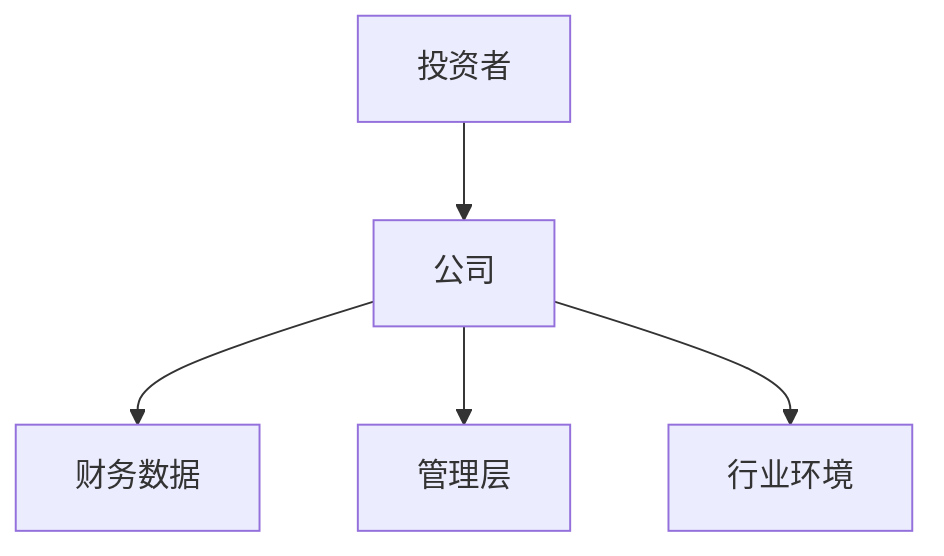
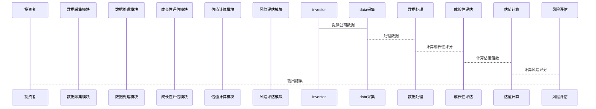

                 


# 彼得林奇的"小盘成长股"筛选策略

## 关键词：彼得·林奇，小盘成长股，股票筛选，投资策略，价值评估，风险管理

## 摘要：本文深入探讨了彼得·林奇的“小盘成长股”筛选策略，分析了其核心概念、算法原理、系统架构以及实际应用案例。通过详细讲解成长性评估、估值方法、风险管理等关键环节，结合数学模型和系统设计，为读者提供了一套完整的筛选策略。本文适合对投资策略和系统架构感兴趣的读者。

---

# 引言

彼得·林奇是全球著名投资家，以其在小盘成长股投资中的卓越表现闻名。他的策略不仅注重公司基本面，还强调成长性和估值的合理性。本文将从背景、理论、算法、系统架构等角度，详细探讨该策略。

---

# 第一部分: 背景介绍

## 第1章: 彼得·林奇与小盘成长股投资概述

### 1.1 彼得·林奇的背景与投资理念
- 彼得·林奇是美国著名投资家，曾管理富达麦哲伦基金，创造了辉煌的投资业绩。
- 他的投资哲学强调长期成长和价值发现，尤其是小盘成长股。

### 1.2 小盘成长股的定义与特点
- 小盘成长股是指市值较小、具有高成长潜力的公司股票。
- 其特点包括低估值、高增长、行业地位稳固等。

### 1.3 小盘成长股与大盘股的对比
- 小盘股风险高，但潜在回报也高；大盘股风险低，回报相对稳定。

---

# 第二部分: 理论基础

## 第2章: 小盘成长股筛选的背景与问题分析

### 2.1 投资者在股票筛选中的常见问题
- 信息过载导致筛选难度大。
- 市场波动影响投资决策。
- 投资者心理偏差影响判断。

### 2.2 小盘成长股筛选的核心问题
- 识别成长性：评估公司收入和利润增长率。
- 评估估值：计算市盈率和市净率。
- 控制风险：通过波动率和贝塔系数衡量。

---

## 第3章: 小盘成长股筛选的核心概念与联系

### 3.1 核心概念原理
- 成长性评估：通过收入增长率和净利润增长率计算成长性评分。
- 估值模型：计算市盈率和市净率的平均值。
- 风险评估：通过波动率和贝塔系数计算风险评分。

### 3.2 核心概念对比表格
| 指标       | 成长性评估 | 估值方法 | 风险控制 |
|------------|------------|-----------|-----------|
| 收入增长率 | 是        | 是        | 否        |
| 市盈率     | 否        | 是        | 否        |
| 贝塔系数   | 否        | 否        | 是        |

### 3.3 ER实体关系图


---

# 第三部分: 算法原理

## 第4章: 小盘成长股筛选算法的数学模型

### 4.1 算法原理
- 成长性评分公式：
  $$ 成长性评分 = \frac{收入增长率 + 净利润增长率}{2} $$
- 估值倍数计算：
  $$ 估值倍数 = \frac{市盈率 + 市净率}{2} $$
- 风险评分模型：
  $$ 风险评分 = \frac{波动率 + 贝塔系数}{2} $$

### 4.2 算法流程图


---

## 第5章: 小盘成长股筛选策略的系统架构

### 5.1 系统功能设计
- 领域模型：公司、财务数据、管理层、行业环境。
- 功能模块：数据采集、成长性评估、估值计算、风险评估。

### 5.2 系统架构图


### 5.3 系统交互序列图


---

## 第6章: 项目实战

### 6.1 环境安装
- 安装Python和相关库（pandas, numpy, matplotlib）。

### 6.2 核心代码实现
```python
import pandas as pd
import numpy as np

def calculate_growth_score(revenue_growth, net_profit_growth):
    return (revenue_growth + net_profit_growth) / 2

def calculate_valuation_multiple(pe, pb):
    return (pe + pb) / 2

def calculate_risk_score(volatility, beta):
    return (volatility + beta) / 2

# 示例数据
company_data = {
    '收入增长率': [0.3, 0.25, 0.4],
    '净利润增长率': [0.2, 0.15, 0.3],
    '市盈率': [15, 20, 25],
    '市净率': [2, 3, 4],
    '波动率': [0.2, 0.3, 0.1],
    '贝塔系数': [1.2, 1.5, 0.8]
}

df = pd.DataFrame(company_data)

# 计算评分
df['成长性评分'] = df.apply(lambda x: calculate_growth_score(x['收入增长率'], x['净利润增长率']), axis=1)
df['估值倍数'] = df.apply(lambda x: calculate_valuation_multiple(x['市盈率'], x['市净率']), axis=1)
df['风险评分'] = df.apply(lambda x: calculate_risk_score(x['波动率'], x['贝塔系数']), axis=1)

print(df)
```

### 6.3 案例分析
- 选取某公司数据，计算成长性评分、估值倍数和风险评分，评估其是否符合小盘成长股标准。

### 6.4 总结
通过代码实现，读者可以实际操作，理解策略的应用过程。

---

## 第7章: 总结与展望

### 7.1 总结
- 彼得·林奇的小盘成长股策略通过成长性、估值和风险评估，帮助投资者筛选出优质股票。
- 本文通过理论、算法和系统设计，详细阐述了该策略。

### 7.2 展望
- 结合AI技术，进一步优化筛选策略。
- 提供更多实际案例，验证策略的有效性。

---

## 作者：AI天才研究院/AI Genius Institute & 禅与计算机程序设计艺术 /Zen And The Art of Computer Programming

---

通过本文，读者可以深入了解彼得·林奇的小盘成长股筛选策略，并通过实际案例和代码实现，掌握其应用方法。希望本文能为投资领域的技术化和系统化提供参考。

