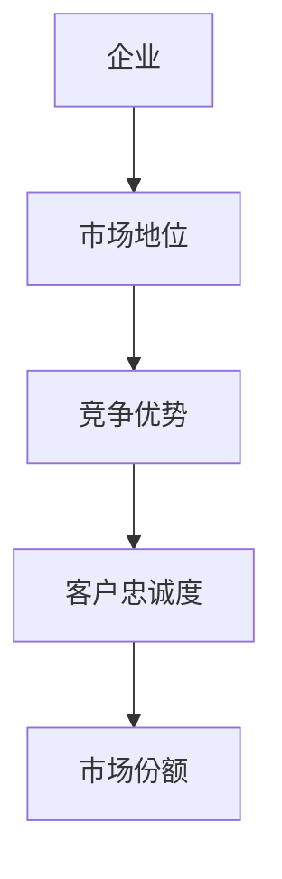
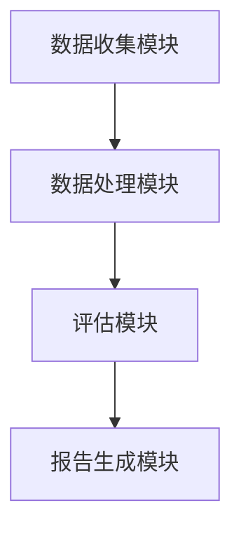
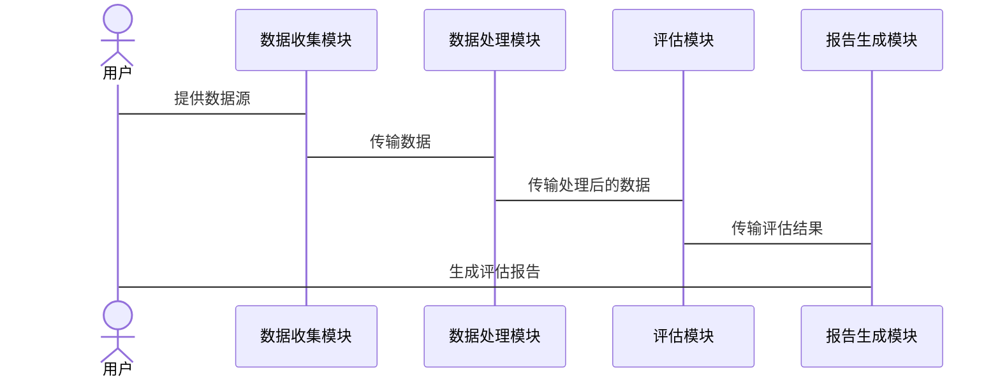

                 


# 彼得林奇的"市场先行者"优势持续性评估方法

## 关键词：市场先行者优势、持续性评估、彼得林奇、竞争优势、市场份额

## 摘要：本文详细探讨了彼得林奇提出的“市场先行者”优势及其持续性评估方法。通过分析市场先行者优势的核心概念、评估模型的构建、系统的分析与设计、以及项目实战，本文旨在为企业提供一套科学的评估方法，帮助识别和维护其市场竞争优势。文章内容涵盖背景介绍、核心概念、算法原理、数学模型、系统分析、项目实战及最佳实践，为读者提供全面而深入的指导。

---

# 第一部分：市场先行者优势的核心概念

## 第1章：市场先行者优势的核心概念

### 1.1 彼得林奇与市场先行者优势

#### 1.1.1 彼得林奇的投资哲学
- 彼得林奇是著名的投资专家，强调长期投资和基本面分析。
- 他提出“市场先行者”概念，认为企业应通过创新和市场领先地位来建立竞争优势。
- 市场先行者优势是指企业在市场上占据领先地位，从而在竞争中获得先发优势。

#### 1.1.2 市场先行者优势的定义
- 市场先行者优势是指企业在市场中占据领先地位，能够影响市场趋势和消费者行为。
- 这种优势通常体现在市场份额、品牌影响力、客户忠诚度等方面。

#### 1.1.3 市场先行者优势的核心要素
- 市场份额：企业在市场中的占有率。
- 品牌影响力：企业品牌在消费者中的认知度和信任度。
- 竞争优势：企业在产品、技术、成本等方面的优势。

### 1.2 市场先行者优势的背景与问题背景

#### 1.2.1 企业竞争中的市场地位问题
- 在激烈的市场竞争中，企业需要通过市场地位来获得长期优势。
- 市场先行者优势是企业在竞争中占据主动地位的关键因素。

#### 1.2.2 市场先行者优势的形成机制
- 市场先行者通过创新、优质产品或服务，吸引大量客户，形成市场主导地位。
- 市场先行者通过持续改进和优化，保持其竞争优势。

#### 1.2.3 优势持续性评估的必要性
- 市场环境不断变化，企业需要定期评估市场先行者优势的持续性。
- 通过评估，企业可以及时发现问题并采取措施，确保竞争优势的持续性。

### 1.3 市场先行者优势的边界与外延

#### 1.3.1 市场先行者优势的边界条件
- 市场先行者优势仅适用于特定市场和产品。
- 优势的持续性受到行业特性、市场环境和竞争态势的影响。

#### 1.3.2 优势的外延与相关概念对比
- 市场地位与竞争优势：市场地位是竞争优势的基础，而竞争优势是市场地位的表现。
- 市场份额与客户忠诚度：市场份额是市场地位的量化指标，客户忠诚度是市场地位的重要组成部分。

#### 1.3.3 优势持续性评估的范围与限制
- 评估范围：市场地位、竞争优势、市场份额、客户忠诚度等。
- 评估限制：市场环境变化、竞争对手策略调整等不可控因素可能影响评估结果。

---

## 第2章：市场先行者优势的核心概念与联系

### 2.1 核心概念原理

#### 2.1.1 市场地位与竞争优势的关系
- 市场地位是竞争优势的基础，竞争优势是市场地位的表现。
- 企业通过市场竞争，不断提升市场地位和竞争优势。

#### 2.1.2 市场份额与盈利能力的关联
- 市场份额高的企业通常具有更强的盈利能力。
- 市场份额与企业收入和利润密切相关。

#### 2.1.3 市场先行者优势的动态变化
- 市场先行者优势不是一成不变的，需要不断维护和提升。
- 竞争对手的崛起和市场环境的变化会影响市场先行者优势的持续性。

### 2.2 核心概念属性特征对比

#### 2.2.1 市场地位与竞争能力的对比
- 市场地位：企业在市场中的位置和影响力。
- 竞争能力：企业在产品、技术、成本等方面的优势。
- 对比：市场地位是外在表现，竞争能力是内在基础。

#### 2.2.2 市场份额与客户忠诚度的对比
- 市场份额：企业在市场中的占有率。
- 客户忠诚度：客户对品牌的忠诚程度。
- 对比：市场份额反映企业的市场表现，客户忠诚度反映企业的市场稳定性。

#### 2.2.3 优势持续性与企业生命周期的对比
- 优势持续性：市场先行者优势的长期维持。
- 企业生命周期：企业从成立到衰退的全过程。
- 对比：优势持续性是企业生命周期中的一个阶段，企业生命周期的变化会影响优势持续性。

### 2.3 ER实体关系图架构



### 2.4 本章小结
- 本章详细介绍了市场先行者优势的核心概念，分析了其与相关概念的关系，构建了核心概念的ER实体关系图，为后续的评估方法奠定了基础。

---

# 第三部分：市场先行者优势持续性评估模型的构建

## 第3章：市场先行者优势持续性评估模型的构建

### 3.1 评估模型的设计

#### 3.1.1 模型目标与输入
- 模型目标：评估市场先行者优势的持续性。
- 模型输入：市场数据、企业数据、竞争对手数据。

#### 3.1.2 模型输出与应用场景
- 模型输出：优势持续性评估结果。
- 应用场景：企业战略决策、投资评估、市场竞争分析。

#### 3.1.3 模型的假设与限制
- 假设：市场环境稳定，竞争对手策略已知。
- 限制：模型结果仅供参考，实际决策需结合具体情况。

### 3.2 数据收集与处理

#### 3.2.1 数据来源与收集方法
- 数据来源：公开市场数据、企业财报、行业报告。
- 收集方法：数据爬取、问卷调查、行业分析。

#### 3.2.2 数据清洗与预处理
- 数据清洗：去除无效数据、处理缺失值。
- 数据预处理：标准化、归一化。

#### 3.2.3 数据特征提取与选择
- 特征提取：提取关键特征，如市场份额、品牌影响力。
- 特征选择：使用统计方法选择重要特征。

### 3.3 指标体系的构建

#### 3.3.1 市场地位指标
- 市场份额：企业的市场占有率。
- 品牌影响力：品牌知名度和美誉度。

#### 3.3.2 竞争优势指标
- 产品优势：产品质量、技术创新。
- 成本优势：生产成本、运营成本。

#### 3.3.3 优势持续性指标
- 市场地位稳定性：市场份额波动率。
- 竞争优势持续性：产品生命周期、技术更新速度。

### 3.4 本章小结
- 本章构建了市场先行者优势持续性评估的指标体系，为后续的评估方法提供了数据支持。

---

## 第4章：市场先行者优势持续性评估方法

### 4.1 定量评估方法

#### 4.1.1 市场份额变化率计算
$$市场份额变化率 = \frac{市场份额_{当前} - 市场份额_{历史}}{市场份额_{历史}} \times 100\%$$

#### 4.1.2 竞争优势指数计算
$$竞争优势指数 = \frac{市场份额}{行业增长率}$$

### 4.2 定性评估方法

#### 4.2.1 品牌影响力评估
- 品牌知名度：品牌在消费者中的认知度。
- 品牌美誉度：消费者对品牌的评价和信任度。

#### 4.2.2 竞争对手分析
- 竞争对手的市场份额和市场策略。
- 竞争对手的产品和技术创新。

### 4.3 综合评估方法

#### 4.3.1 综合指数计算
$$综合优势指数 = w_1 \times 市场份额变化率 + w_2 \times 竞争优势指数 + w_3 \times 品牌影响力指数$$
其中，$w_1, w_2, w_3$为各指标的权重。

#### 4.3.2 综合评估结果
- 优势持续性强：综合优势指数 > 70%
- 优势持续性一般：综合优势指数在 50% 到 70% 之间
- 优势持续性较弱：综合优势指数 < 50%

### 4.4 本章小结
- 本章介绍了市场先行者优势持续性评估的定量和定性方法，构建了综合评估模型，为企业提供了科学的评估工具。

---

## 第5章：系统分析与架构设计方案

### 5.1 问题场景介绍

#### 5.1.1 项目介绍
- 项目目标：评估某企业的市场先行者优势持续性。
- 项目范围：市场数据收集与分析、竞争对手分析、优势持续性评估。

#### 5.1.2 系统功能需求
- 数据收集模块：收集市场数据、企业数据、竞争对手数据。
- 数据处理模块：清洗数据、提取特征。
- 评估模块：计算市场份额变化率、竞争优势指数、综合优势指数。
- 报告生成模块：生成评估报告。

### 5.2 系统架构设计

#### 5.2.1 系统架构图


#### 5.2.2 系统功能设计
- 数据收集模块：负责从公开数据源、企业财报等渠道收集数据。
- 数据处理模块：对收集到的数据进行清洗、标准化和特征提取。
- 评估模块：根据模型计算市场份额变化率、竞争优势指数、综合优势指数。
- 报告生成模块：生成评估报告，包括数据可视化和分析结果。

### 5.3 系统交互设计

#### 5.3.1 系统交互流程


### 5.4 本章小结
- 本章通过系统架构设计和功能设计，构建了一个完整的市场先行者优势持续性评估系统，为企业的实际应用提供了技术支持。

---

## 第6章：项目实战与案例分析

### 6.1 环境安装与配置

#### 6.1.1 环境要求
- 操作系统：Windows、MacOS、Linux
- 开发工具：Python、Jupyter Notebook、IDE
- 数据库：MySQL、MongoDB
- 依赖库：Pandas、NumPy、Matplotlib、Seaborn

#### 6.1.2 安装步骤
1. 安装Python和pip。
2. 安装所需的依赖库：`pip install pandas numpy matplotlib seaborn requests beautifulsoup4`
3. 下载数据集：从公开数据源或企业内部数据源获取市场数据。

### 6.2 核心代码实现

#### 6.2.1 数据收集模块
```python
import requests
from bs4 import BeautifulSoup

def collect_data(url):
    response = requests.get(url)
    soup = BeautifulSoup(response.text, 'html.parser')
    data = []
    for item in soup.find_all('div', class_='market-data'):
        data.append({
            'company': item.find('h2').text,
            'market_share': float(item.find('span', class_='share').text),
            'revenue': float(item.find('span', class_='revenue').text)
        })
    return data
```

#### 6.2.2 数据处理模块
```python
import pandas as pd

def preprocess_data(data):
    df = pd.DataFrame(data)
    df['market_share'] = df['market_share'].fillna(df['market_share'].mean())
    df['revenue_growth'] = df['revenue'].pct_change()
    return df
```

#### 6.2.3 评估模块
```python
def calculate_competition_index(df):
    df['competition_index'] = df['market_share'] / df['revenue_growth']
    return df
```

#### 6.2.4 报告生成模块
```python
import matplotlib.pyplot as plt

def generate_report(df):
    plt.figure(figsize=(10, 6))
    df.plot(kind='bar', x='company', y='market_share')
    plt.title('Market Share Analysis')
    plt.savefig('market_share_analysis.png')
    plt.close()
    return '报告生成成功'
```

### 6.3 实际案例分析

#### 6.3.1 案例背景
- 某企业A在市场中占据领先地位，但最近市场份额有所下降，需要评估其市场先行者优势的持续性。

#### 6.3.2 数据分析
- 数据收集：收集企业A及其竞争对手的市场数据。
- 数据处理：清洗数据，提取市场份额和收入增长率。
- 模型计算：计算市场份额变化率和竞争优势指数。
- 评估结果：综合优势指数为65%，优势持续性一般。

#### 6.3.3 问题分析与解决方案
- 问题：市场份额下降，竞争对手崛起。
- 解决方案：加强品牌推广，优化产品策略，提升客户忠诚度。

### 6.4 本章小结
- 本章通过实际案例分析，展示了市场先行者优势持续性评估方法的应用过程，为企业提供了可操作的指导。

---

## 第7章：总结与最佳实践

### 7.1 总结

#### 7.1.1 核心观点回顾
- 市场先行者优势是企业在市场竞争中的关键优势。
- 优势的持续性评估需要结合定量和定性方法。

#### 7.1.2 评估方法的总结
- 综合优势指数是评估市场先行者优势持续性的有效工具。
- 企业应定期评估市场先行者优势的持续性，及时调整战略。

### 7.2 最佳实践

#### 7.2.1 实施建议
- 定期收集市场数据，更新评估模型。
- 结合企业实际情况，调整评估指标和权重。

#### 7.2.2 注意事项
- 数据来源的准确性和可靠性。
- 模型的适用性和灵活性。

#### 7.2.3 拓展阅读
- 彼得林奇的《彼得林奇投资哲学》。
- 竞争优势理论的相关书籍和文献。

### 7.3 本章小结
- 本章总结了市场先行者优势持续性评估方法的核心观点，提出了实施建议和注意事项，为读者提供了实用的指导。

---

## 作者：AI天才研究院/AI Genius Institute & 禅与计算机程序设计艺术 /Zen And The Art of Computer Programming

---

**本文通过详细分析彼得林奇的市场先行者优势理论，构建了持续性评估模型，并通过实际案例分析，为企业提供了科学的评估方法和实践指导。**

