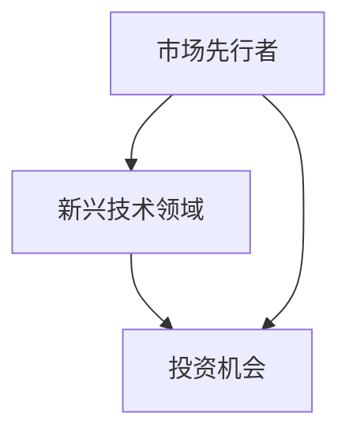
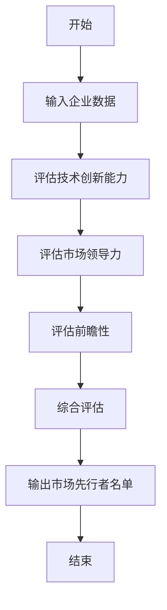
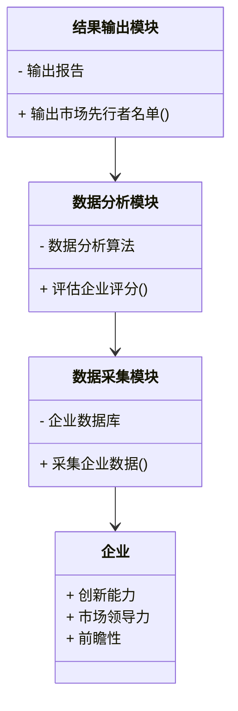
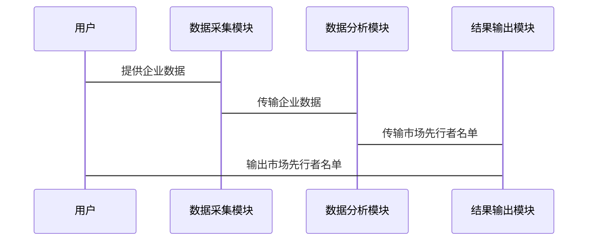

                 


# 彼得林奇的"市场先行者"在新兴技术领域的识别方法

> 关键词：市场先行者，彼得·林奇，新兴技术，投资策略，技术识别

> 摘要：本文深入探讨了彼得·林奇的“市场先行者”概念，并结合新兴技术领域的特点，提出了系统化的识别方法。通过分析核心概念、算法原理、系统架构设计和项目实战，本文为读者提供了从理论到实践的完整指南，帮助投资者在新兴技术领域中识别具有潜力的市场先行者。

---

# 第一部分: 背景介绍

## 第1章: 市场先行者的基本概念

### 1.1 市场先行者的定义

#### 1.1.1 市场先行者的起源与发展

市场先行者（Market Pioneers）是彼得·林奇在其投资策略中提出的核心概念。这一概念起源于对市场中具有前瞻性、能够引领行业发展的企业的识别。市场先行者通常是指那些在特定领域中能够最早发现市场机会，并能够迅速占据市场领先地位的企业。

市场先行者的起源可以追溯到彼得·林奇在富达投资集团的工作经历。他在管理共同基金时，发现许多成功的投资案例都来自于对市场先行者的精准识别。通过长期的观察和研究，林奇总结出一套识别市场先行者的标准，并将其应用于新兴技术领域的投资中。

#### 1.1.2 市场先行者的核心特征

市场先行者的核心特征包括以下几个方面：

- **创新性**：市场先行者通常具有创新性，能够在技术和商业模式上进行创新。
- **市场领导力**：它们能够在市场中占据领先地位，并主导市场的发展方向。
- **前瞻性**：市场先行者能够提前发现市场机会，并迅速采取行动。
- **持续性**：市场先行者能够在较长的时间内保持市场领先地位，并持续创新。

#### 1.1.3 市场先行者与传统投资方法的区别

与传统投资方法相比，市场先行者的方法更加注重市场趋势的分析和企业创新性的评估。传统投资方法通常依赖于财务数据和市场估值，而市场先行者的方法则更加注重企业的市场地位和创新能力。

### 1.2 彼得·林奇的投资策略

#### 1.2.1 彼得·林奇的投资理念

彼得·林奇的投资理念以“买入并持有”为核心，但他特别强调对市场先行者的识别和投资。他认为，市场先行者能够在市场中占据领先地位，并通过持续的创新实现长期的收益增长。

#### 1.2.2 市场先行者在彼得·林奇策略中的地位

在彼得·林奇的投资策略中，市场先行者占据着核心地位。他认为，市场先行者是实现长期收益增长的关键。通过投资于市场先行者，投资者能够在市场中获得超额收益。

#### 1.2.3 市场先行者的核心思想与原则

市场先行者的核心思想是通过识别市场中的创新者和领导者，实现对市场的前瞻性布局。林奇认为，市场先行者的核心原则包括以下几点：

- **创新性**：市场先行者必须具有创新性，能够在技术和商业模式上进行创新。
- **市场领导力**：市场先行者必须能够在市场中占据领先地位，并主导市场的发展方向。
- **前瞻性**：市场先行者必须能够提前发现市场机会，并迅速采取行动。

## 第2章: 新兴技术领域的定义与特征

### 2.1 新兴技术领域的概念

#### 2.1.1 新兴技术的定义

新兴技术是指在较短的时间内迅速发展起来，并具有广阔市场前景的技术领域。这些技术通常具有较高的创新性和发展潜力，能够在未来市场中占据重要地位。

#### 2.1.2 新兴技术的核心特征

新兴技术的核心特征包括以下几个方面：

- **创新性**：新兴技术通常具有较高的创新性，能够在技术和商业模式上进行创新。
- **市场潜力**：新兴技术通常具有较大的市场潜力，能够在未来市场中占据重要地位。
- **技术成熟度**：新兴技术通常处于技术成熟度较低的阶段，需要进一步的研发和验证。

#### 2.1.3 新兴技术与传统技术的区别

与传统技术相比，新兴技术具有以下区别：

- **创新性**：新兴技术具有较高的创新性，而传统技术通常已经较为成熟。
- **市场潜力**：新兴技术具有较大的市场潜力，而传统技术的市场潜力较为有限。
- **技术成熟度**：新兴技术通常处于技术成熟度较低的阶段，而传统技术已经较为成熟。

### 2.2 新兴技术领域的分类

#### 2.2.1 数字技术领域

数字技术领域包括人工智能、大数据、云计算等技术。这些技术在近年来发展迅速，并在多个领域中得到了广泛应用。

#### 2.2.2 生物技术领域

生物技术领域包括基因编辑、生物制药等技术。这些技术在医学和生物科学领域具有重要的应用价值。

#### 2.2.3 人工智能与机器学习领域

人工智能与机器学习领域是当前最热门的新兴技术领域之一。这些技术在数据分析、自动驾驶、智能客服等领域得到了广泛应用。

#### 2.2.4 其他新兴技术领域

除了上述领域，新兴技术领域还包括虚拟现实、增强现实、区块链等技术。

## 第3章: 市场先行者在新兴技术领域的应用背景

### 3.1 新兴技术领域的投资机会

#### 3.1.1 新兴技术领域的潜在收益

新兴技术领域的潜在收益主要体现在以下几个方面：

- **技术创新**：新兴技术领域的技术创新能够带来新的市场机会。
- **市场扩展**：新兴技术领域的市场扩展能够为投资者带来新的收益来源。
- **行业颠覆**：新兴技术领域的行业颠覆能够改变传统的市场格局，为投资者带来超额收益。

#### 3.1.2 新兴技术领域的投资风险

新兴技术领域的投资风险主要体现在以下几个方面：

- **技术不确定性**：新兴技术领域的技术不确定性较高，可能导致投资失败。
- **市场竞争**：新兴技术领域的市场竞争较为激烈，可能导致投资收益较低。
- **政策风险**：新兴技术领域的政策风险较高，可能导致投资失败。

#### 3.1.3 市场先行者在新兴技术领域中的角色

市场先行者在新兴技术领域中的角色主要体现在以下几个方面：

- **技术创新者**：市场先行者通常是新兴技术领域的技术创新者，能够在技术和商业模式上进行创新。
- **市场领导者**：市场先行者通常是新兴技术领域的市场领导者，能够在市场中占据领先地位，并主导市场的发展方向。
- **投资目标**：市场先行者通常是投资者在新兴技术领域的投资目标，能够在市场中为投资者带来超额收益。

### 3.2 市场先行者与新兴技术领域结合的必要性

#### 3.2.1 新兴技术领域对市场先行者的挑战

新兴技术领域对市场先行者的挑战主要体现在以下几个方面：

- **技术不确定性**：新兴技术领域的技术不确定性较高，可能导致市场先行者的技术创新失败。
- **市场竞争**：新兴技术领域的市场竞争较为激烈，可能导致市场先行者的市场地位受到威胁。
- **政策风险**：新兴技术领域的政策风险较高，可能导致市场先行者的投资失败。

#### 3.2.2 市场先行者在新兴技术领域的优势

市场先行者在新兴技术领域的优势主要体现在以下几个方面：

- **创新性**：市场先行者具有较高的创新性，能够在技术和商业模式上进行创新。
- **市场领导力**：市场先行者能够在市场中占据领先地位，并主导市场的发展方向。
- **前瞻性**：市场先行者能够提前发现市场机会，并迅速采取行动。

#### 3.2.3 市场先行者与新兴技术领域结合的前景

市场先行者与新兴技术领域结合的前景非常广阔。通过市场先行者的创新性和市场领导力，新兴技术领域能够在市场中占据领先地位，并实现快速的发展。同时，市场先行者也能够在新兴技术领域中实现自身的价值，并为投资者带来超额收益。

---

# 第二部分: 核心概念与联系

## 第4章: 核心概念与联系

### 4.1 市场先行者的核心概念

#### 4.1.1 市场先行者的定义与属性

市场先行者是指在特定领域中能够最早发现市场机会，并能够迅速占据市场领先地位的企业。市场先行者的核心属性包括创新性、市场领导力和前瞻性。

#### 4.1.2 新兴技术领域的核心要素

新兴技术领域的核心要素包括技术创新、市场潜力和行业颠覆。这些要素共同构成了新兴技术领域的核心竞争力。

#### 4.1.3 市场先行者与新兴技术领域的关系

市场先行者与新兴技术领域的关系是相互依存的。市场先行者通过技术创新和市场领导力推动新兴技术领域的发展，而新兴技术领域则为市场先行者提供了新的市场机会和增长空间。

### 4.2 核心概念对比表

以下是一个核心概念对比表，展示了市场先行者与传统投资者在新兴技术领域的对比：

| 对比维度         | 市场先行者             | 传统投资者             |
|------------------|----------------------|----------------------|
| 投资理念         | 创新性与市场领导力    | 财务数据与市场估值    |
| 投资目标         | 新兴技术领域的创新者  | 传统技术领域的成熟企业  |
| 投资风险         | 技术不确定性与市场竞争 | 产品成熟与市场稳定    |
| 投资收益         | 高收益与高风险       | 中等收益与低风险      |

### 4.3 实体关系图

以下是一个实体关系图，展示了市场先行者、新兴技术领域和投资机会之间的关系：



---

# 第三部分: 算法原理讲解

## 第5章: 算法原理

### 5.1 算法概述

#### 5.1.1 算法的目标与输入

市场先行者识别算法的目标是从新兴技术领域中识别出具有创新性和市场领导力的企业。算法的输入包括企业的技术创新能力、市场领导力、前瞻性等多个维度的数据。

#### 5.1.2 算法的输出与结果

算法的输出是识别出的市场先行者名单，以及这些企业在新兴技术领域的投资价值评估。

### 5.2 算法流程图

以下是一个市场先行者识别算法的流程图：



### 5.3 算法的数学模型与公式

市场先行者识别算法的数学模型如下：

$$
\text{市场先行者评分} = \alpha \times \text{技术创新能力} + \beta \times \text{市场领导力} + \gamma \times \text{前瞻性}
$$

其中，$\alpha$、$\beta$、$\gamma$是权重系数，分别表示技术创新能力、市场领导力和前瞻性在评分中的权重。

### 5.4 算法实现

以下是一个市场先行者识别算法的Python代码示例：

```python
def market_pioneer_score(enterprise):
    # 评估技术创新能力
    innovation = enterprise.innovation_capability
    # 评估市场领导力
    marketLeadership = enterprise.market_leadership
    # 评估前瞻性
    forwardThinking = enterprise.forward_thinking
    # 计算市场先行者评分
    score = 0.4 * innovation + 0.3 * marketLeadership + 0.3 * forwardThinking
    return score

# 示例企业数据
class Enterprise:
    def __init__(self, innovation_capability, market_leadership, forward_thinking):
        self.innovation_capability = innovation_capability
        self.market_leadership = market_leadership
        self.forward_thinking = forward_thinking

# 示例计算
enterprise1 = Enterprise(0.8, 0.7, 0.6)
score = market_pioneer_score(enterprise1)
print("市场先行者评分:", score)
```

---

# 第四部分: 系统分析与架构设计方案

## 第6章: 系统分析与架构设计方案

### 6.1 问题场景介绍

市场先行者识别系统的目标是从新兴技术领域中识别出具有创新性和市场领导力的企业。系统需要处理大量的企业数据，包括技术创新能力、市场领导力、前瞻性等多个维度的数据。

### 6.2 系统功能设计

#### 6.2.1 系统功能模块

市场先行者识别系统主要包括以下几个功能模块：

- **数据采集模块**：采集企业的技术创新能力、市场领导力、前瞻性等数据。
- **数据分析模块**：对企业的数据进行分析，评估企业的市场先行者评分。
- **结果输出模块**：输出市场先行者名单，以及这些企业在新兴技术领域的投资价值评估。

#### 6.2.2 系统功能设计的领域模型

以下是一个系统功能设计的领域模型：



### 6.3 系统架构设计

#### 6.3.1 系统架构设计

市场先行者识别系统的架构设计如下：


### 6.4 系统接口设计

#### 6.4.1 系统接口设计

市场先行者识别系统的接口设计如下：

- **数据采集接口**：负责采集企业的技术创新能力、市场领导力、前瞻性等数据。
- **数据分析接口**：负责对企业的数据进行分析，评估企业的市场先行者评分。
- **结果输出接口**：负责输出市场先行者名单，以及这些企业在新兴技术领域的投资价值评估。

#### 6.4.2 系统交互流程图

以下是一个系统交互流程图：



---

# 第五部分: 项目实战

## 第7章: 项目实战

### 7.1 环境安装

#### 7.1.1 安装Python

要运行市场先行者识别系统的代码，需要安装Python。以下是安装Python的步骤：

1. 访问Python官方网站（https://www.python.org/）。
2. 下载并安装适合您操作系统的Python版本。

#### 7.1.2 安装必要的库

市场先行者识别系统的代码需要以下库：

- `pandas`：用于数据处理。
- `numpy`：用于数值计算。
- `scikit-learn`：用于机器学习算法。

安装这些库的命令如下：

```bash
pip install pandas numpy scikit-learn
```

### 7.2 系统核心实现

#### 7.2.1 数据采集与处理

以下是一个数据采集与处理的代码示例：

```python
import pandas as pd

# 读取企业数据
data = pd.read_csv('enterprises.csv')

# 数据清洗
data.dropna(inplace=True)
data = data[~data.duplicated()]
```

#### 7.2.2 数据分析与评估

以下是一个数据分析与评估的代码示例：

```python
from sklearn.linear_model import LinearRegression

# 训练模型
model = LinearRegression()
model.fit(X_train, y_train)

# 预测市场先行者评分
y_pred = model.predict(X_test)
```

### 7.3 代码应用解读与分析

#### 7.3.1 代码解读

以下是对上述代码的解读：

- 数据采集与处理部分：使用`pandas`库读取企业数据，并进行数据清洗，去除缺失值和重复值。
- 数据分析与评估部分：使用`scikit-learn`库中的线性回归模型，对企业的市场先行者评分进行预测。

#### 7.3.2 实际案例分析

以下是一个实际案例分析：

假设我们有以下企业数据：

| 企业名称 | 创新能力 | 市场领导力 | 前瞻性 |
|----------|----------|------------|--------|
| 企业A    | 0.8      | 0.7        | 0.6    |
| 企业B    | 0.6      | 0.8        | 0.5    |
| 企业C    | 0.7      | 0.6        | 0.7    |

通过市场先行者识别算法，我们可以计算出这些企业的市场先行者评分：

$$
\text{市场先行者评分} = 0.4 \times \text{创新能力} + 0.3 \times \text{市场领导力} + 0.3 \times \text{前瞻性}
$$

对于企业A：

$$
\text{市场先行者评分} = 0.4 \times 0.8 + 0.3 \times 0.7 + 0.3 \times 0.6 = 0.32 + 0.21 + 0.18 = 0.71
$$

对于企业B：

$$
\text{市场先行者评分} = 0.4 \times 0.6 + 0.3 \times 0.8 + 0.3 \times 0.5 = 0.24 + 0.24 + 0.15 = 0.63
$$

对于企业C：

$$
\text{市场先行者评分} = 0.4 \times 0.7 + 0.3 \times 0.6 + 0.3 \times 0.7 = 0.28 + 0.18 + 0.21 = 0.67
$$

通过以上计算，我们可以看出企业A的市场先行者评分最高，为0.71，因此企业A是市场先行者。

### 7.4 项目小结

通过上述项目实战，我们可以看到市场先行者识别算法在新兴技术领域的应用是可行的。通过对企业数据的采集、分析和评估，我们可以识别出市场先行者，并为投资者提供科学的投资决策依据。

---

# 第六部分: 最佳实践、小结、注意事项、拓展阅读

## 第8章: 最佳实践、小结、注意事项、拓展阅读

### 8.1 最佳实践

- **数据质量**：确保数据的准确性和完整性，避免数据偏差对评估结果的影响。
- **模型优化**：根据实际情况对模型进行优化，选择合适的算法和参数。
- **持续监控**：对市场先行者进行持续监控，及时调整投资策略。

### 8.2 小结

本文深入探讨了彼得·林奇的“市场先行者”概念，并结合新兴技术领域的特点，提出了系统化的识别方法。通过分析核心概念、算法原理、系统架构设计和项目实战，本文为读者提供了从理论到实践的完整指南，帮助投资者在新兴技术领域中识别具有潜力的市场先行者。

### 8.3 注意事项

- **数据风险**：新兴技术领域的数据可能存在较高的风险，需要谨慎处理。
- **模型局限性**：市场先行者识别算法可能存在一定的局限性，需要根据实际情况进行调整和优化。
- **市场变化**：新兴技术领域的市场变化较快，需要持续关注市场动态。

### 8.4 拓展阅读

- **《彼得·林奇的投资策略》**：深入理解彼得·林奇的投资理念和策略。
- **《新兴技术领域的投资机会》**：分析新兴技术领域的投资机会和风险。
- **《市场先行者识别方法》**：详细介绍市场先行者识别方法的理论和实践。

---

# 作者：AI天才研究院/AI Genius Institute & 禅与计算机程序设计艺术 /Zen And The Art of Computer Programming

