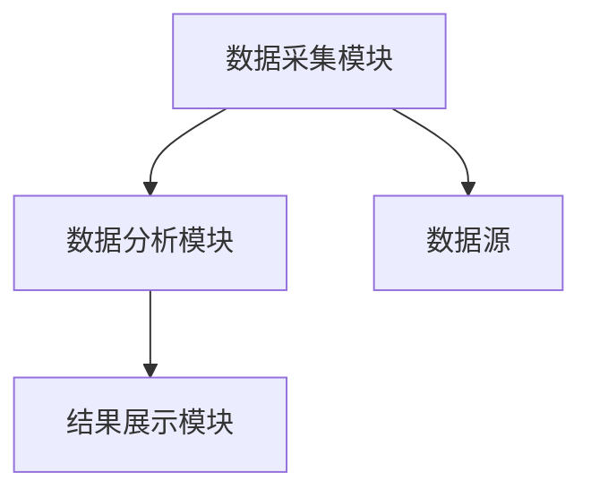
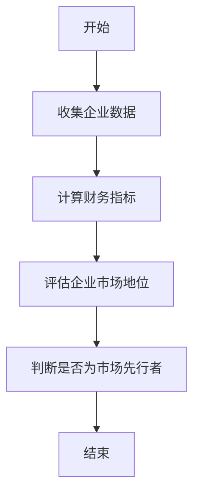

                 


# 彼得林奇的"市场先行者"识别方法

> 关键词：彼得林奇，投资分析，市场先行者，股票分析，财务指标，企业评估

> 摘要：本文详细探讨了彼得·林奇提出的“市场先行者”识别方法，通过系统化的分析和案例研究，揭示了如何通过行业分析、企业评估和财务指标等多维度方法，识别出具有长期竞争优势的市场领先企业。文章从背景介绍、核心概念、算法原理、系统设计到项目实战，全面解析了这一方法的应用和实践。

---

## 第1章：投资分析的基础知识

### 1.1 投资分析的基本概念

#### 1.1.1 投资的基本定义
投资是将资金投入到能够产生收益的资产或项目中，目的是实现财富增值。投资分析则是通过对市场、行业和企业的深入研究，评估投资标的的价值和风险，从而做出科学的投资决策。

#### 1.1.2 投资分析的分类
投资分析主要分为基本面分析和技术分析两大类。基本面分析关注企业的财务状况、行业地位和市场环境等内在因素；技术分析则通过价格走势、成交量等市场数据预测未来的价格变化。

#### 1.1.3 投资分析的重要性
投资分析是投资者在做出投资决策前必不可少的步骤。它帮助投资者识别投资机会、评估风险，并制定合理的投资策略。

---

### 1.2 彼得·林奇的投资理念

#### 1.2.1 彼得·林奇的生平简介
彼得·林奇（Peter Lynch）是美国著名的投资经理人，被誉为“最伟大的股票基金经理”。他在富达投资管理公司管理麦哲伦基金期间，创造了年均29%的收益率，为投资者带来了巨大收益。

#### 1.2.2 林奇的投资哲学
林奇强调长期投资和价值发现。他认为，投资成功的秘诀在于找到那些具有强大竞争优势、良好管理团队和巨大增长潜力的企业，并长期持有。

#### 1.2.3 林奇的市场观点
林奇认为，市场的短期波动不可预测，但长期趋势可以通过对企业基本面的深入研究来把握。他反对短期交易，提倡长期持有的投资策略。

---

## 第2章：市场先行者的定义与特征

### 2.1 市场先行者的定义

#### 2.1.1 市场先行者的概念
市场先行者是指在某个行业或市场中占据领先地位的企业。这些企业通常具有强大的品牌影响力、较高的市场份额和持续的创新能力。

#### 2.1.2 市场先行者的类型
市场先行者可以分为行业领导者和新兴领导者两类。行业领导者是指在现有市场中占据主导地位的企业，而新兴领导者则是指在新兴市场中快速崛起的企业。

#### 2.1.3 市场先行者的优劣势
市场先行者的优势在于其强大的市场地位和品牌影响力，劣势则是可能面临的激烈竞争和较高的运营成本。

---

### 2.2 市场先行者的识别标准

#### 2.2.1 行业地位分析
行业地位分析是识别市场先行者的重要依据。企业是否是行业领导者，是否在行业中占据主导地位，是判断其是否为市场先行者的重要指标。

#### 2.2.2 市场份额分析
市场份额是衡量企业市场地位的重要指标。市场先行者通常具有较高的市场份额，并且能够通过持续创新和优质服务巩固其市场地位。

#### 2.2.3 创新能力评估
创新能力是市场先行者的另一重要特征。这些企业通常具有强大的研发能力，能够不断推出新产品，满足市场需求。

#### 2.2.4 财务状况分析
企业的财务状况是判断其是否为市场先行者的重要依据。健康的财务状况、稳定的盈利能力以及良好的现金流，是市场先行者的重要特征。

---

## 第3章：市场先行者的定性分析

### 3.1 行业分析方法

#### 3.1.1 行业生命周期分析
行业生命周期分析是了解市场先行者的重要方法。企业需要判断所在行业所处的生命周期阶段，从而制定相应的投资策略。

#### 3.1.2 行业竞争结构分析
行业竞争结构分析包括对行业内主要竞争对手的分析，以及对行业进入壁垒的评估。这有助于投资者判断企业的竞争优势。

#### 3.1.3 行业趋势预测
行业趋势预测是识别市场先行者的另一个重要方法。通过预测行业未来的发展趋势，投资者可以更好地判断企业的市场地位。

---

### 3.2 企业分析方法

#### 3.2.1 企业战略分析
企业战略分析包括对企业的发展战略、市场定位以及未来发展方向的评估。这有助于投资者判断企业是否具备长期竞争优势。

#### 3.2.2 企业管理层分析
企业管理层的素质和能力是影响企业未来发展的重要因素。投资者需要评估企业管理层的决策能力和管理风格。

#### 3.2.3 企业核心竞争力分析
企业核心竞争力分析包括对企业技术优势、资源优势和品牌优势的评估。这些因素是企业在市场竞争中保持领先地位的关键。

---

## 第4章：市场先行者的定量分析

### 4.1 财务指标分析

#### 4.1.1 主要财务指标
主要财务指标包括收入增长率、净利润率、毛利率、资产负债率等。这些指标是评估企业财务状况和盈利能力的重要依据。

#### 4.1.2 财务指标的计算公式
- 收入增长率 = （本年收入 - 上年收入）/ 上年收入 × 100%
- 净利润率 = 净利润 / 收入 × 100%
- 毛利率 = 毛利 / 收入 × 100%
- 资产负债率 = 负债总额 / 资产总额 × 100%

#### 4.1.3 财务指标的解读
投资者需要根据财务指标的变化趋势，判断企业的财务健康状况和盈利能力。例如，持续增长的收入和稳定的利润率表明企业具有良好的财务状况。

---

## 第5章：市场先行者的识别方法

### 5.1 识别方法概述

#### 5.1.1 综合评估法
综合评估法是通过对企业多个维度的评估，得出企业是否为市场先行者的结论。这包括对企业市场地位、财务状况、创新能力和管理能力的综合评估。

#### 5.1.2 对比分析法
对比分析法是将目标企业与行业内的其他企业进行对比，找出其在市场中的相对位置。这有助于投资者更好地判断企业的市场地位。

---

## 第6章：系统设计与实现

### 6.1 系统架构设计

#### 6.1.1 系统功能模块
市场先行者识别系统主要包括数据采集模块、数据分析模块和结果展示模块。数据采集模块负责收集企业的财务数据和市场信息；数据分析模块负责对数据进行处理和分析；结果展示模块则将分析结果以可视化的方式呈现。

#### 6.1.2 系统架构图


---

### 6.2 算法实现

#### 6.2.1 算法流程图


#### 6.2.2 Python实现代码
```python
def is_market_leader(company_data):
    # 计算收入增长率
    revenue_growth = (company_data['revenue'] - company_data['revenue_prev']) / company_data['revenue_prev'] * 100
    # 计算利润率
    profit_margin = company_data['net_profit'] / company_data['revenue'] * 100
    # 评估市场地位
    if revenue_growth > 20 and profit_margin > industry_avg_margin:
        return True
    else:
        return False
```

---

## 第7章：项目实战

### 7.1 案例分析

#### 7.1.1 苹果公司分析
以苹果公司为例，分析其是否符合市场先行者的标准。苹果公司在科技行业具有强大的品牌影响力和市场地位，收入和利润持续增长，符合市场先行者的特征。

#### 7.1.2 具体分析步骤
1. 收集苹果公司的财务数据和市场信息。
2. 计算苹果公司的收入增长率和利润率。
3. 对比行业平均水平，评估其市场地位。

---

## 第8章：总结与建议

### 8.1 总结
通过本文的分析，我们可以看出，彼得·林奇的市场先行者识别方法是一种系统化的投资分析方法。它结合了定性分析和定量分析，能够帮助投资者识别出具有长期竞争优势的市场领先企业。

### 8.2 投资建议
投资者在实际操作中，应该结合市场实际情况，灵活运用市场先行者识别方法。同时，要注意分散投资风险，避免过度集中投资于单一行业或企业。

### 8.3 注意事项
在实际应用中，投资者需要不断更新自己的知识和技能，关注市场的变化，及时调整自己的投资策略。

### 8.4 拓展阅读
建议投资者进一步阅读彼得·林奇的著作《彼得·林奇的投资哲学》和《战胜市场的人》，深入了解其投资理念和方法。

---

## 作者信息

作者：AI天才研究院/AI Genius Institute & 禅与计算机程序设计艺术 /Zen And The Art of Computer Programming

---

通过本文的详细分析和案例研究，我们可以更好地理解彼得·林奇的市场先行者识别方法，并将其应用到实际投资中，帮助投资者做出更加科学的投资决策。

