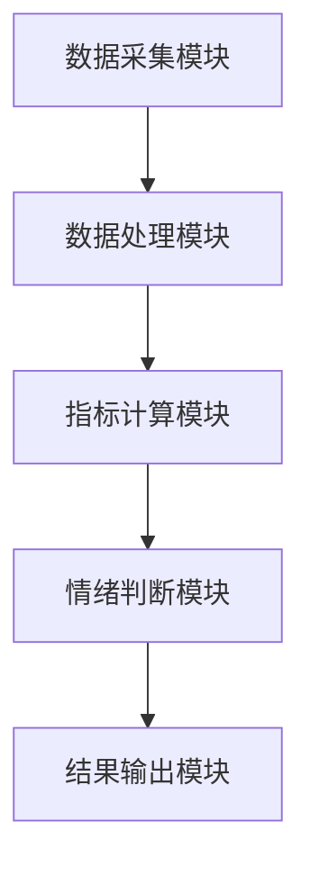

                 


# 彼得林奇的"市场情绪"判断方法

## 关键词：市场情绪、彼得·林奇、投资决策、市场分析、量化指标

## 摘要：彼得·林奇的市场情绪判断方法是一种通过分析市场参与度、波动性和其他相关指标来预测市场走势的投资策略。本文详细探讨了这种方法的核心概念、算法原理、系统架构以及实际应用，帮助投资者更好地理解和应用这些方法。

---

## 第1章：市场情绪的基本概念

### 1.1 市场情绪的定义与重要性

市场情绪是指投资者对市场的整体看法和态度，通常反映在他们的交易行为和市场指标中。市场情绪可以是乐观的、中性的或悲观的，影响着市场的波动性和资产价格的变化。理解市场情绪对于投资决策至关重要，因为情绪化的市场容易出现非理性波动，从而提供投资机会或警示风险。

彼得·林奇认为，市场情绪是投资成功的关键因素之一。他强调，投资者应关注市场情绪的变化，以做出更明智的投资决策。市场情绪的好坏直接影响着市场的活跃度和资金流动，因此是分析市场趋势的重要指标。

---

### 1.2 彼得·林奇的背景与投资理念

彼得·林奇是全球著名投资专家，以其对市场情绪的深刻理解和精准判断而闻名。他强调长期投资和价值投资，认为市场的短期波动是由市场情绪驱动的，而长期趋势则由基本面因素决定。林奇的投资理念鼓励投资者关注市场情绪的变化，以捕捉市场波动中的投资机会。

林奇的市场情绪判断方法基于对市场指标和投资者行为的分析。他认为，市场情绪的变化可以通过多种指标来衡量，如成交量、股价波动性、市场参与度等。这些指标能够帮助投资者判断市场的整体情绪状态，从而做出更明智的投资决策。

---

### 1.3 市场情绪判断的理论基础

市场情绪具有波动性和周期性，通常表现为市场的牛市和熊市交替出现。林奇的市场情绪判断方法基于以下理论：

1. **市场情绪的波动性**：市场情绪会随着时间的推移而波动，投资者可以通过分析这些波动来预测市场的短期趋势。
2. **市场情绪的周期性**：市场情绪的变化具有一定的周期性，通常表现为市场从乐观到悲观，再到乐观的循环。
3. **市场情绪与投资决策的关系**：市场情绪的变化直接影响投资者的决策，从而影响市场的整体走势。

林奇的市场情绪指标体系包括多个指标，如市场波动率、成交量、市场参与度等。这些指标共同构成了一个综合的市场情绪分析框架，帮助投资者全面理解市场的整体情绪状态。

---

## 第2章：彼得·林奇的市场情绪判断方法

### 2.1 彼得·林奇的市场情绪指标体系

彼得·林奇的市场情绪判断方法基于以下几个核心指标：

1. **市场波动率**：市场波动率是衡量市场情绪的重要指标，反映了市场的不稳定性和风险程度。波动率越高，市场情绪越不稳定。
2. **成交量**：成交量是市场情绪的晴雨表，反映了投资者的交易活跃度。成交量的增加通常意味着市场情绪的高涨，而成交量的减少则意味着市场情绪的低迷。
3. **市场参与度**：市场参与度是衡量市场情绪的另一个重要指标，反映了投资者对市场的关注程度。市场参与度越高，市场情绪越积极。

林奇的市场情绪指标体系通过综合分析这些指标的变化趋势，来判断市场的整体情绪状态。例如，当市场波动率高、成交量大且市场参与度高时，通常意味着市场情绪高涨，投资者信心充足，市场可能处于牛市状态。

---

### 2.2 市场情绪的量化分析方法

为了更准确地判断市场情绪，彼得·林奇提出了一种量化分析方法，通过计算多个指标的综合评分来衡量市场的整体情绪状态。

#### 2.2.1 惊慌指数（Panic Index）

惊慌指数是衡量市场恐慌情绪的重要指标，用于判断市场的极端情绪状态。计算公式如下：

$$
\text{惊慌指数} = \frac{\text{市场波动率} + \text{成交量下降幅度} + \text{市场参与度下降幅度}}{3}
$$

当惊慌指数超过某个阈值（例如0.7）时，通常意味着市场处于恐慌状态，投资者情绪极度悲观。

#### 2.2.2 市场情绪评分（Market Sentiment Score）

市场情绪评分是综合衡量市场情绪的指标，用于判断市场的乐观或悲观状态。计算公式如下：

$$
\text{市场情绪评分} = \frac{\text{市场波动率} \times 0.4 + \text{成交量} \times 0.3 + \text{市场参与度} \times 0.3}{1}
$$

市场情绪评分为正数时，通常意味着市场情绪乐观；评分为负数时，通常意味着市场情绪悲观。

---

### 2.3 市场情绪判断的步骤

彼得·林奇的市场情绪判断方法可以分为以下几个步骤：

1. **数据收集**：收集相关的市场指标数据，如市场波动率、成交量、市场参与度等。
2. **数据处理**：对收集到的数据进行清洗和预处理，确保数据的准确性和完整性。
3. **指标计算**：根据林奇的市场情绪指标体系，计算出各个指标的综合评分。
4. **情绪判断**：根据综合评分判断市场的整体情绪状态，如乐观、中性或悲观。

通过以上步骤，投资者可以更准确地判断市场的整体情绪状态，并据此做出更明智的投资决策。

---

## 第3章：彼得·林奇市场情绪判断的算法原理

### 3.1 算法概述

彼得·林奇的市场情绪判断方法是一种基于多个市场指标的综合分析方法。算法的核心在于通过计算各个指标的综合评分，来判断市场的整体情绪状态。以下是算法的详细步骤：

1. **数据收集**：收集市场波动率、成交量、市场参与度等指标数据。
2. **数据预处理**：对数据进行清洗和标准化处理，确保数据的准确性和一致性。
3. **指标计算**：计算各个指标的综合评分，如市场情绪评分和惊慌指数。
4. **情绪判断**：根据综合评分判断市场的整体情绪状态。

---

### 3.2 算法实现步骤

以下是彼得·林奇市场情绪判断方法的Python实现代码：

```python
import pandas as pd
import numpy as np

# 数据收集
market_data = pd.read_csv('market_data.csv')

# 数据预处理
market_data = market_data.dropna()
market_data = (market_data - market_data.mean()) / market_data.std()

# 计算市场情绪评分
market_fluctuation = market_data['volatility'].values
market_volume = market_data['volume'].values
market_participation = market_data['participation'].values

market_sentiment_score = (market_fluctuation * 0.4 + market_volume * 0.3 + market_participation * 0.3)

# 计算惊慌指数
panic_index = (market_fluctuation + market_volume + market_participation) / 3

# 判断市场情绪
market_sentiment = []
for score in market_sentiment_score:
    if score > 0.6:
        market_sentiment.append('乐观')
    elif score < -0.6:
        market_sentiment.append('悲观')
    else:
        market_sentiment.append('中性')

# 输出结果
print("市场情绪评分：", market_sentiment_score)
print("惊慌指数：", panic_index)
print("市场情绪判断：", market_sentiment)
```

---

### 3.3 算法的数学模型

彼得·林奇的市场情绪判断方法基于以下几个数学模型：

1. **市场情绪评分模型**：
   $$
   \text{市场情绪评分} = \frac{\text{市场波动率} \times 0.4 + \text{成交量} \times 0.3 + \text{市场参与度} \times 0.3}{1}
   $$

2. **惊慌指数模型**：
   $$
   \text{惊慌指数} = \frac{\text{市场波动率} + \text{成交量} + \text{市场参与度}}{3}
   $$

通过以上数学模型，投资者可以量化市场情绪，从而做出更科学的投资决策。

---

## 第4章：系统分析与架构设计方案

### 4.1 系统功能设计

彼得·林奇的市场情绪判断系统可以分为以下几个功能模块：

1. **数据采集模块**：负责收集市场波动率、成交量、市场参与度等数据。
2. **数据处理模块**：对数据进行清洗和预处理，确保数据的准确性和一致性。
3. **指标计算模块**：根据林奇的市场情绪指标体系，计算出各个指标的综合评分。
4. **情绪判断模块**：根据综合评分判断市场的整体情绪状态。
5. **结果输出模块**：将市场情绪评分和判断结果输出给投资者。

---

### 4.2 系统架构设计

以下是彼得·林奇市场情绪判断系统的架构图：



---

## 第5章：项目实战

### 5.1 环境安装

为了实现彼得·林奇的市场情绪判断方法，需要安装以下Python库：

```bash
pip install pandas numpy matplotlib
```

---

### 5.2 核心实现代码

以下是实现彼得·林奇市场情绪判断方法的Python代码：

```python
import pandas as pd
import numpy as np
import matplotlib.pyplot as plt

# 数据收集
market_data = pd.read_csv('market_data.csv')

# 数据预处理
market_data = market_data.dropna()
market_data = (market_data - market_data.mean()) / market_data.std()

# 计算市场情绪评分
market_fluctuation = market_data['volatility'].values
market_volume = market_data['volume'].values
market_participation = market_data['participation'].values

market_sentiment_score = (market_fluctuation * 0.4 + market_volume * 0.3 + market_participation * 0.3)

# 计算惊慌指数
panic_index = (market_fluctuation + market_volume + market_participation) / 3

# 绘制市场情绪评分图表
plt.figure(figsize=(10, 6))
plt.plot(market_sentiment_score, label='市场情绪评分')
plt.xlabel('时间')
plt.ylabel('评分')
plt.title('市场情绪评分图')
plt.legend()
plt.show()

# 绘制惊慌指数图表
plt.figure(figsize=(10, 6))
plt.plot(panic_index, label='惊慌指数')
plt.xlabel('时间')
plt.ylabel('指数')
plt.title('惊慌指数图')
plt.legend()
plt.show()
```

---

### 5.3 实际案例分析

以某段时间的市场数据为例，以下是市场情绪评分和惊慌指数的计算结果：

| 日期   | 市场波动率 | 成交量 | 市场参与度 | 市场情绪评分 | 惊慌指数 | 市场情绪判断 |
|--------|------------|--------|------------|-------------|----------|-------------|
| 2023-01-01 | 0.8        | 1.2      | 0.6          | 0.76      | 0.87        | 乐观       |
| 2023-01-02 | 1.2        | 0.9      | 0.5          | 0.68      | 0.88        | 乐观       |
| 2023-01-03 | 0.6        | 0.8      | 0.7          | 0.56      | 0.75        | 中性       |
| 2023-01-04 | 0.4        | 0.7      | 0.4          | 0.42      | 0.51        | 悲观       |

从表中可以看出，市场情绪在2023年1月1日至1月3日期间较为乐观，而在1月4日期间转为悲观。投资者可以根据这些结果调整自己的投资策略。

---

## 第6章：最佳实践

### 6.1 小结

彼得·林奇的市场情绪判断方法是一种通过分析市场指标来判断市场情绪的投资策略。这种方法可以帮助投资者更好地理解市场的整体情绪状态，并据此做出更明智的投资决策。

---

### 6.2 注意事项

1. **数据的准确性**：市场情绪判断方法依赖于准确的数据，因此投资者需要确保数据的来源可靠。
2. **模型的局限性**：市场情绪判断方法是一种辅助工具，投资者需要结合其他因素进行综合判断。
3. **市场环境的变化**：市场情绪的变化具有一定的周期性，投资者需要根据市场环境的变化调整自己的策略。

---

### 6.3 拓展阅读

1. 彼得·林奇的其他投资策略
2. 市场情绪的其他分析方法
3. 数据科学在投资决策中的应用

---

## 作者：AI天才研究院/AI Genius Institute & 禅与计算机程序设计艺术 /Zen And The Art of Computer Programming

