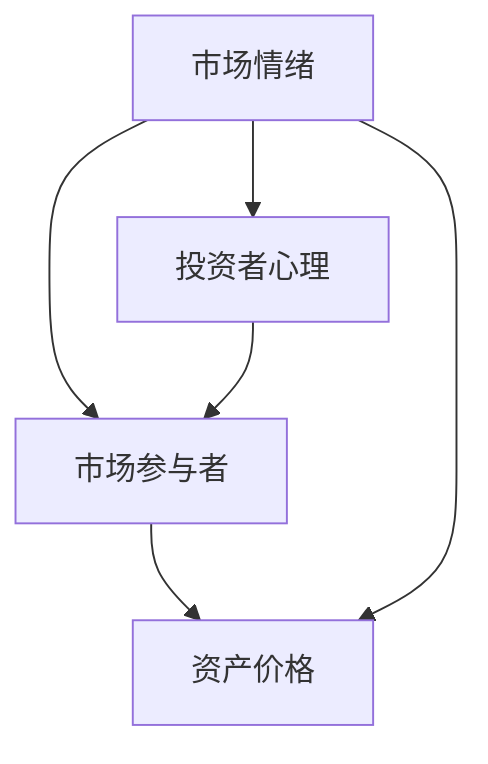
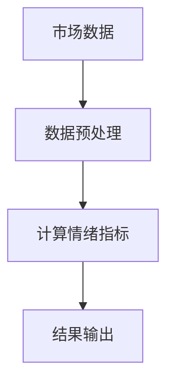
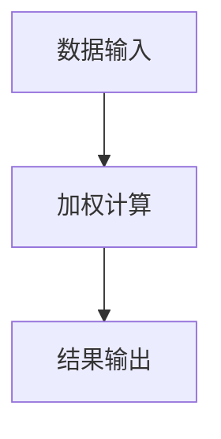
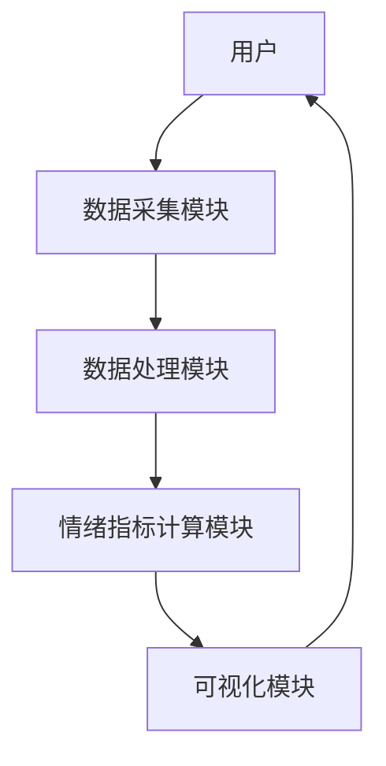

                 


---

# 彼得林奇的"市场情绪"在不同资产类别中的表现

> 关键词：市场情绪，彼得林奇，资产类别，投资者心理，情绪指标，市场波动

> 摘要：本文深入探讨了彼得林奇的"市场情绪"理论在不同资产类别中的表现，分析了市场情绪的核心概念、投资者心理与市场波动的关系，以及市场情绪指标在股票、债券、基金等资产类别中的具体应用。通过结合理论与实际案例，本文揭示了市场情绪在资产定价和投资决策中的重要作用，并提出了基于市场情绪的资产配置策略。

---

## 第一部分: 彼得林奇的"市场情绪"理论基础

### 第1章: 市场情绪的定义与核心概念

#### 1.1 市场情绪的定义
- **1.1.1 投资者心理与市场情绪的关系**
  - 投资者心理是市场情绪的源泉，市场情绪是投资者心理的外在表现。
  - 市场情绪通过投资者的买卖行为影响市场价格和波动。

- **1.1.2 市场情绪的核心特征**
  - 市场情绪具有周期性、波动性和传染性。
  - 市场情绪可以被量化和度量。

- **1.1.3 市场情绪的边界与外延**
  - 市场情绪不等同于市场行为，但可以预测市场行为。
  - 市场情绪是投资者心理的集合，而非个体心理的简单叠加。

#### 1.2 彼得林奇的市场情绪理论
- **1.2.1 彼得林奇的市场情绪理论概述**
  - 彼得林奇认为，市场情绪是市场波动的核心驱动因素。
  - 市场情绪的变化可以解释资产价格的短期波动。

- **1.2.2 市场情绪与资产价格波动的关系**
  - 市场情绪通过影响投资者的买卖决策间接影响资产价格。
  - 市场情绪的过度波动会导致资产价格的过度偏离其内在价值。

- **1.2.3 市场情绪的周期性特征**
  - 市场情绪具有周期性，从乐观到悲观再到乐观，不断循环。
  - 市场情绪的周期性与经济周期密切相关。

### 第2章: 不同资产类别中的市场情绪表现

#### 2.1 股票市场中的市场情绪
- **2.1.1 股票市场的投资者情绪分析**
  - 股票市场的投资者情绪受市场环境和公司基本面的影响较大。
  - 市场情绪通过投资者的买卖行为影响股票价格。

- **2.1.2 市场情绪对股价波动的影响**
  - 市场情绪过度乐观时，股价可能被高估。
  - 市场情绪过度悲观时，股价可能被低估。

- **2.1.3 股票市场中的情绪指标**
  - 常见的情绪指标包括恐慌指数（VIX）、投资者信心指数等。
  - 情绪指标可以通过市场数据和投资者行为数据进行量化。

#### 2.2 债券市场中的市场情绪
- **2.2.1 债券市场的投资者情绪分析**
  - 债券市场的投资者情绪受利率政策和经济环境的影响较大。
  - 债券市场的投资者情绪较为稳定，波动性低于股票市场。

- **2.2.2 市场情绪对债券价格的影响**
  - 市场情绪过度乐观时，债券价格可能被高估。
  - 市场情绪过度悲观时，债券价格可能被低估。

- **2.2.3 债券市场中的情绪指标**
  - 债券市场的情绪指标可以通过债券收益率和市场参与度进行量化。

#### 2.3 其他资产类别中的市场情绪
- **2.3.1 基金市场中的市场情绪**
  - 基金市场的投资者情绪受市场环境和基金业绩的影响较大。
  - 市场情绪通过投资者的申购和赎回行为影响基金净值。

- **2.3.2 黄金市场中的市场情绪**
  - 黄金市场的投资者情绪受通货膨胀预期和避险情绪的影响较大。
  - 市场情绪通过投资者的买卖行为影响黄金价格。

- **2.3.3 其他金融衍生品中的市场情绪**
  - 金融衍生品的市场情绪受市场波动性和风险偏好影响较大。
  - 市场情绪通过投资者的交易行为影响衍生品价格。

---

## 第二部分: 市场情绪的核心概念与联系

### 第3章: 市场情绪的核心原理

#### 3.1 投资者心理与市场情绪的关联
- **3.1.1 投资者心理的构成要素**
  - 投资者心理包括风险偏好、风险认知、投资目标等。
  - 投资者心理是市场情绪的源泉。

- **3.1.2 市场情绪的形成机制**
  - 市场情绪的形成受到市场环境、投资者心理和市场信息的共同影响。
  - 市场情绪的形成是一个复杂的过程，涉及个体和群体行为。

- **3.1.3 市场情绪的传播与放大效应**
  - 市场情绪通过投资者的社交网络和市场信息传播。
  - 市场情绪的传播可能导致市场的过度波动。

#### 3.2 市场情绪指标的属性特征对比
- **3.2.1 不同情绪指标的特征对比表**

| 情绪指标 | 定义 | 计算方式 | 适用场景 | 优缺点 |
|----------|------|----------|----------|--------|
| 恐慌指数（VIX） | 衡量市场波动性的指标 | 基于期权价格计算 | 股票市场 | 反应市场短期波动，但不能预测长期趋势 |
| 投资者信心指数 | 衡量投资者对市场的信心 | 基于投资者调查数据 | 各类资产市场 | 数据滞后，且受样本限制 |

- **3.2.2 情绪指标的适用场景分析**
  - 恐慌指数适用于短期市场波动的分析。
  - 投资者信心指数适用于长期市场趋势的分析。

- **3.2.3 情绪指标的有效性评估**
  - 情绪指标的有效性取决于市场环境和投资者行为。
  - 情绪指标的准确性需要结合其他市场数据进行验证。

#### 3.3 市场情绪的ER实体关系图
- **3.3.1 实体关系图的构建**



- **3.3.2 实体关系图的分析与解释**
  - 市场情绪与投资者心理密切相关。
  - 市场情绪通过市场参与者影响资产价格。
  - 市场情绪与资产价格相互作用，形成市场波动。

---

## 第三部分: 市场情绪的算法原理与数学模型

### 第4章: 市场情绪的算法原理

#### 4.1 市场情绪指标的计算方法
- **4.1.1 情绪指标的计算公式**

$$ \text{情绪指数} = \frac{\text{市场成交量}}{\text{市场成交额}} $$

- **4.1.2 情绪指标的计算流程图（Mermaid）**



#### 4.2 市场情绪与资产价格的关系模型
- **4.2.1 数学模型的建立**

$$ P_t = \alpha + \beta \times M_t + \epsilon_t $$

其中，$P_t$ 是资产价格，$M_t$ 是市场情绪指数，$\epsilon_t$ 是误差项。

- **4.2.2 数学模型的验证与优化**
  - 使用历史数据验证模型的准确性。
  - 通过回归分析优化模型的参数。

### 第5章: 市场情绪的数学模型与公式

#### 5.1 市场情绪指标的数学表达
- **5.1.1 情绪指数的数学公式**

$$ \text{情绪指数} = \sum_{i=1}^{n} w_i \times x_i $$

其中，$w_i$ 是权重，$x_i$ 是情绪指标的组成部分。

- **5.1.2 情绪指数的计算公式（Mermaid流程图）**



---

## 第四部分: 系统分析与架构设计方案

### 第6章: 市场情绪监测系统的构建

#### 6.1 系统功能设计
- **6.1.1 功能需求分析**
  - 数据采集与处理
  - 情绪指标计算
  - 市场情绪可视化

#### 6.2 系统架构设计
- **6.2.1 系统架构图（Mermaid）**



#### 6.3 系统接口设计
- **6.3.1 API接口定义**
  - 数据采集接口：`GET /data`
  - 情绪指标接口：`GET /mood_index`
  - 可视化接口：`GET /visualization`

#### 6.4 系统交互流程设计
- **6.4.1 交互流程图（Mermaid）**


---

## 第五部分: 项目实战

### 第7章: 基于市场情绪的资产配置策略

#### 7.1 环境配置
- **7.1.1 系统环境**
  - 操作系统：Linux
  - 开发工具：Python、Jupyter Notebook
  - 数据源：金融数据API

#### 7.2 系统核心实现源代码
- **7.2.1 情绪指标计算代码**

```python
import pandas as pd

def calculate_mood_index(data):
    # 数据预处理
    data = data.dropna()
    data = data.astype(float)
    
    # 计算情绪指数
    mood_index = data.mean(axis=1)
    
    return mood_index
```

- **7.2.2 情绪指标可视化代码**

```python
import matplotlib.pyplot as plt

def visualize_mood_index(mood_index):
    plt.figure(figsize=(10, 6))
    plt.plot(mood_index, label='Mood Index')
    plt.xlabel('Time')
    plt.ylabel('Mood Index')
    plt.legend()
    plt.show()
```

#### 7.3 代码应用解读与分析
- **7.3.1 代码功能分析**
  - 情绪指标计算代码：基于市场数据计算情绪指数。
  - 情绪指标可视化代码：将情绪指数可视化为时间序列图。

- **7.3.2 代码优化建议**
  - 使用更高效的数据处理方法，如Dask或F pandas。
  - 增加情绪指标的实时更新功能。

#### 7.4 实际案例分析
- **7.4.1 股票市场案例分析**
  - 选取某段时间的股票数据，计算情绪指数，分析其与股价的关系。

- **7.4.2 债券市场案例分析**
  - 选取某段时间的债券数据，计算情绪指数，分析其与债券收益率的关系。

#### 7.5 项目小结
- 通过实际案例分析，验证市场情绪在不同资产类别中的表现。
- 总结基于市场情绪的资产配置策略的有效性。

---

## 第六部分: 最佳实践与小结

### 第8章: 小结与注意事项

#### 8.1 小结
- 本文深入分析了彼得林奇的市场情绪理论在不同资产类别中的表现。
- 市场情绪是影响资产价格波动的重要因素。
- 基于市场情绪的资产配置策略可以帮助投资者优化投资决策。

#### 8.2 注意事项
- 市场情绪指标的准确性依赖于数据质量和模型的合理性。
- 市场情绪分析应结合其他市场数据进行综合判断。
- 投资者应理性看待市场情绪，避免盲目跟风。

#### 8.3 拓展阅读
- 推荐阅读彼得林奇的《投资最重要的事情》。
- 推荐阅读关于市场情绪的经典文献，如《The Psychology of Investing》。

---

## 作者：AI天才研究院/AI Genius Institute & 禅与计算机程序设计艺术 /Zen And The Art of Computer Programming

--- 

这篇文章详细分析了彼得林奇的市场情绪理论在不同资产类别中的表现，通过理论与实践相结合的方式，揭示了市场情绪在资产定价和投资决策中的重要作用。

