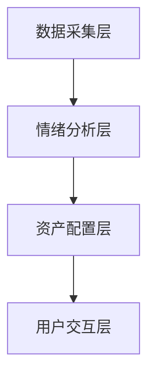
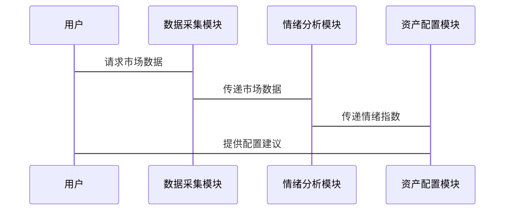

                 


# 彼得林奇的"市场情绪"在资产配置中的运用

> 关键词：资产配置，市场情绪，彼得·林奇，投资策略，量化分析

> 摘要：本文深入探讨了彼得·林奇的市场情绪理论在资产配置中的应用，结合定量分析方法，提出了一种基于市场情绪的资产配置策略。文章从市场情绪的定义、构成、量化方法、系统设计到实际案例分析，全面阐述了如何将市场情绪因素纳入资产配置决策中，以实现更优的风险管理和收益优化。

---

# 第一部分: 市场情绪与资产配置概述

## 第1章: 市场情绪的基本概念

### 1.1 市场情绪的定义与构成

市场情绪是指投资者在市场中的整体心理状态，通常表现为乐观或悲观。它由投资者的心理预期、行为模式和市场参与度共同构成。市场情绪可以通过多种指标量化，如投资者信心指数、市场波动率等。

### 1.2 彼得·林奇的市场情绪理论

彼得·林奇认为，市场情绪是影响资产价格波动的重要因素。他强调，投资者的心理预期会通过交易行为影响市场价格，从而形成市场周期性波动。林奇的市场情绪理论包括以下几个核心观点：

1. **市场情绪的周期性**：市场情绪会经历从乐观到悲观再到乐观的周期性变化。
2. **情绪与市场参与度的关系**：当市场情绪乐观时，投资者倾向于增加投资，市场参与度上升；反之，市场情绪悲观时，投资者倾向于撤资。
3. **情绪对资产价格的影响**：市场情绪通过影响投资者行为间接影响资产价格，从而影响资产配置决策。

### 1.3 市场情绪在资产配置中的重要性

市场情绪是资产配置中的重要因素，因为它可以帮助投资者更好地预测市场波动，优化资产组合的风险收益比。通过分析市场情绪的变化，投资者可以调整资产配置策略，避免在市场情绪过于乐观时过度投资，或在市场情绪过于悲观时错失投资机会。

---

# 第二部分: 市场情绪的量化与分析

## 第2章: 市场情绪的构成与影响

### 2.1 市场情绪的构成要素

市场情绪由以下几个核心要素构成：

1. **投资者心理**：投资者的心理预期，包括对市场的信心和对未来的看法。
2. **市场参与度**：市场参与者的行为模式，如交易量、买卖双方的比例等。
3. **市场波动性**：市场波动率是市场情绪的重要指标，高波动率通常意味着市场情绪的剧烈波动。

### 2.2 市场情绪的影响因素

市场情绪受多种因素影响，包括宏观经济环境、市场新闻、政策变化等。例如，经济数据的好坏、政策调整、突发事件等都可能引发市场情绪的变化。

### 2.3 市场情绪的周期性分析

市场情绪具有明显的周期性特征，通常经历以下几个阶段：

1. **乐观阶段**：投资者情绪高涨，资产价格上涨。
2. **怀疑阶段**：投资者开始质疑市场的合理性，部分资金退出。
3. **悲观阶段**：投资者情绪低落，资产价格下跌。
4. **恐慌阶段**：投资者大量抛售资产，市场出现剧烈波动。
5. **底部阶段**：市场情绪触底，投资者开始逐步恢复信心。

---

# 第三部分: 市场情绪与资产配置策略

## 第3章: 资产配置的基本原理

### 3.1 资产配置的定义与目标

资产配置是指将资金分配到不同的资产类别（如股票、债券、现金等）中，以实现投资目标的过程。资产配置的目标是通过分散投资降低风险，同时追求最大化的收益。

### 3.2 资产配置的核心要素

资产配置的核心要素包括：

1. **投资目标**：投资者的风险承受能力和收益预期。
2. **资产类别**：不同资产类别的风险和收益特征。
3. **市场环境**：宏观经济环境和市场情绪对资产价格的影响。

### 3.3 资产配置的常见策略

常见的资产配置策略包括：

1. **固定权重法**：定期调整资产组合，使各资产权重保持不变。
2. **动态调整法**：根据市场情绪变化，实时调整资产配置比例。
3. **风险管理法**：通过调整资产组合的风险暴露来应对市场波动。

---

## 第4章: 基于市场情绪的资产配置策略

### 4.1 市场情绪与资产配置的关系

市场情绪通过影响投资者行为和资产价格，间接影响资产配置决策。当市场情绪乐观时，投资者倾向于增加高风险资产的配置比例；当市场情绪悲观时，则倾向于增加低风险资产的配置比例。

### 4.2 基于市场情绪的量化配置模型

#### 4.2.1 情绪指标的设计

市场情绪指标的设计需要结合实际数据，常见的指标包括：

1. **投资者信心指数**：反映投资者对市场的信心程度。
2. **市场波动率**：反映市场的波动程度。
3. **市场交易量**：反映市场的活跃程度。

#### 4.2.2 数据来源与处理

数据来源包括历史市场数据、投资者情绪调查数据等。数据处理需要对原始数据进行清洗、标准化和特征提取。

#### 4.2.3 情绪指标的计算

通过将多个情绪指标进行加权平均，得到一个综合的情绪指数。例如：

$$
\text{综合情绪指数} = \alpha \cdot \text{波动率} + \beta \cdot \text{交易量} + \gamma \cdot \text{投资者信心}
$$

其中，$\alpha$、$\beta$、$\gamma$为权重系数。

### 4.3 情绪驱动的资产配置模型

#### 4.3.1 模型设计

根据市场情绪指数的变化，动态调整资产组合的配置比例。例如：

- 当市场情绪指数高于阈值时，增加高风险资产的配置比例。
- 当市场情绪指数低于阈值时，增加低风险资产的配置比例。

#### 4.3.2 模型实现

以下是基于Python的情绪驱动的资产配置模型示例代码：

```python
import pandas as pd
import numpy as np

# 假设 market_sentiment 是一个包含市场情绪指数的序列
market_sentiment = pd.Series([...])

# 设置阈值
threshold = 0.5

# 动态调整资产配置比例
def adjust_asset_allocation(sentiment):
    if sentiment > threshold:
        return {'股票': 0.7, '债券': 0.2, '现金': 0.1}
    else:
        return {'股票': 0.2, '债券': 0.6, '现金': 0.2}

# 应用模型
config = adjust_asset_allocation(market_sentiment.iloc[-1])
```

---

# 第四部分: 系统设计与实现

## 第5章: 系统架构与功能设计

### 5.1 系统架构设计

系统架构采用分层设计，包括数据采集层、情绪分析层、资产配置层和用户交互层。



### 5.2 功能模块设计

系统功能模块包括：

1. **数据采集模块**：采集市场数据和投资者情绪数据。
2. **情绪分析模块**：计算市场情绪指数。
3. **资产配置模块**：根据市场情绪指数调整资产配置比例。
4. **用户交互模块**：提供用户界面，展示配置结果和操作界面。

### 5.3 系统接口设计

系统接口设计包括：

1. 数据接口：与数据源对接，获取市场数据和情绪数据。
2. 计算接口：调用情绪分析和资产配置算法。
3. 用户接口：提供可视化界面，展示配置结果和操作选项。

### 5.4 系统交互设计

以下是系统交互流程图：



---

# 第五部分: 项目实战

## 第6章: 项目实战与案例分析

### 6.1 环境安装

需要安装以下工具和库：

1. **Python**：用于数据分析和编程。
2. **Pandas**：用于数据处理。
3. **Matplotlib**：用于数据可视化。
4. **Mermaid**：用于绘制图表。

### 6.2 核心代码实现

以下是核心代码示例：

```python
import pandas as pd
import numpy as np
import matplotlib.pyplot as plt

# 情绪指数计算
def calculate_sentiment_index(data):
    # 假设 data 是包含市场数据的 DataFrame
    # 计算波动率
    volatility = data['price'].std()
    # 计算交易量
    volume = data['volume'].mean()
    # 计算投资者信心
    confidence = data['sentiment'].mean()
    # 综合情绪指数
    sentiment_index = 0.4 * volatility + 0.3 * volume + 0.3 * confidence
    return sentiment_index

# 资产配置模型
def asset_allocation(sentiment):
    if sentiment > 0.6:
        return {'股票': 0.7, '债券': 0.2, '现金': 0.1}
    elif sentiment > 0.3:
        return {'股票': 0.5, '债券': 0.3, '现金': 0.2}
    else:
        return {'股票': 0.2, '债券': 0.6, '现金': 0.2}

# 示例运行
data = pd.DataFrame({
    'price': [100, 105, 98, 102, 101],
    'volume': [1000, 1200, 900, 1100, 1050],
    'sentiment': [0.6, 0.7, 0.5, 0.6, 0.5]
})
sentiment_index = calculate_sentiment_index(data)
allocation = asset_allocation(sentiment_index)
print(allocation)
```

### 6.3 案例分析

通过实际数据进行案例分析，展示如何根据市场情绪变化调整资产配置比例，并验证模型的有效性。

---

# 第六部分: 最佳实践与总结

## 第7章: 最佳实践与总结

### 7.1 小结

本文详细探讨了彼得·林奇的市场情绪理论在资产配置中的应用，结合定量分析方法，提出了一种基于市场情绪的资产配置策略。通过情绪指标的设计和系统架构的实现，展示了如何将市场情绪因素纳入资产配置决策中，以实现更优的风险管理和收益优化。

### 7.2 注意事项

在实际应用中，需要注意以下几点：

1. **数据质量**：确保数据的准确性和完整性。
2. **模型验证**：对模型进行充分的回测和验证，确保其有效性和稳定性。
3. **风险管理**：在实际投资中，需结合其他因素，如宏观经济指标和市场风险，进行综合判断。

### 7.3 未来展望

未来的研究可以进一步探索市场情绪的多维度分析，结合人工智能技术，如自然语言处理和机器学习，提高市场情绪预测的准确性和实时性。

---

# 作者：AI天才研究院/AI Genius Institute & 禅与计算机程序设计艺术 /Zen And The Art of Computer Programming

