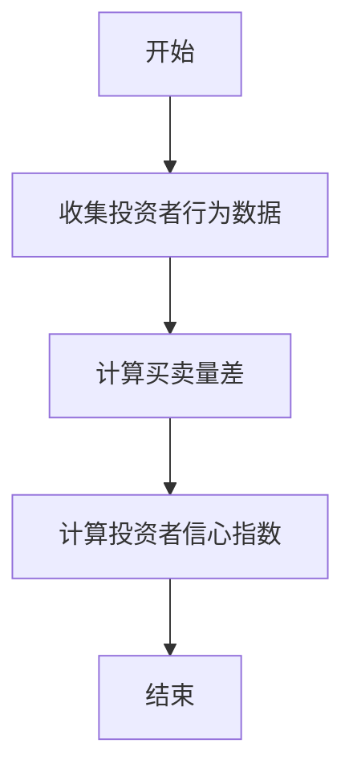
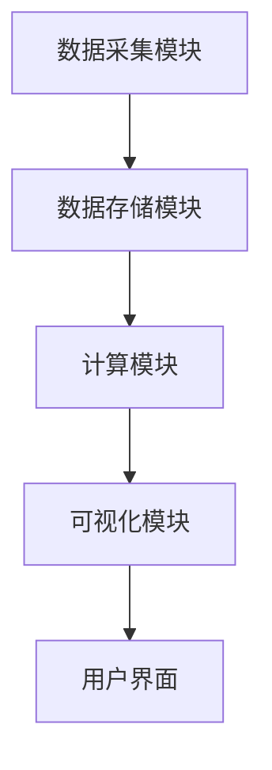

                 


# 彼得林奇的"市场情绪"指标分析

> 关键词：市场情绪，彼得林奇，投资策略，情绪指标，资产价格，投资者心理

> 摘要：本文深入分析了彼得林奇提出的“市场情绪”指标，探讨其在投资决策中的作用，结合数学模型和实际案例，揭示市场情绪如何影响资产价格波动，帮助投资者制定更科学的投资策略。

---

## 第一章：市场情绪指标概述

### 1.1 市场情绪的定义与重要性

市场情绪是指投资者在市场中的情感倾向，通常表现为乐观或悲观。它反映在投资者的行为、交易决策和资产价格波动中。市场情绪是影响资产价格的重要因素之一，尤其是在短期市场波动中。

彼得·林奇作为著名基金经理，强调了市场情绪在投资中的重要性。他认为，投资者情绪的变化往往会导致市场波动，而这种波动可以通过特定的指标进行量化和分析。

### 1.2 彼得·林奇的投资理念

彼得·林奇的投资理念基于对市场情绪的深刻理解。他认为，市场情绪的变化可以预测市场的波动，并通过分析投资者的心理变化来制定投资策略。他的市场情绪指标为投资者提供了一种量化市场情绪的方法。

### 1.3 本文的核心内容与目标

本文旨在通过分析彼得·林奇的市场情绪指标，探讨其在投资决策中的应用。我们将从市场情绪的定义、指标的计算方法，到实际案例分析，全面解析市场情绪对资产价格的影响。

---

## 第二章：市场情绪指标的背景与问题背景

### 2.1 投资者心理与市场情绪

投资者的心理变化直接影响市场情绪。例如，当市场表现良好时，投资者倾向于乐观，导致资产价格上涨；反之，当市场表现不佳时，投资者可能变得悲观，导致资产价格下跌。

### 2.2 市场情绪指标的核心问题

市场情绪指标的核心问题在于如何量化投资者的心理变化。我们需要解决以下问题：
- 如何定义和计算市场情绪指标？
- 市场情绪指标如何与市场周期相关联？
- 市场情绪指标的优缺点是什么？

### 2.3 市场情绪指标的结构与组成

市场情绪指标通常包括以下几个部分：
1. 投资者情绪数据：如交易量、买卖价差等。
2. 市场波动数据：如股票指数波动、波动率等。
3. 市场参与度数据：如投资者参与度、交易活跃度等。

---

## 第三章：市场情绪指标的核心概念

### 3.1 市场情绪指标的原理

市场情绪指标的计算基于投资者行为数据和市场数据。常见的市场情绪指标包括：
1. 投资者信心指数：反映投资者对未来市场的看法。
2. 买卖量差：反映投资者的交易倾向。

### 3.2 市场情绪指标与市场周期的关系

市场情绪指标在不同市场周期中的表现不同。例如，在牛市中，市场情绪指标通常较高；在熊市中，市场情绪指标较低。

### 3.3 市场情绪指标的核心属性对比

以下表格对比了不同市场情绪指标的核心属性：

| 指标名称 | 数据来源 | 计算方法 | 优缺点 |
|----------|-----------|----------|--------|
| 投资者信心指数 | 调查数据 | 加权平均 | 反映投资者对未来市场的看法 |
| 买卖量差 | 交易数据 | 计算买卖量差 | 反映投资者交易倾向 |

---

## 第四章：市场情绪指标的算法原理

### 4.1 市场情绪指标的计算流程

以下是市场情绪指标的计算流程：



### 4.2 市场情绪指标的数学模型

市场情绪指数（MEI）的计算公式如下：

$$ MEI = \frac{\sum_{i=1}^{n} w_i \cdot x_i}{n} $$

其中：
- $w_i$ 是第 $i$ 个指标的权重
- $x_i$ 是第 $i$ 个指标的值
- $n$ 是指标总数

---

## 第五章：市场情绪指标的系统架构设计

### 5.1 系统功能设计

系统功能模块包括：
1. 数据采集模块：收集投资者行为数据和市场数据。
2. 计算模块：计算市场情绪指标。
3. 可视化模块：展示市场情绪指标的变化趋势。

### 5.2 系统架构设计



### 5.3 系统接口设计

系统接口设计如下：
- 数据接口：提供API用于数据采集。
- 计算接口：提供API用于市场情绪指标的计算。
- 可视化接口：提供API用于数据可视化。

---

## 第六章：市场情绪指标的项目实战

### 6.1 环境安装

安装必要的Python库：
```bash
pip install pandas matplotlib numpy
```

### 6.2 核心代码实现

以下是市场情绪指标的Python实现：

```python
import pandas as pd
import matplotlib.pyplot as plt

# 数据加载
data = pd.read_csv('market_data.csv')

# 计算买卖量差
buy_volume = data['buy_volume']
sell_volume = data['sell_volume']
volume_diff = buy_volume - sell_volume

# 计算市场情绪指数
mei = pd.Series(volume_diff).ewm(alpha=0.5).mean()

# 可视化
plt.plot(mei)
plt.title('Market Emotion Index')
plt.xlabel('Time')
plt.ylabel('MEI')
plt.show()
```

### 6.3 实际案例分析

以2008年金融危机为例，分析市场情绪指标的变化。通过观察市场情绪指数的变化，投资者可以更好地理解市场波动的原因。

---

## 第七章：市场情绪指标的最佳实践

### 7.1 最佳实践

- 数据来源的选择：确保数据的准确性和全面性。
- 模型调优：根据市场变化调整模型参数。
- 结果验证：通过历史数据验证模型的有效性。

### 7.2 总结与展望

本文通过分析彼得·林奇的市场情绪指标，揭示了其在投资决策中的重要性。未来的研究可以进一步探讨市场情绪指标与其他投资策略的结合应用。

---

## 作者：AI天才研究院/AI Genius Institute & 禅与计算机程序设计艺术 /Zen And The Art of Computer Programming

