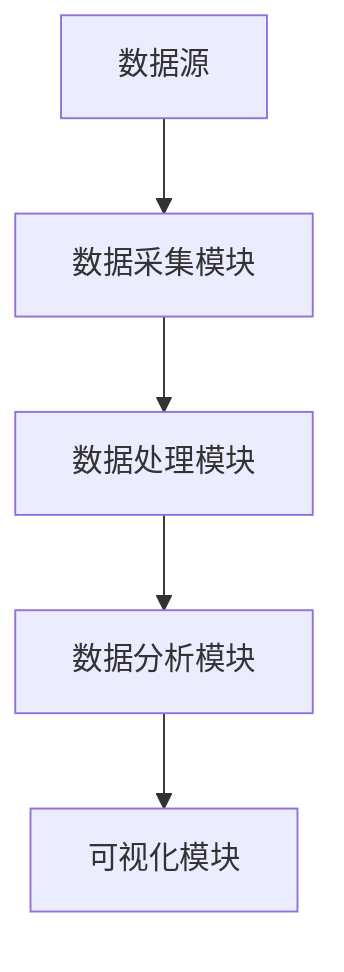
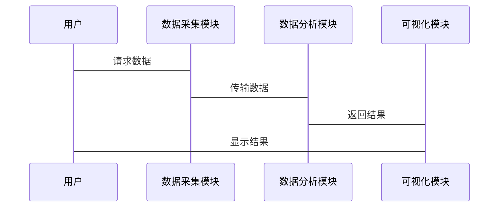

                 


# 彼得林奇的"市场情绪"指标在不同市场周期的表现

> 关键词：市场情绪指标，彼得林奇，投资策略，市场周期，情绪周期，投资心理

> 摘要：本文深入探讨了彼得林奇提出的市场情绪指标在不同市场周期中的表现及其应用。通过分析市场情绪的定义、投资者心理、市场情绪指标的构成及其在牛市、熊市等不同市场阶段的动态变化，结合实际案例和数学模型，系统性地分析了市场情绪指标在投资决策中的重要作用。文章还详细介绍了市场情绪指标的算法实现、数学模型、系统架构设计以及项目实战，为投资者提供了理论与实践相结合的深度解析。

---

# 第一部分：彼得林奇的市场情绪指标概述

## 第1章：市场情绪与投资心理学

### 1.1 市场情绪的定义与重要性

#### 1.1.1 什么是市场情绪
市场情绪是指投资者在市场中的整体情绪状态，反映了市场参与者的乐观或悲观情绪。这种情绪会直接影响市场的供需关系和资产价格。

#### 1.1.2 市场情绪在投资中的作用
市场情绪是投资决策的重要参考，它能够帮助投资者预测市场的短期波动和潜在风险。

#### 1.1.3 彼得林奇对市场情绪的重视
彼得林奇在其投资理论中，特别强调了市场情绪对投资决策的影响，认为情绪是市场波动的核心驱动力。

### 1.2 投资者心理与市场情绪

#### 1.2.1 投资者心理的波动性
投资者的心理会受到市场环境、个人情绪和外界信息的影响，呈现出周期性波动。

#### 1.2.2 情绪周期与市场周期的关系
情绪周期与市场周期密切相关，情绪高涨时市场可能进入牛市，情绪低落时可能进入熊市。

#### 1.2.3 彼得林奇的投资心理分析
彼得林奇通过分析投资者心理，提出了市场情绪指标，帮助投资者更好地理解市场波动。

---

## 第2章：彼得林奇的市场情绪指标

### 2.1 市场情绪指标的提出

#### 2.1.1 彼得林奇市场情绪指标的背景
彼得林奇在长期的投资实践中，发现市场情绪对资产价格的影响巨大。

#### 2.1.2 指标的理论基础
市场情绪指标基于投资者心理和市场行为的分析，结合了技术分析和基本面分析。

#### 2.1.3 指标的实际应用
市场情绪指标可以用于预测市场趋势和优化投资组合。

### 2.2 市场情绪指标的构成

#### 2.2.1 市场情绪的多维度分析
市场情绪可以从投资者的交易行为、市场成交量、资产价格波动等多个维度进行衡量。

#### 2.2.2 指标的量化方法
通过量化指标，如投资者情绪指数（AAII）、恐慌指数（VIX）等，可以量化市场情绪。

#### 2.2.3 指标的动态调整
市场情绪指标需要根据市场环境的变化进行动态调整，以适应不同市场周期的需求。

---

## 第3章：市场情绪指标在不同市场周期的表现

### 3.1 牛市中的市场情绪表现

#### 3.1.1 牛市中的情绪特征
在牛市中，市场情绪通常表现为乐观、贪婪，投资者倾向于高估资产价值。

#### 3.1.2 彼得林奇的牛市投资策略
彼得林奇建议投资者在牛市中保持谨慎，避免过度乐观。

#### 3.1.3 情绪指标在牛市中的应用
通过市场情绪指标，投资者可以识别牛市顶点，提前退出以规避风险。

### 3.2 熊市中的市场情绪表现

#### 3.2.1 熊市中的情绪特征
在熊市中，市场情绪通常表现为悲观、恐惧，投资者倾向于低估资产价值。

#### 3.2.2 彼得林奇的熊市投资策略
彼得林奇建议投资者在熊市中保持耐心，寻找被低估的投资机会。

#### 3.2.3 情绪指标在熊市中的应用
通过市场情绪指标，投资者可以识别熊市底部，及时布局以抓住反弹机会。

### 3.3 整个市场周期中的情绪变化

#### 3.3.1 市场周期的划分
市场周期通常分为牛市、熊市、震荡市等阶段，情绪指标可以用来识别不同阶段的特征。

#### 3.3.2 情绪指标在不同周期的变化规律
市场情绪指标在不同市场周期中的表现呈现出周期性变化，投资者可以根据指标的变化调整投资策略。

#### 3.3.3 情绪指标的周期性分析
通过分析市场情绪指标的周期性，投资者可以更好地理解市场波动的规律，制定长期投资策略。

---

# 第二部分：市场情绪指标的数学模型与算法

## 第4章：市场情绪指标的数学模型

### 4.1 情绪指标的量化方法

#### 4.1.1 相对强度指数（RSI）
RSI是一种常用的技术指标，用于衡量资产的超买或超卖状态。

#### 4.1.2 情绪指数的计算公式
情绪指数可以通过对市场参与者的交易行为进行量化，计算得出。

### 4.2 情绪指标的数学模型

#### 4.2.1 情绪指数模型
$$情绪指数 = \frac{买方力量 - 卖方力量}{买方力量 + 卖方力量}$$

#### 4.2.2 情绪指数模型的应用
通过情绪指数模型，可以预测市场的短期波动和趋势变化。

---

## 第5章：市场情绪指标的算法实现

### 5.1 情绪指标的计算步骤

#### 5.1.1 数据采集
从数据源获取市场交易数据，包括成交量、价格等。

#### 5.1.2 数据处理
对数据进行清洗和预处理，提取有用的特征。

#### 5.1.3 数据分析
使用算法对数据进行分析，计算市场情绪指标。

### 5.2 情绪指标的Python实现

#### 5.2.1 环境搭建
安装必要的Python库，如Pandas、Matplotlib等。

#### 5.2.2 数据处理代码
```python
import pandas as pd
import matplotlib.pyplot as plt

# 读取数据
data = pd.read_csv('market_data.csv')

# 计算情绪指数
def calculate_emotion_index(data):
    buy_strength = data['buy_volume']
    sell_strength = data['sell_volume']
    emotion_index = (buy_strength - sell_strength) / (buy_strength + sell_strength)
    return emotion_index

emotion_index = calculate_emotion_index(data)
```

#### 5.2.3 数据可视化
```python
plt.plot(emotion_index)
plt.title('Market Emotion Index')
plt.xlabel('Time')
plt.ylabel('Emotion Index')
plt.show()
```

---

## 第6章：市场情绪指标的系统架构设计

### 6.1 系统功能设计

#### 6.1.1 数据采集模块
从多个数据源采集市场数据。

#### 6.1.2 数据处理模块
对数据进行清洗和预处理。

#### 6.1.3 数据分析模块
计算市场情绪指标，预测市场趋势。

### 6.2 系统架构设计

#### 6.2.1 系统架构图


#### 6.2.2 系统交互图


---

## 第7章：项目实战

### 7.1 环境安装

#### 7.1.1 安装Python环境
安装Python 3.8及以上版本。

#### 7.1.2 安装依赖库
安装Pandas、Matplotlib、Scikit-learn等库。

### 7.2 核心实现

#### 7.2.1 数据处理
读取市场数据，清洗数据，提取特征。

#### 7.2.2 情绪指标计算
使用算法计算市场情绪指标，预测市场趋势。

### 7.3 案例分析

#### 7.3.1 实际案例
分析2008年金融危机期间的市场情绪指标，验证模型的有效性。

#### 7.3.2 结果解读
解读分析结果，总结市场情绪指标在实际投资中的应用。

---

## 第8章：最佳实践与小结

### 8.1 小结
总结全文内容，强调市场情绪指标的重要性。

### 8.2 注意事项
提醒投资者在使用市场情绪指标时需要注意的事项。

### 8.3 未来研究方向
提出未来可以进一步研究的方向，如多指标结合、算法优化等。

### 8.4 拓展阅读
推荐相关书籍和资源，供读者进一步学习。

---

作者：AI天才研究院 & 禅与计算机程序设计艺术

