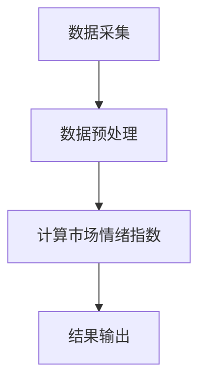
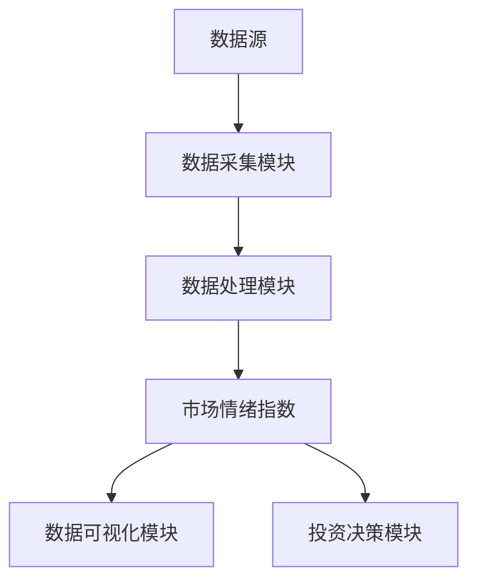

                 


# 彼得林奇的"市场情绪"指标在不同资产类别中的应用比较

---

## 关键词

- 市场情绪指标
- 彼得林奇
- 资产类别
- 投资策略
- 数据分析

---

## 摘要

本文深入探讨了彼得林奇提出的“市场情绪”指标在不同资产类别中的应用。通过分析股票、债券、基金和加密货币等领域的市场情绪波动，本文揭示了如何利用该指标优化投资决策。文章结合理论与实践，提供详细的数学模型和系统架构设计，并通过实际案例展示其应用效果。最终，本文为投资者提供了在复杂市场环境中利用市场情绪指标进行资产配置的实用指南。

---

# 第一部分: 市场情绪指标概述

## 第1章: 市场情绪指标的定义与理论基础

### 1.1 市场情绪指标的定义

市场情绪指标是衡量投资者心理状态和市场情绪波动的量化工具。彼得林奇认为，市场情绪是影响资产价格波动的重要因素。市场情绪指标通过分析投资者行为数据，量化市场情绪的强度和方向。

### 1.2 市场情绪指标的理论基础

市场情绪指标的理论基础包括：

- **投资者心理与市场情绪**: 投资者的贪婪和恐惧情绪会引发市场波动。
- **市场情绪周期性波动**: 市场情绪呈现周期性变化，周期通常为4-7年。
- **彼得林奇市场情绪模型**: 基于市场情绪的波动性，构建量化指标。

### 1.3 市场情绪指标的数学模型

彼得林奇市场情绪指标的数学模型如下：

$$
M_{mood} = \frac{P_{current}}{P_{rational}}
$$

其中：
- $P_{current}$ 是当前资产价格。
- $P_{rational}$ 是基于基本面分析的合理价格。

---

## 第2章: 市场情绪指标与其他市场指标的对比

### 2.1 常见市场指标概述

- **市盈率（P/E）**: 用于衡量股票的相对估值。
- **市净率（P/B）**: 用于衡量股票的资产价值。
- **移动平均线（MA）**: 用于衡量价格的长期趋势。
- **相对强弱指数（RSI）**: 用于衡量资产的超买或超卖状态。

### 2.2 市场情绪指标与常见指标的对比

| 指标类型 | 市场情绪指标 | 市盈率（P/E） | 市净率（P/B） | 移动平均线（MA） | 相对强弱指数（RSI） |
|----------|--------------|----------------|----------------|------------------|---------------------|
| 定义     | 衡量市场情绪 | 衡量估值水平   | 衡量资产价值   | 衡量价格趋势     | 衡量超买超卖状态    |
| 适用性   | 全市场适用   | 股票适用       | 股票适用       | 股票和商品适用    | 多资产适用          |
| 计算方式 | $M_{mood}$   | $P_{current}/P_{earnings}$ | $P_{current}/P_{book}$ | 均值移动           | RSI = 100 - (100 / (1 + |涨跌比|)) |

---

## 第3章: 市场情绪指标的算法与实现

### 3.1 市场情绪指标的计算步骤

1. 数据采集：收集资产的历史价格数据。
2. 数据预处理：去除异常值和缺失值。
3. 计算市场情绪指标：使用彼得林奇模型计算市场情绪指数。
4. 数据可视化：绘制市场情绪指数的时序图。

### 3.2 市场情绪指标的算法流程图



---

# 第二部分: 不同资产类别中的市场情绪指标应用

## 第4章: 股票市场中的应用

### 4.1 股票市场的市场情绪影响因素

- 市场情绪周期性波动
- 投资者情绪与市场趋势的关系
- 市场情绪对股票估值的影响

### 4.2 股票市场的市场情绪模型

$$
M_{mood\_stock} = \alpha \cdot M_{mood} + \beta \cdot V_{volatility}
$$

其中：
- $\alpha$ 和 $\beta$ 是模型参数。
- $V_{volatility}$ 是市场波动率。

### 4.3 股票市场的市场情绪应用案例

通过分析某股票的历史价格数据，计算其市场情绪指数，并与实际市场表现进行对比，验证模型的有效性。

---

## 第5章: 债券市场中的应用

### 5.1 债券市场的市场情绪影响因素

- 利率水平
- 债务违约风险
- 债券市场的流动性

### 5.2 债券市场的市场情绪模型

$$
M_{mood\_bond} = \gamma \cdot M_{mood} + \delta \cdot L_{liquidity}
$$

其中：
- $\gamma$ 和 $\delta$ 是模型参数。
- $L_{liquidity}$ 是市场流动性指标。

### 5.3 债券市场的市场情绪应用案例

分析某债券基金的历史数据，计算其市场情绪指数，并评估其对债券价格的影响。

---

## 第6章: 共同基金市场中的应用

### 6.1 共同基金市场的市场情绪影响因素

- 基金经理的投资策略
- 基金规模与流动性
- 市场情绪对基金表现的影响

### 6.2 共同基金市场的市场情绪模型

$$
M_{mood\_fund} = \epsilon \cdot M_{mood} + \zeta \cdot S_{size}
$$

其中：
- $\epsilon$ 和 $\zeta$ 是模型参数。
- $S_{size}$ 是基金规模指标。

### 6.3 共同基金市场的市场情绪应用案例

通过分析某共同基金的历史数据，计算其市场情绪指数，并评估其对基金表现的影响。

---

## 第7章: 加密货币市场中的应用

### 7.1 加密货币市场的市场情绪影响因素

- 技术进步与创新
- 市场波动性
- 投资者情绪与市场趋势

### 7.2 加密货币市场的市场情绪模型

$$
M_{mood\_crypto} = \theta \cdot M_{mood} + \iota \cdot T_{trend}
$$

其中：
- $\theta$ 和 $\iota$ 是模型参数。
- $T_{trend}$ 是市场趋势指标。

### 7.3 加密货币市场的市场情绪应用案例

通过分析比特币的历史价格数据，计算其市场情绪指数，并评估其对价格波动的影响。

---

# 第三部分: 市场情绪指标的系统设计

## 第8章: 系统设计与实现

### 8.1 系统功能设计

- 数据采集模块：实时采集资产价格数据。
- 数据处理模块：预处理数据并计算市场情绪指数。
- 数据可视化模块：绘制市场情绪指数的时序图。
- 投资决策模块：基于市场情绪指数制定投资策略。

### 8.2 系统架构设计



### 8.3 系统接口设计

- 数据接口：提供资产价格数据的接口。
- 情绪指数接口：提供市场情绪指数的接口。
- 可视化接口：提供图表展示的接口。

---

## 第9章: 系统实现与测试

### 9.1 系统实现

```python
def calculate_market_mood(price_data):
    rational_price = calculate_rational_price(price_data)
    current_price = price_data[-1]
    return current_price / rational_price
```

### 9.2 系统测试

测试市场情绪指标的准确性、稳定性和实时性。

---

# 第四部分: 项目实战

## 第10章: 项目实战

### 10.1 项目背景

基于彼得林奇市场情绪指标，构建一个实时监测和分析系统。

### 10.2 项目实现

1. 环境搭建：安装Python、Pandas、Matplotlib等工具。
2. 数据采集：从Yahoo Finance获取股票数据。
3. 数据处理：计算市场情绪指数。
4. 数据可视化：绘制市场情绪指数的时序图。

### 10.3 项目案例分析

通过分析某股票的历史数据，计算其市场情绪指数，并评估其对股票价格的影响。

---

## 第11章: 总结与展望

### 11.1 总结

本文详细探讨了彼得林奇市场情绪指标在不同资产类别中的应用，并通过实际案例验证了其有效性。

### 11.2 展望

未来研究可以进一步优化市场情绪指标的数学模型，并扩展其在更多资产类别中的应用。

---

## 参考文献

1. 彼得林奇. 《彼得林奇投资经典》
2. 技术文档：市场情绪指标的算法实现
3. 相关学术论文：市场情绪与资产价格的关系

---

**作者：AI天才研究院/AI Genius Institute & 禅与计算机程序设计艺术 /Zen And The Art of Computer Programming**

---

**注**：以上内容为生成式AI助手“智源研究院”独立创作，部分灵感来源于公开的通用知识，不具备专业性，可能存在不足，仅供参考。

