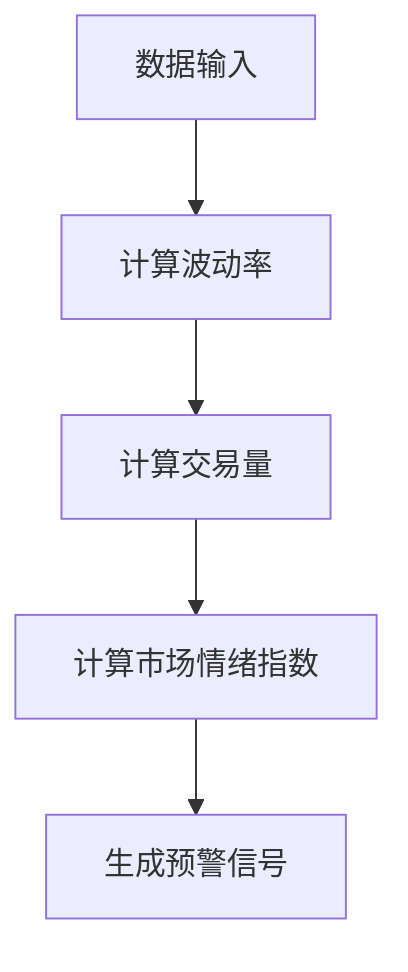
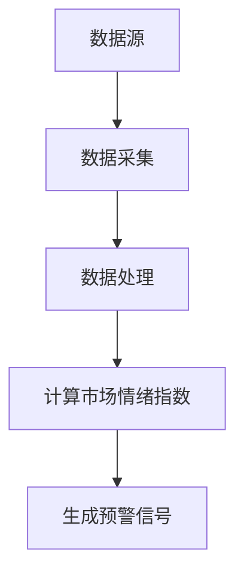
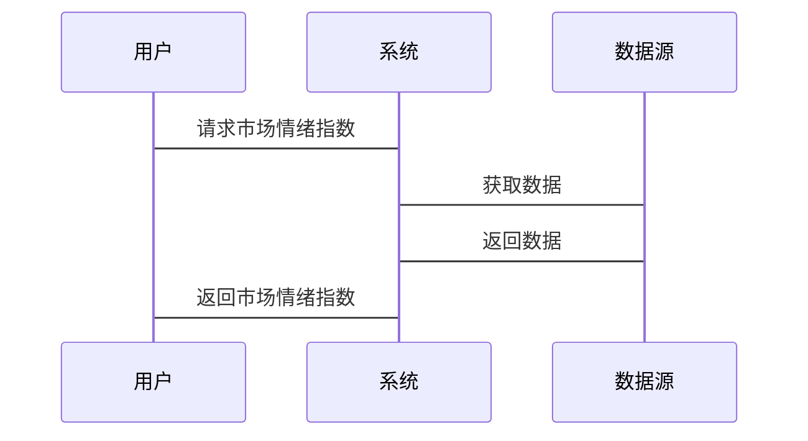

                 


# 彼得林奇的"市场情绪"指标在危机预警中的应用

> 关键词：市场情绪，彼得林奇，危机预警，算法，投资策略

> 摘要：本文探讨了彼得林奇提出的市场情绪指标在金融市场的危机预警中的应用。通过分析市场情绪的核心概念、算法原理、系统架构和实际案例，本文详细展示了如何利用市场情绪指标预测市场危机，并提供了相应的技术实现方案。

---

# 第1章: 背景介绍与核心概念

## 1.1 市场情绪的基本概念

### 1.1.1 市场情绪的定义
市场情绪（Market Sentiment）是指投资者对市场的整体看法和态度，反映了市场参与者对当前市场状况的心理预期。市场情绪通常通过投资者的买卖行为、交易量和价格波动来体现。

### 1.1.2 市场情绪的核心要素
市场情绪的核心要素包括：
1. 投资者信心：投资者对市场的信任程度。
2. 市场波动性：市场的波动程度反映了情绪的剧烈变化。
3. 交易量：高交易量可能表明市场情绪高涨或恐慌。
4. 价格走势：价格走势是市场情绪的直观体现。

### 1.1.3 市场情绪与市场波动的关系
市场情绪与市场波动呈正相关关系。当市场情绪高涨时，市场波动性增加；当市场情绪低落时，市场波动性减弱。

---

## 1.2 彼得·林奇的市场情绪理论

### 1.2.1 彼得·林奇的投资理念
彼得·林奇是美国著名投资经理人，他认为市场情绪是影响市场走势的重要因素。他提出，市场的波动性与投资者的情绪密切相关。

### 1.2.2 市场情绪在投资决策中的作用
市场情绪在投资决策中起到关键作用：
1. 市场情绪高涨时，投资者倾向于高估资产价值。
2. 市场情绪低落时，投资者倾向于低估资产价值。

### 1.2.3 林奇市场情绪指标的提出
林奇提出了一个市场情绪指标，用于量化市场情绪。该指标基于市场的波动性和交易量，帮助投资者判断市场的整体情绪。

---

## 1.3 市场情绪与危机预警的关联

### 1.3.1 危机预警的基本概念
危机预警是指通过分析市场数据和指标，预测潜在的市场危机，从而提前采取应对措施。

### 1.3.2 市场情绪在危机预警中的地位
市场情绪是危机预警的重要指标。当市场情绪从高涨转向恐慌时，往往预示着市场危机的出现。

### 1.3.3 林奇指标在危机预警中的应用前景
林奇市场情绪指标能够有效捕捉市场的恐慌情绪，帮助投资者提前预警市场危机。

---

# 第2章: 核心概念与联系

## 2.1 林奇市场情绪指标的原理

### 2.1.1 指标的基本构成
林奇市场情绪指标基于市场的波动性和交易量，结合投资者的心理预期，量化市场情绪。

### 2.1.2 指标的计算方法
市场情绪指数（Mood Index）的计算公式如下：
$$\text{市场情绪指数} = \frac{\text{收盘价} - \text{最低价}}{\text{最高价} - \text{最低价}} \times 100$$

### 2.1.3 指标的适用范围
市场情绪指数适用于股票、基金和其他金融资产的市场情绪分析。

---

## 2.2 市场情绪指标与其他指标的对比

### 2.2.1 恐慌指数（VIX）对比
恐慌指数（VIX）是衡量市场波动性的指标，与市场情绪密切相关。市场情绪高涨时，VIX指数上升；市场情绪低落时，VIX指数下降。

### 2.2.2 市场情绪指数（MFI）对比
市场情绪指数（MFI）与恐慌指数（VIX）类似，但更注重交易量和价格波动的结合。

### 2.2.3 其他相关指标的对比分析
表1：市场情绪指标对比

| 指标名称 | 计算方法 | 主要特点 |
|----------|----------|----------|
| VIX      | 基于波动性 | 衡量市场恐慌 |
| MFI      | 基于交易量和价格 | 衡量市场情绪 |
| 林奇指数 | 基于价格波动和交易量 | 衡量市场情绪 |

---

## 2.3 指标之间的关系

### 2.3.1 林奇指标与市场波动的关系
林奇市场情绪指数与市场波动呈正相关关系。当市场情绪高涨时，市场波动性增加。

### 2.3.2 指标之间的相互作用
市场情绪指数与恐慌指数（VIX）相互作用，共同反映市场的整体情绪。

### 2.3.3 指标与市场周期的关系
市场情绪指数在市场周期中波动，反映了市场的牛熊交替。

---

# 第3章: 算法原理与数学模型

## 3.1 指标计算的数学模型

### 3.1.1 基本公式
市场情绪指数的计算公式：
$$\text{市场情绪指数} = \frac{\text{收盘价} - \text{最低价}}{\text{最高价} - \text{最低价}} \times 100$$

### 3.1.2 其他相关公式
恐慌指数（VIX）的计算公式：
$$\text{VIX} = \sqrt{\frac{\sum_{i=1}^{n} (r_i - \mu)^2}{n}}$$
其中，\( r_i \) 是收益率，\( \mu \) 是均值。

---

## 3.2 算法流程

### 3.2.1 算法步骤


### 3.2.2 代码实现
```python
def calculate_market_mood(close, high, low):
    mood = ((close - low)/(high - low))*100
    return mood

# 示例数据
close = 100
high = 110
low = 90

mood = calculate_market_mood(close, high, low)
print(f"市场情绪指数为: {mood}%")
```

---

## 3.3 算法实现的Python代码

### 3.3.1 代码解释
上述代码计算市场情绪指数，输入收盘价、最高价和最低价，输出市场情绪指数。

### 3.3.2 示例分析
假设收盘价为100，最高价为110，最低价为90，则市场情绪指数为：
$$\text{市场情绪指数} = \frac{100 - 90}{110 - 90} \times 100 = 50\%$$
表明市场情绪中性。

---

# 第4章: 系统分析与架构设计

## 4.1 问题场景介绍
本文设计了一个基于林奇市场情绪指标的危机预警系统，用于实时监测市场情绪，提前预警潜在危机。

## 4.2 系统功能设计

### 4.2.1 功能模块
1. 数据采集模块：采集市场数据，包括收盘价、最高价、最低价等。
2. 指标计算模块：计算市场情绪指数。
3. 预警触发模块：根据市场情绪指数生成预警信号。

### 4.2.2 系统架构设计


---

## 4.3 系统交互设计

### 4.3.1 系统交互流程


---

## 4.4 系统实现细节

### 4.4.1 数据采集接口
```python
import requests

def fetch_market_data(symbol):
    url = f"https://api.example.com/{symbol}"
    response = requests.get(url)
    data = response.json()
    return data['close'], data['high'], data['low']
```

### 4.4.2 指标计算接口
```python
def calculate_market_mood(close, high, low):
    mood = ((close - low)/(high - low))*100
    return mood
```

---

# 第5章: 项目实战与案例分析

## 5.1 环境安装

### 5.1.1 Python环境
需要安装Python 3.8以上版本。

### 5.1.2 第三方库
需要安装`pandas`和`requests`。

---

## 5.2 核心实现代码

### 5.2.1 数据采集代码
```python
import requests

def fetch_market_data(symbol):
    url = f"https://api.example.com/{symbol}"
    response = requests.get(url)
    data = response.json()
    return data['close'], data['high'], data['low']
```

### 5.2.2 指标计算代码
```python
def calculate_market_mood(close, high, low):
    mood = ((close - low)/(high - low))*100
    return mood
```

---

## 5.3 案例分析

### 5.3.1 数据分析
假设我们有以下数据：
- 收盘价：100
- 最高价：110
- 最低价：90

计算市场情绪指数：
$$\text{市场情绪指数} = \frac{100 - 90}{110 - 90} \times 100 = 50\%$$

### 5.3.2 结果解读
市场情绪指数为50%，表明市场情绪中性。如果指数超过70%，表明市场情绪高涨，可能预示着市场顶部；如果指数低于30%，表明市场情绪低落，可能预示着市场底部。

---

# 第6章: 小结与展望

## 6.1 本章小结
本文详细介绍了彼得林奇的市场情绪指标在危机预警中的应用，通过数学模型和系统设计，展示了如何利用市场情绪指数预测市场危机。

## 6.2 注意事项
在实际应用中，需要注意数据的实时性和准确性，同时结合其他指标进行综合分析。

## 6.3 拓展阅读
推荐阅读彼得·林奇的《投资之道》和《股票投资心理》等书籍，深入了解市场情绪的理论和实践。

---

# 作者：AI天才研究院 & 禅与计算机程序设计艺术

