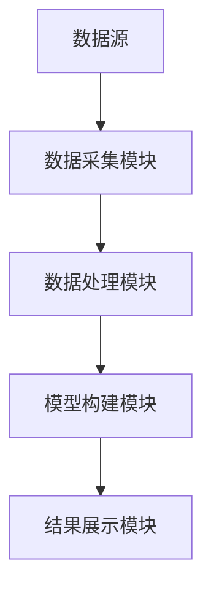

                 


# 彼得林奇的"市场情绪"指标在跨资产类别定价中的应用

**关键词**：市场情绪指标，跨资产定价，彼得林奇，投资策略，资产价格波动

**摘要**：本文探讨了彼得林奇提出的市场情绪指标在跨资产类别定价中的应用。通过分析市场情绪对股票、债券和基金等资产类别的影响，结合具体算法和系统架构设计，构建了一个综合的市场情绪指标体系，并应用于实际定价模型中，为投资者提供科学的决策支持。

---

# 第一部分: 背景介绍与核心概念

## 第1章: 市场情绪指标概述

### 1.1 市场情绪指标的定义与背景

#### 1.1.1 什么是市场情绪指标
市场情绪指标是用来量化投资者在市场中的情绪状态的指标。这些指标反映了投资者的乐观、悲观、贪婪或恐惧等情绪，通常通过投资者行为数据（如交易量、买卖决策）或市场数据（如波动率、收益率）来衡量。

#### 1.1.2 市场情绪指标的历史发展
市场情绪指标的研究可以追溯到早期的市场行为学研究。随着金融市场的不断发展，投资者情绪对资产价格波动的影响逐渐受到重视。彼得林奇在其投资策略中强调了市场情绪的重要性，认为情绪波动是市场波动的重要驱动因素。

#### 1.1.3 市场情绪指标在投资决策中的作用
市场情绪指标在投资决策中起着关键作用。通过分析市场情绪，投资者可以更好地预测市场走势、优化投资组合以及制定交易策略。市场情绪指标可以帮助投资者识别市场过度乐观或过度悲观的情况，从而避免投资决策中的情绪偏差。

### 1.2 彼得林奇的市场情绪理论

#### 1.2.1 彼得林奇的投资理念
彼得林奇是著名的基金经理和投资专家，他认为市场情绪是影响资产价格波动的重要因素。他强调，投资者情绪的波动会导致市场的非理性波动，从而为理性投资者提供投资机会。

#### 1.2.2 市场情绪在彼得林奇投资策略中的地位
在彼得林奇的投资策略中，市场情绪是核心考量因素之一。他认为，市场情绪指标可以帮助投资者识别市场的过度波动，并在市场情绪低落时寻找被低估的资产，在市场情绪高涨时警惕潜在风险。

#### 1.2.3 市场情绪指标的核心要素
市场情绪指标的核心要素包括投资者信心、市场波动率、交易量、资金流动等。彼得林奇认为，这些要素可以通过综合分析来量化市场情绪，并为跨资产定价提供依据。

## 第2章: 跨资产类别定价的背景与挑战

### 2.1 跨资产类别定价的定义

#### 2.1.1 跨资产类别定价的基本概念
跨资产类别定价是指对不同资产类别（如股票、债券、基金等）的价格进行综合评估和定价。由于不同资产类别的特性和市场环境的差异，跨资产定价需要考虑多种因素，包括市场情绪、经济指标、政策环境等。

#### 2.1.2 不同资产类别的特点与定价差异
股票、债券、基金等不同资产类别在定价机制和影响因素上存在显著差异。例如，股票价格受公司业绩、市场情绪影响较大，而债券价格则主要受利率和信用风险影响。

#### 2.1.3 跨资产定价的复杂性与挑战
跨资产定价的复杂性主要体现在不同资产类别之间的相互影响和市场环境的多样性。市场情绪的跨资产一致性与差异性需要通过综合分析来解决，以确保定价模型的准确性和有效性。

### 2.2 市场情绪在跨资产定价中的作用

#### 2.2.1 市场情绪对股票定价的影响
市场情绪对股票定价的影响主要体现在投资者行为和市场波动上。当市场情绪高涨时，投资者倾向于买入股票，推动股价上涨；当市场情绪低落时，投资者倾向于抛售股票，导致股价下跌。

#### 2.2.2 市场情绪对债券定价的影响
市场情绪对债券定价的影响相对间接。当市场情绪高涨时，投资者可能追求风险更高的资产（如股票），导致债券需求减少，债券收益率上升；反之，当市场情绪低落时，投资者可能转向安全资产（如债券），导致债券价格上升。

#### 2.2.3 市场情绪对基金定价的影响
市场情绪对基金定价的影响主要体现在投资者的申购和赎回行为上。当市场情绪高涨时，基金申购量增加，可能导致基金价格上升；当市场情绪低落时，基金赎回量增加，可能导致基金价格下跌。

### 2.3 跨资产定价的核心问题与边界

#### 2.3.1 跨资产定价的核心问题
跨资产定价的核心问题是如何综合考虑不同资产类别的特点和市场环境，构建一个能够反映市场整体情绪的定价模型。核心问题包括如何量化市场情绪、如何处理资产类别之间的相互影响以及如何应对市场环境的动态变化。

#### 2.3.2 跨资产定价的边界与限制
跨资产定价的边界与限制主要包括数据获取的难度、模型的复杂性以及市场环境的不确定性。不同资产类别的数据获取和处理难度不同，模型的复杂性可能导致计算成本过高，而市场环境的不确定性则会影响模型的准确性。

#### 2.3.3 跨资产定价的外部因素
跨资产定价的外部因素包括宏观经济指标、政策环境、国际金融市场波动等。这些因素可能通过影响市场情绪或直接作用于资产价格，进而影响跨资产定价。

---

# 第二部分: 核心概念与联系

## 第3章: 市场情绪指标的核心原理

### 3.1 市场情绪指标的构成要素

#### 3.1.1 投资者情绪的分类
投资者情绪可以分为乐观、悲观、贪婪、恐惧等不同类型。不同的情绪类型会影响投资者的决策行为，进而影响资产价格。

#### 3.1.2 市场情绪的量化方法
市场情绪的量化方法包括基于交易数据的方法（如成交量、买卖价差）、基于市场指标的方法（如波动率、收益率）以及基于投资者调查的方法（如信心指数）。彼得林奇的市场情绪指标通常结合多种方法，以更全面地反映市场情绪。

#### 3.1.3 市场情绪指标的数学模型
市场情绪指标的数学模型可以通过统计分析和机器学习方法来构建。例如，可以使用主成分分析（PCA）来提取市场情绪的核心特征，或者使用时间序列模型（如ARIMA）来预测市场情绪的变化趋势。

### 3.2 市场情绪与资产价格的关系

#### 3.2.1 市场情绪对资产价格的直接影响
市场情绪对资产价格的直接影响体现在投资者的买卖行为上。当市场情绪高涨时，投资者倾向于买入资产，推动价格上涨；当市场情绪低落时，投资者倾向于卖出资产，导致价格下跌。

#### 3.2.2 市场情绪通过投资者行为影响资产价格
市场情绪通过投资者行为影响资产价格的过程包括情绪驱动的交易决策、情绪驱动的市场波动以及情绪驱动的资产配置变化。彼得林奇强调，投资者情绪是市场波动的重要驱动力。

#### 3.2.3 市场情绪的周期性与资产价格波动
市场情绪具有周期性，通常与市场周期密切相关。例如，在市场上涨周期中，市场情绪趋于乐观；在市场下跌周期中，市场情绪趋于悲观。这种周期性影响资产价格的波动，为投资者提供了交易机会。

## 第4章: 市场情绪指标与跨资产定价的联系

### 4.1 市场情绪指标在跨资产定价中的应用

#### 4.1.1 股票市场中的情绪指标应用
在股票市场中，市场情绪指标可以帮助投资者预测股价走势、优化投资组合以及制定交易策略。例如，可以通过分析市场情绪指标来判断市场的超买或超卖状态。

#### 4.1.2 债券市场中的情绪指标应用
在债券市场中，市场情绪指标可以帮助投资者预测债券收益率的变化趋势。当市场情绪高涨时，债券收益率可能上升；当市场情绪低落时，债券收益率可能下降。

#### 4.1.3 其他资产类别中的情绪指标应用
在基金、房地产等其他资产类别中，市场情绪指标同样具有重要作用。例如，基金市场的市场情绪可以通过投资者的申购和赎回行为来衡量，进而影响基金价格。

### 4.2 不同资产类别中市场情绪的差异

#### 4.2.1 股票市场中的情绪特征
股票市场中的市场情绪通常表现出较高的波动性和敏感性。例如，市场情绪的高涨通常伴随着股价的快速上涨，而市场情绪的低落通常伴随着股价的快速下跌。

#### 4.2.2 债券市场中的情绪特征
债券市场中的市场情绪通常表现出较低的波动性和较高的稳定性。由于债券价格主要受利率和信用风险影响，市场情绪的波动对债券价格的影响相对较小。

#### 4.2.3 其他资产类别中的情绪特征
不同资产类别中的市场情绪特征各不相同。例如，房地产市场的市场情绪通常受宏观经济环境和政策环境的影响较大，而大宗商品市场的市场情绪通常受供需关系和国际市场波动的影响较大。

### 4.3 市场情绪指标的跨资产一致性与差异性

#### 4.3.1 不同资产类别中市场情绪的共性
尽管不同资产类别中的市场情绪表现形式不同，但它们都受到投资者情绪的驱动。例如，市场情绪的高涨通常会导致各类资产价格的上涨，而市场情绪的低落通常会导致各类资产价格的下跌。

#### 4.3.2 不同资产类别中市场情绪的差异性
不同资产类别中的市场情绪在影响机制和表现形式上存在显著差异。例如，股票市场中的市场情绪通常通过投资者的买卖行为影响价格，而债券市场中的市场情绪通常通过利率变化影响价格。

#### 4.3.3 市场情绪指标的跨资产一致性
市场情绪指标的跨资产一致性体现在市场情绪的波动趋势上。例如，市场情绪的高涨通常同时影响股票、债券和基金等各类资产的价格走势。

---

# 第三部分: 算法原理与系统架构设计

## 第5章: 算法原理

### 5.1 市场情绪指标的量化算法

#### 5.1.1 数据获取与预处理
数据获取与预处理是市场情绪量化的重要步骤。需要收集包括交易量、收益率、波动率等市场数据，以及投资者信心指数等情绪数据。数据预处理包括数据清洗、标准化和特征提取等步骤。

#### 5.1.2 市场情绪指标的构建
市场情绪指标的构建可以通过统计分析和机器学习方法来实现。例如，可以使用主成分分析（PCA）提取市场情绪的核心特征，或者使用时间序列模型（如ARIMA）预测市场情绪的变化趋势。

#### 5.1.3 市场情绪指标的应用
市场情绪指标的应用包括资产价格预测、投资组合优化和风险控制等。例如，可以通过分析市场情绪指标来判断市场的超买或超卖状态，从而制定相应的交易策略。

### 5.2 跨资产定价模型的构建

#### 5.2.1 数据流与特征提取
跨资产定价模型的构建需要考虑不同资产类别的数据特征。例如，股票价格受公司业绩和市场情绪影响，债券价格受利率和信用风险影响，基金价格受投资者行为和市场环境影响。

#### 5.2.2 模型构建与训练
跨资产定价模型的构建可以通过回归分析、时间序列分析或机器学习方法来实现。例如，可以使用多元回归模型将市场情绪指标和其他经济指标作为自变量，资产价格作为因变量，建立定价模型。

#### 5.2.3 模型验证与优化
模型验证与优化是跨资产定价模型构建的重要步骤。需要通过历史数据验证模型的准确性和稳定性，并根据验证结果进行模型参数调整和优化。

## 第6章: 系统架构设计

### 6.1 系统功能设计

#### 6.1.1 数据采集模块
数据采集模块负责从各种数据源获取市场数据和情绪数据。例如，可以从股票交易所获取股票价格和交易量数据，从调查机构获取投资者信心指数数据。

#### 6.1.2 数据处理模块
数据处理模块负责对获取的数据进行清洗、标准化和特征提取。例如，可以通过数据清洗去除异常值，通过标准化将不同数据源的数据统一到同一尺度。

#### 6.1.3 模型构建模块
模型构建模块负责根据处理后的数据构建市场情绪指标和跨资产定价模型。例如，可以使用机器学习算法训练市场情绪指标的预测模型，或者使用统计方法建立资产价格与市场情绪的关系模型。

#### 6.1.4 结果展示模块
结果展示模块负责将模型的预测结果和分析结果以可视化形式展示给用户。例如，可以通过图表展示市场情绪指标的变化趋势，或者通过仪表盘展示不同资产类别的定价预测结果。

### 6.2 系统架构图



### 6.3 接口设计与交互流程

#### 6.3.1 系统接口设计
系统接口设计包括数据接口和用户接口。数据接口用于与数据源和第三方服务交互，用户接口用于与最终用户交互。例如，可以通过API接口从股票交易所获取实时数据，或者通过网页界面向用户提供市场情绪指标和定价预测结果。

#### 6.3.2 系统交互流程
系统交互流程包括数据采集、数据处理、模型构建和结果展示四个阶段。用户可以通过用户界面提交数据请求，系统通过数据采集模块获取数据，通过数据处理模块处理数据，通过模型构建模块构建市场情绪指标和定价模型，最后通过结果展示模块向用户展示结果。

---

# 第四部分: 项目实战与最佳实践

## 第7章: 项目实战

### 7.1 环境安装与配置

#### 7.1.1 数据获取工具安装
需要安装数据获取工具，例如用于从股票交易所获取数据的API客户端，或者用于从调查机构获取投资者信心指数的工具。常用的工具有Python的pandas库和requests库，以及数据源提供的API接口。

#### 7.1.2 数据处理工具安装
需要安装数据处理工具，例如用于数据清洗和特征提取的Python库（如numpy、pandas）和机器学习库（如scikit-learn）。此外，还需要安装可视化工具，例如用于绘制市场情绪指标变化趋势的matplotlib库。

#### 7.1.3 模型构建工具安装
需要安装模型构建工具，例如用于时间序列分析的statsmodels库，或用于机器学习的scikit-learn库。对于更复杂的模型，可能需要安装深度学习框架，例如TensorFlow或PyTorch。

### 7.2 核心代码实现

#### 7.2.1 数据获取与预处理
以下是一个数据获取与预处理的Python代码示例：

```python
import pandas as pd
import requests
import json

# 从股票交易所获取股票价格数据
def get_stock_data(ticker):
    url = f"https://api.stockexchange.com/{ticker}"
    response = requests.get(url)
    data = json.loads(response.text)
    df = pd.DataFrame(data)
    return df

# 从调查机构获取投资者信心指数
def get_sentiment_data():
    url = "https://api.survey.com/sentiment"
    response = requests.get(url)
    data = json.loads(response.text)
    df = pd.DataFrame(data)
    return df

# 数据预处理
def preprocess_data(stock_data, sentiment_data):
    # 合并数据
    merged_data = pd.merge(stock_data, sentiment_data, on='date')
    # 去除缺失值
    merged_data.dropna(inplace=True)
    # 标准化处理
    normalized_data = (merged_data - merged_data.mean()) / merged_data.std()
    return normalized_data
```

#### 7.2.2 市场情绪指标构建

```python
from sklearn.decomposition import PCA

# 提取市场情绪特征
def extract_sentiment_features(data):
    features = data[['volume', 'return', 'volatility']]
    return features

# 使用PCA提取主成分
def build_sentiment_index(features):
    pca = PCA(n_components=1)
    pca.fit(features)
    sentiment_index = pca.transform(features)
    return sentiment_index

# 可视化市场情绪指数变化
import matplotlib.pyplot as plt

def visualize_sentiment_index(sentiment_index, dates):
    plt.plot(dates, sentiment_index)
    plt.title('Market Sentiment Index Over Time')
    plt.xlabel('Date')
    plt.ylabel('Sentiment Index')
    plt.show()
```

#### 7.2.3 跨资产定价模型实现

```python
from statsmodels.tsa.arima_model import ARIMA

# 构建ARIMA模型预测资产价格
def predict_asset_price(sentiment_index, prices):
    model = ARIMA(prices, order=(1, 1, 1))
    model_fit = model.fit()
    forecast = model_fit.forecast(steps=30)
    return forecast

# 可视化预测结果
def visualize_forecast(actual_prices, forecast_prices):
    plt.plot(actual_prices, label='Actual Prices')
    plt.plot(forecast_prices, label='Forecast Prices')
    plt.title('Asset Price Forecast')
    plt.xlabel('Date')
    plt.ylabel('Price')
    plt.legend()
    plt.show()
```

### 7.3 案例分析与实际应用

#### 7.3.1 案例分析
以股票市场为例，假设我们已经构建了一个市场情绪指数，并使用ARIMA模型对股票价格进行了预测。通过对比实际价格和预测价格，可以验证模型的准确性。

#### 7.3.2 项目总结
通过本项目，我们成功地将彼得林奇的市场情绪指标应用于跨资产定价模型中，验证了市场情绪指标在资产定价中的重要性。同时，我们也发现了一些问题和挑战，例如数据获取的难度、模型的复杂性以及市场环境的不确定性。

## 第8章: 最佳实践

### 8.1 小结

### 8.2 注意事项

### 8.3 拓展阅读

---

# 作者信息

作者：AI天才研究院/AI Genius Institute & 禅与计算机程序设计艺术/Zen And The Art of Computer Programming

---

通过以上步骤，我们系统地探讨了彼得林奇的市场情绪指标在跨资产类别定价中的应用，从理论到实践，从算法到系统设计，为读者提供了一个全面的视角。

