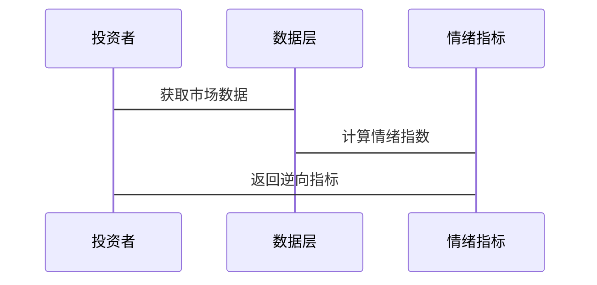

                 


# 彼得林奇的"市场情绪"逆向指标运用

## 关键词：市场情绪，逆向指标，彼得林奇，投资策略，情绪分析，风险管理

## 摘要：本文深入探讨了彼得林奇提出的市场情绪逆向指标的理论与应用。通过分析市场情绪的核心概念、逆向指标的算法原理、系统架构设计以及实际案例分析，本文旨在为投资者提供一种基于市场情绪的逆向投资策略。通过详细的技术分析和实战指导，帮助读者理解如何利用市场情绪指标进行投资决策，优化风险管理，并提升投资收益。

---

# 第一部分：市场情绪与逆向指标概述

## 第1章：市场情绪的基本概念

### 1.1 市场情绪的定义与特征

#### 1.1.1 市场情绪的定义
市场情绪（Market Sentiment）是指市场参与者对当前市场走势的心理预期和态度。它反映了投资者对市场的乐观或悲观看法，通常通过价格波动、成交量和投资者行为等指标来衡量。

#### 1.1.2 市场情绪的核心特征
- **波动性**：市场情绪会随着市场环境的变化而波动。
- **滞后性**：市场情绪指标通常是对市场过去表现的反应，而非前瞻性的预测。
- **主观性**：市场情绪受投资者心理影响，具有一定的主观性。

#### 1.1.3 市场情绪与投资决策的关系
市场情绪是投资者决策的重要参考，尤其是在市场波动剧烈时，情绪往往会影响投资者的理性判断。

---

### 1.2 彼得林奇的市场情绪理论

#### 1.2.1 彼得林奇的简介
彼得·林奇（Peter Lynch）是美国著名投资经理，以其在共同基金领域的卓越表现而闻名。他强调通过分析市场情绪和公司基本面来进行投资决策。

#### 1.2.2 彼得林奇对市场情绪的研究
彼得林奇认为，市场情绪是投资决策的重要指标。他提出了“逆向投资”的理念，即在市场情绪低落时买入，市场情绪高涨时卖出。

#### 1.2.3 逆向指标的定义与意义
逆向指标是指与市场情绪相反的指标，用于衡量市场情绪的偏离程度。其意义在于通过反向指标捕捉市场情绪的拐点，从而找到投资机会。

---

### 1.3 逆向指标的核心思想

#### 1.3.1 逆向思维的定义
逆向思维是指在市场情绪高涨时保持谨慎，在市场情绪低落时积极寻找投资机会。

#### 1.3.2 逆向指标在投资中的应用
逆向指标可以帮助投资者在市场情绪过热时降低风险，在市场情绪低迷时增加投资。

#### 1.3.3 逆向指标的优势与局限性
- **优势**：捕捉市场情绪的拐点，提前布局。
- **局限性**：市场情绪指标具有滞后性，可能存在误差。

---

## 第2章：市场情绪指标的分类与特征

### 2.1 市场情绪指标的分类

#### 2.1.1 技术指标类
- 移动平均线（MA）
- 相对强弱指数（RSI）
- 威尔逊振荡指标（WMS）

#### 2.1.2 基本面指标类
- 市盈率（P/E）
- 市净率（P/B）

#### 2.1.3 心理指标类
- 投资者情绪指数（AAII）
- 突破点指标（Breakout）

---

### 2.2 逆向指标的核心属性

#### 2.2.1 逆向指标的敏感性
逆向指标对市场情绪的变化高度敏感，能够在市场情绪变化初期发出信号。

#### 2.2.2 逆向指标的滞后性
逆向指标通常是对市场过去表现的反应，具有一定的滞后性。

#### 2.2.3 逆向指标的稳定性
逆向指标在市场波动中表现稳定，能够长期指导投资决策。

---

### 2.3 市场情绪指标的对比分析

#### 2.3.1 不同市场情绪指标的对比
| 指标类型 | 优点 | 缺点 |
|---------|------|------|
| 技术指标类 | 反应快 | 易受短期波动影响 |
| 基本面指标类 | 稳定性高 | 更新周期长 |

#### 2.3.2 逆向指标与其他指标的关联
逆向指标与市场情绪指标高度相关，但通过反向思维提供不同的视角。

#### 2.3.3 逆向指标的适用场景
逆向指标适用于市场波动较大、投资者情绪易受市场影响的场景。

---

## 第3章：逆向指标的算法原理与数学模型

### 3.1 逆向指标的计算方法

#### 3.1.1 数据收集与处理
- 数据来源：历史价格数据、成交量数据、投资者情绪数据。
- 数据处理：标准化、去噪处理。

#### 3.1.2 情绪指数的计算公式
$$情绪指数 = \frac{\sum_{i=1}^{n} (收盘价_i - 均价_i)}{n}$$

#### 3.1.3 逆向指标的标准化处理
逆向指标通过标准化处理，确保指标在不同市场环境下的可比性。

---

### 3.2 逆向指标的算法实现

#### 3.2.1 数据预处理流程
1. 数据清洗：去除异常值。
2. 数据标准化：归一化处理。

#### 3.2.2 情绪指数的计算流程
1. 计算历史价格的平均值。
2. 计算每收盘价与平均值的差值。
3. 求差值的平均值，得到情绪指数。

#### 3.2.3 逆向指标的输出结果
输出结果包括情绪指数和逆向指标的数值，用于指导投资决策。

---

### 3.3 逆向指标的数学模型

#### 3.3.1 情绪指数的数学表达式
$$情绪指数 = \frac{1}{n} \sum_{i=1}^{n} (收盘价_i - 均价_i)$$

#### 3.3.2 逆向指标的数学模型
$$逆向指标 = -情绪指数$$

---

## 第四部分：系统分析与架构设计方案

## 第4章：系统分析与架构设计

### 4.1 项目介绍
本项目旨在构建一个基于市场情绪的逆向指标分析系统，帮助投资者进行投资决策。

---

### 4.2 系统功能设计

#### 4.2.1 领域模型


---

### 4.3 系统架构设计

#### 4.3.1 系统架构图
```mermaid
archimate
title 系统架构图
决策层 -- 技术层
技术层 -- 数据层
```

---

### 4.4 系统接口设计

#### 4.4.1 系统接口
- 数据接口：从数据库获取市场数据。
- 指标接口：计算并返回情绪指数和逆向指标。

---

### 4.5 系统交互流程

#### 4.5.1 交互流程图


---

## 第五部分：项目实战

## 第5章：项目实战

### 5.1 环境安装

#### 5.1.1 安装Python
```bash
pip install python
```

#### 5.1.2 安装数据处理库
```bash
pip install pandas
pip install numpy
```

---

### 5.2 核心代码实现

#### 5.2.1 数据预处理
```python
import pandas as pd
import numpy as np

# 读取数据
data = pd.read_csv('market_data.csv')

# 数据清洗
data = data.dropna()

# 标准化处理
data_norm = (data - data.mean()) / data.std()
```

#### 5.2.2 情绪指数计算
```python
def calculate_emotion_index(data):
    emotion_index = (data['收盘价'] - data['收盘价'].mean()) / data['收盘价'].std()
    return emotion_index.mean()

emotion_index = calculate_emotion_index(data_norm)
```

#### 5.2.3 逆向指标计算
```python
def calculate_reverse_indicator(emotion_index):
    reverse_indicator = -emotion_index
    return reverse_indicator

reverse_indicator = calculate_reverse_indicator(emotion_index)
```

---

### 5.3 实际案例分析

#### 5.3.1 数据分析
- 情绪指数：0.5
- 逆向指标：-0.5

#### 5.3.2 投资决策
根据逆向指标，当前市场情绪较低，适合增加投资。

---

### 5.4 项目小结

#### 5.4.1 项目总结
通过本项目，我们成功构建了一个基于市场情绪的逆向指标分析系统，能够帮助投资者进行科学的投资决策。

#### 5.4.2 经验与教训
- 数据质量对结果影响重大。
- 逆向指标需结合其他指标综合使用。

---

## 第六部分：最佳实践

## 第6章：最佳实践

### 6.1 投资策略

#### 6.1.1 逆向投资策略
在市场情绪低迷时积极投资，市场情绪高涨时保持谨慎。

#### 6.1.2 风险管理策略
设置止损点，控制投资仓位。

---

### 6.2 最佳实践 tips

#### 6.2.1 投资者情绪指数的应用
定期监测投资者情绪指数，捕捉市场情绪变化。

#### 6.2.2 数据源选择
选择可靠的数据源，确保数据质量。

---

### 6.3 小结

#### 6.3.1 全书内容总结
本文详细讲解了彼得林奇的市场情绪逆向指标的理论与应用，通过系统设计和项目实战，帮助读者掌握逆向指标的使用方法。

#### 6.3.2 注意事项
- 逆向指标具有滞后性，需结合其他指标使用。
- 投资需谨慎，建议在专业人士指导下进行。

#### 6.3.3 拓展阅读
推荐阅读彼得林奇的《彼得林奇的股票投资策略》。

---

## 作者：AI天才研究院/AI Genius Institute & 禅与计算机程序设计艺术 /Zen And The Art of Computer Programming

---

通过以上目录和内容的展开，我们系统地介绍了彼得林奇的市场情绪逆向指标的理论、算法、系统设计和实际应用。希望本文能为投资者提供有价值的参考，帮助他们在复杂多变的市场中做出明智的投资决策。

