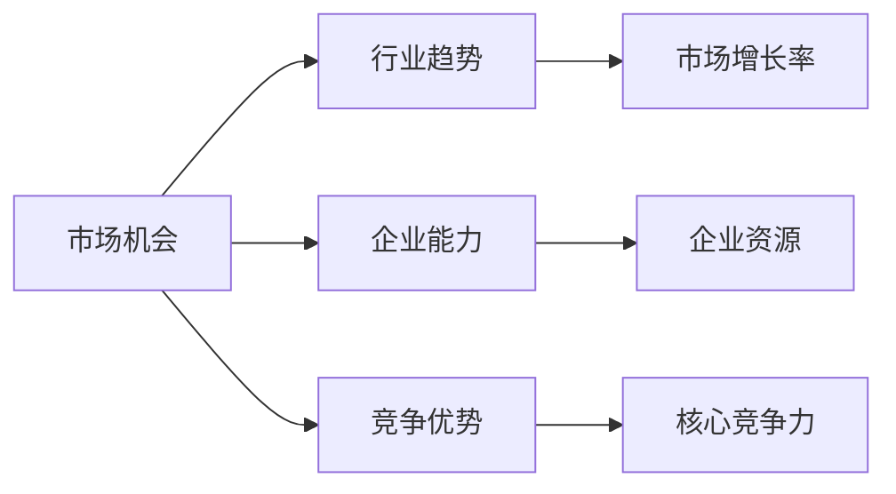
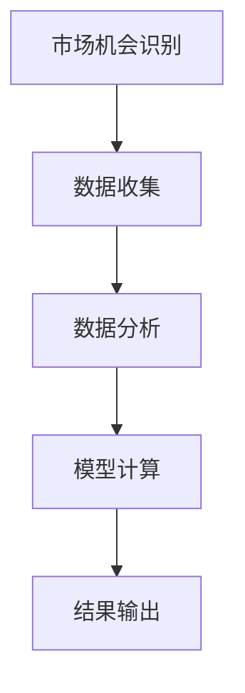

                 


# 彼得林奇的"市场机会"在跨境并购中的识别

> **关键词**：彼得林奇，市场机会，跨境并购，投资策略，风险管理

> **摘要**：本文探讨了彼得林奇的市场机会识别理论在跨境并购中的应用。通过分析市场趋势、企业能力及竞争优势，结合风险管理策略，提出一套系统化的市场机会识别框架。文章还结合实际案例，详细阐述了彼得林奇的投资策略，并提供了实用的建议。

---

## 第一部分：彼得林奇的市场机会识别理论与跨境并购概述

### 第1章：彼得林奇与市场机会识别概述

#### 1.1 彼得林奇的背景与投资理念
##### 1.1.1 彼得林奇的生平简介
彼得·林奇（Peter Lynch）是全球最著名的投资专家之一，曾任Fidelity投资公司的基金经理，管理着麦哲伦基金（Magellan Fund），创造了年均29%的回报率。他以独特的市场机会识别方法闻名，强调从基本面分析中寻找低估的股票。

##### 1.1.2 彼得林奇的投资哲学
彼得林奇认为，市场机会的核心在于发现那些具有持续增长潜力且被市场低估的企业。他强调长期投资和价值发现，反对短期投机。

##### 1.1.3 彼得林奇对市场机会的定义
市场机会是指那些在特定行业或市场中，由于某种原因被低估或未被充分认识到的投资标的，这些标的具有较高的增长潜力。

#### 1.2 市场机会识别的核心概念
##### 1.2.1 市场机会的定义与特征
市场机会是指在特定市场中，由于价格波动、行业趋势或企业基本面变化等因素，导致某类资产或企业具有投资吸引力的时刻。

##### 1.2.2 市场机会的分类与层次
市场机会可以分为行业级市场机会和企业级市场机会。行业级机会关注整个行业的增长潜力，而企业级机会则关注具体企业的竞争优势。

##### 1.2.3 市场机会与企业战略的关系
市场机会是企业制定战略的重要依据，企业通过识别市场机会，制定相应的并购、投资或扩张策略。

#### 1.3 跨境并购的定义与特点
##### 1.3.1 跨境并购的基本概念
跨境并购是指一家企业收购另一家位于不同国家或地区的企业的行为，涉及跨国界的资产转移和资源整合。

##### 1.3.2 跨境并购的动机与驱动因素
- **战略整合**：通过并购实现资源互补或市场扩展。
- **技术获取**：获取被并购企业的核心技术或专利。
- **成本降低**：通过规模经济降低生产成本。
- **市场进入**：快速进入新市场。

##### 1.3.3 跨境并购的挑战与风险
- **法律风险**：涉及不同国家的法律法规差异。
- **文化整合**：跨国并购后的企业文化冲突。
- **汇率风险**：汇率波动对企业财务的影响。

---

### 第2章：彼得林奇市场机会识别的核心模型

#### 2.1 彼得林奇市场机会识别模型的构建
##### 2.1.1 模型的理论基础
彼得林奇的市场机会识别模型基于基本面分析，结合行业趋势、企业能力及竞争优势，预测企业的增长潜力。

##### 2.1.2 模型的构成要素
- **行业趋势**：行业的增长潜力和周期性。
- **企业能力**：企业的财务状况、管理能力和技术优势。
- **竞争优势**：企业的核心竞争力和市场地位。

##### 2.1.3 模型的数学表达式
$$ \text{市场机会} = f(\text{行业趋势}, \text{企业能力}, \text{竞争优势}) $$

##### 2.1.4 实体关系图


#### 2.2 模型的算法原理
##### 2.2.1 算法流程


##### 2.2.2 算法实现
```python
def market_opportunity_analysis():
    industry_trend = calculate_industry_trend()
    company_capability = assess_company_capability()
    competitive_advantage = evaluate_competitive_advantage()
    return industry_trend * company_capability * competitive_advantage

def calculate_industry_trend():
    # 行业趋势分析，返回0-1之间的值
    return 0.8  # 示例值

def assess_company_capability():
    # 企业能力评估，返回0-1之间的值
    return 0.7  # 示例值

def evaluate_competitive_advantage():
    # 竞争优势评估，返回0-1之间的值
    return 0.9  # 示例值
```

---

### 第3章：跨境并购中的市场机会识别策略

#### 3.1 行业趋势分析
##### 3.1.1 行业生命周期分析
- **导入期**：市场需求增长迅速，竞争较少。
- **成长期**：行业增长稳定，竞争加剧。
- **成熟期**：增长放缓，竞争激烈。
- **衰退期**：市场需求下降，企业利润减少。

##### 3.1.2 行业竞争格局分析
分析行业内主要竞争者的市场份额、产品差异化及成本结构。

##### 3.1.3 行业政策环境分析
研究政府政策、贸易壁垒及税收政策对企业的影响。

#### 3.2 企业能力评估
##### 3.2.1 企业核心竞争力分析
评估企业的技术研发能力、品牌影响力及管理团队。

##### 3.2.2 企业财务状况分析
分析企业的盈利能力、资产负债率及现金流情况。

##### 3.2.3 企业组织能力分析
评估企业的组织架构、内部沟通效率及文化融合能力。

#### 3.3 竞争优势分析
##### 3.3.1 企业竞争优势的识别
识别企业的核心竞争力、成本优势及差异化优势。

##### 3.3.2 企业竞争优势的评估
通过定量和定性方法评估竞争优势的强弱。

##### 3.3.3 企业竞争优势的优化
通过并购整合优化企业资源，提升竞争优势。

---

## 第4章：跨境并购中的风险管理与控制

### 4.1 跨境并购中的风险类型
#### 4.1.1 市场风险
- 由于市场波动导致的投资损失。

#### 4.1.2 法律风险
- 跨境并购涉及的法律文件复杂，可能存在法律纠纷。

#### 4.1.3 财务风险
- 汇率波动、债务负担过重等财务问题。

#### 4.1.4 文化风险
- 企业文化冲突影响整合效果。

#### 4.1.5 运营风险
- 并购后企业整合过程中的管理问题。

### 4.2 风险管理策略
#### 4.2.1 风险识别与评估
- 通过尽职调查识别潜在风险。
- 评估风险对并购项目的影响程度。

#### 4.2.2 风险控制措施
- 设立风险管理团队。
- 制定应对计划，如法律咨询、财务对冲等。

#### 4.2.3 风险监控与报告
- 建立风险监控机制，定期评估风险状态。
- 编写风险管理报告，及时调整策略。

---

## 第5章：彼得林奇市场机会识别的实践与案例分析

### 5.1 经典案例分析
#### 5.1.1 案例背景
- 选择一个典型的跨境并购案例，如某企业跨国并购一家技术领先企业。

#### 5.1.2 市场机会识别过程
- 分析行业趋势、企业能力及竞争优势。
- 评估市场机会的可行性。

#### 5.1.3 并购后的整合与优化
- 优化企业组织结构，整合资源。
- 提升企业核心竞争力。

### 5.2 从彼得林奇的视角看市场机会
- 彼得林奇强调长期投资和价值发现，这在跨境并购中尤为重要。
- 通过基本面分析识别低估企业，实现价值最大化。

---

## 第6章：彼得林奇的投资策略与跨境并购的结合

### 6.1 彼得林奇的投资策略
#### 6.1.1 选股标准
- 选择具有持续增长潜力且被市场低估的企业。

#### 6.1.2 投资组合管理
- 通过分散投资降低风险，提升收益。

#### 6.1.3 长期投资策略
- 避免短期波动，坚持长期持有优质资产。

### 6.2 跨境并购中的应用
#### 6.2.1 企业估值
- 使用彼得林奇的估值方法，评估目标企业的价值。

#### 6.2.2 并购后的管理
- 通过长期投资理念，优化并购后企业的运营。

---

## 第7章：总结与展望

### 7.1 总结
- 彼得林奇的市场机会识别理论为跨境并购提供了重要的理论支持。
- 通过行业趋势分析、企业能力评估及竞争优势分析，可以有效识别市场机会。

### 7.2 展望
- 随着全球经济一体化的深入，跨境并购将成为企业获取市场机会的重要手段。
- 未来，彼得林奇的理论将进一步与实践结合，为企业提供更有效的市场机会识别方法。

---

## 作者：AI天才研究院/AI Genius Institute & 禅与计算机程序设计艺术 /Zen And The Art of Computer Programming

