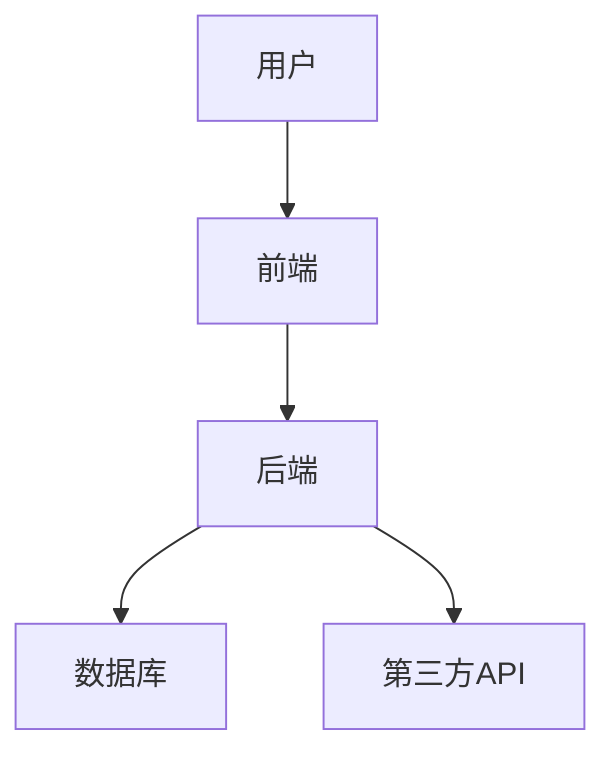
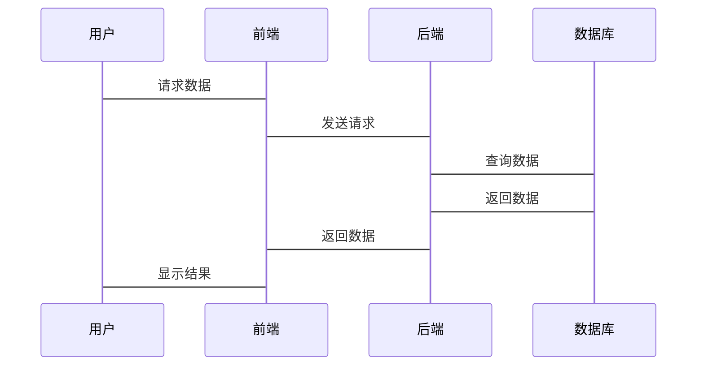

                 


# 彼得林奇的"市场机会"把握技巧

## 关键词：彼得·林奇，投资策略，市场机会，价值投资，PE分析，PEG分析

## 摘要：本文深入探讨了彼得·林奇的投资理念，分析了其市场机会的识别与把握技巧，结合经典投资案例，详细阐述了价值投资与成长投资的结合策略，并通过数学模型与算法原理，为读者提供了系统化的投资方法论。文章从理论到实践，结合实际案例，为投资者提供了切实可行的投资策略与实战指南。

---

# 第一部分: 彼得·林奇投资理念与市场机会概述

## 第1章: 彼得·林奇投资理念概述

### 1.1 彼得·林奇及其投资风格

#### 1.1.1 彼得·林奇的生平简介

彼得·林奇（Peter Lynch）是美国著名的投资专家，被誉为“股票投资之父”。他曾在富达投资管理公司担任经理，管理着麦哲伦基金，创造了年均29%的收益率，远超市场平均水平。林奇的投资理念以“价值投资”和“成长投资”的结合为核心，强调通过深入研究公司基本面，寻找被市场低估的投资机会。

#### 1.1.2 林奇的投资理念与风格

林奇的投资风格以“自下而上”为主，注重分析公司的基本面，如盈利能力、成长潜力、财务状况等。他认为，市场波动为投资者提供了廉价买入优质资产的机会，尤其是在市场恐慌时，许多优质股票会被低估。

#### 1.1.3 林奇投资方法的核心思想

- **价值与成长的结合**：林奇认为，投资不仅要关注公司的当前价值，还要关注其未来的成长潜力。
- **分散投资**：通过投资不同类型和行业的股票，降低风险。
- **长期投资**：避免频繁交易，耐心持有优质股票，等待其价值成长。

### 1.2 市场机会的基本概念

#### 1.2.1 市场机会的定义与特征

市场机会是指在特定市场条件下，某些行业或公司的股票价格被低估，具有上涨潜力的投资机会。市场机会的特征包括：
- **低估性**：股票价格低于其真实价值。
- **成长性**：公司具有良好的成长潜力。
- **周期性**：市场机会往往出现在市场波动或经济周期的低谷期。

#### 1.2.2 市场机会的分类与层次

市场机会可以分为以下几类：
- **行业机会**：整个行业处于上升期，具有投资潜力。
- **公司机会**：个别公司基本面优秀，被市场低估。
- **市场情绪机会**：市场恐慌或过度乐观时，出现的投资机会。

#### 1.2.3 市场机会的识别与评估

识别市场机会的关键在于分析公司的基本面和市场情绪。林奇常用的方法包括：
- **PE分析**：市盈率（Price-to-Earnings Ratio）= 股价 / 每股收益。
- **PEG分析**：市盈率相对盈利增长比率（PEG）= PE / 净利润增长率。

---

## 第2章: 林奇成功案例分析

### 2.1 林奇的经典投资案例

#### 2.1.1 需求增长型投资案例

**案例：可口可乐公司**

林奇投资可口可乐时，该公司正处于高速增长期，且市盈率低于行业平均水平。他通过分析公司的盈利能力、市场占有率和未来增长潜力，认为可口可乐具有长期投资价值。

#### 2.1.2 价值低估型投资案例

**案例：IBM公司**

在20世纪90年代，IBM的股价因市场对技术行业的不看好而被低估。林奇通过分析IBM的财务状况和行业地位，认为其股价被市场低估，具有投资价值。

#### 2.1.3 周期性行业投资案例

**案例：航空公司**

在经济周期低谷时，航空公司股票通常会被低估。林奇通过分析行业周期和公司基本面，选择在周期底部买入，等待周期回升。

### 2.2 案例分析方法与启示

#### 2.2.1 案例分析的步骤与流程

1. **行业分析**：分析行业趋势和周期。
2. **公司基本面分析**：评估公司的盈利能力、财务状况和管理团队。
3. **市场情绪分析**：判断市场对公司的看法是否合理。

#### 2.2.2 案例分析的关键点与注意事项

- **行业趋势**：选择处于上升期的行业。
- **公司基本面**：重点关注盈利能力、成长潜力和财务健康。
- **市场情绪**：避免被市场恐慌或过度乐观影响。

---

## 第3章: 市场机会的识别与分析方法

### 3.1 市场机会识别的基本原则

#### 3.1.1 从行业趋势中发现机会

- **行业增长潜力**：选择处于增长期的行业。
- **行业集中度**：选择市场集中度高的行业。

#### 3.1.2 从公司基本面分析机会

- **盈利能力**：ROE（净资产收益率）和净利率。
- **财务状况**：资产负债率和现金流。

#### 3.1.3 从市场情绪中捕捉机会

- **市场恐慌**：市场恐慌时，优质股票可能被低估。
- **市场乐观**：市场过度乐观时，警惕泡沫。

### 3.2 林奇的市场机会分析框架

#### 3.2.1 行业分析与市场定位

- **行业生命周期**：行业处于导入期、成长期或衰退期。
- **行业竞争格局**：行业集中度和竞争程度。

#### 3.2.2 公司财务指标分析

- **PE分析**：市盈率=股价/每股收益。
- **PEG分析**：PEG=PE/净利润增长率。

#### 3.2.3 市场情绪与资金流动分析

- **资金流向**：资金流入和流出行业的分析。
- **市场情绪指标**：投资者情绪指数和市场波动率。

### 3.3 市场机会的量化评估方法

#### 3.3.1 市盈率与市净率分析

- **市盈率（PE）**：衡量股价是否合理。
- **市净率（PB）**：衡量股价与资产净值的关系。

#### 3.3.2 股息率与收益能力分析

- **股息率**：股息/股价。
- **收益能力**：净利润增长率和营业收入增长率。

#### 3.3.3 行业增长潜力评估

- **行业增长率**：行业收入增长率。
- **市场容量**：行业市场规模和未来增长空间。

---

## 第4章: 林奇投资策略的数学模型与算法原理

### 4.1 投资策略的核心算法

#### 4.1.1 基于PE分析的投资策略

$$ PE = \frac{Price}{Earnings} $$

#### 4.1.2 基于PEG分析的投资策略

$$ PEG = \frac{PE}{Growth Rate} $$

#### 4.1.3 基于ROE分析的投资策略

$$ ROE = \frac{Net Profit}{Total Equity} $$

### 4.2 投资策略的数学模型

#### 4.2.1 PE分析模型

$$ PE = \frac{Price}{Earnings} $$

#### 4.2.2 PEG分析模型

$$ PEG = \frac{PE}{Growth Rate} $$

#### 4.2.3 ROE分析模型

$$ ROE = \frac{Net Profit}{Total Equity} $$

---

## 第5章: 系统分析与架构设计方案

### 5.1 问题场景介绍

林奇的投资策略需要一个系统化的框架，包括数据采集、分析和决策支持。

### 5.2 系统功能设计

#### 5.2.1 数据采集模块

- 采集市场数据：股价、财务数据、行业数据。
- 数据清洗与预处理。

#### 5.2.2 数据分析模块

- 计算PE、PEG、ROE等指标。
- 生成行业和公司报告。

#### 5.2.3 决策支持模块

- 提供投资建议。
- 生成投资组合。

### 5.3 系统架构设计

#### 5.3.1 系统架构图



#### 5.3.2 系统交互图



---

## 第6章: 项目实战

### 6.1 环境安装

- **Python**：安装Python 3.8及以上版本。
- **库**：安装pandas、numpy、scipy、matplotlib。

### 6.2 系统核心实现源代码

```python
import pandas as pd
import numpy as np

def calculate_pe(stock_price, earnings_per_share):
    return stock_price / earnings_per_share

def calculate_peg(pe, growth_rate):
    return pe / growth_rate

def calculate_roe(net_profit, total_equity):
    return net_profit / total_equity

# 示例数据
stock_price = 50
earnings_per_share = 10
growth_rate = 0.15
net_profit = 100
total_equity = 500

pe = calculate_pe(stock_price, earnings_per_share)
peg = calculate_peg(pe, growth_rate)
roe = calculate_roe(net_profit, total_equity)

print(f"PE: {pe}")
print(f"PEG: {peg}")
print(f"ROE: {roe}")
```

### 6.3 代码应用解读与分析

- **PE计算**：通过股价和每股收益计算市盈率。
- **PEG计算**：通过市盈率和净利润增长率计算PEG。
- **ROE计算**：通过净利润和股东权益计算净资产收益率。

### 6.4 实际案例分析

**案例：苹果公司**

- **股价**：100美元。
- **每股收益**：20美元。
- **净利润增长率**：10%。
- **净资产收益率**：25%。

计算结果：
- PE = 5
- PEG = 5 / 0.1 = 50
- ROE = 0.25

### 6.5 项目小结

通过代码实现，我们可以快速计算公司的PE、PEG和ROE，从而评估其投资价值。

---

## 第7章: 最佳实践 tips、小结、注意事项、拓展阅读

### 7.1 最佳实践 tips

- **分散投资**：避免将所有资金投入到单一股票或行业。
- **长期持有**：耐心持有优质股票，等待其价值增长。
- **定期复盘**：定期评估投资组合，调整策略。

### 7.2 小结

本文通过理论分析、案例研究和系统设计，全面介绍了彼得·林奇的市场机会把握技巧，为投资者提供了系统化的投资方法论。

### 7.3 注意事项

- **风险控制**：设置止损点，避免重大损失。
- **持续学习**：关注市场变化和公司动态，及时调整投资策略。
- **纪律性**：坚持投资计划，避免情绪化决策。

### 7.4 拓展阅读

- 《彼得·林奇的成功投资》
- 《价值投资入门》
- 《投资的敌人》

---

## 作者：AI天才研究院/AI Genius Institute & 禅与计算机程序设计艺术 /Zen And The Art of Computer Programming

