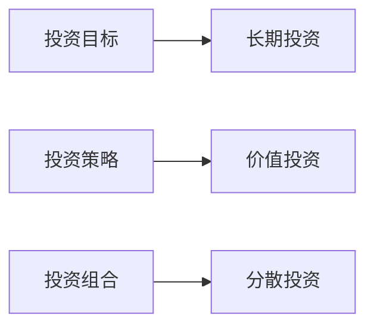
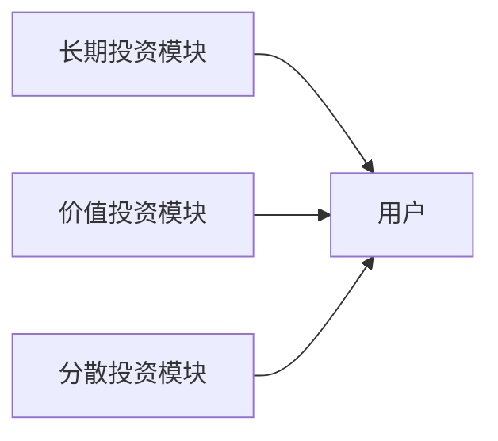
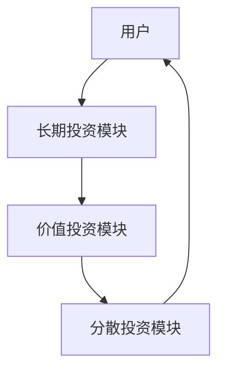

                 

# 彼得林奇的"常识投资"原则解析

## 关键词：彼得林奇，常识投资，长期投资，价值投资，分散投资，风险管理，投资策略

## 摘要：  
彼得·林奇是全球闻名的投资大师，他的“常识投资”原则以其简单、实用而著称。本文将从背景、核心概念、算法原理、系统架构、实战案例等多个角度详细解析“常识投资”原则，帮助读者深入理解这一投资理念的精髓，并通过实际案例展示其在投资实践中的应用。文章还结合数学模型和系统设计，为读者提供全面而深入的分析。

---

## 第一部分：彼得林奇的"常识投资"原则背景介绍

### 第1章：彼得·林奇及其投资理念概述

#### 1.1 彼得·林奇及其投资风格

##### 1.1.1 彼得·林奇的生平简介
彼得·林奇（Peter Lynch）是全球最著名的职业投资人之一，曾在富达投资管理公司（Fidelity）管理麦哲伦基金（Magellan Fund）长达13年，创造了年均29%的回报率。他的投资风格以“常识投资”为核心，主张用普通投资者的思维方式来选择股票，避免过度复杂的分析。

##### 1.1.2 林奇的投资风格与核心理念
林奇的投资理念强调以下几点：
1. **长期投资**：相信市场会走向正确的方向，投资优质企业而非短期波动。
2. **价值投资**：寻找具有持续增长潜力的企业，关注企业的基本面。
3. **分散投资**：通过投资不同类型的企业来降低风险。

##### 1.1.3 林奇投资理念的演变与影响
林奇的投资理念起源于对市场有效性的质疑，他认为市场并非总是理性且有效，尤其是对于普通投资者而言，可以通过常识和洞察力找到被低估的投资机会。

#### 1.2 "常识投资"原则的背景与问题背景

##### 1.2.1 投资领域中的常见问题
投资领域中存在许多常见问题，例如：
- 过度关注短期市场波动，忽视长期投资价值。
- 过度依赖复杂的技术分析，忽视基本面研究。
- 集中投资于少数股票，导致风险过高。

##### 1.2.2 "常识投资"原则的提出背景
“常识投资”原则的提出，正是为了应对上述问题。它强调回归投资的本质，通过长期持有优质资产来实现财富增值。

##### 1.2.3 问题解决的核心思路
- **长期视角**：避免短期波动的干扰，关注企业的长期价值。
- **基本面分析**：通过研究企业的财务状况、行业地位和竞争优势，选择具有持续增长潜力的企业。
- **分散投资**：通过投资不同类型的企业，降低单一投资的风险。

##### 1.2.4 "常识投资"原则的边界与外延
“常识投资”并非完全排斥其他投资方法，而是一种以长期视角为基础，结合基本面分析和分散投资的综合性投资策略。

##### 1.2.5 核心概念的结构与组成
“常识投资”原则的核心概念包括：
1. **长期投资**：以时间换空间，等待企业价值的实现。
2. **价值投资**：寻找被低估的企业，关注企业的内在价值。
3. **分散投资**：通过多样化降低风险，避免过度集中。

---

### 第2章："常识投资"原则的核心概念与联系

#### 2.1 核心概念的原理分析

##### 2.1.1 长期投资的核心原理
长期投资的核心原理在于时间复利效应。通过长期持有优质资产，投资者可以最大化复利效应，从而实现财富的长期增长。

##### 2.1.2 价值投资的内在逻辑
价值投资的内在逻辑在于寻找市场价格低于内在价值的企业。通过研究企业的财务状况、行业地位和竞争优势，投资者可以识别出具有持续增长潜力的企业。

##### 2.1.3 分散投资的风险控制机制
分散投资的风险控制机制在于通过投资不同类型的企业，降低单一投资的风险。即使某一只股票表现不佳，其他股票的表现可能弥补整体收益。

#### 2.2 核心概念的属性特征对比

##### 2.2.1 长期投资与短期投资的对比分析
| 属性 | 长期投资 | 短期投资 |
|------|---------|----------|
| 目标 | 资产增值，注重复利效应 | 资产增值，注重短期收益 |
| 风险 | 较低 | 较高 |
| 持股策略 | 长期持有，关注企业价值 | 短期买卖，关注市场波动 |

##### 2.2.2 价值投资与趋势投资的对比分析
| 属性 | 价值投资 | 趋势投资 |
|------|---------|----------|
| 核心理念 | 寻找被低估的企业 | 跟随市场趋势，顺势而为 |
| 分析方法 | 基本面分析 | 技术分析 |
| 风险控制 | 通过基本面分析降低风险 | 依赖市场趋势，风险较高 |

##### 2.2.3 分散投资与集中投资的对比分析
| 属性 | 分散投资 | 集中投资 |
|------|---------|----------|
| 风险 | 较低 | 较高 |
| 收益潜力 | 较稳定 | 较高 |
| 投资难度 | 较低 | 较高 |

#### 2.3 实体关系图（ER图）分析

---

## 第三部分：系统分析与架构设计

### 第4章：系统架构设计

#### 4.1 系统功能设计

##### 4.1.1 投资目标
系统旨在帮助投资者实现长期财富增值，通过长期投资、价值投资和分散投资的策略，降低投资风险。

##### 4.1.2 投资策略
系统提供以下功能模块：
1. **长期投资模块**：帮助投资者选择具有长期增长潜力的企业。
2. **价值投资模块**：提供基本面分析工具，帮助投资者识别被低估的企业。
3. **分散投资模块**：通过多样化投资降低风险。

##### 4.1.3 系统架构设计

#### 4.2 系统架构设计

##### 4.2.1 系统架构图

##### 4.2.2 系统交互流程图

---

## 第五部分：实战案例

### 第5章：实战案例分析

#### 5.1 投资组合构造与优化

##### 5.1.1 投资组合构造
投资者可以选择不同类型的企业，例如：
- **科技企业**：如苹果、微软。
- **消费企业**：如可口可乐、麦当劳。
- **金融企业**：如银行、保险公司。

##### 5.1.2 投资组合优化
通过调整投资比例，优化投资组合的风险和收益。

#### 5.2 投资策略实现与优化

##### 5.2.1 投资策略实现
- **长期投资**：选择优质企业，长期持有。
- **价值投资**：通过基本面分析，识别被低估的企业。
- **分散投资**：投资不同类型的企业，降低风险。

##### 5.2.2 投资策略优化
- 定期评估投资组合，调整持仓。
- 关注企业的财务状况和行业趋势。
- 保持长期投资的耐心和信心。

---

## 总结

彼得·林奇的“常识投资”原则强调长期投资、价值投资和分散投资。通过本文的详细解析，读者可以更好地理解这一投资理念，并将其应用于实际投资中。投资不仅是技术的运用，更是一种心态和智慧的体现。

---

## 作者：AI天才研究院/AI Genius Institute & 禅与计算机程序设计艺术 /Zen And The Art of Computer Programming

