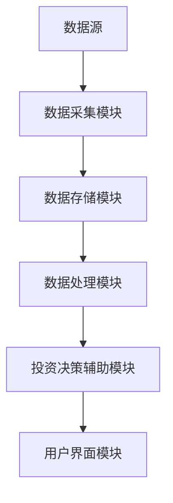

                 


# 彼得林奇的"常识投资"在人工智能决策辅助时代的价值重估

---

## 关键词  
- 彼得·林奇，常识投资，人工智能，投资决策，决策辅助，量化投资，数据挖掘，市场预测，投资策略

---

## 摘要  
彼得·林奇的“常识投资”是一种基于基本面分析和市场直觉的投资方法，强调通过深入研究和常识判断来寻找优质投资标的。随着人工智能技术的快速发展，AI在投资决策中的应用越来越广泛，其强大的数据处理能力、模式识别能力和预测能力正在重新定义传统投资方法的价值。本文将从常识投资的核心理念出发，分析其在AI决策辅助时代的潜力与挑战，探讨如何将传统投资智慧与现代技术相结合，构建更加高效、智能的投资决策系统。

---

## 第一部分: 彼得·林奇的"常识投资"概述

### 第1章: 常识投资的核心理念  

#### 1.1 常识投资的定义与背景  
常识投资是彼得·林奇提出的一种投资方法，其核心在于通过深入研究企业的基本面，结合市场环境和投资者心理，做出理性且具有前瞻性的投资决策。这种方法强调投资者应具备对企业、行业和市场的深刻理解，而非单纯依赖市场短期波动。  

#### 1.2 常识投资的哲学与方法  
- **基本面分析**：通过对企业的财务数据、行业地位、管理团队等进行深入分析，识别具有长期增长潜力的投资标的。  
- **市场情绪与投资者心理**：关注市场情绪的变化，避免被短期市场波动所左右，注重长期价值的挖掘。  
- **长期投资与价值发现**：常识投资强调长期持有的理念，寻找那些能够持续创造价值的企业，而非短期投机。  

### 第2章: AI决策辅助的现状与挑战  

#### 2.1 人工智能在投资领域的应用  
人工智能技术在投资领域的应用主要体现在以下几个方面：  
1. **机器学习与投资预测**：通过训练机器学习模型，预测市场走势和企业业绩。  
2. **自然语言处理在市场分析中的作用**：利用NLP技术分析新闻、财报等文本数据，提取市场情绪和行业趋势。  
3. **数据挖掘与投资决策**：通过对海量数据的挖掘，发现潜在的投资机会和风险点。  

#### 2.2 AI决策辅助的主要挑战  
1. **数据质量与模型偏差**：投资数据的质量直接影响模型的准确性，而模型的偏差可能导致错误的决策。  
2. **模型的可解释性问题**：复杂的AI模型往往难以解释其决策过程，这在投资领域尤为重要。  
3. **市场波动与模型鲁棒性**：市场波动剧烈时，AI模型的预测能力可能受到挑战，需要更高的鲁棒性。  

---

## 第二部分: 常识投资与AI决策辅助的结合  

### 第3章: AI技术在常识投资中的应用潜力  

#### 3.1 AI在基本面分析中的应用  
1. **财务数据的自动化分析**：通过机器学习模型自动提取和分析企业的财务数据，识别财务健康状况。  
2. **公司新闻与市场情绪的智能处理**：利用NLP技术分析公司新闻和市场评论，提取情绪指标，辅助投资决策。  
3. **行业趋势的预测与识别**：通过时间序列分析和模式识别，预测行业发展趋势，识别潜在投资机会。  

#### 3.2 AI在市场预测中的创新应用  
1. **时间序列预测模型**：利用LSTM等深度学习模型预测股票价格和市场走势。  
2. **基于NLP的市场情绪分析**：通过分析社交媒体和新闻媒体的情绪，预测市场短期波动。  
3. **多因素模型的优化与应用**：结合传统多因素模型与AI技术，优化投资组合的构建。  

### 第4章: 常识投资与AI决策辅助的融合策略  

#### 4.1 传统投资策略的数字化转型  
1. **基于常识的量化投资模型**：将传统投资理念转化为量化指标，结合AI技术进行投资决策。  
2. **AI驱动的动态投资组合管理**：根据市场变化实时调整投资组合，结合常识投资的长期价值视角。  
3. **常识与数据的结合：投资决策的新范式**：通过AI技术增强常识投资的决策能力，同时利用数据驱动的方法验证和优化投资策略。  

#### 4.2 AI辅助下的投资决策优化  
1. **基于AI的风险评估与管理**：通过AI技术识别和量化投资风险，制定风险控制策略。  
2. **智能选股与投资机会挖掘**：利用AI技术筛选具有成长潜力的企业，辅助投资决策。  
3. **实时市场反馈与投资策略调整**：结合实时市场数据和AI模型反馈，动态调整投资策略。  

---

## 第三部分: 系统分析与架构设计  

### 第5章: 系统架构与功能设计  

#### 5.1 系统架构设计  
1. **整体架构图**：  

2. **数据流与功能模块划分**：系统分为数据采集、数据处理、投资决策辅助和用户界面四个主要模块，数据在各模块之间流动，完成从数据输入到决策输出的全过程。  
3. **系统扩展性与可维护性**：通过模块化设计，确保系统具有良好的扩展性和可维护性，方便后续功能的添加和优化。  

#### 5.2 功能模块详细设计  
1. **数据采集模块**：负责从多种数据源（如股票数据、新闻数据等）获取数据，并进行初步清洗和预处理。  
2. **数据处理与分析模块**：对数据进行深度分析，包括时间序列分析、NLP分析等，提取有用的投资信号。  
3. **投资决策辅助模块**：结合AI模型和常识投资理念，生成投资建议和决策支持。  

---

## 第四部分: 项目实战与案例分析  

### 第7章: 项目实战与代码实现  

#### 7.1 环境搭建与数据准备  
1. **开发环境与工具选择**：推荐使用Python作为开发语言，结合TensorFlow、Keras等深度学习框架。  
2. **数据源获取与预处理**：从公开数据源获取股票数据和新闻数据，进行清洗和格式化处理。  

#### 7.2 核心算法实现  
1. **时间序列预测模型**：  
   ```python
   import numpy as np
   import pandas as pd
   from tensorflow.keras.models import Sequential
   from tensorflow.keras.layers import LSTM, Dense

   # 数据准备
   data = pd.read_csv('stock_data.csv')
   train_data = data['close'].values[:1000]
   test_data = data['close'].values[1000:]

   # 数据预处理
   train_data = train_data.reshape(-1, 1)
   train_data = train_data / np.max(train_data)

   # 模型构建
   model = Sequential()
   model.add(LSTM(128, input_shape=(None, 1)))
   model.add(Dense(1))
   model.compile(loss='mean_squared_error', optimizer='adam')

   # 训练模型
   model.fit(train_data, epochs=50, batch_size=32)
   ```

2. **NLP分析模型**：  
   ```python
   from transformers import pipeline

   sentiment_pipeline = pipeline("sentiment-analysis")
   sentiment = sentiment_pipeline("Recent news about the company is positive")[0]['label']
   ```

#### 7.3 案例分析与结果解读  
通过实际案例分析，展示如何利用AI技术辅助常识投资决策。例如，在分析一家科技公司的股票时，结合其财务数据和新闻情绪，利用AI模型预测其股价走势，并与实际数据对比，验证模型的准确性。  

---

## 第五部分: 总结与展望  

### 第8章: 总结与展望  

#### 8.1 总结  
本文从常识投资的核心理念出发，探讨了AI技术在投资决策中的应用潜力，并提出了将两者结合的融合策略。通过系统设计和项目实战，展示了如何利用AI技术增强传统投资方法的决策能力。  

#### 8.2 展望  
随着AI技术的不断进步，常识投资在AI决策辅助时代将焕发新的活力。未来，可以通过以下几个方面进一步优化：  
1. 提高AI模型的可解释性，增强投资者对AI决策的信任。  
2. 结合更复杂的数据挖掘技术，发现更多潜在的投资机会。  
3. 加强对市场波动的预测能力，提升模型的鲁棒性。  

---

## 作者：AI天才研究院 & 禅与计算机程序设计艺术  

---

**注意：** 以上内容仅为示例，实际文章需根据具体需求进行调整和补充。

