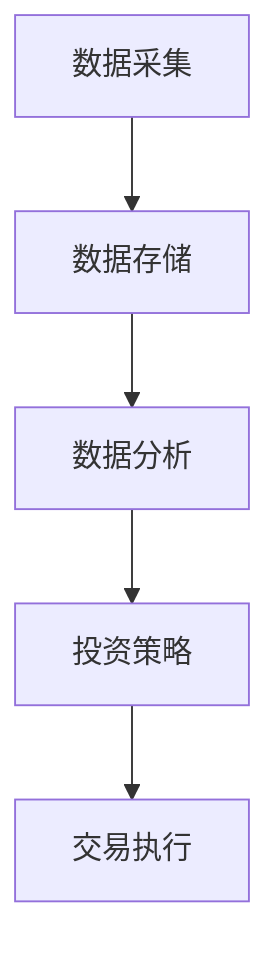

                 


# 彼得林奇的"常识投资"在人工智能时代的调整

> 关键词：彼得林奇，常识投资，人工智能，投资策略，算法，数据分析

> 摘要：本文探讨了彼得林奇的常识投资理论在人工智能时代的调整，分析了AI技术如何改变投资决策，结合具体算法如回归分析和时间序列分析，展示了如何利用AI优化投资组合和风险评估。

---

## 引言

在金融投资领域，彼得·林奇以其常识投资理论闻名，强调对公司基本面的深入研究和市场趋势的判断。然而，随着人工智能技术的飞速发展，投资环境发生了巨大变化。本文将探讨在AI时代，常识投资策略如何调整，以适应新的技术挑战和市场动态。

---

## 第1章：常识投资的基本概念

### 1.1 彼得·林奇的常识投资理论

常识投资强调通过深入分析公司基本面，如财务状况、管理层能力和行业地位，来做出投资决策。林奇认为，投资者应选择自己熟悉的公司，避免盲目跟风。

- **核心观点**：
  - 选择具有持续增长潜力的公司。
  - 避免短期市场波动，关注长期价值。
  - 通过深入研究降低投资风险。

### 1.2 AI时代对投资的影响

人工智能技术的引入，为投资决策带来了新的可能性。AI可以通过处理大量数据，提供更精准的市场预测和风险评估。

- **数据驱动决策**：AI能够分析历史数据，识别市场趋势和潜在风险。
- **自动化交易**：算法交易通过AI实时分析市场数据，执行交易策略。
- **个性化投资建议**：AI可以根据投资者的风险承受能力和财务状况，提供定制化建议。

---

## 第2章：常识投资在AI时代的调整

### 2.1 数据驱动的决策方式

AI通过大数据分析，帮助投资者做出更科学的决策。以下是如何利用AI进行数据驱动投资的步骤：

1. **数据收集**：收集公司财务数据、市场趋势、行业报告等。
2. **数据清洗**：处理缺失值和异常值，确保数据质量。
3. **数据分析**：使用统计方法和机器学习模型进行预测和分类。

### 2.2 AI在投资组合管理中的应用

AI可以通过优化算法，帮助投资者构建最优投资组合，平衡风险与收益。

- **算法优化**：使用遗传算法或模拟退火算法，寻找最优解。
- **风险管理**：通过VaR（在险价值）模型，评估投资组合的风险。

---

## 第3章：AI技术在投资中的算法原理

### 3.1 回归分析在投资中的应用

回归分析用于预测资产价格和评估投资回报。

- **线性回归**：模型形式为$$y = \beta_0 + \beta_1x + \epsilon$$，其中$x$是自变量，$y$是因变量。
- **多元回归**：扩展为多个自变量，模型形式为$$y = \beta_0 + \beta_1x_1 + \beta_2x_2 + \ldots + \beta_nx_n + \epsilon$$。

### 3.2 时间序列分析

时间序列分析用于预测未来价格走势。

- **ARIMA模型**：Autoregressive Integrated Moving Average模型，适用于非平稳序列。
- **步骤**：
  1. 检验数据的平稳性。
  2. 确定模型参数。
  3. 模型训练与预测。

---

## 第4章：系统架构设计

### 4.1 系统功能设计

- **数据采集模块**：收集市场数据和公司财报。
- **数据分析模块**：应用机器学习算法进行预测和分类。
- **投资策略模块**：根据分析结果制定投资策略。

### 4.2 系统架构图



---

## 第5章：项目实战

### 5.1 调整投资组合的案例

假设我们有一个包含股票和债券的投资组合，目标是优化其风险收益比。

- **步骤**：
  1. 收集历史数据。
  2. 训练机器学习模型。
  3. 评估不同组合的风险和收益。

### 5.2 Python代码实现

```python
import pandas as pd
import numpy as np

# 示例数据
data = pd.DataFrame({
    'returns': [0.05, 0.02, -0.01, 0.03, 0.0]
})

# 计算VaR
def calculate_var(data, confidence_level=0.95):
    returns_sorted = np.sort(data['returns'])
    percentile = int(confidence_level * (len(returns_sorted) - 1))
    var = returns_sorted[percentile]
    return var

var = calculate_var(data)
print(f"VaR at {confidence_level} confidence level: {var}")
```

---

## 第6章：最佳实践与小结

### 6.1 小结

- AI技术为投资决策提供了新的工具和方法。
- 通过数据驱动和算法优化，投资者可以做出更科学的决策。

### 6.2 注意事项

- 数据质量至关重要，需确保数据的准确性和完整性。
- 模型需定期更新，以适应市场变化。
- 投资者应理解AI的局限性，避免过度依赖技术。

### 6.3 拓展阅读

- 《机器学习实战》
- 《Python金融大数据分析》

---

## 结语

彼得·林奇的常识投资在人工智能时代需要进行调整，以适应新的技术和市场环境。通过结合AI技术，投资者可以更高效地进行数据分析和决策制定，从而提高投资收益和风险控制能力。未来，随着技术的不断进步，AI在投资中的应用将更加广泛和深入。

---

## 作者：AI天才研究院 & 禅与计算机程序设计艺术

---

