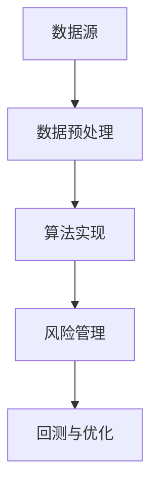

                 


# 彼得林奇的"常识投资"在复杂衍生品市场中的应用

> 关键词：彼得林奇，常识投资，复杂衍生品，期权定价，风险管理，投资策略

> 摘要：本文探讨了彼得林奇的常识投资理念在复杂衍生品市场中的应用，分析了其在衍生品定价、风险管理以及投资策略优化中的价值。通过结合实际案例和数学模型，展示了如何将常识投资方法应用于复杂衍生品市场的策略制定和实践。

---

## 第1章：常识投资的定义与衍生品市场的结合

### 1.1 常识投资的基本概念

#### 1.1.1 投资的基本定义
投资是指将资金投入某个项目或资产，以期望在未来获得收益或资本增值的行为。投资的核心在于识别有价值的机会，并通过合理的资源配置实现收益最大化。

#### 1.1.2 彼得林奇的常识投资方法
彼得·林奇是美国著名投资经理人，以其独特的“常识投资”理念闻名。他认为，成功的投资不需要复杂的数学模型或高深的金融理论，而是基于对公司基本面的深入研究和市场常识的判断。具体而言，常识投资包括以下几点：
- **基本面分析**：研究公司的财务报表、行业地位、管理团队等因素。
- **市场情绪分析**：关注市场参与者的心理和行为，避免盲目跟风。
- **风险控制**：在投资决策中始终考虑潜在风险，并制定相应的应对策略。

#### 1.1.3 常识投资的核心理念与原则
- **长期投资**：避免频繁交易，专注于优质资产的长期增值。
- **分散投资**：通过多元化配置降低风险，避免过度集中在单一资产或行业。
- **价值投资**：寻找被市场低估的优质公司，长期持有，等待价值回归。

---

### 1.2 衍生品市场的基本概念

#### 1.2.1 衍生品市场的定义与分类
衍生品市场是指交易金融衍生品的市场，金融衍生品包括期权、期货、掉期（Swap）和远期合约等。这些产品通常基于基础资产（如股票、债券、商品等）的价格波动进行交易。

衍生品市场的分类如下：
1. **场内市场**：在交易所进行标准化交易，如期权和期货。
2. **场外市场**：非标准化的私人交易，通常涉及复杂的掉期和远期合约。

#### 1.2.2 期权、期货、掉期等衍生品的特性
- **期权**：买方有权在特定时间以预定价格购买或出售标的资产，卖方则有义务配合交易。
- **期货**：双方约定在未来特定时间以预定价格买卖标的资产。
- **掉期**：双方在未来某一时间点交换资产或现金流。

#### 1.2.3 复杂衍生品市场的特点与挑战
复杂衍生品市场的特点包括：
- 高杠杆性：衍生品通常允许投资者以小博大，但也意味着高风险。
- 高流动性：许多衍生品在交易所上市，具有较高的流动性。
- 高风险性：复杂的定价模型和市场波动可能导致巨大损失。

---

## 第2章：常识投资在衍生品市场中的应用背景

### 2.1 传统投资与复杂衍生品市场的区别

#### 2.1.1 传统股票投资的基本方法
传统股票投资主要基于对公司基本面的分析，如收入、利润、资产负债表等。投资者通过分析财务报表和市场趋势来判断股票的价值。

#### 2.1.2 复杂衍生品市场的特殊性
复杂衍生品市场的特殊性体现在：
- 产品复杂性：衍生品通常基于基础资产的波动性设计，涉及复杂的定价模型。
- 市场参与者：包括机构投资者、对冲基金和个人投资者。
- 风险管理：衍生品市场的风险主要来自价格波动和信用风险。

#### 2.1.3 常识投资在衍生品市场的适用性
常识投资在衍生品市场的适用性体现在以下几个方面：
- 基于基本面分析：通过研究标的资产的基本面，判断衍生品的内在价值。
- 市场情绪分析：利用市场情绪的变化，捕捉衍生品市场的短期波动机会。
- 风险管理：通过分散投资和设置止损点来降低风险。

---

### 2.2 衍生品市场中的常见问题与挑战

#### 2.2.1 信息不对称的问题
信息不对称是指市场参与者掌握的信息量不同，可能导致价格扭曲和交易机会的不公平。

#### 2.2.2 市场波动性与风险
衍生品市场的波动性较高，容易受到宏观经济因素和市场情绪的影响。

#### 2.2.3 衍生品定价的复杂性
复杂的定价模型（如Black-Scholes公式）需要大量的数据和假设，可能导致定价偏差。

---

## 第3章：常识投资的核心概念与理论基础

### 3.1 常识投资的核心概念

#### 3.1.1 基本面分析的重要性
基本面分析是常识投资的核心，通过研究公司的财务报表、行业地位和管理团队等因素，判断其未来的盈利能力。

#### 3.1.2 市场情绪与投资者行为
市场情绪是影响衍生品价格的重要因素。投资者行为通常受到贪婪和恐惧的驱动，导致市场的波动。

#### 3.1.3 风险管理的核心地位
风险管理是投资成功的关键，通过合理配置资产和设置止损点，降低潜在损失。

---

### 3.2 衍生品市场的理论基础

#### 3.2.1 期权定价模型（如Black-Scholes公式）
Black-Scholes公式是衍生品定价的基础，用于计算期权的理论价格。公式如下：

$$ C = S_0 \cdot N(d_1) - K \cdot e^{-rT} \cdot N(d_2) $$

其中：
- \( C \) 是看涨期权的价格
- \( S_0 \) 是标的资产的价格
- \( K \) 是行权价格
- \( r \) 是无风险利率
- \( T \) 是到期时间
- \( N(d) \) 是标准正态分布的累积分布函数
- \( d_1 = \frac{\ln(S_0/K) + (r + \sigma^2/2)T}{\sigma \sqrt{T}} \)
- \( d_2 = d_1 - \sigma \sqrt{T} \)

#### 3.2.2 风险中性定价理论
风险中性定价理论假设市场参与者是风险中性的，通过无风险利率进行定价。

#### 3.2.3 市场套利与无套利原理
套利是指在不同市场或资产之间利用价格差异获利。无套利原理假设在有效市场中，套利机会不存在。

---

## 第4章：常识投资在衍生品市场中的策略分析

### 4.1 基于基本面的衍生品投资策略

#### 4.1.1 股票期权的买入策略
买入看涨期权是一种常见的策略，适合预期标的资产价格上涨的投资者。

#### 4.1.2 期货市场的套期保值应用
套期保值是通过期货市场对冲现货市场的价格波动风险。

#### 4.1.3 利用波动率的跨式策略
跨式策略是同时买入看涨和看跌期权，适用于预期标的资产价格大幅波动的情况。

---

### 4.2 技术分析与常识投资的结合

#### 4.2.1 技术分析在衍生品交易中的应用
技术分析通过研究价格走势和成交量，预测未来的市场趋势。

#### 4.2.2 结合基础分析与技术分析
将基本面分析与技术分析相结合，提高投资决策的准确性。

---

## 第5章：系统架构与算法实现

### 5.1 系统架构设计

#### 5.1.1 系统功能设计
- 数据收集与预处理
- 算法实现与优化
- 风险管理与回测

#### 5.1.2 系统架构图


### 5.2 算法实现

#### 5.2.1 Black-Scholes模型实现
```python
import math

def black_scholes(S, K, r, sigma, T):
    d1 = (math.log(S/K) + (r + sigma**2/2)*T) / (sigma * math.sqrt(T))
    d2 = d1 - sigma * math.sqrt(T)
    N = lambda x: math.erf(x / math.sqrt(2))
    call_price = S * N(d1) - K * math.exp(-r*T) * N(d2)
    return call_price
```

---

## 第6章：项目实战与案例分析

### 6.1 环境安装与配置

#### 6.1.1 Python环境配置
安装Python和必要的库（如numpy、pandas、scipy）。

#### 6.1.2 数据源选择
选择可靠的金融数据源，如Yahoo Finance或Quandl。

---

### 6.2 核心代码实现

#### 6.2.1 波动率套利策略
```python
import pandas as pd
import numpy as np

def volatility_arbitrage(data, window=20):
    # 计算波动率
    returns = data.pct_change().dropna()
    volatility = returns.rolling(window).std()
    # 识别波动率高的标的
    high_volatility = volatility[volatility > np.mean(volatility)]
    return high_volatility
```

---

## 第7章：总结与展望

### 7.1 总结
本文探讨了彼得林奇的常识投资理念在复杂衍生品市场中的应用，分析了其在衍生品定价、风险管理以及投资策略优化中的价值。

### 7.2 展望
未来，随着人工智能和大数据技术的发展，常识投资在衍生品市场中的应用将更加广泛和深入。

---

## 作者：AI天才研究院/AI Genius Institute & 禅与计算机程序设计艺术 /Zen And The Art of Computer Programming

---

通过本文的分析，读者可以深入了解如何将常识投资理念应用于复杂衍生品市场，并通过实际案例和代码实现，掌握相关策略和方法。

