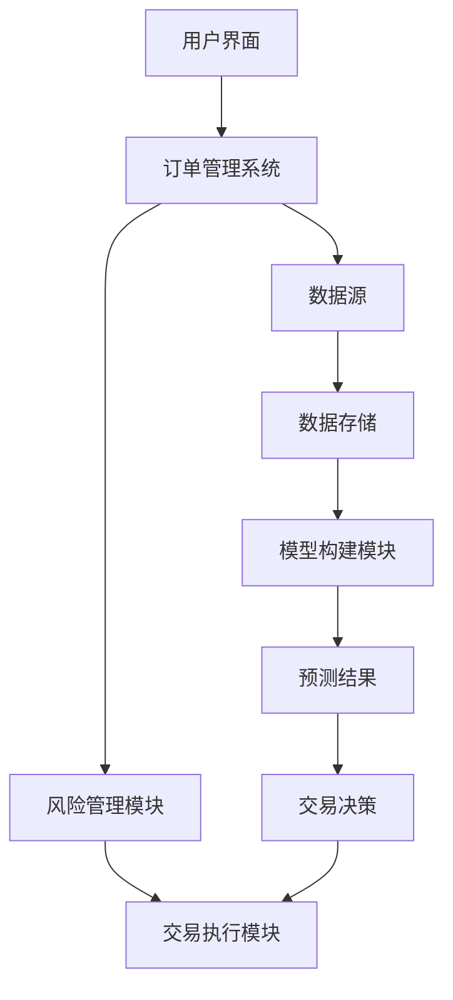
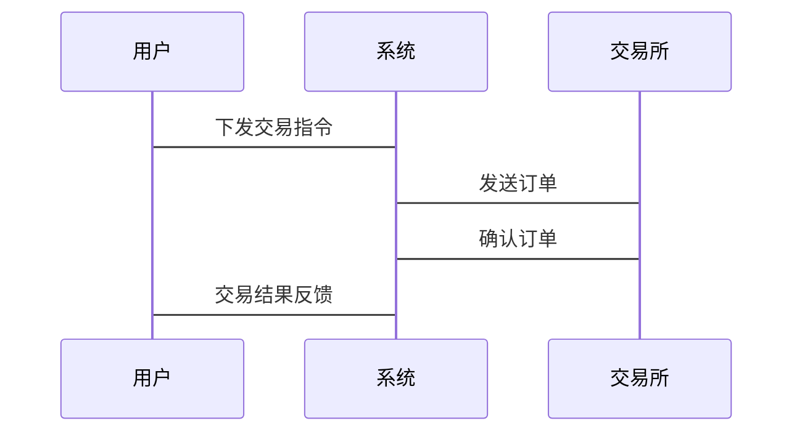

                 


# 彼得林奇的"常识投资"在算法交易盛行时代的重新定位

## 关键词：常识投资，算法交易，彼得林奇，金融投资，量化分析

## 摘要：在算法交易主导的金融市场中，传统投资策略面临巨大挑战。本文深入分析彼得林奇的常识投资理念，探讨其在算法交易时代的适应性与创新。通过结合算法交易的技术优势，提出新的投资策略，为投资者提供理论与实践的双重指导。

---

## 第一部分：彼得林奇常识投资理论的回顾

### 第1章：彼得林奇常识投资的核心理念

#### 1.1 彼得林奇投资理论的起源

- **1.1.1 彼得林奇的生平简介**
  - 彼得·林奇（Peter Lynch）是美国著名投资家，曾管理富达麦哲伦基金，创造了卓越的投资业绩。
  - 他强调基本面分析和长期投资，提倡“常识投资”理念，认为普通投资者也能通过分析经济数据和公司基本面进行投资。

- **1.1.2 常识投资的核心思想**
  - 基于对公司基本面的深入分析，选择具有竞争优势和良好前景的公司。
  - 长期持有优质股票，避免频繁交易，减少交易成本和税务负担。
  - 通过分散投资降低风险，关注可预测的市场波动。

- **1.1.3 常识投资与价值投资的区别**
  - 价值投资侧重于寻找被市场低估的股票，强调安全边际。
  - 常识投资更注重公司基本面的持续增长和竞争优势，关注企业的长期盈利能力。

#### 1.2 常识投资的主要方法

- **1.2.1 基本面分析的要点**
  - 财务指标：关注净利润率、ROE（净资产收益率）、负债情况等。
  - 行业分析：了解公司所在行业的竞争状况和未来发展趋势。
  - 管理层评估：考察公司管理层的稳定性、战略眼光和执行力。

- **1.2.2 股票筛选的标准**
  - 公司具有持续增长的潜力。
  - 公司财务健康，负债合理，现金流稳定。
  - 公司在行业中具有竞争优势，如技术领先、成本优势等。

- **1.2.3 长期投资的策略**
  - 定期审视投资组合，根据公司基本面变化进行调整。
  - 避免短期市场波动的干扰，保持长期投资的纪律性。
  - 结合市场周期，灵活调整投资策略，如在市场低迷时增加持仓。

### 第2章：算法交易的现状与发展

#### 2.1 算法交易的定义与特点

- **2.1.1 算法交易的定义**
  - 算法交易（Algorithmic Trading）是指利用数学模型和计算机程序自动执行交易决策的过程。
  - 通过算法分析市场数据，识别交易机会，并在极短时间内完成交易。

- **2.1.2 算法交易的核心技术**
  - 数据处理：实时收集和分析市场数据，包括价格、成交量等。
  - 模型开发：利用统计学和机器学习方法，构建预测模型。
  - 系统执行：通过交易平台自动下单，确保交易的快速和准确。

- **2.1.3 算法交易与传统交易的区别**
  - 交易速度：算法交易可以以毫秒级速度完成，而传统交易通常较慢。
  - 决策方式：算法交易依赖模型和算法，传统交易依赖人类判断。
  - 风险控制：算法交易可以通过模型实时监控和调整风险，传统交易则依赖人工判断。

#### 2.2 算法交易的主要类型

- **2.2.1 高频交易**
  - 特点：高频、高频率的交易策略，利用算法在极短时间内完成大量交易。
  - 优势：捕捉市场微小波动，获取短期利润。
  - 劣势：风险极高，依赖技术基础设施，可能引发市场闪崩。

- **2.2.2 统计套利**
  - 特点：利用统计方法寻找市场中的定价偏差，通过套利获利。
  - 优势：基于数学模型，风险可控。
  - 劣势：依赖数据质量和模型的有效性，市场变化可能导致模型失效。

- **2.2.3 量化交易**
  - 特点：使用量化方法进行交易决策，依赖数学模型和算法。
  - 优势：可以处理大量数据，发现市场中的规律和机会。
  - 劣势：模型过度拟合风险，可能在市场变化中表现不佳。

#### 2.3 算法交易对市场的深远影响

- **2.3.1 市场流动性的提升**
  - 算法交易增加了市场的参与者，提高了市场的流动性和价格效率。
  - 提供了更多的交易机会，降低了交易成本。

- **2.3.2 市场波动性的增加**
  - 高频交易和算法交易可能导致市场波动加剧，出现短期剧烈的价格波动。
  - 可能引发市场闪崩，对市场稳定性构成挑战。

- **2.3.3 市场结构的变化**
  - 算法交易推动了电子交易平台的发展，传统交易所的地位受到挑战。
  - 市场参与者结构发生变化，机构投资者和个人投资者的比例调整。

### 第3章：算法交易时代下常识投资的挑战与机遇

#### 3.1 算法交易对传统投资策略的冲击

- **3.1.1 短期波动对长期投资的影响**
  - 算法交易可能导致短期价格剧烈波动，影响长期投资的稳定性。
  - 投资者可能因为短期波动而做出错误的决策，如盲目跟风或恐慌性抛售。

- **3.1.2 算法交易对市场有效性的挑战**
  - 算法交易可能导致市场过度波动，影响价格发现的效率。
  - 部分市场参与者利用算法进行套利，可能扭曲市场价格。

- **3.1.3 投资者行为的变化**
  - 算法交易使得投资者的行为更加理性化和数据驱动。
  - 传统的人类判断在市场中逐渐被算法决策取代，投资者需要适应新的决策模式。

#### 3.2 常识投资在算法交易环境中的新定位

- **3.2.1 长期投资与短期波动的平衡**
  - 在算法交易环境下，投资者需要平衡长期投资策略与短期市场波动。
  - 通过基本面分析，选择具有长期增长潜力的公司，同时关注短期波动对投资组合的影响。

- **3.2.2 基本面分析与技术分析的结合**
  - 算法交易依赖技术分析，而常识投资依赖基本面分析。
  - 将基本面分析与技术分析相结合，可以提高交易决策的准确性。
  - 使用算法工具辅助基本面分析，提高分析效率和准确性。

- **3.2.3 风险管理的新策略**
  - 在算法交易环境下，风险管理更加重要。
  - 使用算法模型实时监控市场风险，及时调整投资组合。
  - 结合传统风险管理方法，如止损、分散投资等，构建更加稳健的投资组合。

## 第二部分：算法交易时代下常识投资的新策略

### 第4章：系统分析与架构设计

#### 4.1 问题场景介绍

- 在算法交易环境下，如何将常识投资理念与算法交易技术相结合，构建新的投资策略。
- 如何利用算法技术辅助基本面分析，提高投资决策的效率和准确性。

#### 4.2 系统功能设计

- **4.2.1 数据采集模块**
  - 实时采集市场数据，包括价格、成交量、财务数据等。
  - 数据源包括股票市场、债券市场、期货市场等。
- **4.2.2 模型构建模块**
  - 利用机器学习和统计学方法，构建预测模型。
  - 模型包括基本面分析模型、市场情绪分析模型等。
- **4.2.3 交易执行模块**
  - 根据模型预测结果，自动执行交易决策。
  - 支持多种交易策略，如趋势跟踪、套利等。

#### 4.3 系统架构设计



#### 4.4 系统接口设计

- API接口：
  - 数据接口：获取市场数据，如价格、成交量等。
  - 模型接口：调用预测模型，获取交易信号。
  - 执行接口：发送交易指令，执行订单。

#### 4.5 系统交互设计



### 第5章：项目实战

#### 5.1 环境安装

- 安装Python编程环境，如Anaconda。
- 安装必要的库，如Pandas、NumPy、Matplotlib、Scikit-learn、Zipline等。

#### 5.2 系统核心实现

- **5.2.1 数据采集**

```python
import pandas as pd
import numpy as np

# 示例数据：模拟股票价格
data = {'date': ['2023-01-01', '2023-01-02', '2023-01-03', '2023-01-04', '2023-01-05'],
        'price': [100, 101, 99, 102, 100]}
df = pd.DataFrame(data)
print(df)
```

- **5.2.2 模型构建**

```python
from sklearn.linear_model import LinearRegression

# 示例数据：预测股票价格
X = np.array([1, 2, 3, 4, 5]).reshape(-1, 1)
y = np.array([100, 101, 99, 102, 100])

model = LinearRegression()
model.fit(X, y)

# 预测价格
print(model.predict(np.array([[6]])))
```

- **5.2.3 交易执行**

```python
# 示例代码：简单的交易策略
import zipline as zp

class SimpleStrategy(zp.Algorithm):
    def initialize(self):
        self.position = None

    def handle_data(self, data):
        if self.position is None:
            self.position = self.symbol('AAPL')
            self.order(self.position, 100)
        else:
            if data.current('AAPL', 'close') > data.current('AAPL', 'open'):
                self.order(self.position, 150)
            else:
                self.position.close()

algo = SimpleStrategy()
```

#### 5.3 代码应用解读

- 数据采集模块：通过Python库采集实时市场数据，包括股票价格、成交量等。
- 模型构建模块：使用机器学习模型分析数据，生成交易信号。
- 交易执行模块：根据模型预测结果，自动执行交易指令。

#### 5.4 实际案例分析

- 案例：利用算法交易辅助基本面分析，投资科技公司股票。
- 步骤：
  1. 采集目标公司的财务数据和市场数据。
  2. 构建预测模型，分析公司基本面和市场趋势。
  3. 根据模型预测结果，制定交易策略。
  4. 自动执行交易指令，实时监控交易结果。

## 第三部分：总结与展望

### 第6章：总结与展望

- **6.1 本文总结**
  - 在算法交易时代，传统投资策略需要与新技术相结合，才能在市场中保持竞争力。
  - 常识投资理念强调基本面分析和长期投资，算法交易则提供了高效的数据处理和交易执行手段。
  - 通过将两者结合，可以构建更加高效和稳健的投资策略。

- **6.2 未来展望**
  - 随着人工智能和大数据技术的发展，算法交易将更加智能化和个性化。
  - 常识投资与算法交易的结合将更加紧密，投资策略将更加多元化和复杂化。
  - 投资者需要不断学习新技术，适应市场变化，才能在竞争激烈的市场中立于不败之地。

---

## 作者：AI天才研究院/AI Genius Institute & 禅与计算机程序设计艺术 /Zen And The Art of Computer Programming

