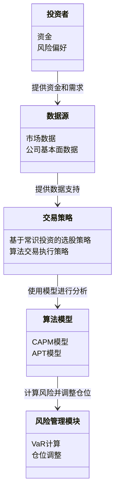

                 


# 彼得林奇的"常识投资"在算法交易盛行时代的重要性

## 关键词：彼得林奇、常识投资、算法交易、金融投资、量化交易、风险管理

## 摘要：  
在当今金融市场中，算法交易和量化投资已经成为主流趋势，但彼得·林奇的“常识投资”理念依然具有重要的现实意义。本文从背景介绍、核心概念与联系、算法交易的数学模型与系统架构等方面，详细探讨了常识投资与算法交易的结合。通过分析两者的优势和不足，结合实际案例，本文提出了如何在算法交易时代中有效运用常识投资理念，以提升投资效率和风险管理能力。

---

## 第一部分: 彼得林奇的"常识投资"与算法交易的背景介绍

### 第1章: 常识投资的定义与核心理念  
常识投资是一种以基本面分析为基础的投资策略，强调通过对公司基本面的深入研究，选择具有长期竞争优势和合理估值的公司进行投资。其核心理念包括：  
1. **长期投资**：关注企业的长期价值，而非短期市场波动。  
2. **基本面分析**：通过对企业财务状况、行业地位和管理层能力的分析，选择优质企业。  
3. **分散投资**：通过投资于多个行业和企业，降低投资风险。  

### 第2章: 算法交易的现状与发展趋势  
算法交易是一种基于数学模型和算法自动执行交易的策略，其特点包括：  
1. **高速交易**：利用计算机程序快速完成交易决策和执行。  
2. **量化分析**：依赖数学模型和大数据分析，寻找市场中的套利机会。  
3. **高频交易**：在极短时间内完成大量交易，以捕捉微小的价格波动。  

近年来，算法交易在全球金融市场中占据了重要地位，尤其是在美国、欧洲和亚洲的交易所中，算法交易的比例已经超过50%。然而，随着算法交易的普及，市场波动性增加，传统投资策略面临新的挑战。

### 第3章: 常识投资与算法交易的联系  
常识投资与算法交易看似对立，但两者并非完全割裂。常识投资提供了长期价值判断的基础，而算法交易则通过技术手段提高了交易效率和精准度。两者的结合可以通过以下方式实现：  
1. **数据驱动的选股**：利用算法对大量数据进行筛选，快速识别符合常识投资标准的公司。  
2. **风险管理**：通过算法监控市场波动，及时调整投资组合，降低风险。  
3. **自动化交易执行**：在找到优质标的后，利用算法快速完成交易，提高执行效率。  

---

## 第二部分: 常识投资与算法交易的核心概念与联系

### 第4章: 常识投资的核心概念原理  
常识投资的核心在于“常识”——即通过对市场的理解、对公司基本面的分析以及对行业趋势的判断，选择具有长期竞争优势的企业。其关键特征包括：  
1. **长期视角**：关注企业的长期价值，而非短期价格波动。  
2. **低风险偏好**：通过分散投资和基本面分析，降低投资风险。  
3. **逆向思维**：在市场恐慌时寻找低估机会，在市场狂热时保持冷静。  

### 第5章: 算法交易的核心概念原理  
算法交易依赖于数学模型和计算机程序，通过分析市场数据和价格波动，寻找交易机会。其关键特征包括：  
1. **高速执行**：算法交易可以在毫秒级别完成交易决策和执行。  
2. **量化分析**：通过大数据分析和统计套利，寻找市场中的定价错误。  
3. **自动化决策**：交易策略完全依赖于算法，减少人为干预。  

### 第6章: 常识投资与算法交易的对比分析  
以下是对常识投资和算法交易的对比分析：

#### 对比特征表格  
| 特性               | 常识投资                   | 算法交易                   |  
|--------------------|---------------------------|---------------------------|  
| 投资理念           | 长期价值驱动               | 数据驱动                   |  
| 决策方式           | 人为判断                   | 算法自动决策               |  
| 交易频率           | 低频                       | 高频                       |  
| 风险偏好           | 低风险偏好                 | 高风险偏好（取决于策略）   |  
| 适用场景           | 长期价值投资               | 短期套利或高频交易         |  

#### 实体关系图  
```mermaid
entity RelationshipDiagram {
  常识投资 ----> 市场基本面
  算法交易 ----> 数据源
  常识投资 ----> 交易策略
  算法交易 ----> 算法模型
}
```

---

## 第三部分: 算法交易的数学模型与公式

### 第7章: 算法交易的数学模型  
算法交易依赖于多种数学模型，以下是其中两个经典模型的介绍：  

#### 7.1 CAPM模型  
CAPM（资本资产定价模型）用于计算资产的预期收益，公式如下：  
$$ E(r_i) = r_f + β_i (E(r_m) - r_f) $$  
其中：  
- \( E(r_i) \)：资产i的预期收益率  
- \( r_f \)：无风险利率  
- \( β_i \)：资产i的贝塔系数（衡量资产的系统性风险）  
- \( E(r_m) \)：市场预期收益率  

#### 7.2 APT模型  
APT（套利定价理论）用于分析资产收益与多个因素的关系，公式如下：  
$$ E(r_i) = α_i + β_i (E(r_m) - r_f) + γ_i z $$  
其中：  
- \( α_i \)：资产i的特异风险溢价  
- \( β_i \)：资产i的贝塔系数  
- \( z \)：其他影响因素  

#### 7.3 风险管理模型  
VaR（Value at Risk）用于衡量投资组合的风险，公式如下：  
$$ VaR = \mu + z \cdot \sigma $$  
其中：  
- \( \mu \)：平均回报  
- \( z \)：标准正态分布的分位数  
- \( \sigma \)：回报的标准差  

### 第8章: 算法交易的Python实现  
以下是CAPM和APT模型的Python代码实现示例：  

#### 8.1 CAPM模型的Python代码实现  
```python
import numpy as np

def calculate_capm(rf, beta, market_return):
    return rf + beta * (market_return - rf)

# 示例数据
rf = 0.05  # 无风险利率
beta = 1.2  # 贝塔系数
market_return = 0.10  # 市场预期收益率

expected_return = calculate_capm(rf, beta, market_return)
print(f"预期收益率：{expected_return}")
```

#### 8.2 APT模型的Python代码实现  
```python
def calculate_apt(rf, beta, market_return, z):
    return rf + beta * (market_return - rf) + z

# 示例数据
rf = 0.05
beta = 1.2
market_return = 0.10
z = 0.02

expected_return = calculate_apt(rf, beta, market_return, z)
print(f"预期收益率：{expected_return}")
```

---

## 第四部分: 系统分析与架构设计方案

### 第9章: 系统功能设计  
以下是结合常识投资和算法交易的系统功能设计：  

#### 领域模型（Mermaid 类图）  


---

## 第五部分: 项目实战

### 第10章: 项目实战  
#### 环境配置  
- 数据源：Yahoo Finance 或 Bloomberg  
- 工具：Python、Pandas、NumPy、Matplotlib  
- 环境：Jupyter Notebook 或 IDE  

#### 核心代码实现  
以下是基于常识投资和算法交易结合的策略实现：  

```python
import pandas as pd
import numpy as np
import yfinance as yf
from datetime import datetime, timedelta

# 下载数据
start_date = datetime.now() - timedelta(days=365)
end_date = datetime.now()
data = yf.download("AAPL", start=start_date, end=end_date)

# 计算基本面指标（简化）
data['SAR'] = data['Adj Close'].rolling(20).mean()  # 简单平均作为参考价值

# 基于CAPM的信号生成
def generate_signal(data, rf=0.05, beta=1.2, market_return=0.10):
    expected_return = rf + beta * (market_return - rf)
    signal = data['Adj Close'] < data['SAR'] * (1 + expected_return)
    return signal

signal = generate_signal(data)
data['Signal'] = signal.astype(int)

# 可视化
data[['Adj Close', 'SAR']].plot()
```

#### 案例分析  
通过上述代码，我们可以生成基于常识投资和算法交易结合的交易信号。当股票价格低于其预期价值时，触发买入信号；当价格高于预期价值时，触发卖出信号。这种方法结合了长期价值判断和短期价格波动分析，能够有效捕捉市场机会并控制风险。

---

## 第六部分: 总结

### 第11章: 总结与最佳实践  
1. **总结**  
   彼得·林奇的常识投资理念在算法交易盛行的时代依然具有重要的意义。通过结合长期价值判断和算法交易的技术优势，投资者可以在复杂多变的市场中找到平衡点，实现稳健的投资回报。  

2. **最佳实践**  
   - **数据驱动**：利用算法筛选数据，辅助常识投资的决策。  
   - **风险管理**：通过算法监控市场波动，及时调整投资组合。  
   - **持续学习**：关注市场变化，不断优化交易策略。  

3. **注意事项**  
   - 算法交易虽然高效，但需要谨慎选择模型和参数，避免过度依赖技术指标。  
   - 常识投资需要长期学习和积累，不能急于求成。  

4. **未来展望**  
   随着人工智能和大数据技术的不断发展，常识投资与算法交易的结合将更加紧密，投资者需要不断提升自身的技术能力和市场理解力，才能在未来的金融市场中立于不败之地。

---

## 作者：AI天才研究院 & 禅与计算机程序设计艺术

---

以上是完整的文章大纲及内容，涵盖背景介绍、核心概念、数学模型、系统架构、项目实战等部分，力求通过详细且通俗易懂的分析，帮助读者理解彼得林奇的常识投资在算法交易时代的重要性。

