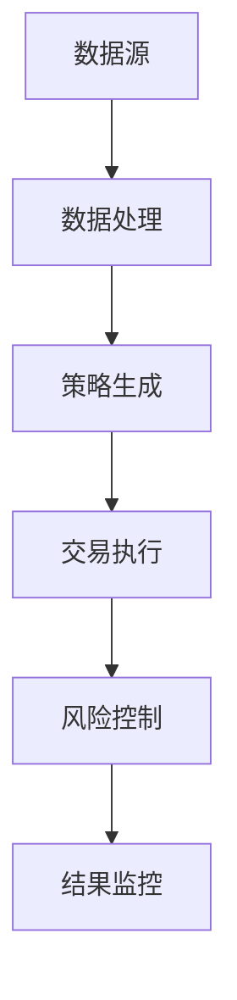
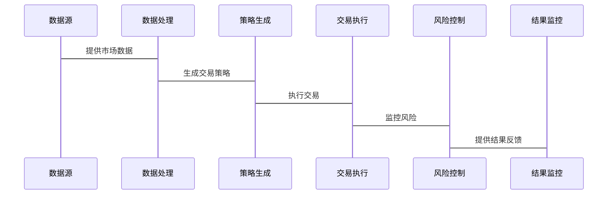

                 


```markdown
# 彼得林奇的"常识投资"在高频交易时代的价值重估

> 关键词：彼得林奇，常识投资，高频交易，算法优化，投资策略

> 摘要：本文探讨了彼得林奇的常识投资理念在高频交易时代的价值重估。通过分析高频交易的技术基础、算法实现与优化，结合常识投资的核心概念，提出了两者结合的可能性与必要性。文章从背景介绍、核心概念、算法实现、系统设计到项目实战，全面分析了高频交易时代下，常识投资的优化与重构。

---

## 第1章: 彼得林奇的常识投资理念

### 1.1 彼得林奇的常识投资概述

#### 1.1.1 彼得林奇的投资者背景
彼得·林奇是全球最著名的股票基金经理之一，他的投资理念以“常识投资”为核心，强调通过基本面分析和对企业内在价值的理解来进行投资决策。他主张投资者应该基于对企业竞争优势、财务状况和市场地位的分析，选择那些具有长期增长潜力的公司进行投资。

#### 1.1.2 常识投资的核心理念
常识投资的核心在于“买入并持有”，即通过长期持有优质股票，获得企业成长带来的收益。林奇认为，投资者不需要频繁交易，而是应该关注企业的基本面，选择那些具有强大竞争优势、合理估值和良好管理的公司。

#### 1.1.3 常识投资与价值投资的联系与区别
常识投资与价值投资有相似之处，但也有显著区别。价值投资强调以低于内在价值的价格买入优质资产，而常识投资更注重对企业基本面的深入研究和长期持有的策略。两者都强调安全边际和长期投资，但常识投资更注重对企业竞争优势的分析。

### 1.2 高频交易的现状与发展

#### 1.2.1 高频交易的定义与特点
高频交易是指通过计算机算法在极短时间内进行大量的交易，利用市场微小的价格波动赚取利润。高频交易的特点是交易速度快、算法复杂、依赖技术优势和高频数据。

#### 1.2.2 高频交易的技术基础
高频交易依赖于高速计算机、低延迟网络和高频数据源。交易系统需要能够在毫秒级别完成数据处理、算法决策和交易执行。高频交易的技术基础包括算法交易、高频数据处理和交易执行系统。

#### 1.2.3 高频交易对传统投资的挑战
高频交易的快速发展对传统投资策略提出了挑战。传统投资策略依赖于对企业基本面的分析，而高频交易则强调通过技术手段捕捉市场短期波动。两者的冲突在于，高频交易注重短期收益，而传统投资注重长期价值。

### 1.3 常识投资与高频交易的结合必要性

#### 1.3.1 常识投资在高频交易时代的困境
随着市场的日益复杂化和信息的碎片化，传统常识投资的效率和效果受到挑战。高频交易的兴起使得市场的波动性和不确定性增加，传统的长期持有策略在短期内面临更大的风险。

#### 1.3.2 高频交易对常识投资的补充作用
高频交易可以通过技术手段快速捕捉市场机会，为常识投资提供更多的数据支持和决策依据。高频交易可以帮助投资者在短期内优化交易策略，降低交易成本，提高交易效率。

#### 1.3.3 两者的结合对投资策略的优化
通过结合常识投资的长期视角和高频交易的短期技术优势，投资者可以在不同市场环境下灵活调整投资策略。这种结合可以实现长期价值与短期收益的平衡，提高投资组合的整体收益。

---

## 第2章: 常识投资的核心概念与高频交易的技术分析

### 2.1 常识投资的核心概念

#### 2.1.1 常识投资的基本原则
常识投资的基本原则包括：选择优质企业、长期持有、关注安全边际、分散投资和避免过度交易。这些原则强调对企业基本面的深入研究和长期投资的稳定性。

#### 2.1.2 安全边际的定义与计算
安全边际是指买入价格与企业内在价值之间的差距。通过计算安全边际，投资者可以避免在高估的市场中买入股票，降低投资风险。

#### 2.1.3 企业竞争优势的分析
竞争优势是企业长期盈利能力的核心。通过分析企业的竞争优势，投资者可以识别那些具有持续增长潜力的公司，从而做出更明智的投资决策。

### 2.2 高频交易的技术分析

#### 2.2.1 算法交易的数学模型
算法交易依赖于数学模型来预测市场走势和优化交易策略。常见的算法模型包括统计套利模型、动量模型和均值回归模型。

#### 2.2.2 数据处理与特征提取
高频交易依赖于高频数据的处理和特征提取。通过分析市场数据中的高频特征，交易系统可以快速识别市场机会和风险。

#### 2.2.3 交易策略的快速迭代
高频交易的策略需要不断优化和迭代。通过实时监控市场变化和交易结果，交易系统可以快速调整策略，适应市场环境。

### 2.3 常识投资与高频交易的对比分析

#### 2.3.1 常识投资的长期视角
常识投资强调长期持有和对企业基本面的研究，关注企业的竞争优势和内在价值。这种策略适合那些希望获得长期稳定收益的投资者。

#### 2.3.2 高频交易的短期视角
高频交易注重短期市场波动，依赖算法和高频数据，追求快速的买卖机会。这种策略适合那些希望在短期内获得高收益的投资者。

#### 2.3.3 两者的优缺点对比
常识投资的优点是稳定性高、风险低，缺点是灵活性差、交易成本高。高频交易的优点是灵活性高、交易成本低，缺点是风险高、稳定性差。

---

## 第3章: 高频交易中的算法实现与优化

### 3.1 高频交易的算法原理

#### 3.1.1 统计套利模型
统计套利模型通过分析市场的统计特征，寻找价格偏离合理区间的机会。这种模型依赖于数据的统计特征和算法优化。

#### 3.1.2 算法交易的流程
算法交易的流程包括数据采集、信号生成、订单执行和交易结果监控。每个环节都需要高效的算法和快速的执行系统。

#### 3.1.3 算法优化的数学模型
算法优化的数学模型包括回归分析、时间序列分析和风险管理系统。这些模型帮助交易系统实现最优的交易策略。

### 3.2 高频交易中的数学模型

#### 3.2.1 时间序列分析
时间序列分析用于预测市场的未来走势。通过分析历史价格数据，交易系统可以预测市场的短期波动。

#### 3.2.2 回归分析与预测
回归分析用于分析变量之间的关系，帮助交易系统预测市场的价格走势和交易机会。

#### 3.2.3 风险管理系统
风险管理模型用于控制交易风险，包括头寸管理和风险对冲策略。这些模型帮助交易系统在高频交易中降低风险。

### 3.3 算法优化的实现

#### 3.3.1 算法实现的Python代码
```python
import pandas as pd
import numpy as np
from sklearn.linear_model import LinearRegression

# 数据预处理
data = pd.read_csv('market_data.csv')
X = data[['open', 'high', 'low', 'close']]
y = data['next_day_return']

# 算法实现
model = LinearRegression()
model.fit(X, y)
predictions = model.predict(X)
```

#### 3.3.2 算法优化的数学推导
$$ \text{优化目标} = \min \sum (y_i - \hat{y}_i)^2 $$
其中，$$ y_i $$ 是实际值，$$ \hat{y}_i $$ 是预测值。

#### 3.3.3 算法优化的案例分析
通过分析高频交易中的具体案例，我们可以看到算法优化如何帮助交易系统实现更高的收益和更低的风险。

---

## 第4章: 常识投资与高频交易的结合策略

### 4.1 常识投资在高频交易中的应用

#### 4.1.1 基于基本面分析的高频交易策略
通过结合基本面分析和高频交易技术，投资者可以实现对企业基本面的实时监控和快速反应。

#### 4.1.2 企业竞争优势的快速识别
通过高频数据和算法分析，投资者可以快速识别企业的竞争优势，优化投资决策。

#### 4.1.3 安全边际的动态调整
通过高频数据和算法优化，投资者可以实现安全边际的动态调整，降低投资风险。

### 4.2 高频交易对常识投资的优化

#### 4.2.1 数据驱动的决策优化
通过高频数据和算法分析，投资者可以实现数据驱动的决策优化，提高投资效率。

#### 4.2.2 算法辅助的快速决策
通过算法辅助，投资者可以快速识别市场机会和风险，优化投资策略。

#### 4.2.3 风险控制的强化
通过高频交易的技术优势，投资者可以实现更有效的风险控制，降低投资风险。

### 4.3 结合策略的系统架构设计

#### 4.3.1 系统功能设计
系统功能包括数据采集、策略生成、交易执行和风险控制。这些功能需要协同工作，实现投资策略的优化。

#### 4.3.2 系统架构图


#### 4.3.3 系统接口设计
系统接口包括数据接口、交易接口和风险控制接口。这些接口需要实现高效的交互，保证系统的运行效率。

#### 4.3.4 系统交互序列图


---

## 第5章: 项目实战

### 5.1 环境安装
安装必要的软件和库，包括Python、Pandas、NumPy和Scikit-learn。

### 5.2 系统核心实现源代码
```python
import pandas as pd
import numpy as np
from sklearn.linear_model import LinearRegression

# 数据预处理
data = pd.read_csv('market_data.csv')
X = data[['open', 'high', 'low', 'close']]
y = data['next_day_return']

# 算法实现
model = LinearRegression()
model.fit(X, y)
predictions = model.predict(X)

# 交易策略
buy_signals = predictions > 0.5
sell_signals = predictions < 0.5

# 执行交易
positions = np.zeros(len(data))
positions[buy_signals] = 1
positions[sell_signals] = 0
```

### 5.3 代码应用解读与分析
通过代码实现，我们可以看到高频交易中的算法优化如何实现交易策略的优化，提高投资收益。

### 5.4 实际案例分析
通过具体案例分析，我们可以看到高频交易时代下，常识投资与高频交易的结合如何实现投资收益的最大化。

### 5.5 项目小结
项目小结部分总结了高频交易时代下，常识投资与高频交易结合的可行性与必要性，提出了未来的发展方向。

---

## 第6章: 最佳实践与总结

### 6.1 最佳实践 tips
- 理解高频交易的技术基础
- 掌握算法优化的数学模型
- 结合基本面分析与高频交易技术

### 6.2 小结
高频交易时代下，常识投资的优化与重构是必然趋势。通过结合高频交易的技术优势和常识投资的长期视角，投资者可以实现投资策略的优化和收益的最大化。

### 6.3 注意事项
- 风险控制是高频交易的核心
- 算法优化需要结合市场实际情况
- 长期投资与短期交易需要平衡

### 6.4 拓展阅读
- 推荐阅读彼得林奇的投资著作
- 学习高频交易的算法实现
- 研究市场微观结构与交易策略

---

## 作者：AI天才研究院/AI Genius Institute & 禅与计算机程序设计艺术 /Zen And The Art of Computer Programming
```

