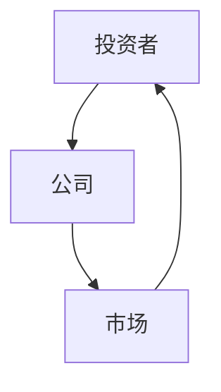
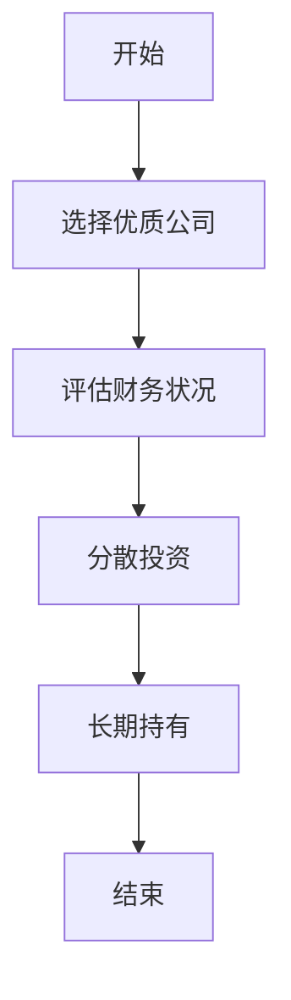
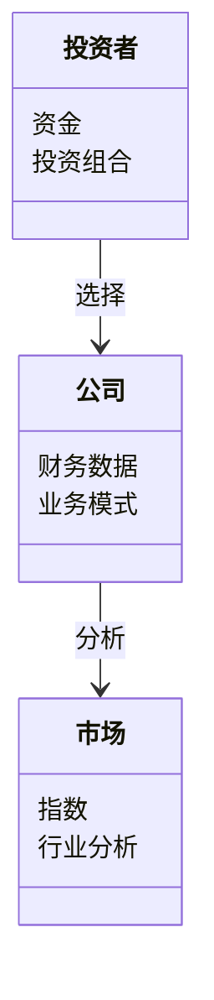

                 


```markdown
# 彼得林奇的"常识投资"实践指南

## 关键词：常识投资, 投资策略, 股票分析, 投资组合, 财务分析

## 摘要：本文深入探讨了彼得·林奇的“常识投资”方法，结合技术背景分析其原理、策略与实际操作。通过系统设计与项目实战，详细讲解了如何运用该方法进行投资决策，提供可复制的实践指南。

## 第1章: 背景介绍

### 1.1 什么是常识投资
#### 1.1.1 投资的基本概念
投资是指将资金投入某个领域以期望获得收益的过程。在金融领域，投资通常指购买股票、债券或其他金融资产。

#### 1.1.2 彼得林奇的"常识投资"定义
彼得·林奇提倡“常识投资”，即基于常识和理性分析进行投资，避免跟风和情绪化决策。

#### 1.1.3 投资与非专业的区别
专业投资强调系统分析和长期策略，而非专业投资往往依赖运气和短期波动。

### 1.2 投资的核心概念
#### 1.2.1 投资的基本原理
投资的目的是通过资产增值获取收益，核心在于选择具有持续增长潜力的企业。

#### 1.2.2 投资的目标与策略
目标是实现资产的长期增值，策略包括价值投资、成长投资和指数投资。

#### 1.2.3 投资的边界与外延
投资有其边界，如资金规模、风险承受能力等，外延则涉及资产配置和风险管理。

## 第2章: 核心概念与联系

### 2.1 核心概念原理
#### 2.1.1 价值投资的原理
寻找市场低估的公司，长期持有，等待其价值回归。

#### 2.1.2 分散投资的原理
通过投资不同行业和地区的资产，降低风险。

#### 2.1.3 长期投资的原理
通过长期持有优质资产，获得复利效应。

### 2.2 核心概念属性特征对比
| 投资策略 | 定义 | 优点 | 缺点 |
|----------|------|------|------|
| 价值投资 | 寻找低估公司 | 稳定收益 | 需深入分析 |
| 成长投资 | 投资高增长公司 | 高回报 | 风险较高 |

### 2.3 ER实体关系图架构


## 第3章: 算法原理讲解

### 3.1 算法原理


### 3.2 算法实现
```python
def peterson_investment_strategy(companies):
    selected = []
    for company in companies:
        if company.financial_health > 70 and company.growth_potential > 80:
            selected.append(company)
    return selected
```

## 第4章: 系统分析与架构设计方案

### 4.1 问题场景介绍
投资者面临选择优质公司、分散投资和长期持有的挑战。

### 4.2 系统功能设计


## 第5章: 项目实战

### 5.1 实战案例分析
分析腾讯控股，评估其财务状况和市场地位，制定投资策略。

### 5.2 核心代码实现
```python
def analyze_financials(company_data):
    # 计算市盈率、市净率等指标
    pass

def evaluate_growth(company_data):
    # 评估公司增长潜力
    pass
```

## 第6章: 最佳实践

### 6.1 投资策略总结
长期投资、分散风险和选择优质公司是成功的基石。

### 6.2 注意事项
定期复盘，避免情绪化决策，合理配置资产。

## 作者：AI天才研究院/AI Genius Institute & 禅与计算机程序设计艺术 /Zen And The Art of Computer Programming
```

