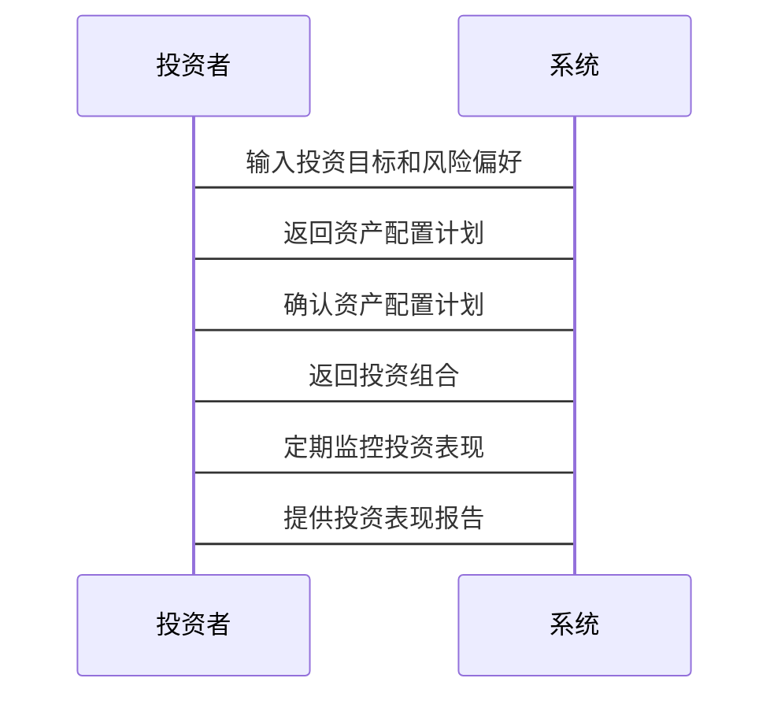

                 


## 第一部分: 彼得·林奇的“常识投资”理念概述

### 第1章: 投资的基本概念与背景

#### 1.1 投资的基本概念
##### 1.1.1 什么是投资
投资是将资金投入某个项目或资产，以期在未来获得收益或增值的行为。投资的目的是通过合理配置资金，实现财富的保值和增值。投资可以分为实物投资（如房地产、黄金）和金融投资（如股票、债券）等。

##### 1.1.2 投资的目的与意义
投资的主要目的是为了实现财富的增长。通过投资，投资者可以将闲置资金用于创造更多价值，同时分散风险，提高资金的使用效率。投资的意义在于通过合理的资产配置，实现财富的长期稳定增长。

##### 1.1.3 投资的基本分类
投资可以分为以下几类：
- **短期投资**：指持有时间较短的投资，通常在几个月内变现，风险较高，收益不稳定。
- **长期投资**：指持有时间较长的投资，通常在数年以上，风险较低，收益相对稳定。
- **股票投资**：通过购买公司股份，成为股东，分享公司收益。
- **债券投资**：购买公司或政府发行的债券，定期获得利息收益。
- **房地产投资**：购买房地产用于出租或升值。
- **金融衍生品投资**：通过期货、期权等衍生品进行投资，风险较高，收益潜力大。

#### 1.2 彼得·林奇的背景介绍
##### 1.2.1 彼得·林奇的生平简介
彼得·林奇（Peter Lynch）是美国著名的投资专家，被誉为“股票投资之父”。他出生于1942年，曾在富达投资管理公司担任基金经理，管理着麦哲伦基金（Fidelity Magellan Fund），该基金在他的管理下取得了卓越的业绩，年平均回报率高达29%。

##### 1.2.2 林奇的投资经历与成就
林奇的职业生涯始于1965年，他在富达投资管理公司工作了27年，期间管理的麦哲伦基金从1977年到1990年期间，年平均回报率高达29%，远超同期市场表现。林奇以其卓越的投资业绩和独特的投资理念闻名于世。

##### 1.2.3 林奇投资理念的核心思想
林奇的投资理念强调长期投资、价值投资和分散投资。他认为，投资者应该选择那些具有持续增长潜力的优质公司，长期持有，避免频繁交易，以减少交易成本和市场波动的影响。

#### 1.3 “常识投资”理念的提出
##### 1.3.1 “常识投资”的定义
“常识投资”是彼得·林奇提出的一种投资理念，强调投资者应该基于常识和理性进行投资，选择那些具有长期增长潜力的优质公司，长期持有，避免盲目跟风和短期炒作。

##### 1.3.2 “常识投资”与传统投资理念的区别
与传统投资理念相比，“常识投资”更加注重长期投资和价值投资，强调对公司基本面的深入分析，避免短期市场波动的干扰。传统投资理念可能更注重技术分析和市场趋势，而“常识投资”更注重公司内在价值的评估。

##### 1.3.3 “常识投资”理念的核心要素
“常识投资”理念的核心要素包括：
1. 长期投资：选择优质公司，长期持有，避免频繁交易。
2. 价值投资：基于公司基本面分析，选择具有长期增长潜力的公司。
3. 分散投资：通过分散投资降低风险，避免过度集中于某一只股票或行业。

### 第2章: “常识投资”理念的核心概念

#### 2.1 长期投资的重要性
##### 2.1.1 长期投资的基本原理
长期投资是指投资者将资金投入某个资产或公司，长期持有，以获得资产增值或公司收益的策略。长期投资的基本原理是通过时间的推移，资产的价值会逐渐增长，同时市场波动的影响也会被平滑。

##### 2.1.2 长期投资的优势与劣势
- **优势**：
  - 长期投资可以避免频繁交易的成本和税收，降低投资成本。
  - 长期投资可以平滑市场波动，降低短期市场波动的风险。
  - 长期投资可以利用复利效应，实现财富的长期增长。
- **劣势**：
  - 长期投资需要较长的时间周期，期间可能面临市场环境的变化。
  - 长期投资需要对市场和公司有深入的了解和判断，需要较强的研究能力。

##### 2.1.3 长期投资与短期投资的对比
| 对比维度 | 长期投资 | 短期投资 |
|----------|----------|----------|
| 投资周期 | 长期（数年以上） | 短期（几个月以内） |
| 风险水平 | 较低 | 较高 |
| 收益稳定性 | 较高 | 较低 |
| 投资策略 | 价值投资为主 | 技术分析为主 |

#### 2.2 市场波动与投资决策
##### 2.2.1 市场波动的定义与特征
市场波动是指股票价格或其他资产价格在短期内的涨跌现象。市场波动的特征包括：
- 不可预测性：市场波动难以准确预测，常常受到市场情绪、突发事件等多种因素的影响。
- 不可避免性：市场波动是市场机制的一部分，无法完全避免。
- 不可持续性：市场波动通常是短期的，不会持续长期。

##### 2.2.2 市场波动对投资决策的影响
市场波动对投资决策的影响主要体现在以下几个方面：
1. **情绪影响**：市场波动常常引发投资者的恐慌或贪婪情绪，导致非理性决策。
2. **交易成本**：频繁的交易可能导致较高的交易成本，降低投资收益。
3. **投资策略**：市场波动较大的情况下，投资者可能需要调整投资策略，选择更加稳健的投资方式。

##### 2.2.3 如何在市场波动中保持冷静
在市场波动中保持冷静是投资成功的关键。投资者可以通过以下方式实现：
- **制定投资计划**：在市场波动前制定详细的投资计划，避免情绪化决策。
- **分散投资**：通过分散投资降低市场波动对整体投资组合的影响。
- **长期视角**：保持长期投资的视角，避免因短期波动而改变投资策略。

#### 2.3 价值投资与成长投资的结合
##### 2.3.1 价值投资的基本原理
价值投资是一种投资策略，强调以低于市场价值的价格买入优质资产。价值投资者认为，市场价格常常会偏离资产的内在价值，通过寻找被市场低估的资产进行投资，可以在市场回归内在价值时获得收益。

##### 2.3.2 成长投资的基本原理
成长投资是一种投资策略，强调投资于具有高成长潜力的公司。成长投资者认为，公司的未来收益增长潜力是最重要的因素，通过投资于高速成长的公司，可以在未来获得超额收益。

##### 2.3.3 价值投资与成长投资的结合
“常识投资”理念强调价值投资与成长投资的结合。投资者应该选择那些具有长期增长潜力的优质公司，既关注公司的内在价值，又关注公司的成长性。这种结合可以实现风险与收益的平衡，提高投资组合的整体收益。

### 第3章: 彼得·林奇的“常识投资”策略

#### 3.1 选择优质公司的标准
##### 3.1.1 公司基本面分析
公司基本面分析是评估公司价值的重要方法，包括以下几个方面：
- **财务状况**：包括收入、利润、资产负债表等财务指标，评估公司的盈利能力和财务健康状况。
- **行业地位**：包括公司在行业中的地位、竞争优势、市场占有率等。
- **管理团队**：包括管理团队的经验、能力和战略规划等。

##### 3.1.2 公司财务状况评估
评估公司财务状况时，需要重点关注以下几个指标：
- **盈利能力**：包括净利润率、毛利率、营业利润率等。
- **偿债能力**：包括资产负债率、流动比率、速动比率等。
- **成长能力**：包括收入增长率、净利润增长率等。

##### 3.1.3 公司管理团队的重要性
公司管理团队是公司成功的关键因素之一。优秀的管理团队能够制定正确的战略，提高公司的竞争力，实现公司的长期增长。投资者在选择公司时，应该关注管理团队的能力和稳定性。

#### 3.2 分散投资的风险
##### 3.2.1 风险分散的基本原理
风险分散是指通过将资金分配到不同的资产或行业中，降低投资组合的整体风险。分散投资的基本原理是“不要把所有的鸡蛋放在一个篮子里”，通过分散投资，降低单一资产或行业波动对整体投资组合的影响。

##### 3.2.2 如何通过分散投资降低风险
投资者可以通过以下方式实现风险分散：
- **资产配置**：将资金分配到不同的资产类别，如股票、债券、房地产等。
- **行业分散**：将资金分配到不同的行业，避免过度集中于某一个行业。
- **地域分散**：将资金分配到不同的地理区域，分散区域风险。

##### 3.2.3 分散投资的实施步骤
1. **确定投资目标**：明确投资目标和风险承受能力。
2. **制定资产配置计划**：根据投资目标和风险偏好，制定资产配置计划。
3. **选择投资标的**：根据资产配置计划，选择不同的资产或行业进行投资。
4. **定期调整投资组合**：根据市场变化和投资目标，定期调整投资组合。

#### 3.3 长期持有优质股票的策略
##### 3.3.1 长期持有的优势
长期持有优质股票的优势主要体现在以下几个方面：
- **复利效应**：长期持有可以利用复利效应，实现财富的长期增长。
- **降低交易成本**：长期持有可以减少交易次数，降低交易成本和税收。
- **避免短期波动**：长期持有可以避免短期市场波动的影响，实现长期稳定的收益。

##### 3.3.2 长期持有股票的注意事项
- **选择优质公司**：长期持有股票的前提是选择具有长期增长潜力的优质公司。
- **避免频繁交易**：长期持有需要避免频繁交易，减少交易成本和税收。
- **定期调整投资组合**：根据市场变化和公司情况，定期调整投资组合。

##### 3.3.3 如何选择适合长期持有的股票
选择适合长期持有的股票时，应该关注以下几个方面：
- **公司基本面**：包括财务状况、行业地位、管理团队等。
- **公司成长性**：包括收入增长率、净利润增长率等。
- **市场估值**：包括市盈率、市净率等估值指标。

### 第4章: “常识投资”理念的数学模型与公式

#### 4.1 投资回报的计算公式
##### 4.1.1 投资回报率的计算公式
投资回报率（ROI）的计算公式为：
$$ ROI = \frac{净收益}{投入资金} \times 100\% $$

其中，净收益包括资本增值和股息收益等。

##### 4.1.2 复利计算公式
复利计算公式为：
$$ A = P \times (1 + r)^n $$
其中：
- \( A \) 为最终金额
- \( P \) 为本金
- \( r \) 为年利率
- \( n \) 为年数

##### 4.1.3 投资回报与风险的关系
投资回报与风险之间存在正相关关系。一般来说，风险越高，潜在的回报也越高。投资者需要在风险与收益之间找到平衡点，选择适合自己的投资策略。

#### 4.2 股票价值的评估公式
##### 4.2.1 市盈率（P/E）的计算公式
市盈率（P/E）的计算公式为：
$$ P/E = \frac{股价}{每股收益} $$

##### 4.2.2 市净率（P/B）的计算公式
市净率（P/B）的计算公式为：
$$ P/B = \frac{股价}{每股净资产} $$

##### 4.2.3 股息率的计算公式
股息率的计算公式为：
$$ 股息率 = \frac{每股股息}{股价} \times 100\% $$

#### 4.3 投资组合的优化公式
##### 4.3.1 马科维茨投资组合理论
马科维茨投资组合理论认为，投资者可以通过分散投资降低风险，实现投资组合的优化。投资组合的优化可以通过以下公式实现：
$$ \text{最小化方差} \quad \text{在给定的预期收益下} $$

##### 4.3.2 如何通过数学模型优化
投资者可以通过以下步骤实现投资组合的优化：
1. **确定投资目标**：明确投资目标和风险承受能力。
2. **评估资产回报率**：评估不同资产的预期回报率和风险。
3. **计算协方差矩阵**：计算不同资产之间的协方差矩阵。
4. **求解优化问题**：通过数学模型求解投资组合的最优配置。

### 第5章: 系统分析与架构设计方案

#### 5.1 问题场景介绍
在投资过程中，投资者需要面对复杂的市场环境和多样化的投资选择。为了实现投资目标，投资者需要构建一个科学的投资系统，包括投资策略、资产配置、风险管理和投资监控等。

#### 5.2 项目介绍
“常识投资”理念的投资系统旨在帮助投资者实现长期稳定的投资收益。该系统包括以下几个部分：
- **投资策略**：基于“常识投资”理念的投资策略。
- **资产配置**：根据投资目标和风险偏好，制定资产配置计划。
- **风险管理**：通过分散投资和定期调整，降低投资风险。
- **投资监控**：定期监控投资组合的表现，及时调整投资策略。

#### 5.3 系统功能设计
##### 5.3.1 领域模型Mermaid类图


##### 5.3.2 系统架构设计Mermaid架构图


##### 5.3.3 系统接口设计
- **投资者接口**：投资者通过系统输入投资目标和风险偏好。
- **资产配置接口**：系统根据投资者需求，制定资产配置计划。
- **风险管理接口**：系统通过分散投资和定期调整，降低投资风险。
- **投资监控接口**：系统定期监控投资组合的表现，及时调整投资策略。

##### 5.3.4 系统交互Mermaid序列图


### 第6章: 项目实战

#### 6.1 环境安装
投资者需要安装以下工具和软件：
- **投资分析软件**：如Excel、Python、R等。
- **数据获取工具**：如Yahoo Finance API、Alpha Vantage API等。
- **可视化工具**：如Matplotlib、Seaborn等。

#### 6.2 系统核心实现源代码
##### 6.2.1 投资策略实现
```python
def investment_strategy(portfolio, market_conditions):
    # 根据市场条件调整投资策略
    if market_conditions == 'bull':
        # 在牛市中，增加股票配置
        portfolio['stocks'] += 10%
    elif market_conditions == 'bear':
        # 在熊市中，减少股票配置
        portfolio['stocks'] -= 5%
    return portfolio
```

##### 6.2.2 资产配置实现
```python
def asset_allocation(portfolio, risk_tolerance):
    # 根据风险承受能力调整资产配置
    if risk_tolerance == 'low':
        # 低风险承受能力，增加债券配置
        portfolio['bonds'] += 20%
    elif risk_tolerance == 'medium':
        # 中等风险承受能力，保持当前配置
        pass
    else:
        # 高风险承受能力，增加股票配置
        portfolio['stocks'] += 15%
    return portfolio
```

##### 6.2.3 风险管理实现
```python
def risk_management(portfolio, volatility):
    # 根据市场波动性调整投资组合
    if volatility > 20%:
        # 市场波动性高，增加现金配置
        portfolio['cash'] += 10%
    return portfolio
```

#### 6.3 代码应用解读与分析
- **投资策略实现**：根据市场条件调整投资策略，牛市中增加股票配置，熊市中减少股票配置。
- **资产配置实现**：根据风险承受能力调整资产配置，低风险承受能力增加债券配置，高风险承受能力增加股票配置。
- **风险管理实现**：根据市场波动性调整投资组合，市场波动性高时增加现金配置，降低投资风险。

#### 6.4 实际案例分析
##### 6.4.1 案例背景
假设投资者有100万元资金，风险承受能力为中等，市场条件为牛市。

##### 6.4.2 投资策略制定
根据“常识投资”理念，选择优质公司，长期持有，分散投资。

##### 6.4.3 投资组合调整
- **股票配置**：根据市场条件牛市，增加股票配置10%，股票配置比例从30%增加到40%。
- **债券配置**：保持债券配置不变，债券配置比例为20%。
- **现金配置**：保持现金配置不变，现金配置比例为10%。

##### 6.4.4 投资组合表现
在牛市中，股票配置增加后，投资组合的收益显著提高，但风险也有所增加。通过分散投资和定期调整，投资组合的风险得到了有效控制。

### 第7章: 最佳实践、小结、注意事项、拓展阅读

#### 7.1 最佳实践
- **长期投资**：选择优质公司，长期持有，避免频繁交易。
- **分散投资**：通过分散投资降低风险，避免过度集中于某一只股票或行业。
- **价值投资**：关注公司基本面，选择具有长期增长潜力的优质公司。

#### 7.2 小结
彼得·林奇的“常识投资”理念强调长期投资、价值投资和分散投资。通过选择优质公司，长期持有，分散投资，投资者可以在市场波动中保持稳定的投资收益。

#### 7.3 注意事项
- **市场风险**：市场波动是投资过程中不可避免的风险，投资者需要做好心理准备。
- **信息获取**：投资者需要及时获取市场信息，了解公司的基本面情况。
- **定期调整**：根据市场变化和公司情况，定期调整投资组合。

#### 7.4 拓展阅读
- **《彼得·林奇的成功投资》**：彼得·林奇的经典著作，详细阐述了他的投资理念和策略。
- **《投资学》**：介绍投资学的基本理论和方法，帮助投资者更好地理解投资过程。
- **《价值投资入门》**：详细介绍价值投资的基本原理和方法，帮助投资者掌握价值投资的技巧。

### 作者：AI天才研究院/AI Genius Institute & 禅与计算机程序设计艺术 /Zen And The Art of Computer Programming

