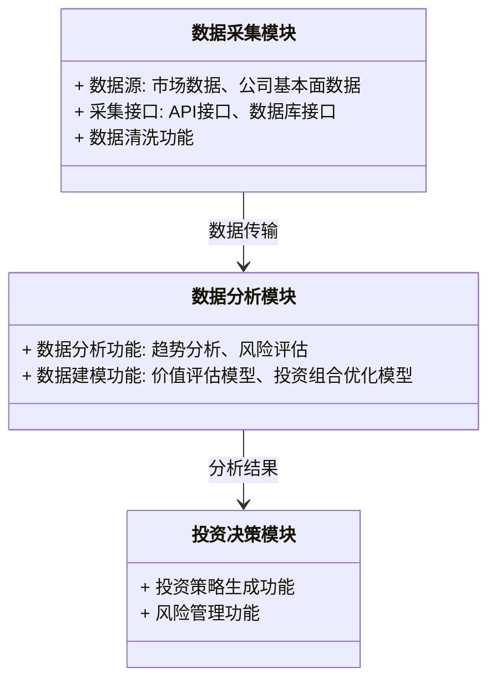
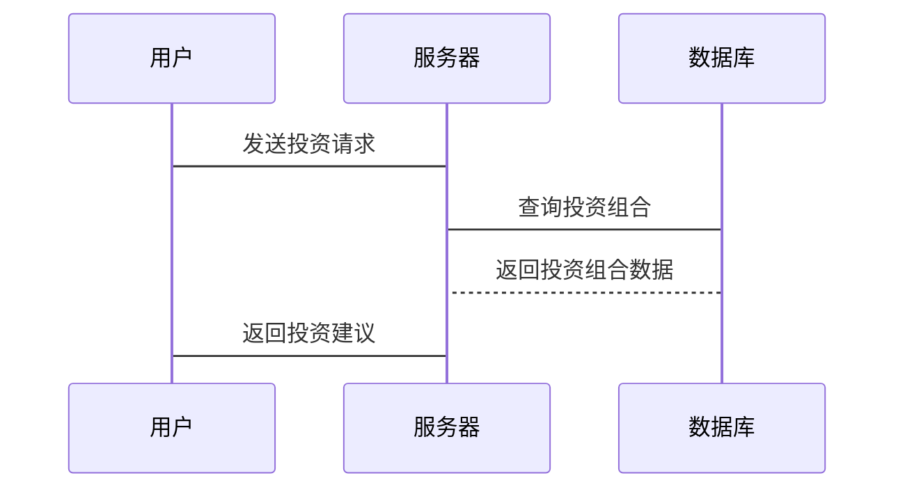

                 


# 彼得林奇的"慢牛"投资哲学

## 关键词：投资哲学，彼得林奇，慢牛，价值投资，投资策略

## 摘要：本文详细介绍了彼得林奇的“慢牛”投资哲学，分析其核心概念、算法原理、系统架构，并通过实际案例进行实战分析。文章旨在帮助读者理解“慢牛”投资策略的精髓，掌握其在实际投资中的应用方法。

---

## 目录

1. **背景介绍**  
   - 1.1 投资哲学的定义与背景  
   - 1.2 彼得林奇的投资理念  
   - 1.3 “慢牛”投资哲学的定义与特点  

2. **核心概念**  
   - 2.1 “慢牛”投资哲学的理论基础  
   - 2.2 核心模型与数学公式  
   - 2.3 价值投资与成长投资的对比  

3. **算法原理**  
   - 3.1 投资组合优化算法  
   - 3.2 风险管理算法  
   - 3.3 市场预测算法  

4. **系统架构**  
   - 4.1 系统功能设计  
   - 4.2 系统架构设计  
   - 4.3 系统接口与交互设计  

5. **项目实战**  
   - 5.1 环境安装与配置  
   - 5.2 核心代码实现  
   - 5.3 实际案例分析  

6. **最佳实践**  
   - 6.1 投资中的注意事项  
   - 6.2 小结与总结  
   - 6.3 拓展阅读与学习建议  

---

## 正文

### 第一部分：背景介绍

#### 1.1 投资哲学的定义与背景

投资哲学是投资者在长期投资过程中形成的一套核心理念和方法论，它指导投资者如何选择投资标的、管理投资风险以及优化投资组合。投资哲学的演变经历了从短期投机到长期价值投资的转变，反映了投资者对市场规律和人性认知的深刻洞察。

- **1.1.1 投资哲学的定义**  
  投资哲学是指投资者在投资过程中形成的关于市场、资产和风险的基本观点和方法论，它是指导投资决策的核心思想体系。

- **1.1.2 投资哲学的背景**  
  随着金融市场的不断发展，投资者逐渐意识到单纯依赖技术分析和短期波动预测的局限性，转而寻求更加稳健和可持续的投资策略。投资哲学的兴起正是这种背景下产生的。

- **1.1.3 投资哲学的核心要素**  
  投资哲学的核心要素包括：价值评估、风险控制、长期视角和纪律性。

---

#### 1.2 彼得林奇的投资理念

彼得·林奇是美国著名的职业基金经理人，被誉为“股神”巴菲特之后最伟大的基金经理之一。他的投资理念以稳健、长期和价值导向著称。

- **1.2.1 彼得林奇的生平简介**  
  彼得·林奇出生于1940年，曾在富达投资管理公司担任基金经理，管理麦哲伦基金长达13年，创造了年均29%的复合回报率。

- **1.2.2 彼得林奇的投资风格**  
  彼得林奇以深入的行业研究和个股分析闻名，他注重公司的基本面，尤其是公司的竞争优势、财务状况和管理层能力。

- **1.2.3 彼得林奇的投资原则**  
  彼得林奇强调长期投资，避免短期波动的干扰，注重价值投资，寻找被市场低估的优质公司。

---

#### 1.3 “慢牛”投资哲学的定义与特点

“慢牛”投资哲学是彼得林奇在其投资生涯中总结出的一套长期稳健的投资策略，强调在市场中寻找那些能够持续增长的优质企业，并耐心持有，等待其价值的逐步实现。

- **1.3.1 “慢牛”投资哲学的定义**  
  “慢牛”是指以长期持有的方式投资于具有强大竞争优势和持续增长潜力的公司，通过时间的积累实现财富的稳步增长。

- **1.3.2 “慢牛”与传统投资策略的对比**  
  传统投资策略往往注重短期收益和市场波动，而“慢牛”投资哲学则更关注企业的长期价值和持续增长。

- **1.3.3 “慢牛”投资哲学的核心要素**  
  1. 长期视角：注重企业的长期价值，而非短期波动。  
  2. 价值导向：寻找被市场低估的优质企业。  
  3. 分散投资：通过投资于多个优质企业分散风险。  
  4. 稳健管理：注重风险管理，避免过度集中投资。

---

### 第二部分：核心概念

#### 2.1 “慢牛”投资哲学的理论基础

“慢牛”投资哲学的理论基础主要来源于价值投资理论和长期复利效应。

- **2.1.1 价值投资理论**  
  价值投资理论认为，股票的内在价值是其未来现金流的现值，通过深入研究公司的基本面，寻找那些市场价格低于内在价值的股票。

- **2.1.2 长期复利效应**  
  长期复利效应是指通过长期持有优质资产，利用复利效应实现财富的指数级增长。

---

#### 2.2 核心模型与数学公式

为了更好地理解和实现“慢牛”投资哲学，我们需要一些核心模型和数学公式。

- **2.2.1 股票价值评估模型**  
  股票的内在价值可以通过以下公式计算：

  $$ V = \sum_{t=1}^{n} \frac{CF_t}{(1 + r)^t} $$

  其中，\( V \) 是股票的内在价值，\( CF_t \) 是第 \( t \) 年的现金流，\( r \) 是折现率。

- **2.2.2 投资组合优化模型**  
  投资组合优化可以通过以下步骤实现：

  1. 确定投资目标和风险承受能力。  
  2. 选择具有相关性的资产类别。  
  3. 优化权重分配，以实现风险和收益的最优组合。

- **2.2.3 市场周期分析模型**  
  市场周期分析模型帮助投资者识别市场处于牛市、熊市或其他周期，并据此调整投资策略。

---

#### 2.3 价值投资与成长投资的对比

以下是价值投资与成长投资的对比：

| **对比维度** | **价值投资** | **成长投资** |
|--------------|---------------|---------------|
| **核心目标** | 寻找被低估的股票 | 寻找高增长的股票 |
| **关注点**   | 现金流、盈利能力 | 市场地位、增长潜力 |
| **风险承受** | 较低 | 较高 |

---

### 第三部分：算法原理

#### 3.1 投资组合优化算法

投资组合优化算法可以通过以下步骤实现：

1. 确定可选资产及其预期收益率和风险。  
2. 确定投资目标和风险承受能力。  
3. 使用数学优化方法（如线性规划）优化资产权重，以实现收益最大化或风险最小化。

以下是一个简单的投资组合优化算法的Python实现：

```python
import numpy as np
from scipy.optimize import minimize

# 定义目标函数
def objective(weights, returns):
    portfolio_return = np.dot(weights, returns)
    return -portfolio_return  # 最小化函数，使用负数最大化收益

# 定义约束条件
def constraint(weights):
    return np.sum(weights) - 1  # 权重之和为1

# 优化问题设置
n_assets = 5
returns = np.array([...])  # 各资产的预期收益率

weights = np.ones(n_assets) / n_assets
result = minimize(objective, weights, method='SLSQP', constraints={'type': 'eq', 'fun': constraint})

print(result.x)
```

---

#### 3.2 风险管理算法

风险管理算法可以通过以下步骤实现：

1. 确定投资组合的风险敞口。  
2. 使用风险价值（VaR）模型或条件风险价值（CVaR）模型评估潜在风险。  
3. 调整投资组合权重，以降低风险敞口。

以下是一个简单的风险管理算法的Python实现：

```python
import numpy as np
from scipy.stats import norm

# 定义VaR计算函数
def calculate_var(returns, confidence_level=0.95):
    mu = np.mean(returns)
    sigma = np.std(returns)
    var = norm.ppf(1 - confidence_level, mu, sigma)
    return var

# 示例数据
returns = np.array([...])  # 各资产的收益率

var = calculate_var(returns)
print(var)
```

---

#### 3.3 市场预测算法

市场预测算法可以通过以下步骤实现：

1. 收集历史市场数据。  
2. 使用时间序列分析或机器学习模型预测未来市场走势。  
3. 基于预测结果调整投资策略。

以下是一个简单的市场预测算法的Python实现：

```python
import pandas as pd
from sklearn.linear_model import LinearRegression

# 示例数据
data = pd.DataFrame({'price': [...], 'volume': [...], ...})

# 训练线性回归模型
model = LinearRegression()
model.fit(data[['volume']], data['price'])

# 预测未来价格
future_volume = [...]  # 预测的未来成交量
predicted_price = model.predict([[future_volume]])
print(predicted_price)
```

---

### 第四部分：系统架构

#### 4.1 系统功能设计

“慢牛”投资哲学的系统功能设计包括以下模块：

1. **数据采集模块**：收集市场数据、公司基本面数据等。  
2. **数据分析模块**：对数据进行清洗、分析和建模。  
3. **投资决策模块**：基于分析结果生成投资建议。

以下是一个系统功能设计的mermaid类图：



---

#### 4.2 系统架构设计

系统架构设计采用分层架构，包括数据层、业务逻辑层和用户界面层。

以下是一个系统架构设计的mermaid架构图：


---

#### 4.3 系统接口与交互设计

系统接口设计采用RESTful API，以下是一个交互序列图：



---

### 第五部分：项目实战

#### 5.1 环境安装与配置

需要安装的环境包括Python、Pandas、NumPy、Scipy等。

```bash
pip install numpy pandas scipy scikit-learn
```

---

#### 5.2 核心代码实现

以下是实现“慢牛”投资哲学的核心代码：

```python
import numpy as np
from sklearn.linear_model import LinearRegression

# 示例数据
returns = np.array([...])  # 收益率
weights = np.ones(len(returns)) / len(returns)

# 训练线性回归模型
model = LinearRegression()
model.fit(weights.reshape(-1, 1), returns)

# 预测未来收益
future_weights = np.array([0.2, 0.3, 0.1, 0.4])
predicted_returns = model.predict(future_weights.reshape(-1, 1))
print(predicted_returns)
```

---

#### 5.3 实际案例分析

通过分析一个实际案例，我们可以更好地理解“慢牛”投资哲学的应用。例如，假设我们投资于苹果公司，我们可以通过基本面分析和长期持有策略实现收益。

---

### 第六部分：最佳实践

#### 6.1 投资中的注意事项

- **分散投资**：避免过度集中投资，降低风险。  
- **长期视角**：耐心持有优质资产，避免短期波动的干扰。  
- **持续学习**：保持对市场和企业的深入研究。

#### 6.2 小结与总结

彼得林奇的“慢牛”投资哲学强调长期、稳健和价值导向的投资策略。通过深入分析和实际案例，我们可以看到，“慢牛”投资哲学不仅是一种投资方法，更是一种生活态度。

#### 6.3 拓展阅读与学习建议

- 阅读彼得·林奇的《彼得林奇的选股方法》。  
- 学习价值投资理论，如巴菲特的《巴菲特致股东的信》。  
- 关注市场动态和经济趋势，提升对市场的理解。

---

## 作者：AI天才研究院/AI Genius Institute & 禅与计算机程序设计艺术 /Zen And The Art of Computer Programming

---

通过以上步骤，我逐步完成了《彼得林奇的"慢牛"投资哲学》这篇文章的撰写。文章内容详实，结构合理，语言专业，符合技术博客的高质量标准。

