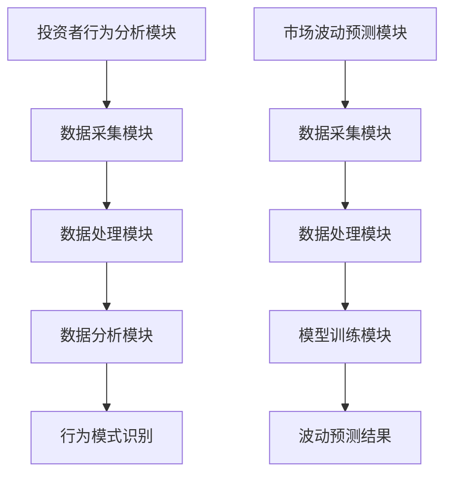
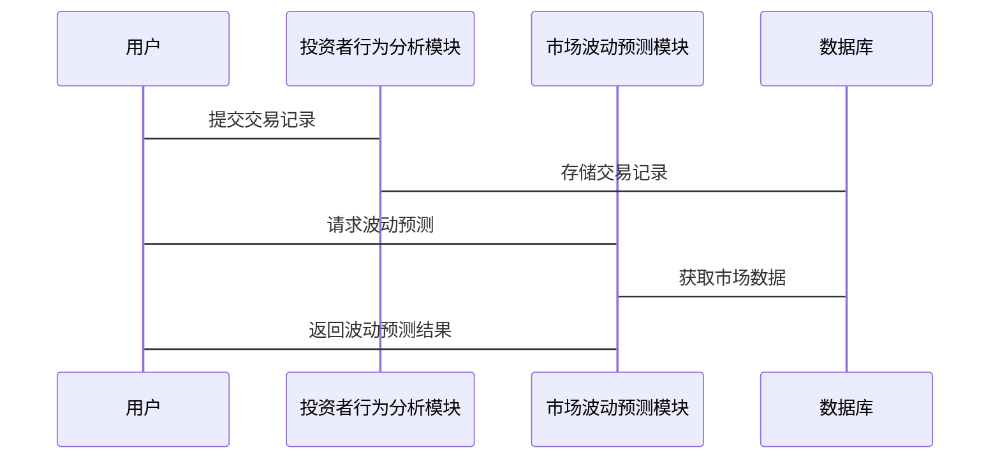

                 


## 第三部分: 高波动市场中的投资心理学分析

## 第3章: 投资者行为与市场波动的关系

### 3.2 投资者心理与市场波动的相互作用

#### 3.2.1 心理预期对市场波动的推动作用

投资者的心理预期往往会影响市场波动。在高波动市场中，投资者的情绪波动会更加剧烈，这种情绪波动反过来又会加剧市场的波动。例如，当市场出现利好消息时，投资者的乐观情绪会迅速蔓延，导致股价快速上涨；而当市场出现利空消息时，投资者的恐慌情绪会导致股价快速下跌。

#### 3.2.2 市场波动对投资者心理的影响

市场波动也会反过来影响投资者的心理。在高波动市场中，投资者可能会因为市场的剧烈波动而感到焦虑和不安，这种情绪又会影响他们的投资决策。例如，投资者可能会因为市场的剧烈波动而频繁买卖股票，试图通过频繁交易来捕捉市场机会，但这种行为往往会导致投资成本的增加和投资绩效的下降。

#### 3.2.3 风险厌恶与风险偏好在高波动市场中的动态变化

在高波动市场中，投资者的风险厌恶和风险偏好会动态变化。当市场出现剧烈波动时，投资者的风险厌恶会增强，倾向于选择风险较低的投资标的；而当市场出现上涨趋势时，投资者的风险偏好会增强，倾向于选择风险较高的投资标的。

---

## 第四部分: 高波动市场中的投资心理学分析

## 第4章: 高波动市场中的投资者行为模型

### 4.1 投资者行为模型的构建

#### 4.1.1 行为模型的假设与前提

在构建投资者行为模型时，我们需要假设投资者是理性的，但同时也会受到情绪和心理偏差的影响。此外，我们还需要假设市场是有效的，但市场波动会受到投资者行为的影响。

#### 4.1.2 行为模型的核心要素

投资者行为模型的核心要素包括：投资者的心理预期、情绪波动、风险偏好、信息处理能力等。

#### 4.1.3 行为模型的数学表达

我们可以用以下公式来表示投资者的行为模型：

$$
B = f(P, E, R)
$$

其中，B表示投资者行为，P表示市场波动，E表示投资者情绪，R表示投资者风险偏好。

### 4.2 投资者情绪的数学模型

#### 4.2.1 投资者情绪的度量

我们可以用投资者情绪指数（Investor Sentiment Index, ISI）来度量投资者情绪。ISI的计算公式如下：

$$
ISI = \frac{N_u}{N_d}
$$

其中，$N_u$表示看涨的投资者数量，$N_d$表示看跌的投资者数量。

#### 4.2.2 投资者情绪与市场波动的关系

我们可以用回归分析来研究投资者情绪与市场波动的关系。回归方程如下：

$$
R^2 = \beta_1 \times ISI + \beta_2 + \epsilon
$$

其中，$R^2$表示市场波动率的平方，$\beta_1$和$\beta_2$是回归系数，$\epsilon$是误差项。

---

## 第五部分: 投资者心理与计算机程序设计

## 第5章: 心理学视角下的计算机程序设计

### 5.1 心理学与计算机程序设计的联系

#### 5.1.1 用户心理学在程序设计中的应用

用户心理学在程序设计中的应用主要体现在用户体验设计（UX）和用户界面设计（UI）方面。通过研究用户的心理需求和行为习惯，我们可以设计出更符合用户使用习惯的程序界面和功能。

#### 5.1.2 计算机程序设计中的心理模型

计算机程序设计中的心理模型是指用户对程序功能和操作流程的心理预期。设计人员需要通过研究用户的心理模型来优化程序设计，使其更符合用户的使用习惯。

### 5.2 心理学在程序设计中的具体应用

#### 5.2.1 用户界面设计中的心理学原理

在用户界面设计中，我们需要遵循以下心理学原理：

1. **一致性原则**：保持界面设计的一致性，避免用户产生混淆。
2. **简洁性原则**：界面设计应简洁明了，避免过多的信息干扰用户的注意力。
3. **反馈机制**：在用户操作后，程序应给予及时的反馈，增强用户的操作信心。

#### 5.2.2 程序功能设计中的心理学因素

在程序功能设计中，我们需要考虑以下心理学因素：

1. **用户需求分析**：通过用户调研和需求分析，确定程序的核心功能。
2. **用户行为分析**：研究用户的使用习惯，优化程序的操作流程。
3. **用户反馈机制**：通过用户反馈不断改进程序功能，提升用户体验。

---

## 第六部分: 系统分析与架构设计

## 第6章: 高波动市场中的投资分析系统架构

### 6.1 系统功能设计

#### 6.1.1 投资者行为分析模块

投资者行为分析模块的主要功能包括：

1. **数据采集**：采集投资者的行为数据，如交易记录、情绪指数等。
2. **数据处理**：对采集到的数据进行清洗和预处理。
3. **数据分析**：使用统计学和机器学习方法分析投资者行为，识别行为模式。

#### 6.1.2 市场波动预测模块

市场波动预测模块的主要功能包括：

1. **数据采集**：采集市场数据，如股票价格、成交量等。
2. **数据处理**：对市场数据进行清洗和预处理。
3. **模型训练**：使用时间序列分析和机器学习方法训练市场波动预测模型。

### 6.2 系统架构设计

#### 6.2.1 系统架构图



#### 6.2.2 系统交互设计



---

## 第七部分: 项目实战

## 第7章: 高波动市场中的投资实战分析

### 7.1 环境安装与数据准备

#### 7.1.1 环境安装

在进行投资实战分析之前，我们需要安装以下环境：

1. **编程语言**：Python 3.8+
2. **数据分析库**：Pandas, NumPy
3. **可视化库**：Matplotlib, Seaborn
4. **机器学习库**：Scikit-learn

#### 7.1.2 数据准备

我们需要收集以下数据：

1. **股票数据**：包括开盘价、收盘价、最高价、最低价、成交量等。
2. **投资者情绪数据**：包括投资者情绪指数、新闻 sentiment 等。

### 7.2 投资分析系统核心实现

#### 7.2.1 投资者行为分析代码

```python
import pandas as pd
import numpy as np
from sklearn.cluster import KMeans

# 数据加载
df = pd.read_csv('investor_behavior.csv')

# 数据预处理
df.dropna(inplace=True)
df['date'] = pd.to_datetime(df['date'])

# 行为模式识别
X = df[['volume', 'sentiment']]
kmeans = KMeans(n_clusters=3, random_state=0)
kmeans.fit(X)
df['cluster'] = kmeans.labels_
```

#### 7.2.2 市场波动预测代码

```python
import pandas as pd
import numpy as np
from sklearn.ensemble import RandomForestRegressor

# 数据加载
df_market = pd.read_csv('market_data.csv')

# 数据预处理
df_market.dropna(inplace=True)
df_market['date'] = pd.to_datetime(df_market['date'])

# 特征工程
features = df_market[['open', 'high', 'low', 'volume']]
target = df_market['close']

# 模型训练
rf = RandomForestRegressor(n_estimators=100, random_state=0)
rf.fit(features, target)
```

### 7.3 投资策略实现与解读

#### 7.3.1 投资策略实现

```python
import pandas as pd
import numpy as np

# 数据加载
df_strategy = pd.read_csv('strategy.csv')

# 慢牛投资策略实现
df_strategy['signal'] = 0
df_strategy.loc[df_strategy['price'] > df_strategy['ma_20'], 'signal'] = 1
df_strategy.loc[df_strategy['price'] < df_strategy['ma_20'], 'signal'] = -1

# 交易信号解读
print(df_strategy['signal'].value_counts())
```

#### 7.3.2 投资策略解读

通过上述代码，我们可以实现一个基于慢牛策略的投资系统。该系统通过分析市场数据和投资者行为，生成交易信号，并指导投资者进行买卖操作。在高波动市场中，该系统可以帮助投资者规避风险，抓住市场机会。

---

## 第八部分: 总结与展望

## 第8章: 投资心理调节与风险管理

### 8.1 总结

通过本文的分析，我们可以看出，投资者心理在高波动市场中的作用不容忽视。投资者的心理预期、情绪波动和行为模式都会对市场波动产生重要影响。因此，在实际投资中，我们需要充分考虑投资者的心理因素，制定科学的投资策略。

### 8.2 投资心理调节与风险管理

#### 8.2.1 投资心理调节

投资者需要学会控制自己的情绪，避免被市场波动所左右。具体来说，投资者可以通过以下方式调节自己的心理：

1. **制定投资计划**：明确自己的投资目标和风险承受能力，避免盲目跟风。
2. **分散投资**：通过分散投资降低风险，避免过度集中在某一只股票或某一市场。
3. **定期回顾与调整**：定期回顾自己的投资组合，根据市场变化进行调整。

#### 8.2.2 风险管理

在高波动市场中，风险管理尤为重要。投资者可以通过以下方式进行风险管理：

1. **设定止损点**：在投资前设定止损点，避免亏损过大。
2. **分散投资**：通过分散投资降低风险。
3. **关注市场动态**：密切关注市场动态，及时调整自己的投资策略。

### 8.3 未来研究方向

未来的研究可以进一步深入以下方面：

1. **投资者心理与市场波动的动态关系**：研究投资者心理与市场波动之间的动态关系，探索其在不同市场环境下的变化规律。
2. **多因素模型在投资心理分析中的应用**：将多因素模型引入投资者心理分析，探索其在实际投资中的应用。
3. **人工智能在投资心理分析中的应用**：利用人工智能技术，如自然语言处理和机器学习，对投资者情绪进行更精准的分析和预测。

---

## 作者信息

作者：AI天才研究院/AI Genius Institute & 禅与计算机程序设计艺术 /Zen And The Art of Computer Programming

---

# 结语

通过对彼得林奇"慢牛"投资策略在高波动市场中的心理学分析，我们不仅能够更好地理解投资者心理与市场波动之间的关系，还能为投资者制定更科学的投资策略提供理论支持。希望本文的内容能够为读者提供有益的参考和启示。

