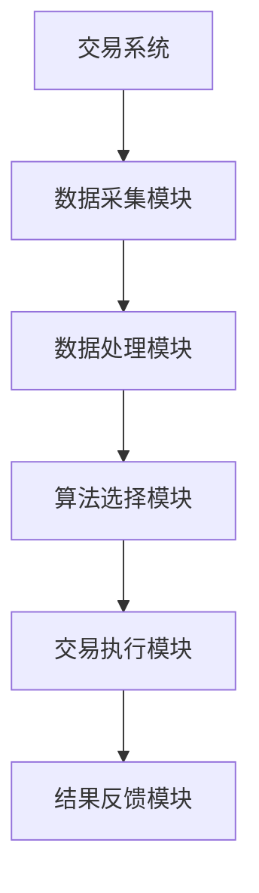
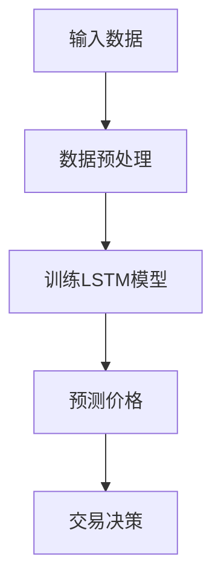

                 


```markdown
# 彼得林奇的"慢牛"投资在高频交易时代的价值

> 关键词：高频交易，彼得林奇，慢牛投资，价值投资，算法交易，金融系统架构

> 摘要：本文探讨了彼得林奇的“慢牛”投资理念在高频交易时代的应用价值。通过分析高频交易的算法与系统架构，结合“慢牛”投资的核心思想，提出了一种将长期价值投资与高频交易相结合的创新策略。本文详细介绍了高频交易的数学模型、算法实现以及系统架构，并通过实战项目展示了如何在高频交易中融入“慢牛”理念，实现投资收益与风险的最优平衡。

---

## 第一部分：高频交易的背景与挑战

### 第1章：高频交易的定义与特点

#### 1.1 高频交易的定义与核心特点
- 高频交易（High-Frequency Trading, HFT）是指通过计算机算法在极短时间内进行大量交易的行为。
- 核心特点：
  - 高速性：毫秒级别交易执行。
  - 短期性：基于短期价格波动获利。
  - 自动化：算法自动决策与执行。

#### 1.2 高频交易的市场影响
- 提高市场流动性。
- 可能引发市场波动加剧。
- 增加系统性风险。

#### 1.3 高频交易的优缺点对比
| 特性 | 优点 | 缺点 |
|------|------|------|
| 投资周期 | 短期 | 易受市场波动影响 |
| 数据处理能力 | 高效 | 对技术要求极高 |
| 风险控制 | 及时 | 可能放大市场波动 |

---

### 第2章：高频交易的算法与技术

#### 2.1 高频交易的主要算法
- **动量策略（Momentum Strategy）**：基于价格短期趋势。
- **均值回归策略（Mean Reversion Strategy）**：基于价格偏离长期均值的反转。
- **统计套利策略（Statistical Arbitrage）**：利用资产价格差异获利。

#### 2.2 高频交易的数学模型
- 时间序列分析：ARIMA、GARCH模型。
- 机器学习算法：LSTM、随机森林。

#### 2.3 高频交易的系统架构


---

## 第二部分：“慢牛”投资理念的现代价值

### 第3章：彼得林奇投资理念的核心思想

#### 3.1 长期价值投资的定义
- 以企业基本面分析为基础。
- 长期持有优质资产。
- 追求长期稳定的收益。

#### 3.2 “慢牛”投资的内涵
- 选择具有持续增长潜力的企业。
- 长期持有，耐心等待价值实现。
- 降低交易成本与税收负担。

#### 3.3 彼得林奇投资理念的形成背景
- 美国20世纪80年代的经济环境。
- 对人性与市场的深刻理解。

---

### 第4章：“慢牛”投资与高频交易的对比分析

#### 4.1 核心差异对比
| 维度 | 高频交易 | “慢牛”投资 |
|------|----------|------------|
| 投资周期 | 短期 | 长期 |
| 数据依赖 | 高频数据 | 公司基本面 |
| 风险控制 | 严格 | 较松 |

#### 4.2 优劣对比与融合策略
- 高频交易适合短期套利。
- “慢牛”投资适合长期稳健收益。
- 结合两者：利用高频交易捕捉短期机会，同时长期持有优质资产。

---

## 第三部分：系统架构与实战实现

### 第5章：高频交易中的数学模型与算法

#### 5.1 时间序列分析
- **ARIMA模型**：用于预测未来价格。
  $$ ARIMA(p, d, q) $$
- **LSTM网络**：适合捕捉复杂时间序列。

#### 5.2 机器学习算法实现
- **LSTM算法流程图**：


### 第6章：系统架构与实战项目

#### 6.1 系统架构设计
- **模块划分**：
  - 数据采集模块。
  - 数据分析模块。
  - 交易执行模块。
  - 风险控制模块。

#### 6.2 项目实战实现
- **环境安装**：
  - Python 3.8+。
  - 数据库：MySQL。
  - 开发工具：PyCharm。
- **核心代码实现**：
  ```python
  import pandas as pd
  from sklearn.model_selection import train_test_split
  from sklearn.metrics import accuracy_score

  # 数据预处理
  def preprocess_data(df):
      df['Date'] = pd.to_datetime(df['Date'])
      df.set_index('Date', inplace=True)
      return df

  # LSTM模型训练
  def train_lstm_model(train_X, train_y):
      # 模型定义与训练...
      return model

  # 交易策略实现
  def trading_strategy(predicted_prices, current_price):
      if predicted_prices > current_price:
          return 'Buy'
      else:
          return 'Sell'
  ```

#### 6.3 实战案例分析
- 数据来源：某金融市场的分钟级数据。
- 模型训练：使用LSTM预测未来价格。
- 交易策略：基于预测结果执行买卖决策。
- 实验结果：对比“慢牛”策略与高频交易策略的收益与风险。

---

## 第四部分：总结与展望

### 第7章：总结与最佳实践

#### 7.1 本章总结
- 高频交易与“慢牛”投资各有优劣。
- 结合两者可实现收益与风险的最优平衡。
- 系统化的方法是关键。

#### 7.2 最佳实践 tips
- 根据市场环境选择合适策略。
- 保持对市场的持续学习与适应。
- 系统化交易策略是投资成功的关键。

---

## 作者

作者：AI天才研究院/AI Genius Institute & 禅与计算机程序设计艺术 /Zen And The Art of Computer Programming
```

