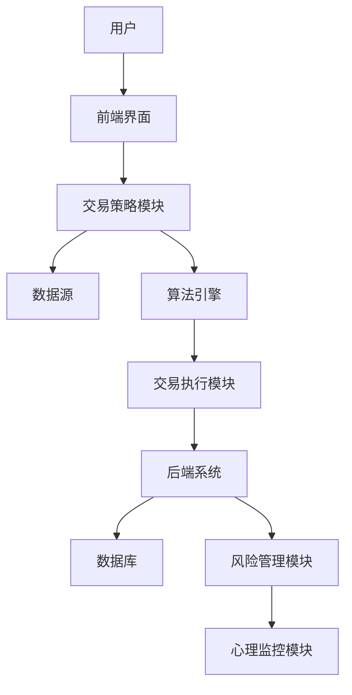
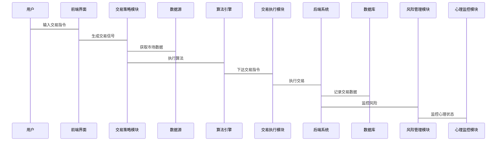

                 


# 彼得林奇的"慢牛"投资在高频交易环境中的心理建设

## 关键词：高频交易, 彼得林奇, 慢牛投资, 心理建设, 算法交易, 统计套利

## 摘要：  
在现代金融市场中，高频交易以其快速、算法驱动的特点，成为投资领域的重要组成部分。然而，高频交易的快节奏和高风险环境对投资者的心理状态提出了严峻挑战。本文以彼得林奇的“慢牛”投资理念为核心，探讨如何在高频交易环境中进行心理建设，以应对高波动性和快节奏的市场环境。通过分析高频交易的算法原理、心理影响及应对策略，本文旨在为投资者提供一套在高频交易中保持长期稳健投资心态的心理建设方法。

---

# 第1章: 高频交易的背景与彼得林奇的"慢牛"投资

## 1.1 高频交易的背景与特点

### 1.1.1 高频交易的定义与特点  
高频交易（High-Frequency Trading, HFT）是指通过计算机算法在极短时间内完成大量交易的交易方式。其特点包括：  
- **高速性**：利用先进的算法和低延迟技术，在毫秒级别完成交易。  
- **算法驱动**：依赖复杂算法进行决策，减少人为干预。  
- **高频率**：每天可能执行成千上万笔交易。  
- **高风险**：由于交易速度快，潜在收益和风险都极大。  

### 1.1.2 彼得林奇"慢牛"投资的核心理念  
彼得·林奇是著名的投资经理，他的“慢牛”投资策略强调：  
- **长期投资**：关注企业的基本面，寻找具有长期增长潜力的公司。  
- **价值投资**：以合理价格买入优质股票，耐心持有，等待其价值增长。  
- **分散投资**：通过分散投资降低风险，避免过度依赖单一资产。  

### 1.1.3 高频交易环境下的投资挑战  
高频交易的高波动性和快速变化的市场环境，与“慢牛”投资的长期稳健理念存在矛盾。投资者需要在以下方面进行调整：  
- 快速决策与长期规划的平衡。  
- 高频波动对长期投资心态的冲击。  
- 算法交易对传统投资策略的挑战。  

## 1.2 彼得林奇"慢牛"投资与高频交易的结合

### 1.2.1 "慢牛"投资在高频交易中的适用性  
尽管“慢牛”投资强调长期性，但其核心理念（如基本面分析、分散投资）仍可为高频交易提供参考。例如：  
- 算法交易中可以嵌入基本面分析模型，筛选出具备长期增长潜力的标的。  
- 通过分散投资策略降低单一交易的风险。  

### 1.2.2 高频交易对"慢牛"投资心理的影响  
高频交易的高波动性和快速变化的市场环境，容易让投资者陷入情绪化的决策。例如：  
- 过度关注短期价格波动，忽视长期投资目标。  
- 频繁的市场反馈可能导致心理压力过大，影响决策能力。  

### 1.2.3 高频交易环境下的投资策略优化  
结合“慢牛”投资理念，高频交易环境下的投资策略可以优化为：  
- 短期交易与长期投资相结合，通过高频交易捕捉短期机会，同时保持长期投资的稳定性。  
- 在算法中加入风险控制机制，避免过度投机。  

## 1.3 本章小结  
高频交易的快速性和算法驱动特点，对传统投资理念提出了新的挑战。然而，通过将彼得林奇的“慢牛”投资理念与高频交易环境相结合，投资者可以在快节奏的市场中保持长期稳健的投资心态，实现收益与风险的平衡。

---

# 第2章: 高频交易环境下的投资心理建设

## 2.1 投资心理的核心概念与分析

### 2.1.1 投资心理的定义与分类  
投资心理是指投资者在决策过程中所经历的心理过程和情绪反应。主要分为：  
- **理性心理**：基于逻辑和数据的决策。  
- **感性心理**：受情绪和直觉驱动的决策。  
- **混合心理**：理性与感性相结合的决策。  

### 2.1.2 高频交易环境下的心理特征  
在高频交易环境中，投资者的心理特征包括：  
- **高敏感性**：对市场波动高度敏感，容易受到价格波动的影响。  
- **快速决策疲劳**：由于交易速度极快，投资者容易产生决策疲劳。  
- **情绪波动大**：短期收益或亏损可能导致情绪大幅波动。  

### 2.1.3 彼得林奇"慢牛"投资的心理要素  
“慢牛”投资的成功依赖于以下心理要素：  
- **耐心**：能够长期持有优质资产，不被短期波动干扰。  
- **理性**：基于基本面分析做出决策，避免情绪化交易。  
- **纪律性**：严格执行投资计划，避免随意调整策略。  

## 2.2 心理模型与高频交易的结合

### 2.2.1 心理模型的构建与优化  
在高频交易环境中，心理模型需要进行优化，例如：  
- **短期与长期目标的结合**：在追求短期收益的同时，保持长期投资目标。  
- **风险控制**：通过心理模型预设止损点，避免过度亏损。  

### 2.2.2 高频交易中的心理风险与应对策略  
高频交易环境中的心理风险包括：  
- **过度自信**：认为算法能够确保收益，忽视市场不确定性。  
- **决策疲劳**：由于交易频率高，投资者容易失去决策能力。  
- **情绪化交易**：价格波动引发情绪化决策，导致错误交易。  

应对策略：  
- **心理训练**：通过模拟交易和情景演练，增强心理承受能力。  
- **自动化决策**：将关键决策自动化，减少人为情绪干扰。  

### 2.2.3 彼得林奇"慢牛"心理在高频交易中的应用  
- **长期视角**：在高频交易中，投资者可以利用算法筛选出具备长期增长潜力的资产。  
- **风险控制**：通过算法设置止损和止盈点，保持投资纪律。  
- **心理稳定性**：通过心理训练，增强面对短期波动的稳定性。  

## 2.3 本章小结  
在高频交易环境中，投资心理建设至关重要。通过结合彼得林奇的“慢牛”投资理念，投资者可以在快节奏的市场中保持理性、耐心和纪律性，实现长期稳健的投资收益。

---

# 第3章: 高频交易环境下的算法与心理模型

## 3.1 高频交易算法原理

### 3.1.1 高频交易的核心算法  
高频交易依赖于以下算法：  
- **统计套利算法**：通过寻找资产价格偏离长期均值的机会进行交易。  
- **算法交易策略**：基于市场数据和算法模型自动执行交易。  
- **高频信号生成算法**：通过分析市场数据生成交易信号。  

### 3.1.2 统计套利算法的数学模型  
统计套利的核心在于寻找资产价格的均值回归特性。常用模型包括：  
- **均值回归模型**：基于资产价格的历史数据，预测未来价格的回归。  
- **协方差矩阵模型**：分析资产之间的相关性，寻找套利机会。  

数学公式：  
$$ r_i = \alpha + \beta r_f + \epsilon $$  
其中，\( r_i \) 是资产i的收益，\( r_f \) 是无风险利率，\( \epsilon \) 是误差项。

### 3.1.3 高频交易算法的代码实现  
以下是一个简单的统计套利算法的Python代码示例：  

```python
import pandas as pd
import numpy as np

# 示例数据：资产A和资产B的价格数据
prices = pd.DataFrame({
    'A': [100, 102, 101, 99, 103],
    'B': [95, 97, 96, 94, 98]
})

# 计算资产价格的差值
spread = prices['A'] - prices['B']

# 计算差值的均值和标准差
mean_spread = spread.mean()
std_spread = spread.std()

# 设置交易信号：当差值超过均值一定倍数时，买入A卖出B
threshold = mean_spread + 2 * std_spread
signal = np.where(spread > threshold, 1, -1)

# 执行交易
positions = [0]  # 初始持仓为0
for i in range(1, len(signal)):
    if signal[i] == 1:
        positions.append(1)
    else:
        positions.append(-1)

print("交易信号:", signal)
print("持仓变化:", positions)
```

### 3.2 彼得林奇"慢牛"策略的算法实现

### 3.2.1 "慢牛"策略的数学模型  
“慢牛”策略的核心在于寻找具备长期增长潜力的资产。常用模型包括：  
- **基本面分析模型**：基于企业的财务数据和行业前景进行评估。  
- **多因子模型**：结合多个因子（如市盈率、市净率、ROE等）筛选优质资产。  

数学公式：  
$$ \text{投资价值} = \alpha \cdot \text{市盈率} + \beta \cdot \text{ROE} + \gamma \cdot \text{行业前景} $$  

### 3.2.2 策略在高频交易中的优化  
在高频交易中，可以将“慢牛”策略嵌入到算法中，例如：  
- **筛选优质资产**：通过算法筛选出具备长期增长潜力的资产，作为高频交易的目标。  
- **动态调整策略**：根据市场变化实时调整交易策略，同时保持长期投资目标。  

### 3.2.3 心理模型与算法的结合  
心理模型可以通过算法实现，例如：  
- **情绪化交易的抑制**：通过算法预设规则，减少情绪化交易的发生。  
- **风险控制的自动化**：通过算法实时监控风险指标，自动执行止损和止盈操作。  

## 3.3 心理模型与算法的结合

### 3.3.1 心理因素对算法决策的影响  
心理因素可能干扰算法决策，例如：  
- **过度自信**：可能导致算法过度交易。  
- **情绪波动**：可能影响算法的执行逻辑。  

### 3.3.2 心理稳定性与算法优化  
通过优化算法，可以减少心理因素对决策的影响，例如：  
- **自动化决策**：将关键决策自动化，减少人为干预。  
- **风险控制**：通过算法预设风险指标，自动执行止损操作。  

## 3.4 本章小结  
在高频交易环境中，心理模型与算法的结合可以有效减少情绪化交易，提高决策的科学性和稳定性。

---

# 第4章: 高频交易环境下的系统架构与心理建设

## 4.1 系统架构设计

### 4.1.1 系统功能设计  
高频交易系统的功能包括：  
- **数据采集**：实时采集市场数据。  
- **算法执行**：根据算法生成交易信号。  
- **风险管理**：监控和管理交易风险。  
- **心理监控**：实时监控投资者的心理状态。  

### 4.1.2 系统架构图  
以下是一个高频交易系统的架构图：



### 4.1.3 系统接口设计  
系统接口包括：  
- **数据接口**：与数据源（如交易所API）对接。  
- **交易接口**：与交易执行模块对接。  
- **用户接口**：与前端界面对接。  

### 4.1.4 系统交互流程图  
以下是一个系统交互流程图：



## 4.2 心理监控与算法优化

### 4.2.1 心理监控模块的功能设计  
心理监控模块包括：  
- **情绪识别**：通过投资者的行为数据识别情绪状态。  
- **心理压力评估**：评估投资者的心理压力水平。  
- **心理干预**：根据心理状态提供干预措施。  

### 4.2.2 心理监控与算法优化的结合  
心理监控模块可以与算法优化结合，例如：  
- **动态调整算法参数**：根据投资者的心理状态调整交易策略。  
- **实时反馈**：向投资者提供心理反馈，帮助其保持稳定心态。  

### 4.2.3 心理稳定性与系统架构的优化  
通过优化系统架构，可以提高心理监控的效率，例如：  
- **实时数据处理**：快速处理投资者的心理数据。  
- **智能化反馈**：根据心理数据提供智能化的反馈建议。  

## 4.3 本章小结  
在高频交易环境中，系统架构的设计与心理监控的结合，可以有效提高交易系统的稳定性和收益能力。

---

# 第5章: 项目实战与案例分析

## 5.1 环境安装与配置

### 5.1.1 安装Python与相关库  
- **Python**：安装Python 3.8及以上版本。  
- **库**：安装`pandas`、`numpy`、`matplotlib`等库。  

### 5.1.2 安装高频交易框架  
- **Backtrader**：一个流行的高频交易回测框架。  
- **配置环境**：安装必要的开发工具和API接口。  

## 5.2 系统核心实现

### 5.2.1 统计套利算法的实现  
以下是一个统计套利算法的Python代码示例：

```python
import backtrader as bt

class MyStrategy(bt.Strategy):
    def __init__(self):
        self.data = self.datas[0]
        self.order = None

    def next(self):
        # 简单的均值回归策略
        current_price = self.data.close[-1]
        average = (self.data.close.mean() * 2) / len(self.data.close)
        threshold = average * 0.5

        if current_price < threshold:
            if self.order is None:
                self.order = self.buy()
        elif current_price > threshold:
            if self.order is not None:
                self.order.close()

# 创建回测环境
cerebro = bt.Cerebro()

# 添加数据
data = bt.feeds.YahooFinanceData(dataname='AAPL', fromdate='2020-01-01', todate='2023-12-31')
cerebro.adddata(data)

# 添加策略
cerebro.addstrategy(MyStrategy)

# 设置资金和佣金
cerebro.broker.setcash(10000.0)
cerebro.broker.setcommission(0.001)

# 执行回测
cerebro.run()

# 绘制结果
cerebro.plot()
```

### 5.2.2 心理监控模块的实现  
以下是一个简单的心理监控模块的Python代码示例：

```python
import pandas as pd
import numpy as np

# 示例数据：投资者的心理状态评分
psychological_data = pd.DataFrame({
    'date': ['2023-10-01', '2023-10-02', '2023-10-03'],
    'mood_score': [75, 85, 65]
})

# 心理监控算法：基于情绪评分的交易信号生成
def generate_signal(data):
    if data['mood_score'] > 80:
        return 1  # 买入信号
    elif data['mood_score'] < 60:
        return -1  # 卖出信号
    else:
        return 0  # 保持仓位

# 生成交易信号
signal = psychological_data.apply(generate_signal, axis=1)
print("交易信号:", signal)
```

## 5.3 案例分析与代码解读

### 5.3.1 统计套利算法的案例分析  
以苹果公司（AAPL）为例，使用上述代码进行回测，分析策略的收益与风险。

### 5.3.2 心理监控模块的案例分析  
通过心理评分数据，分析投资者在不同情绪状态下的交易表现。

## 5.4 本章小结  
通过项目实战，读者可以更好地理解高频交易环境下的算法与心理建设的结合，掌握实际操作的技巧和方法。

---

# 第6章: 高频交易环境下的最佳实践与心理建设

## 6.1 最佳实践

### 6.1.1 心理建设的实践技巧  
- **心理训练**：通过模拟交易和情景演练，增强心理承受能力。  
- **情绪管理**：学会控制情绪，避免情绪化交易。  
- **知识储备**：加强金融知识和交易技术的学习，提升自信心。  

### 6.1.2 风险控制的实践技巧  
- **止损与止盈**：设置合理的止损和止盈点，控制交易风险。  
- **分散投资**：通过分散投资降低单一资产的风险。  
- **自动化决策**：将关键决策自动化，减少人为干预。  

## 6.2 心理建设的注意事项

### 6.2.1 心理疲劳的应对  
- **定期休息**：避免长时间盯盘，防止心理疲劳。  
- **自我调节**：通过冥想、运动等方式缓解压力。  

### 6.2.2 情绪波动的管理  
- **情绪识别**：及时识别情绪波动，避免影响决策。  
- **心理干预**：必要时寻求心理辅导或专业帮助。  

## 6.3 拓展阅读

### 6.3.1 高频交易领域的经典书籍  
- 《The New Market Wizards》  
- 《High-Frequency Trading: A Practical Guide to Algorithmic and Quantitative Investment》  

### 6.3.2 心理建设领域的经典书籍  
- 《The Psychology of Trading》  
- 《Mastery: The Keys to Success and Long-Term Achievement》  

## 6.4 本章小结  
在高频交易环境中，心理建设是投资者成功的关键。通过最佳实践和心理建设的技巧，投资者可以在快节奏的市场中保持稳定心态，实现长期稳健的投资收益。

---

# 结语

在高频交易环境中，彼得林奇的“慢牛”投资理念为我们提供了一种新的视角。通过结合高频交易的算法与心理建设的技巧，投资者可以在快节奏的市场中保持长期稳健的投资心态，实现收益与风险的平衡。未来，随着技术的进步和市场的变化，高频交易环境下的心理建设将更加重要，投资者需要不断学习和适应，以应对新的挑战。

---

# 作者：AI天才研究院 & 禅与计算机程序设计艺术

