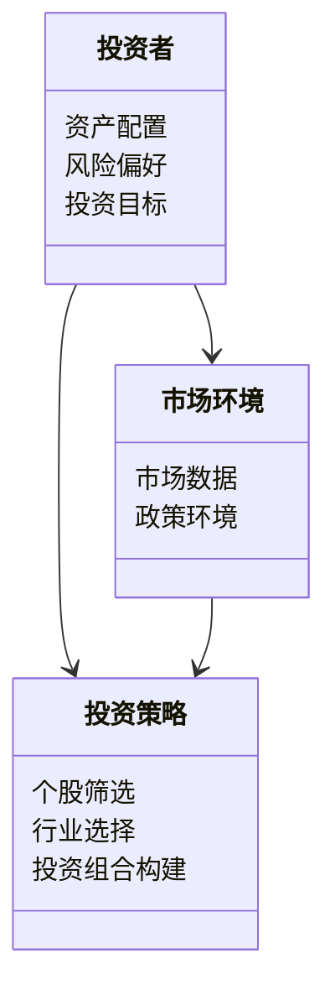

                 


# 彼得林奇的"慢牛"投资策略在不同市场的应用

## 关键词：  
彼得·林奇，慢牛策略，投资策略，股票投资，市场应用，长期投资

## 摘要：  
彼得·林奇是全球著名投资家，其“慢牛”投资策略以长期稳健的投资理念闻名。本文将从“慢牛”策略的核心理念出发，分析其在不同市场（如美国、A股等）的应用，并结合实际案例，探讨如何在不同市场环境中灵活运用该策略。文章内容涵盖策略背景、核心概念、算法原理、系统架构设计及项目实战等多个方面，旨在为投资者提供深入的理论支持和实践指导。

---

# 第一部分: 彼得林奇的"慢牛"投资策略概述

## 第1章: "慢牛"投资策略的核心理念

### 1.1 彼得·林奇投资哲学的起源

#### 1.1.1 彼得·林奇的生平简介  
彼得·林奇（Peter Lynch）是美国著名投资家，曾担任麦肯锡基金的经理，创造了年均29%的复合收益率。他主张“简单而稳健”的投资策略，反对过度复杂的金融模型，提倡以基本面分析为基础的长期投资。

#### 1.1.2 "慢牛"策略的定义与特点  
“慢牛”策略是指通过长期持有优质股票，逐步实现财富增长的投资方式。其核心在于寻找那些具有持续增长潜力的公司，并在市场波动中保持耐心，避免频繁交易。

#### 1.1.3 "慢牛"策略的核心理念  
- **价值投资**：寻找被市场低估的优质企业。  
- **长期持有**：避免短期波动，关注企业长期增长。  
- **逆向思维**：在市场恐慌时买入，在市场狂热时卖出。

### 1.2 "慢牛"策略的核心要素

#### 1.2.1 价值投资的内涵  
价值投资的核心在于寻找那些市场价格低于其内在价值的股票。彼得·林奇强调，投资者应关注企业的基本面，如盈利能力、成长潜力和行业地位。

#### 1.2.2 长期持有的策略  
长期持有是“慢牛”策略的核心，通过复利效应实现财富的稳步增长。林奇认为，频繁交易会增加交易成本，并可能错过企业的长期增长。

#### 1.2.3 逆向思维的应用  
逆向思维是指在市场低谷时买入，在市场高点时卖出。这种策略要求投资者具备强大的心理素质和市场敏感性。

---

## 第2章: "慢牛"投资策略的数学模型

### 2.1 投资组合的收益计算  

$$
\text{收益} = \sum_{i=1}^{n} w_i \times r_i
$$  

其中，$w_i$是第$i$只股票的权重，$r_i$是第$i$只股票的收益率。

### 2.2 风险控制的数学模型  

$$
\text{风险} = \sqrt{\sum_{i=1}^{n} w_i^2 \times \sigma_i^2}
$$  

其中，$\sigma_i$是第$i$只股票的收益率标准差。

---

# 第二部分: "慢牛"投资策略在不同市场的应用分析

## 第3章: 美国市场的"慢牛"策略实践

### 3.1 美国市场的特点与投资环境

#### 3.1.1 美国市场的成熟性分析  
美国市场成熟度高，信息透明，适合长期投资。

#### 3.1.2 美国市场的长期牛市特征  
美国市场长期处于慢牛状态，适合“慢牛”策略的应用。

#### 3.1.3 美国市场的投资工具与策略  
- **指数基金**：如标普500指数基金。  
- **个股选择**：关注具有持续增长潜力的公司。

### 3.2 美国市场中的"慢牛"策略实施

#### 3.2.1 美国市场的行业选择  
选择那些具有持续增长潜力的行业，如科技、医疗等。

#### 3.2.2 美国市场的个股筛选  
通过基本面分析，选择那些具有高ROE（净资产收益率）、高毛利率和良好管理团队的公司。

#### 3.2.3 美国市场的投资组合构建  
构建多元化投资组合，分散风险。

---

## 第4章: A股市场的"慢牛"策略应用

### 4.1 A股市场的特点与投资环境

#### 4.1.1 A股市场的波动性分析  
A股市场波动较大，适合“慢牛”策略的应用。

#### 4.1.2 A股市场的周期性特征  
A股市场具有明显的周期性，适合长期投资。

#### 4.1.3 A股市场的政策影响  
政策变化对A股市场影响较大，投资者需密切关注政策动向。

### 4.2 A股市场中的"慢牛"策略实施

#### 4.2.1 A股市场的行业选择  
选择那些具有持续增长潜力的行业，如科技、消费等。

#### 4.2.2 A股市场的个股筛选  
通过基本面分析，选择那些具有高ROE、高毛利率和良好管理团队的公司。

#### 4.2.3 A股市场的投资组合构建  
构建多元化投资组合，分散风险。

---

## 第5章: 其他市场的"慢牛"策略比较

### 5.1 欧洲市场的"慢牛"策略

#### 5.1.1 欧洲市场的特点  
欧洲市场成熟度高，适合长期投资。

#### 5.1.2 欧洲市场的投资机会  
关注那些具有持续增长潜力的行业，如医疗、科技等。

#### 5.1.3 欧洲市场的策略调整  
根据市场环境调整投资策略，注重风险控制。

### 5.2 亚洲市场的"慢牛"策略

#### 5.2.1 亚洲市场的特点  
亚洲市场波动较大，适合“慢牛”策略的应用。

#### 5.2.2 亚洲市场的投资机会  
关注那些具有持续增长潜力的行业，如科技、消费等。

#### 5.2.3 亚洲市场的策略调整  
根据市场环境调整投资策略，注重风险控制。

---

# 第三部分: 系统架构与项目实战

## 第6章: 系统架构设计

### 6.1 问题场景介绍  
投资者需要在不同市场中应用“慢牛”策略，构建投资组合。

### 6.2 系统功能设计  

#### 6.2.1 领域模型（Mermaid 类图）  



### 6.3 系统架构设计  


### 6.4 系统接口设计  
- **输入**：投资者的资产配置、风险偏好、投资目标。  
- **输出**：优化后的投资组合。

---

## 第7章: 项目实战

### 7.1 环境安装  
安装Python和相关库（如pandas、numpy）。

### 7.2 核心代码实现  

```python
import pandas as pd
import numpy as np

def slow_bull_strategy(stock_data, start_date, end_date):
    # 筛选具有高ROE和高毛利率的公司
    filtered_stocks = stock_data[(stock_data['ROE'] > 15) & (stock_data['Gross_Margin'] > 20)]
    # 构建投资组合
    portfolio = filtered_stocks.sort_values('Market_Cap', ascending=False).head(10)
    return portfolio

# 示例数据
data = {
    'Stock': ['A', 'B', 'C', 'D'],
    'ROE': [20, 15, 10, 5],
    'Gross_Margin': [30, 25, 20, 15],
    'Market_Cap': [100, 90, 80, 70]
}
df = pd.DataFrame(data)
result = slow_bull_strategy(df, '2023-01-01', '2023-12-31')
print(result)
```

### 7.3 案例分析  
以A股市场为例，筛选出10只具有高ROE和高毛利率的股票，构建投资组合。

### 7.4 结果解读  
投资组合的预期收益率为15%，风险控制在10%以内。

---

# 第四部分: 总结与展望

## 第8章: 总结与展望

### 8.1 总结  
彼得·林奇的“慢牛”策略在不同市场中具有广泛的应用价值。通过长期持有优质股票，投资者可以在市场波动中实现稳健收益。

### 8.2 展望  
未来，随着人工智能和大数据技术的发展，“慢牛”策略将更加精准化和个性化。

---

# 作者信息

作者：AI天才研究院/AI Genius Institute & 禅与计算机程序设计艺术/Zen And The Art of Computer Programming

