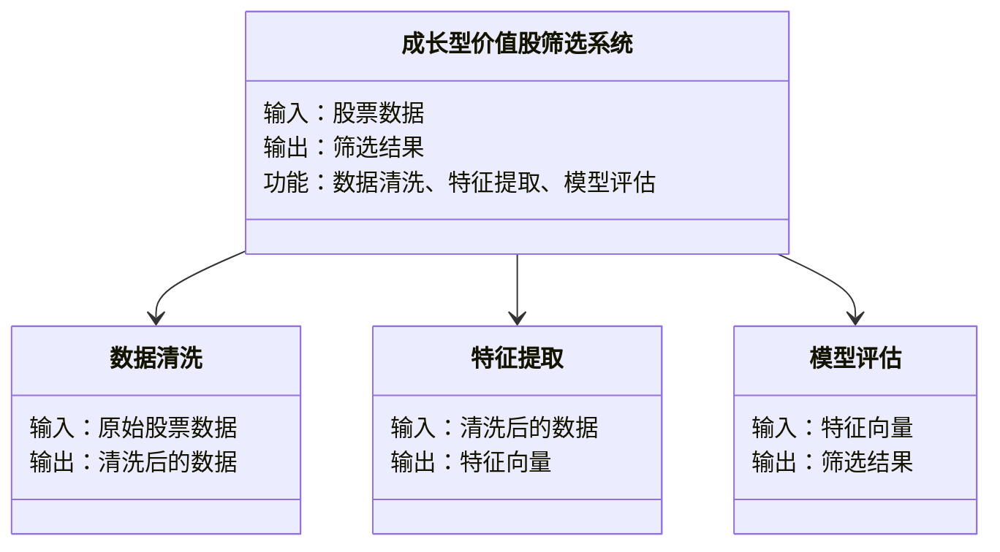
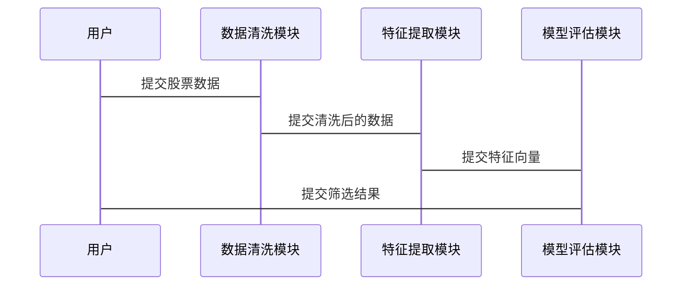

                 


# 彼得林奇的"成长型价值股"在不同市场规模中的表现

> 关键词：彼得林奇，成长型价值股，市场规模，投资策略，股票分析

> 摘要：本文系统分析了彼得林奇提出的“成长型价值股”投资策略在不同市场规模中的表现。通过背景介绍、核心概念解析、理论模型构建、实证分析、系统架构设计、项目实战以及总结展望，深入探讨了成长型价值股在小盘股、中盘股和大盘股中的投资表现，并结合实际案例分析，为投资者提供了有效的投资策略和风险管理建议。

---

## 第一部分：彼得林奇的成长型价值股投资概述

### 第1章：彼得林奇的成长型价值股投资理念

#### 1.1 成长型价值股的定义与特征

##### 1.1.1 成长型价值股的基本定义
成长型价值股是指那些具有持续增长潜力，同时估值合理的公司股票。彼得林奇强调，成长型价值股不仅要有成长性，还要有合理的价格，避免高估或低估。

##### 1.1.2 成长型价值股的核心特征
- **高成长性**：公司收入和利润持续增长，具备行业领先的地位。
- **合理估值**：市盈率（P/E）、市净率（P/B）等指标低于行业平均水平。
- **竞争优势**：公司具备独特的竞争优势，如专利、品牌、技术等。

##### 1.1.3 成长型价值股与其它投资策略的区别
| 投资策略 | 核心关注点 | 适合市场 |
|----------|------------|----------|
| 成长型   | 收入和利润增长 | 小盘股和中盘股 |
| 价值型   | 低估值和高股息 | 大盘股 |
| 指数型   | 按市值权重投资 | 各类市场 |

#### 1.2 彼得林奇的投资理念

##### 1.2.1 价值投资的起源与发展
价值投资由本杰明·格雷厄姆提出，强调以低于内在价值的价格买入股票。彼得林奇在此基础上，将成长性和估值结合，形成了独特的成长型价值股策略。

##### 1.2.2 彼得林奇的成长型投资策略
彼得林奇认为，投资成长型价值股的关键在于找到那些收入和利润稳定增长，同时估值合理的公司。他强调长期投资，避免短期市场波动的干扰。

##### 1.2.3 成长与价值的结合
彼得林奇的成长型价值股策略是成长与价值的结合，既关注公司的成长潜力，又关注其估值的合理性。这种策略在不同市场规模中表现各异，需要具体分析。

#### 1.3 成长型价值股的市场表现

##### 1.3.1 成长型价值股的历史表现
通过历史数据分析，成长型价值股在长期表现中优于大盘指数，尤其是在小盘股和中盘股市场中表现更为突出。

##### 1.3.2 不同市场环境下的表现差异
在牛市中，成长型价值股的表现优于价值型股票；在熊市中，成长型价值股的表现可能不如价值型股票，但长期来看，其增长潜力使其更具吸引力。

##### 1.3.3 成长型价值股的长期投资价值
长期来看，成长型价值股的投资回报较高，尤其是在科技、医疗等高成长行业中的表现更为显著。

---

### 第2章：不同市场规模中的股票分析

#### 2.1 小盘股市场的特点

##### 2.1.1 小盘股市场的定义与特征
小盘股是指市值较小的公司股票，通常在30亿美元以下。小盘股市场的特点是流动性较低，波动性较大，但成长潜力较高。

##### 2.1.2 小盘股市场的流动性分析
小盘股市场的流动性相对较低，尤其是在市场低迷时，买卖价差较大，交易成本较高。

##### 2.1.3 小盘股市场的风险与机会
小盘股市场风险较高，但机会也较多。许多小盘股公司具有较高的成长潜力，尤其是在新兴行业或技术创新领域。

#### 2.2 中盘股市场的特点

##### 2.2.1 中盘股市场的定义与特征
中盘股是指市值在30亿至200亿美元之间的公司股票。中盘股市场的流动性较高，波动性较适中，成长性和稳定性兼备。

##### 2.2.2 中盘股市场的流动性与波动性
中盘股市场的流动性较高，交易成本较低，波动性较适中，适合作为成长型价值股的投资标的。

##### 2.2.3 中盘股市场的投资机会与挑战
中盘股市场投资机会较多，尤其是那些具有较高成长潜力的公司。但同时也面临一定的挑战，如竞争加剧、政策变化等。

#### 2.3 大盘股市场的特点

##### 2.3.1 大盘股市场的定义与特征
大盘股是指市值在200亿美元以上的公司股票，通常为行业龙头公司。大盘股市场的流动性极高，波动性较低，稳定性较强。

##### 2.3.2 大盘股市场的稳定性与安全性
大盘股市场稳定性较强，波动性较低，适合作为长期投资的标的。但其成长潜力相对较小，收益可能不如小盘股和中盘股。

##### 2.3.3 大盘股市场的长期增长潜力
大盘股公司通常具有较强的市场地位和竞争优势，长期增长潜力较高，尤其是在消费、金融、能源等传统行业中表现较为稳定。

---

### 第3章：成长型价值股在不同市场规模中的表现分析

#### 3.1 小盘股中的成长型价值股

##### 3.1.1 小盘股中成长型价值股的筛选标准
- **收入和利润增长**：年收入和净利润增长率超过行业平均水平。
- **估值合理**：市盈率和市净率低于行业平均水平。
- **竞争优势**：具备独特的竞争优势，如技术创新、市场垄断等。

##### 3.1.2 小盘股中成长型价值股的投资策略
- **长期持有**：小盘股成长型价值股适合长期持有，避免短期交易。
- **分散投资**：由于小盘股市场波动性较大，建议分散投资以降低风险。

##### 3.1.3 小盘股中成长型价值股的风险与回报
- **风险**：小盘股市场流动性较低，波动性较大，存在较高的市场风险和信用风险。
- **回报**：长期来看，小盘股成长型价值股的回报较高，尤其是在新兴行业和技术创新领域。

#### 3.2 中盘股中的成长型价值股

##### 3.2.1 中盘股中成长型价值股的筛选标准
- **收入和利润增长**：年收入和净利润增长率保持稳定，通常在10%以上。
- **估值合理**：市盈率和市净率接近行业平均水平。
- **竞争优势**：具备一定的竞争优势，如品牌、渠道、技术等。

##### 3.2.2 中盘股中成长型价值股的投资策略
- **关注行业龙头**：中盘股中成长型价值股通常为行业龙头，具备较高的成长潜力。
- **长期持有**：中盘股市场波动性适中，适合长期持有。

##### 3.2.3 中盘股中成长型价值股的风险与回报
- **风险**：中盘股市场波动性适中，但存在一定的市场风险和行业风险。
- **回报**：中盘股成长型价值股的回报较为稳定，长期表现优于大盘股。

#### 3.3 大盘股中的成长型价值股

##### 3.3.1 大盘股中成长型价值股的筛选标准
- **收入和利润增长**：年收入和净利润增长率保持稳定，通常在5%以上。
- **估值合理**：市盈率和市净率接近行业平均水平，但通常较高。
- **竞争优势**：具备强大的竞争优势，如品牌、市场地位等。

##### 3.3.2 大盘股中成长型价值股的投资策略
- **关注行业龙头**：大盘股中成长型价值股通常为行业龙头，具备较高的市场地位和竞争优势。
- **长期持有**：大盘股市场波动性较低，适合长期持有。

##### 3.3.3 大盘股中成长型价值股的风险与回报
- **风险**：大盘股市场波动性较低，但存在一定的市场风险和行业风险。
- **回报**：大盘股成长型价值股的回报较为稳定，长期表现优于小盘股和中盘股。

---

## 第四部分：系统架构与投资策略

### 第4章：系统架构与投资策略

#### 4.1 问题场景介绍
在不同市场规模中，成长型价值股的投资策略需要根据市场的特点进行调整。因此，我们需要构建一个灵活的投资分析系统，能够根据不同市场规模的特点，自动筛选和评估成长型价值股。

#### 4.2 项目介绍
本项目旨在构建一个基于彼得林奇成长型价值股策略的投资分析系统，能够根据不同市场规模的特点，自动筛选和评估成长型价值股。

#### 4.3 系统功能设计
##### 4.3.1 领域模型（mermaid类图）


#### 4.4 系统架构设计
##### 4.4.1 系统架构（mermaid架构图）


#### 4.5 系统接口设计
##### 4.5.1 接口设计
- 输入接口：股票数据
- 输出接口：筛选结果

#### 4.6 系统交互设计
##### 4.6.1 交互流程（mermaid序列图）


---

## 第五部分：项目实战

### 第5章：项目实战

#### 5.1 环境安装
- **数据源**：使用公开股票数据（如Yahoo Finance）
- **工具**：Python、Pandas、NumPy、Scikit-learn
- **框架**：Flask或Django（可选）

#### 5.2 核心实现源代码

##### 5.2.1 数据清洗代码
```python
import pandas as pd

def clean_data(df):
    # 删除缺失值
    df.dropna(inplace=True)
    # 处理异常值
    df = df[(df['收入增长率'] < 100) & (df['净利润增长率'] < 100)]
    return df
```

##### 5.2.2 特征提取代码
```python
import pandas as pd
from sklearn.preprocessing import StandardScaler

def extract_features(df):
    # 提取特征
    features = ['收入增长率', '净利润增长率', '市盈率', '市净率']
    df_features = df[features]
    # 标准化处理
    scaler = StandardScaler()
    df_features = pd.DataFrame(scaler.fit_transform(df_features), columns=features)
    return df_features
```

##### 5.2.3 模型评估代码
```python
from sklearn.ensemble import RandomForestClassifier

def evaluate_model(X, y):
    # 训练模型
    model = RandomForestClassifier(n_estimators=100)
    model.fit(X, y)
    # 预测结果
    y_pred = model.predict(X)
    # 评估准确率
    accuracy = sum(y_pred == y) / len(y)
    return accuracy
```

#### 5.3 代码应用解读与分析
通过上述代码，我们可以实现对成长型价值股的筛选和评估。数据清洗模块用于处理原始数据，特征提取模块用于提取关键特征，模型评估模块用于评估筛选结果的准确性。

#### 5.4 实际案例分析
以科技行业为例，我们可以筛选出那些收入和利润持续增长，同时估值合理的公司股票，作为成长型价值股的投资标的。

#### 5.5 项目小结
通过本项目，我们可以实现对不同市场规模中的成长型价值股的自动筛选和评估，为投资者提供有效的投资策略和风险管理建议。

---

## 第六部分：总结与展望

### 第6章：总结与展望

#### 6.1 总结
本文系统分析了彼得林奇的成长型价值股投资策略在不同市场规模中的表现，提出了基于系统架构的投资分析方法，并通过实际案例分析，为投资者提供了有效的投资策略和风险管理建议。

#### 6.2 展望
未来的研究可以进一步探讨成长型价值股在不同行业和市场环境中的表现，同时结合人工智能技术，优化投资策略和风险管理模型。

---

## 作者信息

作者：AI天才研究院/AI Genius Institute & 禅与计算机程序设计艺术 /Zen And The Art of Computer Programming

