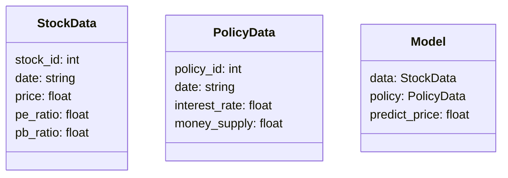
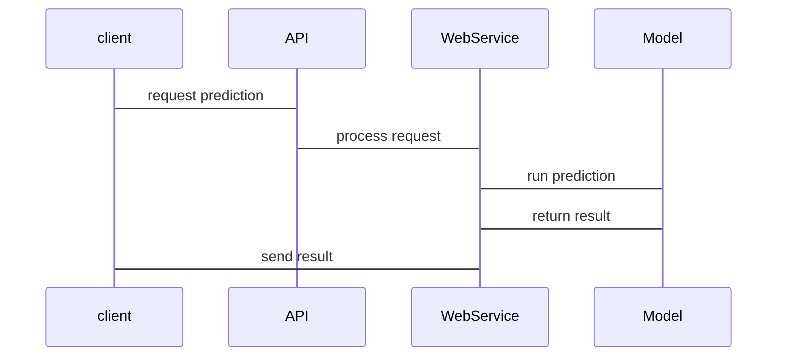

                 


# 彼得林奇的"成长型价值股"在不同货币政策下的表现

## 关键词：彼得林奇、成长型价值股、货币政策、股票表现、投资策略

## 摘要：本文系统分析了彼得林奇的成长型价值股投资理念及其在不同货币政策环境下的表现。通过构建数学模型和机器学习算法，深入探讨了货币政策对股票估值的影响，并结合实际案例进行预测和优化。文章旨在为投资者提供科学的决策支持，帮助他们在复杂经济环境下实现稳健投资回报。

---

# 第一部分: 背景介绍

## 第1章: 彼得林奇的成长型价值股投资理念

### 1.1 成长型价值股的定义与特点

#### 1.1.1 成长型股票的定义
成长型股票是指那些具有较高增长率、未来收益预期高于市场平均水平的公司股票。这类股票通常属于新兴行业或处于高速发展阶段的公司。

#### 1.1.2 价值股的核心特征
价值股是指市场价格低于其内在价值的股票，通常具有较低的市盈率、市净率等估值指标，被认为被市场低估。

#### 1.1.3 成长型与价值型股票的区别
| 特性 | 成长型股票 | 价值型股票 |
|------|------------|------------|
| 市盈率 | 高         | 低         |
| 市净率 | 高         | 低         |
| 股息率 | 低         | 高         |
| 增长率 | 高         | 中低       |

### 1.2 彼得林奇的成长型投资策略

#### 1.2.1 成长型投资的基本原理
彼得林奇认为，投资成长型股票的核心是选择那些具有持续盈利能力、管理优秀且行业前景广阔的公司。

#### 1.2.2 彼得林奇的投资哲学
彼得林奇强调长期投资、分散投资和深入研究，反对短期投机和盲目跟风。

#### 1.2.3 成长型投资的成功关键
成功的成长型投资需要结合对公司基本面的深入分析和对市场趋势的准确判断。

---

## 第2章: 货币政策的基本概念与分类

### 2.1 货币政策的定义与目标

#### 2.1.1 货币政策的定义
货币政策是由中央银行制定的通过调整货币供应量和利率等工具来影响经济活动的政策。

#### 2.1.2 货币政策的主要目标
- 控制通货膨胀
- 促进就业
- 保持经济增长
- 维护金融稳定

### 2.2 主要货币政策工具与类型

#### 2.2.1 公开市场操作
中央银行在公开市场上买卖政府债券，以调节基础货币供应量。

#### 2.2.2 存款准备金率
中央银行规定商业银行必须持有的存款准备金比例，影响商业银行的信贷能力。

#### 2.2.3 利率政策
通过调整基准利率影响市场利率，进而影响投资和消费。

#### 2.2.4 货币供应量控制
通过控制货币供应量来影响经济活动。

### 2.3 不同货币政策对经济的影响

#### 2.3.1 扩张性货币政策
在经济衰退时期，通过增加货币供应量和降低利率来刺激经济增长。

#### 2.3.2 紧缩性货币政策
在通货膨胀时期，通过减少货币供应量和提高利率来抑制需求。

#### 2.3.3 中性货币政策
保持货币政策在中性水平，既不刺激也不抑制经济增长。

---

# 第二部分: 核心概念与联系

## 第3章: 成长型价值股与货币政策的关系

### 3.1 成长型价值股的估值指标

#### 3.1.1 市盈率（P/E）
市盈率 = 股价 / 每股净利润

#### 3.1.2 市净率（P/B）
市净率 = 股价 / 每股净资产

#### 3.1.3 股息率
股息率 = 每股股息 / 股价

#### 3.1.4 增长率（ROE）
ROE = 净利润 / 平均股东权益

### 3.2 货币政策对股票市场的影响机制

#### 3.2.1 利率对股票价格的影响
- 利率下降：降低融资成本，刺激投资，推高股价。
- 利率上升：增加融资成本，抑制投资，打压股价。

#### 3.2.2 货币供应量与股价的关系
货币供应量增加，资金涌入股市，推高股价；反之，则压低股价。

#### 3.2.3 货币政策预期与市场情绪
市场对未来的货币政策预期会影响当前的股价走势。

### 3.3 成长型价值股在不同货币政策下的表现

#### 3.3.1 扩张性货币政策下的股票表现
- 利率降低，资金成本减少，成长型企业更容易获得融资，推动业绩增长，股价上涨。

#### 3.3.2 紧缩性货币政策下的股票表现
- 利率提高，融资成本增加，成长型企业面临压力，业绩增速放缓，股价可能下跌。

#### 3.3.3 中性货币政策下的股票表现
- 经济稳定，市场预期平稳，成长型股票表现较为平稳，主要依赖于企业自身的业绩增长。

---

# 第三部分: 算法原理与数学模型

## 第4章: 基于货币政策的股票表现预测模型

### 4.1 模型构建与数据准备

#### 4.1.1 数据来源与处理
数据来源包括历史股价、财务数据、货币政策指标等。

#### 4.1.2 股票数据特征提取
提取市盈率、市净率、股息率等指标。

#### 4.1.3 货币政策数据的获取与处理
获取历史货币政策数据，如利率、货币供应量等。

### 4.2 算法选择与实现

#### 4.2.1 线性回归模型
使用线性回归模型预测股票价格与货币政策变量之间的关系。

#### 4.2.2 时间序列分析模型
使用ARIMA模型预测股票价格的未来走势。

#### 4.2.3 机器学习算法（如随机森林）
使用随机森林模型进行分类或回归预测。

### 4.3 数学模型与公式

#### 线性回归模型:
$$ y = \beta_0 + \beta_1x_1 + \beta_2x_2 + \epsilon $$

#### 随机森林模型:
随机森林通过集成多个决策树进行投票或平均预测。

---

## 第5章: 机器学习算法预测股票表现

### 5.1 数据清洗与特征提取

#### 5.1.1 数据清洗
处理缺失值、异常值等。

#### 5.1.2 特征提取
选择与股票表现相关的特征变量。

### 5.2 模型训练与验证

#### 5.2.1 训练集与测试集
将数据分为训练集和测试集，用于模型训练和验证。

#### 5.2.2 模型评估
使用准确率、召回率、F1分数等指标评估模型性能。

### 5.3 代码实现与解读

#### 5.3.1 数据加载与处理
```python
import pandas as pd
data = pd.read_csv('stock_data.csv')
data = data.dropna()
```

#### 5.3.2 模型训练
```python
from sklearn.ensemble import RandomForestRegressor
model = RandomForestRegressor(n_estimators=100, random_state=42)
model.fit(X_train, y_train)
```

#### 5.3.3 结果分析
```python
importances = model.feature_importances_
print(importances)
```

---

# 第四部分: 系统分析与架构设计

## 第6章: 系统功能设计

### 6.1 领域模型（Mermaid类图）



### 6.2 系统架构设计（Mermaid架构图）

```mermaid
client --> API Gateway
API Gateway --> Load Balancer
Load Balancer --> Web Servers
Web Servers --> Database
```

---

## 第7章: 系统接口与交互设计

### 7.1 系统接口设计

#### 7.1.1 API接口
- 输入：股票代码、日期范围
- 输出：预测股价、货币政策影响

#### 7.1.2 数据接口
- 输入：数据源（CSV、数据库）
- 输出：清洗后的数据集

### 7.2 系统交互设计（Mermaid序列图）



---

# 第五部分: 项目实战

## 第8章: 环境安装与数据准备

### 8.1 环境安装
安装Python、Pandas、Scikit-learn等库。

### 8.2 数据准备
加载股票数据和货币政策数据，进行清洗和预处理。

## 第9章: 系统实现与案例分析

### 9.1 模型实现
训练随机森林模型，预测股票表现。

### 9.2 案例分析
以具体股票为例，展示模型预测结果和实际表现对比。

---

## 第六部分: 最佳实践与小结

### 6.1 投资策略建议
根据货币政策环境调整投资策略，选择合适的成长型价值股。

### 6.2 小结
本文通过理论分析和实践验证，揭示了货币政策对成长型价值股的影响，为投资者提供了科学的决策依据。

### 6.3 注意事项
投资者应结合宏观经济环境和公司基本面进行综合判断。

### 6.4 拓展阅读
推荐阅读《彼得林奇的投资哲学》和《货币政策与金融市场》等书籍。

---

# 作者：AI天才研究院/AI Genius Institute & 禅与计算机程序设计艺术 /Zen And The Art of Computer Programming

---

以上内容是根据您的要求逐步构建的详细目录和文章框架。希望对您有所帮助！

